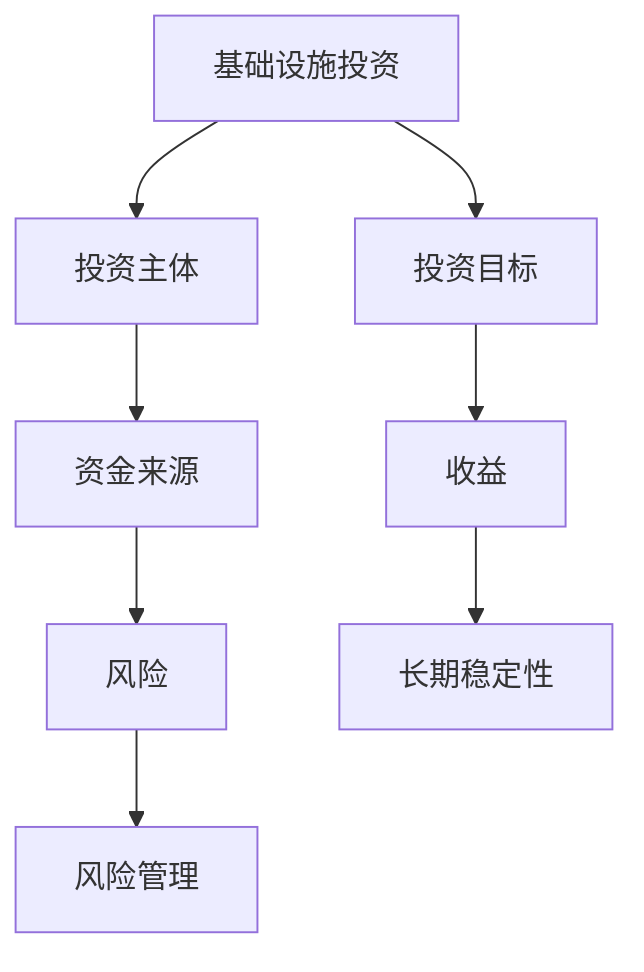
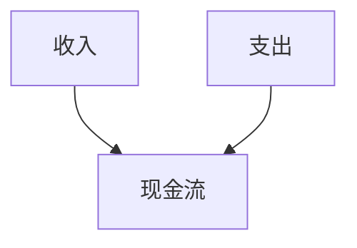

                 

# 基础设施投资：长期稳定收益的另类选择

> 关键词：基础设施投资，长期收益，稳定性，另类选择，风险控制，数学模型，系统架构

> 摘要：本文探讨了基础设施投资作为长期稳定收益的另类选择的潜力。通过分析基础设施投资的核心概念、数学模型和系统架构，本文为投资者提供了深入的理论支持和实践指导。文章结合实际案例，展示了如何通过科学的分析和系统化的管理，实现基础设施投资的长期稳定性收益。

---

## 第一部分: 基础设施投资的背景与概念

### 第1章: 基础设施投资的背景与概念

#### 1.1 基础设施投资的定义与特点
- **定义**：基础设施投资是指对公共或商业基础设施的建设和运营进行的资金投入，包括交通、能源、通信、教育、医疗等领域的项目。
- **特点**：
  - 长期性：基础设施项目通常具有较长的建设和回收周期。
  - 稳定性：基础设施资产的需求相对稳定，具有抗周期性。
  - 高门槛：基础设施投资通常需要较大的资金投入和专业能力。
  - 社会效益：基础设施项目往往具有显著的社会效益，但经济效益可能较低。

#### 1.2 基础设施投资的历史演变
- **传统模式**：政府主导的基础设施建设，以公共服务为目的。
- **现代模式**：引入私营资本，采用PPP（公私合营）模式，提高效率和创新性。
- **全球化趋势**：随着全球经济一体化，基础设施投资逐渐从国内扩展到跨境合作。

#### 1.3 基础设施投资的经济与社会影响
- **经济增长**：基础设施是经济发展的基石，能够提升生产效率和区域竞争力。
- **社会稳定**：基础设施改善能够提高居民生活质量，促进社会稳定。
- **长期性与稳定性**：基础设施投资能够为投资者提供长期稳定的收益，同时为社会提供持续的服务。

#### 1.4 基础设施投资的核心要素
- **投资主体**：政府、企业和私人投资者。
- **投资目标**：实现经济效益和社会效益的双重目标。
- **投资周期**：从规划、建设到运营，通常需要数年甚至更长时间。
- **投资风险**：包括政策风险、市场风险和运营风险。

#### 1.5 本章小结
本章通过对基础设施投资的定义、特点、历史演变及其影响的分析，为读者提供了全面的背景知识，为后续分析奠定了基础。

---

## 第二部分: 基础设施投资的核心概念与联系

### 第2章: 基础设施投资的核心概念

#### 2.1 基础设施投资的资产类型
- **公共基础设施**：如道路、桥梁、供水系统，通常由政府投资和运营。
- **商业基础设施**：如商场、写字楼、工业园区，通常由私人投资和运营。
- **综合性基础设施**：结合公共和商业功能的混合型基础设施，如综合交通枢纽。

#### 2.2 基础设施投资的市场分析
- **市场需求分析**：分析基础设施项目的使用需求，包括人口增长、经济发展等因素。
- **市场供给分析**：分析市场上已有的基础设施供给情况，避免过度投资。
- **市场竞争格局**：分析现有竞争者和潜在竞争者的市场策略。

#### 2.3 基础设施投资的风险管理
- **风险分类**：
  - **政策风险**：政府政策变化可能影响项目收益。
  - **市场风险**：市场需求变化可能导致项目收益下降。
  - **运营风险**：建设和运营中的不确定性可能导致成本超支或项目失败。
- **风险评估方法**：通过定量分析（如概率树分析）和定性分析（如情景分析）进行综合评估。
- **风险控制策略**：通过保险、合同条款和风险管理机制来降低风险。

#### 2.4 基础设施投资的收益模型
- **收益来源**：
  - **直接收益**：通过收费、租金等方式获得的收入。
  - **间接收益**：通过提升区域经济价值获得的增值收益。
- **收益影响因素**：
  - 项目规模：规模越大，收益潜力越大，但风险也越高。
  - 地理位置：地理位置优越的项目通常具有更高的收益潜力。
  - 运营效率：高效的运营能够降低成本，提高收益。
- **收益预测模型**：基于历史数据和市场趋势，利用回归分析或时间序列分析进行预测。

#### 2.5 核心概念关系图（Mermaid流程图）

---

## 第三部分: 基础设施投资的数学模型与数据分析

### 第3章: 基础设施投资的数学模型

#### 3.1 基础设施投资的现金流分析
- **定义**：现金流是指项目在生命周期内各阶段的现金流入和流出。
- **公式**：
  $$\text{净现金流} = \text{现金流入} - \text{现金流出}$$
- **可视化（Mermaid流程图）**：

#### 3.2 基础设施投资的估值模型
- **净现值（NPV）模型**：
  $$\text{NPV} = \sum_{t=0}^{n} \frac{\text{现金流}}{(1 + r)^t}$$
  其中，\( r \) 是折现率，\( n \) 是项目周期。
- **内部收益率（IRR）模型**：
  $$\text{IRR} = \text{使NPV为零的折现率}$$

---

通过以上分析，我们可以看出，基础设施投资作为长期稳定收益的另类选择，具有重要的理论和实践意义。通过科学的数学模型和系统化的管理，投资者可以在确保社会稳定和经济增长的同时，实现自身的长期收益目标。

