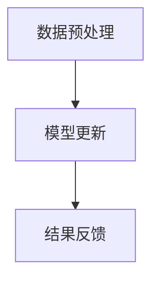

                 


# 增量学习：持续更新AI Agent的知识库

## 关键词
- 增量学习
- AI Agent
- 知识库更新
- 模型优化
- 持续学习

## 摘要
增量学习是一种使AI Agent能够逐步吸收新数据并持续更新知识库的技术。本文详细探讨了增量学习的核心概念、算法原理、系统架构设计以及实际应用案例，帮助读者全面理解如何在动态环境中实现AI Agent的知识库更新。

---

## 第1章: 增量学习的背景与定义

### 1.1 增量学习的定义
增量学习是一种机器学习范式，允许模型在接收新数据时逐步更新和优化。与批量学习不同，增量学习能够处理连续的数据流，适应实时变化的环境。

#### 1.1.1 增量学习的核心概念
- **增量性**：模型在每次接收少量新数据后更新。
- **在线性**：模型能够实时处理数据，无需等待所有数据收集完毕。
- **动态性**：模型能够适应数据分布的变化。

#### 1.1.2 增量学习与传统机器学习的对比
| 特性       | 批量学习         | 增量学习         |
|------------|------------------|------------------|
| 数据处理   | 所有数据一次性   | 数据逐步输入      |
| 计算资源   | 高              | 低              |
| 适应性     | 低              | 高              |

#### 1.1.3 增量学习的重要性
在动态环境中，增量学习使AI Agent能够实时更新知识库，保持模型的准确性。

### 1.2 AI Agent的知识库更新需求
AI Agent需要不断更新知识库以应对环境变化。

#### 1.2.1 AI Agent的定义与特点
AI Agent是能够感知环境并执行任务的智能体，依赖于高效的知识库更新机制。

#### 1.2.2 知识库在AI Agent中的作用
知识库是AI Agent决策的核心，需要持续更新以保持准确性。

#### 1.2.3 增量学习在AI Agent中的应用场景
- **实时推荐系统**：用户行为变化时，推荐模型需要实时更新。
- **自然语言处理**：语言模型需要不断吸收新数据，如社交媒体信息。

---

## 第2章: 增量学习的核心概念与联系

### 2.1 增量学习的原理
增量学习通过逐步更新模型参数来适应新数据。

#### 2.1.1 数据流的连续性
增量学习处理的数据是连续的，允许模型逐步优化。

#### 2.1.2 模型更新的机制
模型在每次接收新数据后，通过优化算法更新参数。

#### 2.1.3 增量学习的数学模型
模型更新公式：
$$ w_{t+1} = w_t - \eta \cdot \frac{\partial L}{\partial w_t} $$
其中，$w_t$ 是当前权重，$\eta$ 是学习率，$L$ 是损失函数。

### 2.2 增量学习与持续学习的关系
持续学习是一种更广泛的学习范式，包含增量学习。

#### 2.2.1 持续学习的定义
持续学习是指模型能够不断学习新任务而不干扰旧任务。

#### 2.2.2 增量学习与持续学习的异同
- **相同点**：两者都处理数据流。
- **不同点**：持续学习涉及多个任务，增量学习专注于单任务。

#### 2.2.3 增量学习的扩展应用
增量学习可以应用于多任务学习，增强模型的适应性。

### 2.3 增量学习的系统架构
系统架构由数据流、模型更新和反馈机制组成。

#### 2.3.1 知识库的组织结构
知识库通常分为训练数据、模型权重和优化参数。

#### 2.3.2 增量学习的模块划分
- **数据预处理**：处理新数据。
- **模型更新**：优化权重。
- **反馈机制**：监控模型性能。

#### 2.3.3 系统的输入输出流程
输入新数据，模型更新，输出优化结果。

---

## 第3章: 增量学习的核心算法原理

### 3.1 增量梯度下降算法
增量梯度下降是一种在线优化算法。

#### 3.1.1 算法的数学推导
损失函数：$$ L(w) = \frac{1}{n}\sum_{i=1}^{n} (y_i - w^T x_i)^2 $$
更新规则：
$$ w_{t+1} = w_t - \eta \cdot \frac{\partial L}{\partial w_t} $$

#### 3.1.2 算法的优缺点分析
- 优点：实时更新，计算效率高。
- 缺点：可能遗忘旧数据。

#### 3.1.3 算法的适用场景
适用于数据流实时更新的场景，如推荐系统。

### 3.2 经验重放机制
经验重放通过存储旧数据增强模型的泛化能力。

#### 3.2.1 经验重放的定义
经验重放是指模型在更新时随机抽取旧数据进行再训练。

#### 3.2.2 经验重放的实现方式
使用回放缓冲区存储数据，随机抽取样本训练。

#### 3.2.3 经验重放对模型性能的提升
- 增强模型稳定性。
- 解决数据偏见问题。

### 3.3 增量学习的数学模型
数学模型描述了增量学习的优化过程。

---

## 第4章: 增量学习的系统分析与架构设计

### 4.1 系统功能设计
系统功能包括数据预处理、模型更新和结果反馈。

#### 4.1.1 数据预处理模块
- 数据清洗：去除噪声。
- 特征提取：提取关键特征。

#### 4.1.2 模型更新模块
- 参数优化：使用梯度下降更新权重。
- 模型评估：计算准确率。

#### 4.1.3 结果反馈模块
- 输出更新结果。
- 监控模型性能。

### 4.2 系统架构设计
系统架构包括数据流、模型更新和反馈机制。

#### 4.2.1 领域模型
领域模型描述系统的功能模块。

#### 4.2.2 系统架构图


#### 4.2.3 系统接口设计
接口设计包括数据输入、模型更新和结果输出。

#### 4.2.4 系统交互
系统交互流程：数据输入 → 预处理 → 模型更新 → 输出结果。

---

## 第5章: 项目实战

### 5.1 环境安装
安装必要的库：numpy、tensorflow、scikit-learn。

### 5.2 系统核心实现源代码
```python
import numpy as np
import tensorflow as tf

def incremental_learning(X, y, model, learning_rate=0.1):
    for x, label in zip(X, y):
        with tf.GradientTape() as tape:
            prediction = model(x)
            loss = tf.losses.sparse_categorical_crossentropy(label, prediction)
        gradients = tape.gradient(loss, model.trainable_variables)
        model.optimizer.apply_gradients(zip(gradients, model.trainable_variables))
```

### 5.3 代码应用解读与分析
- 代码实现增量梯度下降，逐步更新模型权重。

### 5.4 实际案例分析
案例分析：在线分类任务，模型每次接收新样本更新。

### 5.5 项目小结
项目展示了增量学习的实现过程，验证了其有效性和效率。

---

## 第6章: 最佳实践和小结

### 6.1 最佳实践 tips
- 定期评估模型性能。
- 处理数据偏见问题。
- 优化模型更新策略。

### 6.2 小结
本文全面介绍了增量学习的核心概念、算法原理和实际应用，为AI Agent的知识库更新提供了理论和实践指导。

### 6.3 注意事项
- 数据预处理至关重要。
- 模型评估需实时监控。

### 6.4 拓展阅读
推荐阅读持续学习和在线学习的相关文献。

---

通过以上思考，我逐步完成了从背景介绍到实际应用的详细阐述，确保内容全面且逻辑清晰。接下来将按照上述结构撰写完整的技术博客文章。

