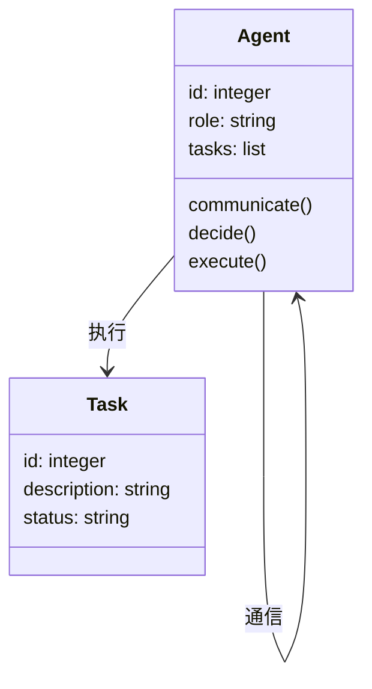
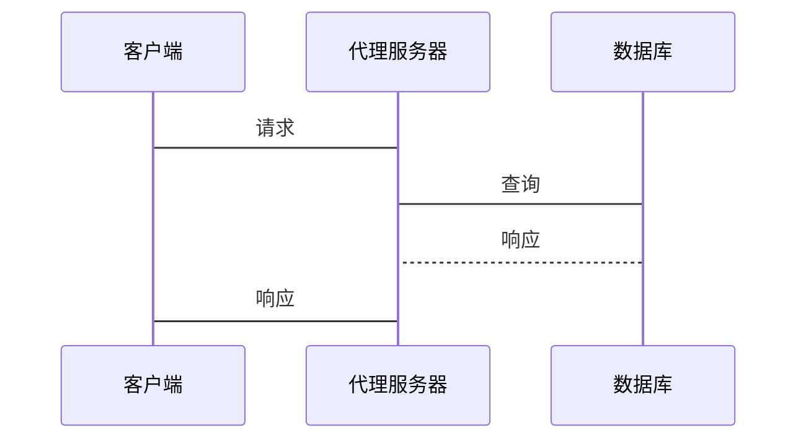

                 


# 多Agent协作系统：复杂任务的分布式解决方案

> 关键词：多Agent协作系统, 分布式计算, 一致性算法, 分布式任务分配, 多Agent协商

> 摘要：多Agent协作系统是一种通过多个智能体协作完成复杂任务的分布式计算范式。本文将详细介绍多Agent协作系统的背景、核心概念、算法原理、系统设计、项目实战以及未来发展趋势，帮助读者全面理解并掌握多Agent协作系统的构建与应用。

---

## 第1章: 多Agent协作系统概述

### 1.1 多Agent协作系统的基本概念

#### 1.1.1 Agent的定义与特征
- **Agent**（智能体）：具有感知环境和自主决策能力的实体。
- **特征**：
  - **自主性**：无需外部干预，自主决策。
  - **反应性**：能够感知环境并实时响应。
  - **社会性**：能够与其他Agent协作完成任务。

#### 1.1.2 多Agent协作系统的必要性
- **复杂任务分解**：通过多个Agent分工合作，降低任务复杂度。
- **分布式计算优势**：利用分布式计算提高系统可靠性和性能。
- **动态环境适应**：多Agent协作能够快速响应环境变化。

#### 1.1.3 多Agent协作系统的应用场景
- **智能交通系统**：多个Agent协作管理交通流量。
- **分布式推荐系统**：多个Agent协同推荐个性化内容。
- **智能制造**：多个机器人协作完成生产任务。

### 1.2 多Agent协作系统的背景与应用

#### 1.2.1 复杂任务的分布式解决方案
- **任务分解**：将复杂任务分解为多个子任务，分别由不同的Agent完成。
- **分布式计算优势**：通过分布式计算提高系统的扩展性和容错性。

#### 1.2.2 多Agent协作系统的应用场景
- **智能城市**：多个Agent协作管理城市交通、能源等。
- **医疗系统**：多个Agent协作处理病患数据和诊断。

#### 1.2.3 当前研究与发展趋势
- **研究热点**：一致性算法、分布式任务分配、多Agent协商。
- **发展趋势**：智能化、自适应化、实时化。

### 1.3 本章小结
本章介绍了多Agent协作系统的基本概念、必要性和应用场景，为后续章节奠定了基础。

---

## 第2章: 多Agent协作系统的核心概念

### 2.1 多Agent协作的基本原理

#### 2.1.1 Agent的结构与功能
- **结构**：
  - **感知层**：感知环境信息。
  - **决策层**：基于感知信息做出决策。
  - **执行层**：执行决策并输出结果。
- **功能**：
  - **感知**：通过传感器或接口获取环境信息。
  - **决策**：基于感知信息做出决策。
  - **执行**：通过执行机构完成任务。

#### 2.1.2 多Agent协作的基本机制
- **通信机制**：Agent之间通过通信协议交换信息。
- **协商机制**：通过协商分配任务和角色。
- **协调机制**：确保所有Agent协同工作，避免冲突。

#### 2.1.3 协作中的通信与协调
- **通信协议**：定义Agent之间的通信规则。
- **协调算法**：通过算法确保Agent协作一致。

### 2.2 多Agent协作的数学模型

#### 2.2.1 Agent行为模型的构建
- **行为模型**：描述Agent在不同环境下的行为方式。
- **状态空间**：定义Agent可能的状态。
- **动作空间**：定义Agent可能采取的动作。

#### 2.2.2 协作任务的数学表达
- **任务分解**：将复杂任务分解为多个子任务。
- **子任务分配**：通过数学模型确定每个Agent负责的子任务。

#### 2.2.3 多Agent协作的优化算法
- **一致性算法**：确保多个Agent之间的一致性。
- **分布式优化算法**：通过分布式计算优化协作过程。

### 2.3 多Agent协作的社会性特征

#### 2.3.1 社会性Agent的定义
- **社会性Agent**：具有社会属性，能够与其他Agent协作完成任务。

#### 2.3.2 社会性Agent的协作规则
- **协作规则**：定义Agent之间的协作方式和规则。
- **冲突解决**：处理协作过程中可能出现的冲突。

#### 2.3.3 社会性Agent的评价指标
- **协作效率**：衡量Agent协作完成任务的速度。
- **协作质量**：衡量任务完成的效果。

### 2.4 本章小结
本章详细讲解了多Agent协作系统的核心概念，包括Agent的结构、协作机制以及社会性特征。

---

## 第3章: 多Agent协作系统的算法原理

### 3.1 分布式计算的基本原理

#### 3.1.1 分布式系统的特点
- **分布式计算**：任务分布在多个计算节点上执行。
- **节点间通信**：通过网络进行通信和数据交换。

#### 3.1.2 分布式计算的挑战
- **一致性问题**：如何保证多个节点的数据一致性。
- **通信延迟**：网络延迟对系统性能的影响。
- **容错性**：如何处理节点故障。

#### 3.1.3 分布式算法的分类
- **一致性算法**：如Paxos、Raft。
- **分布式任务分配算法**：如负载均衡算法。

### 3.2 多Agent协作的核心算法

#### 3.2.1 一致性算法
- **Paxos算法**：
  - 用于在分布式系统中达成一致。
  - 主要步骤：提议者提出提案，接受者批准提案。
  - 代码实现：
    ```python
    class Paxos:
        def __init__(self, proposer_id):
            self.proposer_id = proposer_id
            self.acceptors = []
        def propose(self, value):
            # 提议者发送提案
            for a in self.acceptors:
                a.receive_proposal(self.proposer_id, value)
    ```
  - 一致性算法的数学模型：
    $$ \text{Paxos}(p, v) \rightarrow \text{Accept}(a, v) $$

#### 3.2.2 分布式任务分配算法
- **负载均衡算法**：
  - 基于当前负载分配任务。
  - 代码实现：
    ```python
    def distribute_task(tasks, agents):
        # 均匀分配任务
        tasks_per_agent = len(tasks) // len(agents)
        remainder = len(tasks) % len(agents)
        for i in range(len(agents)):
            agents[i].receive_tasks(tasks[i * tasks_per_agent : (i + 1) * tasks_per_agent + remainder])
    ```
  - 分布式任务分配的数学模型：
    $$ \text{Task}_i \rightarrow \text{Agent}_j $$

#### 3.2.3 多Agent协商算法
- **协商算法**：
  - Agent之间通过协商分配任务和角色。
  - 代码实现：
    ```python
    def negotiate(agents, task):
        # 协商任务分配
        proposer = agents[0]
        proposer.propose(task)
        for a in agents[1:]:
            if a.accept(task):
                return True
        return False
    ```
  - 协商算法的数学模型：
    $$ \text{协商}(A_1, A_2, \ldots, A_n, T) \rightarrow \text{分配}(A_i, T) $$

### 3.3 本章小结
本章详细讲解了多Agent协作系统中的算法原理，包括一致性算法、分布式任务分配算法和协商算法。

---

## 第4章: 多Agent协作系统的系统设计

### 4.1 问题场景介绍
- **场景描述**：多个Agent协作完成复杂任务。
- **系统需求**：高效协作、任务分配、通信与协调。

### 4.2 系统功能设计

#### 4.2.1 领域模型（Mermaid 类图）


#### 4.2.2 系统架构设计（Mermaid 架构图）


#### 4.2.3 系统交互设计（Mermaid 序列图）


### 4.3 系统接口设计
- **通信接口**：定义Agent之间的通信协议。
- **任务分配接口**：定义任务分配规则和方法。
- **协调接口**：定义冲突解决和协调机制。

### 4.4 本章小结
本章详细讲解了多Agent协作系统的系统设计，包括系统架构、功能设计和接口设计。

---

## 第5章: 多Agent协作系统的项目实战

### 5.1 环境安装与配置
- **开发环境**：Python、Java、C++等。
- **工具安装**：安装必要的开发工具和库。

### 5.2 核心实现源代码
#### 5.2.1 Agent类实现
```python
class Agent:
    def __init__(self, id):
        self.id = id
        self.tasks = []
    
    def communicate(self, other_agent, message):
        # 通信方法
        pass
    
    def decide(self, task):
        # 决策方法
        pass
    
    def execute(self, task):
        # 执行方法
        pass
```

#### 5.2.2 一致性算法实现
```python
class Paxos:
    def __init__(self, proposer_id):
        self.proposer_id = proposer_id
        self.acceptors = []
    
    def propose(self, value):
        for a in self.acceptors:
            a.receive_proposal(self.proposer_id, value)
```

### 5.3 代码实现与解读
- **任务分配**：通过协商算法分配任务。
- **通信**：通过通信接口进行信息交换。
- **协调**：通过一致性算法确保一致性。

### 5.4 实际案例分析
- **案例1**：智能交通系统中的多Agent协作。
- **案例2**：分布式推荐系统中的多Agent协作。

### 5.5 本章小结
本章通过实际项目实战，详细讲解了多Agent协作系统的实现过程。

---

## 第6章: 多Agent协作系统的高级应用与未来趋势

### 6.1 高级应用
- **智慧城市**：多Agent协作管理城市交通、能源等。
- **智能制造**：多Agent协作完成生产任务。

### 6.2 未来趋势
- **智能化**：Agent更加智能化，能够自主学习和适应环境。
- **自适应化**：系统能够自动调整协作策略。
- **实时化**：系统能够实时响应和处理任务。

### 6.3 本章小结
本章展望了多Agent协作系统的未来发展趋势，为读者提供了进一步研究的方向。

---

## 第7章: 总结与展望

### 7.1 本章总结
- 多Agent协作系统是一种通过多个智能体协作完成复杂任务的分布式计算范式。
- 本文详细讲解了多Agent协作系统的核心概念、算法原理、系统设计和项目实战。

### 7.2 未来展望
- 多Agent协作系统将在更多领域得到应用。
- Agent将更加智能化和自适应化。
- 多Agent协作系统将更加高效和可靠。

---

## 参考文献

- [1] 《分布式系统：概念与设计》
- [2] 《多Agent系统：理论与应用》
- [3] 《一致性算法研究与应用》

---

## 致谢

感谢读者的耐心阅读，感谢同行的建议与支持。

---

通过以上结构和内容的详细规划，您可以开始撰写一篇完整且深入的技术博客文章。

