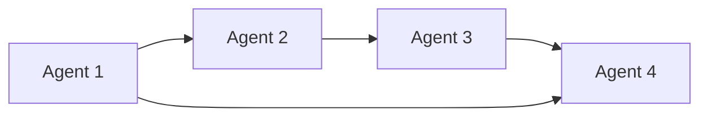

                 


# 多Agent协作：构建复杂的AI系统

## 关键词：多Agent协作、AI系统、分布式计算、任务分配、通信协议

## 摘要：多Agent协作是一种通过多个智能体协同工作来构建复杂AI系统的方法。本文从基本概念、算法原理、系统架构到项目实战，详细阐述了多Agent协作的核心内容，帮助读者全面理解并掌握这一技术。

---

# 第1章：多Agent协作的基本概念

## 1.1 多Agent协作的定义与背景

### 1.1.1 什么是多Agent协作

多Agent协作是指多个智能体（Agent）通过协同工作，共同完成复杂任务的过程。每个Agent都是一个能够感知环境、自主决策的实体，它们通过通信和协作完成单个Agent无法完成的任务。

### 1.1.2 多Agent协作的应用场景

- **分布式计算**：任务分解到多个Agent，提高计算效率。
- **人机协作**：人类与AI Agent协同完成复杂任务。
- **智能交通系统**：多个Agent协调交通流量。

### 1.1.3 多Agent协作的核心特点

- **自主性**：Agent能够自主决策。
- **协作性**：多个Agent协同工作。
- **动态性**：环境和任务可能动态变化。

## 1.2 多Agent协作的背景与意义

### 1.2.1 当前AI系统的发展趋势

AI系统逐渐从单点智能转向分布式智能，多Agent协作成为趋势。

### 1.2.2 多Agent协作在复杂系统中的优势

- **提高系统可靠性**：通过冗余和协作减少单点故障。
- **增强系统性能**：通过任务分解和并行处理提升效率。
- **适应动态环境**：多个Agent能够快速响应环境变化。

### 1.2.3 多Agent协作的应用前景

广泛应用于机器人、自动驾驶、智能城市等领域。

---

# 第2章：多Agent协作的核心概念与联系

## 2.1 多Agent协作的核心概念

### 2.1.1 Agent的基本属性

| 属性 | 描述 |
|------|------|
| 自主性 | Agent能够自主决策 |
| 反应性 | Agent能感知环境并做出反应 |
| 社交性 | Agent能与其他Agent通信协作 |

### 2.1.2 多Agent协作的系统架构

- **基于黑板模型的架构**：多个Agent共享一个公共黑板，进行信息交流和任务协调。

### 2.1.3 Agent之间的关系与交互

- **协作关系**：Agent之间通过协作完成任务。
- **竞争关系**：Agent之间可能为资源分配而竞争。

## 2.2 多Agent协作的核心要素

### 2.2.1 协作目标与任务分解

- **协作目标**：明确每个Agent的目标和责任。
- **任务分解**：将整体任务分解为多个子任务，分配给不同的Agent。

### 2.2.2 Agent的智能性与自主性

- **智能性**：Agent具备问题解决和学习能力。
- **自主性**：Agent能够在没有外部干预的情况下运行。

### 2.2.3 协作过程中的动态性与不确定性

- **动态性**：环境和任务可能随时变化。
- **不确定性**：信息不完全或存在不确定性。

## 2.3 多Agent协作的实体关系图



---

# 第3章：多Agent协作的算法原理

## 3.1 多Agent协作的基本算法

### 3.1.1 分布式协作算法

- **基于一致性协议的分布式任务分配**：通过一致性协议确保所有Agent达成一致。

### 3.1.2 协作任务分配算法

- **贪心算法**：优先分配高价值的任务。

### 3.1.3 协作过程中的同步与协调算法

- **时间戳法**：通过时间戳确定操作的顺序。

## 3.2 协作任务分配的数学模型

### 3.2.1 任务分配问题的数学建模

$$\text{最大化} \sum_{i=1}^{n} v_i$$

$$\text{约束} \sum_{i=1}^{n} x_i \leq C$$

其中，$v_i$ 是任务 $i$ 的价值，$x_i$ 是分配给Agent的变量，$C$ 是资源限制。

### 3.2.2 基于图论的任务分配模型

使用图论模型将任务分配问题建模为图的匹配问题。

### 3.2.3 基于优化理论的任务分配算法

使用线性规划等优化方法求解任务分配问题。

## 3.3 协作过程中的通信协议

### 3.3.1 Agent之间的通信机制

- **发布-订阅模式**：Agent发布消息，其他Agent订阅并处理。

### 3.3.2 通信协议的设计与实现

- **协议栈设计**：包括数据链路层、网络层、传输层和应用层。

### 3.3.3 通信中的数据加密与安全性

- **加密算法**：如AES加密算法。

---

# 第4章：多Agent协作的系统架构设计

## 4.1 系统功能设计

### 4.1.1 Agent的行为模型

- **反应式模型**：基于当前感知做出反应。
- **认知式模型**：具备推理和规划能力。

### 4.1.2 协作任务的分解与分配

- **任务分解算法**：将整体任务分解为子任务。
- **任务分配策略**：根据Agent的能力分配任务。

### 4.1.3 协作过程中的动态调整

- **自适应调整算法**：根据环境变化动态调整协作策略。

## 4.2 系统架构设计


## 4.3 系统接口设计

### 4.3.1 Agent与协作管理模块的接口

- **接口定义**：协作管理模块接收Agent的请求并进行任务分配。

### 4.3.2 任务分配模块与通信模块的接口

- **数据传输**：任务分配模块将任务信息传递给通信模块。

### 4.3.3 监控模块与反馈模块的接口

- **反馈机制**：监控模块收集反馈信息并传递给反馈模块。

---

# 第5章：多Agent协作的项目实战

## 5.1 项目环境安装与配置

### 5.1.1 开发环境的选择

- **Python编程语言**：适合快速开发和原型设计。

### 5.1.2 依赖库的安装

- **安装第三方库**：如`socket`用于通信，`numpy`用于数值计算。

### 5.1.3 项目初始化与配置

- **创建项目结构**：包括`src`、`config`、`data`等目录。

## 5.2 项目核心实现

### 5.2.1 Agent类的实现

```python
class Agent:
    def __init__(self, id):
        self.id = id
        self.tasks = []
    
    def receive_task(self, task):
        self.tasks.append(task)
    
    def execute_task(self):
        for task in self.tasks:
            # 执行任务
            pass
```

### 5.2.2 协作管理模块的实现

```python
class CollaborationManager:
    def __init__(self):
        self.agents = []
    
    def assign_task(self, task, agent):
        agent.receive_task(task)
```

### 5.2.3 通信模块的实现

```python
import socket

class Communicator:
    def __init__(self, host, port):
        self.host = host
        self.port = port
        self.sock = socket.socket(socket.AF_INET, socket.SOCK_STREAM)
    
    def connect(self):
        self.sock.connect((self.host, self.port))
```

## 5.3 实际案例分析

### 5.3.1 案例背景

- **任务**：多Agent协作完成物流配送任务。

### 5.3.2 系统实现

- **任务分配**：根据地理位置分配最近的Agent执行任务。
- **通信**：Agent之间通过通信模块实时更新配送状态。

### 5.3.3 优化与改进

- **负载均衡**：动态调整任务分配，确保每个Agent的负载均衡。

---

# 第6章：系统分析与优化

## 6.1 系统性能分析

### 6.1.1 性能指标

- **响应时间**：系统对请求的响应时间。
- **吞吐量**：单位时间内完成的任务数量。
- **资源利用率**：CPU、内存等资源的使用情况。

### 6.1.2 性能优化策略

- **负载均衡**：通过动态调整任务分配，减少单点负载压力。
- **通信优化**：减少通信延迟和数据传输量。

## 6.2 系统优化

### 6.2.1 负载均衡算法

- **轮转算法**：按顺序分配任务。
- **加权轮转算法**：根据Agent的能力分配任务。

### 6.2.2 动态调整协作任务分配策略

- **自适应分配算法**：根据实时环境变化动态调整任务分配。

---

# 第7章：扩展与展望

## 7.1 当前研究热点

### 7.1.1 基于强化学习的多Agent协作

- **Q-learning算法**：用于多Agent协作中的决策优化。

### 7.1.2 多Agent协作的自适应与自组织

- **自适应协作**：根据环境变化自动调整协作策略。
- **自组织网络**：Agent能够自主组织形成协作网络。

## 7.2 未来研究方向

### 7.2.1 边缘计算中的多Agent协作

- **边缘计算**：在边缘设备上实现多Agent协作，减少数据传输延迟。

### 7.2.2 人机协作的新模式

- **混合型协作**：结合人类和AI Agent的优势，实现更高效的协作。

---

# 第8章：总结与展望

## 8.1 总结

多Agent协作是一种构建复杂AI系统的重要方法，通过多个智能体的协作，能够实现更高效、更灵活的系统。本文详细介绍了多Agent协作的核心概念、算法原理、系统架构和项目实战，为读者提供了全面的指导。

## 8.2 展望

随着AI技术的不断发展，多Agent协作将在更多领域得到应用。未来的研究方向包括自适应协作、自组织网络以及人机协作的新模式。希望本文能够为读者在多Agent协作领域提供有益的参考和启示。

---

通过以上章节的详细分析和实现，我们可以看到多Agent协作在构建复杂AI系统中的巨大潜力。希望本文能够帮助读者深入理解多Agent协作的核心内容，并能够在实际项目中灵活运用这些技术。

