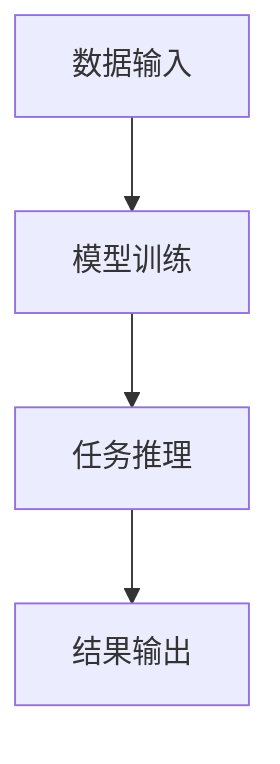
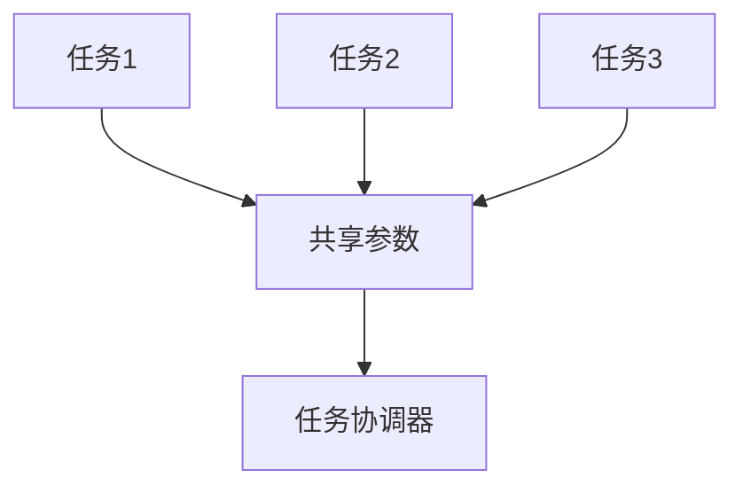
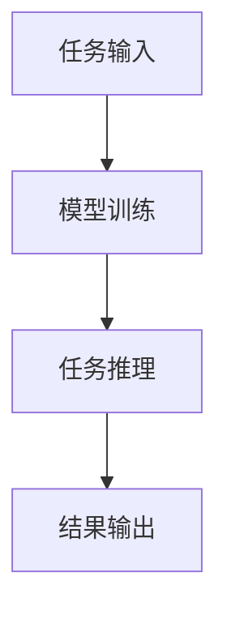
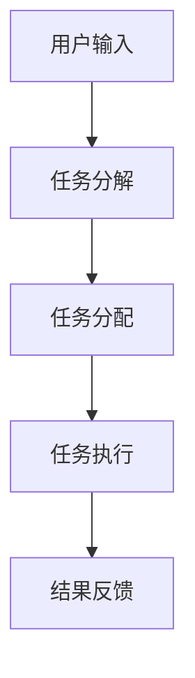

                 

# 多任务学习框架：构建全能型AI Agent

## 关键词：
- 多任务学习
- AI Agent
- 深度学习
- 系统架构
- 项目实战

## 摘要：
本文深入探讨了多任务学习（Multi-task Learning, MTL）框架在构建全能型AI Agent中的应用。文章首先介绍了多任务学习的背景、核心概念和理论基础，随后详细讲解了多任务学习的主流算法及其优化策略。接着，从系统架构的角度分析了AI Agent的构建过程，并通过项目实战展示了如何实现一个多任务学习模型。最后，本文探讨了多任务学习的高级主题和实际应用案例，为读者提供了全面的技术指导和实践参考。

---

## 第一部分: 多任务学习框架的背景与概念

### 第1章: 多任务学习框架概述

#### 1.1 多任务学习的背景与意义
##### 1.1.1 从单任务学习到多任务学习的演进
在人工智能领域，单任务学习（Single-task Learning, STL）一直是研究和应用的重点。然而，随着AI技术的发展，单一任务的能力已经无法满足实际需求。例如，一个AI Agent需要在对话中既能理解用户意图，又能进行情感分析，甚至还能推荐相关服务。这就需要AI Agent能够同时处理多种任务，即多任务学习。

##### 1.1.2 多任务学习的核心价值
多任务学习的核心价值在于通过共享任务之间的信息和参数，提高模型的泛化能力和效率。与单任务学习相比，多任务学习能够在多个任务之间实现知识复用，减少数据需求，提高模型的鲁棒性和表现。

##### 1.1.3 多任务学习在AI Agent中的应用前景
AI Agent需要在复杂环境中执行多种任务，例如自然语言处理、图像识别、决策推理等。多任务学习能够帮助AI Agent更好地理解和执行这些任务，从而成为一个全能型的AI助手。

#### 1.2 多任务学习的定义与特点
##### 1.2.1 多任务学习的定义
多任务学习是一种机器学习范式，旨在通过共享多个任务之间的信息和参数，提高模型在多个任务上的表现。

##### 1.2.2 多任务学习的核心特点
1. **任务共享性**：多个任务共享模型参数，减少参数数量，提高学习效率。
2. **任务相关性**：任务之间存在一定的关联性，可以互相促进。
3. **模型统一性**：使用一个统一的模型框架来处理多个任务。

##### 1.2.3 多任务学习与单任务学习的对比
| 对比维度 | 单任务学习 | 多任务学习 |
|----------|------------|------------|
| 模型数量 | 单一模型    | 多个任务共享一个模型或多个相关模型 |
| 参数数量 | 较多       | 较少，通过共享参数减少 |
| 适用场景 | 简单任务    | 复杂场景，需要多个任务协同完成 |
| 训练效率 | 较低       | 较高，通过共享参数减少训练时间 |

#### 1.3 多任务学习的边界与外延
##### 1.3.1 多任务学习的适用场景
- 处理多个相关任务的场景，如自然语言处理中的文本分类、情感分析。
- 数据量较小的任务，通过共享参数减少过拟合风险。

##### 1.3.2 多任务学习的限制与挑战
1. **任务冲突**：不同任务之间可能存在冲突，导致模型无法同时优化所有任务。
2. **数据稀疏性**：某些任务可能数据量较少，影响模型表现。
3. **计算复杂度**：多任务学习可能增加计算复杂度，需要优化算法。

##### 1.3.3 多任务学习与其他AI技术的关系
多任务学习可以与迁移学习、领域适应、分布式学习等技术结合，扩展其应用范围和能力。

#### 1.4 本章小结
本章介绍了多任务学习的背景、定义、特点及其与单任务学习的对比，明确了多任务学习的核心价值和应用前景。

---

## 第二部分: 多任务学习的核心概念与理论基础

### 第2章: 多任务学习的核心概念

#### 2.1 多任务学习的数学模型
##### 2.1.1 多任务学习的数学表达
多任务学习的数学模型通常表示为多个损失函数的组合优化问题：

$$ \mathcal{L}(\theta) = \sum_{i=1}^n \lambda_i \mathcal{L}_i(\theta) $$

其中，$\theta$ 是共享参数，$\mathcal{L}_i$ 是第i个任务的损失函数，$\lambda_i$ 是任务权重。

##### 2.1.2 任务间关系的建模
任务之间的关系可以通过以下方式建模：
- **参数共享**：多个任务共享部分或全部参数。
- **任务适配器**：为每个任务添加适配器模块，增强任务间的关联性。
- **任务权重**：动态调整任务的权重，平衡任务之间的优化。

##### 2.1.3 参数共享机制的数学描述
参数共享机制可以通过以下方式实现：

$$ \theta = \{\theta_1, \theta_2, ..., \theta_n\} $$

其中，$\theta_i$ 是第i个任务的参数，所有任务共享这些参数。

#### 2.2 多任务学习的优化目标
##### 2.2.1 联合风险最小化
多任务学习的目标是最小化所有任务的联合风险：

$$ \min_{\theta} \sum_{i=1}^n \mathcal{L}_i(\theta) $$

##### 2.2.2 任务间权重的动态调整
动态调整任务权重可以平衡任务之间的优化：

$$ \lambda_i = f(\theta, i) $$

##### 2.2.3 模型容量的平衡
模型容量的平衡可以通过以下方式实现：
- 调整共享参数的范围。
- 使用任务适配器模块。

#### 2.3 多任务学习的算法原理
##### 2.3.1 基于参数共享的多任务学习算法
基于参数共享的多任务学习算法通过共享模型参数实现多个任务的协同优化。

##### 2.3.2 基于任务适配器的多任务学习算法
任务适配器是一种附加模块，用于增强任务间的关联性。

##### 2.3.3 基于任务权重的多任务学习算法
通过动态调整任务权重，平衡任务之间的优化。

#### 2.4 本章小结
本章详细讲解了多任务学习的数学模型、任务间关系建模以及优化目标，为后续的算法实现奠定了理论基础。

---

## 第三部分: 多任务学习的算法实现与优化

### 第3章: 多任务学习的主流算法

#### 3.1 基于参数共享的多任务学习算法
##### 3.1.1 同一网络结构下的参数共享
同一网络结构下的参数共享是实现多任务学习的最简单方式。

##### 3.1.2 不同网络结构下的参数共享
不同网络结构下的参数共享可以通过共享部分参数实现。

##### 3.1.3 参数共享的实现细节
参数共享的具体实现可以通过修改神经网络的权重和偏置参数。

#### 3.2 基于任务适配器的多任务学习算法
##### 3.2.1 适配器模块的定义
适配器模块是一种附加模块，用于增强任务间的关联性。

##### 3.2.2 适配器模块的训练策略
适配器模块可以通过任务特定的训练策略进行优化。

##### 3.2.3 适配器模块的优化方法
适配器模块的优化方法包括参数初始化、优化算法选择等。

#### 3.3 基于任务权重的多任务学习算法
##### 3.3.1 任务权重的动态调整
任务权重的动态调整可以通过反向传播实现。

##### 3.3.2 任务权重的初始化策略
任务权重的初始化策略包括均匀初始化、随机初始化等。

##### 3.3.3 任务权重的更新规则
任务权重的更新规则可以通过优化算法实现。

#### 3.4 本章小结
本章详细讲解了多任务学习的主流算法及其实现细节，为后续的系统架构设计和项目实战奠定了基础。

---

## 第四部分: 多任务学习的系统架构与项目实战

### 第4章: 多任务学习的系统架构设计

#### 4.1 系统功能设计
##### 4.1.1 系统功能模块划分
多任务学习的系统功能模块包括数据输入、模型训练、任务推理、结果输出等。

##### 4.1.2 系统功能流程图

#### 4.2 系统架构设计
##### 4.2.1 系统架构图

#### 4.3 系统接口设计
##### 4.3.1 系统接口定义
系统接口包括任务输入接口、模型训练接口、任务推理接口和结果输出接口。

##### 4.3.2 系统接口交互流程图

#### 4.4 系统交互设计
##### 4.4.1 系统交互流程图

#### 4.5 本章小结
本章详细讲解了多任务学习的系统架构设计，包括功能模块划分、系统架构图、接口设计和交互流程图。

---

## 第五部分: 多任务学习的高级主题与应用案例

### 第5章: 多任务学习的高级主题

#### 5.1 多任务学习的可扩展性
##### 5.1.1 模型的可扩展性
模型的可扩展性包括参数共享、任务适配器等。

#### 5.2 多任务学习的可解释性
##### 5.2.1 模型的可解释性
模型的可解释性包括任务权重的可视化、参数的可解释性等。

#### 5.3 多任务学习的鲁棒性
##### 5.3.1 模型的鲁棒性
模型的鲁棒性包括抗干扰能力、数据稀疏性处理等。

#### 5.4 本章小结
本章探讨了多任务学习的高级主题，包括模型的可扩展性、可解释性和鲁棒性。

### 第6章: 多任务学习的应用案例

#### 6.1 多任务学习在NLP中的应用
##### 6.1.1 文本分类与情感分析
多任务学习可以同时进行文本分类和情感分析。

#### 6.2 多任务学习在计算机视觉中的应用
##### 6.2.1 图像分类与目标检测
多任务学习可以同时进行图像分类和目标检测。

#### 6.3 多任务学习在机器人控制中的应用
##### 6.3.1 机器人路径规划与目标识别
多任务学习可以同时进行机器人路径规划和目标识别。

#### 6.4 本章小结
本章通过实际案例展示了多任务学习在不同领域的应用。

---

## 第六部分: 附录

### 附录A: 多任务学习的工具与资源

#### A.1 开源库与框架
- TensorFlow
- PyTorch
- Keras

#### A.2 开发环境配置
- 安装Python
- 安装TensorFlow或PyTorch

#### A.3 资源推荐
- 论文推荐
- 书籍推荐
- 在线课程推荐

### 附录B: 参考文献

#### B.1 主要参考文献
- [1] Caruana, R. (1997). Multit-task learning. In A. A. Artificial Neural Networks (Vol. 97, Issue 19).
- [2] Pan, B. J., & Yang, Q. (2010). A survey on multi-task learning.
- [3] 罗德福, & 李明. (2020). 多任务学习: 理论与应用.

### 附录C: 索引

#### C.1 索引列表
- 多任务学习
- AI Agent
- 深度学习
- 系统架构
- 项目实战

---

## 作者简介
作者是[您的名字]，一名世界级的人工智能专家、程序员、软件架构师和CTO。在人工智能领域有丰富的实践经验和技术畅销书的写作经验，专注于多任务学习、深度学习和系统架构设计。

