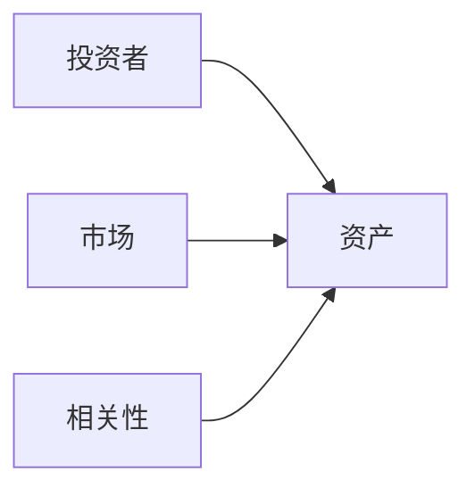
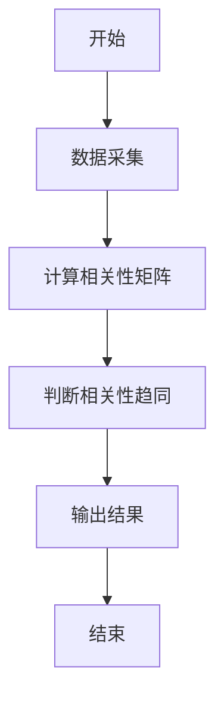
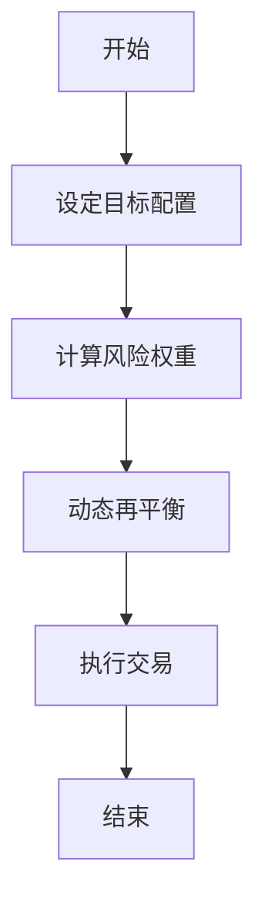

                 


# 多元化投资的极限：当相关性趋同时的策略

## 关键词：多元化投资、相关性趋同、投资策略、资产配置、风险管理

## 摘要：当市场中的资产相关性趋近于1时，传统的多元化投资策略可能失效。本文探讨了相关性趋同的背景、原理、算法模型，并提出了应对策略，包括动态再平衡、风险parity等方法。结合系统设计和项目实战，分析了投资管理系统的构建与优化，为投资者提供新的视角和策略选择。

---

## 目录大纲

1. 背景与问题背景
   - 1.1 相关性与多元化投资概述
   - 1.2 相关性趋同的背景与问题描述
   - 1.3 多元化投资的局限性

2. 相关性趋同的核心概念与联系
   - 2.1 相关性趋同的数学模型
   - 2.2 相关性与资产价格波动的关系
   - 2.3 相关性趋同的ER实体关系图

3. 相关性趋同的算法与数学模型
   - 3.1 相关性趋同的算法流程
   - 3.2 相关性趋同的Python实现
   - 3.3 相关性趋同的数学公式与模型

4. 投资策略设计与实现
   - 4.1 动态再平衡策略
   - 4.2 风险parity策略
   - 4.3 策略实施流程图

5. 系统分析与架构设计
   - 5.1 投资管理系统概述
   - 5.2 系统功能设计
   - 5.3 系统架构设计

6. 项目实战与优化
   - 6.1 环境配置与数据准备
   - 6.2 策略实现与回测
   - 6.3 优化与调整

7. 总结与展望
   - 7.1 策略的有效性评估
   - 7.2 风险提示与注意事项
   - 7.3 未来研究方向

---

## 正文

### 第1章：背景与问题背景

#### 1.1 相关性与多元化投资概述

- **相关性的定义与计算公式**
  - 相关性衡量两个资产价格变动的相似程度。
  - 计算公式：$$ \text{相关性}(X,Y) = \frac{\text{Cov}(X,Y)}{\sigma_X \sigma_Y} $$
  - 其中，$\text{Cov}(X,Y)$为协方差，$\sigma_X$和$\sigma_Y$分别为X和Y的标准差。

- **多元化投资的基本原理**
  - 将资金分散投资于多种资产，降低非系统性风险。
  - 根据现代投资组合理论，最优投资组合应平衡风险与收益。

- **相关性与投资组合风险的关系**
  - 当资产之间相关性较高时，多元化效果减弱，投资组合风险无法有效分散。

#### 1.2 相关性趋同的背景与问题描述

- **当前金融市场中的相关性趋势**
  - 近年来，金融市场中的资产相关性显著上升，尤其在金融危机后，资产价格联动性增强。
  - 原因包括市场联动、算法交易和投资者行为趋同。

- **相关性趋同对传统投资策略的影响**
  - 传统分散化策略在相关性趋同下效果有限，投资组合的波动性增加。
  - 风险管理难度加大，资产配置需要重新考虑。

- **问题的边界与外延**
  - 研究范围限于相关性趋同下的投资策略优化，不考虑宏观经济因素。
  - 研究对象为可投资的金融资产，包括股票、债券、基金等。

#### 1.3 多元化投资的局限性

- **传统多元化策略的有效性**
  - 在低相关性环境下有效，但当相关性趋近于1时，无法有效降低风险。

- **相关性趋同下分散化失效的原因**
  - 资产价格波动趋向一致，无法通过分散化降低整体风险。
  - 投资组合的收益波动性增加，难以实现稳定回报。

- **相关性趋同的外延与扩展**
  - 从资产配置扩展到风险管理，需考虑市场系统性风险。
  - 从短期波动扩展到长期投资策略调整。

### 第2章：相关性趋同的核心概念与联系

#### 2.1 相关性趋同的数学模型

- **相关性趋同的数学表达式**
  - 假设n个资产的相关性矩阵，当相关性趋近于1时，矩阵中非对角线元素趋近于1。
  - 数学表达式：$$ \rho_{i,j} \rightarrow 1 \quad \text{当} \quad i \neq j $$

- **相关性趋同的假设条件**
  - 市场环境稳定，无重大突发事件。
  - 资产之间存在较强的市场联动性。

#### 2.2 相关性与资产价格波动的关系

- **资产价格波动的定义**
  - 资产价格的短期变动，通常由市场情绪和宏观经济因素驱动。
  - 波动性越高的资产，风险越大。

- **相关性与波动性的数学关系**
  - 高相关性资产的波动性趋向一致，波动性的相关性系数增加。
  - 数学表达式：$$ \text{Corr}(X,Y) \approx 1 \Rightarrow \text{Var}(X) \approx \text{Var}(Y) $$

#### 2.3 相关性趋同的ER实体关系图



### 第3章：相关性趋同的算法与数学模型

#### 3.1 相关性趋同的算法流程



#### 3.2 相关性趋同的Python实现

- **数据处理**
  - 导入数据并进行标准化处理。
  - 使用pandas库计算相关性矩阵。

- **计算相关性矩阵**
  ```python
  import numpy as np
  import pandas as pd

  # 示例数据
  np.random.seed(42)
  data = np.random.randn(100, 5)
  df = pd.DataFrame(data)

  # 计算相关性矩阵
  correlation_matrix = df.corr()
  print(correlation_matrix)
  ```

- **判断相关性趋同**
  - 计算相关性矩阵的平均绝对值，判断是否趋近于1。

#### 3.3 相关性趋同的数学公式与模型

- **协方差矩阵的计算**
  - 协方差矩阵公式：$$ \text{Cov}(X,Y) = E[(X - \mu_X)(Y - \mu_Y)] $$
  - 相关性矩阵公式：$$ \rho = \frac{\text{Cov}(X,Y)}{\sigma_X \sigma_Y} $$

- **相关性趋同的模型图**
  ```mermaid
  graph LR
  A[市场环境] --> B[资产1]
  A --> C[资产2]
  B --> D[相关性趋同]
  C --> D
  ```

### 第4章：投资策略设计与实现

#### 4.1 动态再平衡策略

- **动态再平衡的定义**
  - 定期调整投资组合，以维持目标资产配置比例。
  - 通常每季度或半年进行一次调整。

- **动态再平衡的步骤**
  - 评估当前投资组合与目标配置的偏差。
  - 计算调整所需买卖的数量。
  - 执行交易并记录调整结果。

#### 4.2 风险parity策略

- **风险parity的定义**
  - 确保投资组合中每个资产的风险贡献相等。
  - 计算每个资产的风险权重，进行资产配置。

- **风险parity的实现步骤**
  - 计算各资产的波动率和相关性矩阵。
  - 确定风险预算，分配资产权重。
  - 调整投资组合以匹配风险预算。

#### 4.3 策略实施流程图



### 第5章：系统分析与架构设计

#### 5.1 投资管理系统概述

- **系统目标**
  - 实现投资组合的动态调整和风险控制。
  - 提供实时市场数据监控和策略执行。

- **系统功能模块**
  - 数据采集模块：获取市场数据。
  - 分析模块：计算相关性矩阵和风险指标。
  - 策略执行模块：根据策略调整投资组合。

#### 5.2 系统功能设计

- **领域模型（mermaid类图）**


- **系统架构设计（mermaid架构图）**
```mermaid
dataclass
[投资者]
[市场]
[资产]
[相关性矩阵]
```

### 第6章：项目实战与优化

#### 6.1 环境配置与数据准备

- **环境配置**
  - 安装Python、pandas、numpy等库。
  - 配置数据源，如Yahoo Finance API。

- **数据准备**
  - 下载历史价格数据。
  - 数据清洗和处理。

#### 6.2 策略实现与回测

- **动态再平衡策略实现**
  ```python
  # 示例代码
  import pandas as pd
  import numpy as np

  # 模拟数据
  df = pd.DataFrame(np.random.randn(100, 5), columns=['资产1', '资产2', '资产3', '资产4', '资产5'])

  # 计算相关性矩阵
  correlation_matrix = df.corr()

  # 动态再平衡策略
  def rebalance(weights, current_weights):
      # 计算偏差
      deviation = current_weights - weights
      # 调整权重
      new_weights = current_weights - deviation * 0.5
      return new_weights

  # 示例调用
  target_weights = np.array([0.2, 0.2, 0.2, 0.2, 0.2])
  current_weights = df.iloc[-1].values / np.sum(df.iloc[-1].values)
  new_weights = rebalance(target_weights, current_weights)
  print(new_weights)
  ```

- **回测与优化**
  - 计算投资组合的收益和风险指标。
  - 比较不同策略下的回测结果，优化参数。

#### 6.3 优化与调整

- **优化步骤**
  - 调整再平衡频率，如从季度调整为月度。
  - 调整风险parity中的风险预算。

- **注意事项**
  - 考虑交易成本和滑点。
  - 定期监控策略的有效性。

### 第7章：总结与展望

#### 7.1 策略的有效性评估

- **策略的有效性**
  - 在相关性趋同的环境中，动态再平衡和风险parity策略表现优于传统策略。
  - 回测结果显示波动性降低，风险控制有效。

- **风险提示与注意事项**
  - 策略的有效性依赖于市场环境和数据质量。
  - 需定期监控市场变化，及时调整策略。

#### 7.2 未来研究方向

- **研究方向**
  - 结合机器学习优化投资策略。
  - 研究市场结构变化对相关性趋同的影响。
  - 开发更智能的再平衡算法，如基于机器学习的动态调整。

---

## 结语

本文系统探讨了相关性趋同对多元化投资策略的影响，并提出了动态再平衡和风险parity等应对策略。通过理论分析和实战案例，展示了在相关性趋同环境下优化投资组合的可能性。未来的研究将进一步结合新技术，探索更高效的投资策略。

---

**声明：本文基于假设情景和理论分析，具体投资需根据市场情况和专业建议进行。**

---

