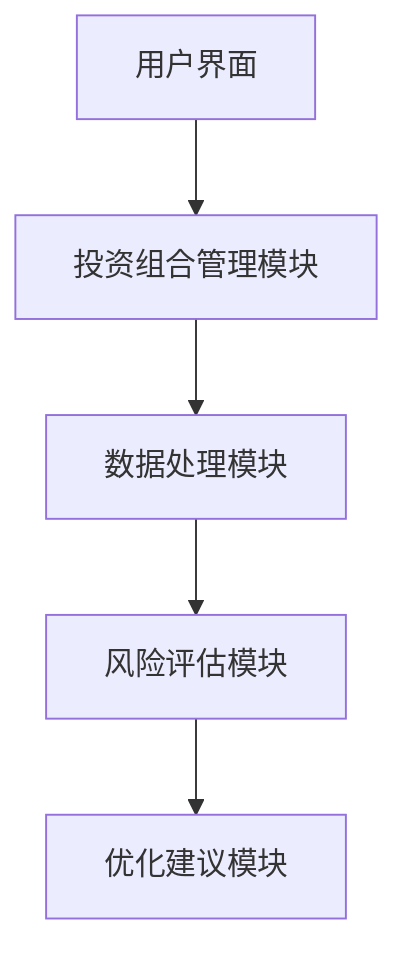

                 


# 多元化投资组合在市场波动中的作用

## 关键词：多元化投资组合、市场波动、风险管理、投资策略、资产配置、现代投资组合理论、系统架构

## 摘要：本文探讨了多元化投资组合在市场波动中的关键作用，通过分析市场波动的基本概念、多元化投资组合的核心原理，结合现代投资组合理论（MPT）的数学模型，深入解析了如何通过科学的资产配置和系统设计来降低风险、优化收益。文章还通过实际案例展示了投资组合管理系统的设计与实现，并提出了在波动市场中的最佳投资策略。

---

# 第一部分：市场波动与投资组合的基础知识

## 第1章：市场波动的基本概念

### 1.1 市场波动的定义与特征

#### 1.1.1 市场波动的定义
市场波动是指金融市场中资产价格在短期内的剧烈波动，通常由市场供需变化、投资者情绪、宏观经济因素等多重因素引起。波动性是市场风险的核心指标之一。

#### 1.1.2 市场波动的主要特征
- **非线性**：市场波动通常表现出非线性特征，即波动幅度可能突然增大或减小。
- **周期性**：市场波动往往呈现周期性，如周期性牛市和熊市交替出现。
- **不可预测性**：市场波动具有高度不确定性，难以准确预测。

#### 1.1.3 市场波动的分类与衡量
市场波动可以分为系统性波动（影响整个市场的因素）和非系统性波动（影响单个资产的因素）。衡量市场波动的主要指标包括标准差、波动率（Volatility）和最大回撤（Maximum Drawdown）。

---

## 第2章：多元化投资组合的原理

### 2.1 多元化投资的基本概念

#### 2.1.1 多元化投资的定义
多元化投资是指将资金分散投资于不同资产类别、行业或地区，以降低单一资产或市场波动带来的风险。

#### 2.1.2 多元化投资的原理
多元化投资通过分散投资组合中的资产，降低特定资产或市场的波动对整体投资组合的影响。这种策略的核心是通过资产之间的负相关性来优化风险与收益的平衡。

#### 2.1.3 多元化投资的优势与局限
- **优势**：降低投资组合的整体波动性，提高风险调整后的收益。
- **局限**：无法完全消除系统性风险，且需要投入更多时间和资源进行组合管理。

### 2.2 现代投资组合理论（MPT）

#### 2.2.1 MPT的核心思想
现代投资组合理论由哈里·马科维茨在1952年提出，认为投资者可以通过优化资产配置来最大化收益，同时最小化投资组合的风险。

#### 2.2.2 马科维茨的有效前沿理论
有效前沿是指在给定风险水平下，能够提供最高预期收益的投资组合的集合。投资者可以通过调整资产配置，在有效前沿上找到最优组合。

#### 2.2.3 风险与收益的平衡
MPT通过引入均值-方差优化模型，帮助投资者在风险与收益之间找到最佳平衡点。其数学模型如下：

$$
\text{目标函数：} \min \sigma^2 \quad \text{在给定} \quad \mu \text{下}
$$

$$
\text{约束条件：} \sum w_i = 1, w_i \geq 0
$$

其中，$\sigma^2$ 表示投资组合的波动率，$\mu$ 表示预期收益，$w_i$ 表示各资产的权重。

---

## 第3章：市场波动中的风险与收益

### 3.1 风险的定义与分类

#### 3.1.1 系统性风险与非系统性风险
- **系统性风险**：影响整个市场的风险，如经济衰退、战争等。
- **非系统性风险**：影响特定资产或行业的风险，如公司业绩下滑。

#### 3.1.2 市场风险与流动性风险
- **市场风险**：由于市场波动导致的资产价格下跌风险。
- **流动性风险**：资产无法迅速变现的风险。

#### 3.1.3 其他类型的风险
如信用风险、操作风险等。

### 3.2 收益的来源与波动性

#### 3.2.1 收益的波动性与市场周期
资产收益往往呈现周期性波动，投资者需要在不同市场周期中调整投资策略。

#### 3.2.2 高收益与高风险的权衡
高收益通常伴随着高风险，尤其是在市场波动剧烈的环境下。

#### 3.2.3 长期收益与短期波动的关系
长期收益更多依赖于资产的内在价值增长，而短期波动更多受到市场情绪和外部事件的影响。

---

# 第二部分：多元化投资组合的系统分析

## 第4章：投资组合管理系统的设计

### 4.1 系统架构设计

#### 4.1.1 系统功能模块划分
- 用户界面模块：用户输入投资需求和偏好。
- 投资组合管理模块：根据用户需求生成优化组合。
- 数据处理模块：收集和分析市场数据。
- 风险评估模块：评估投资组合的风险。
- 优化建议模块：提供调整建议。

#### 4.1.2 系统架构的Mermaid图


### 4.2 系统功能设计

#### 4.2.1 投资组合分析模块
分析现有投资组合的构成和风险收益比。

#### 4.2.2 风险评估模块
评估投资组合在不同市场条件下的潜在风险。

#### 4.2.3 优化建议模块
根据评估结果，提供资产调整建议。

---

## 第5章：投资组合的数学模型与算法

### 5.1 投资组合优化的数学模型

#### 5.1.1 基本模型
$$
\text{目标函数：} \min \sigma^2 \quad \text{在给定} \quad \mu \text{下}
$$

#### 5.1.2 约束条件
$$
\sum w_i = 1, \quad w_i \geq 0
$$

### 5.2 现代投资组合理论的公式推导

#### 5.2.1 有效前沿的数学推导
有效前沿定义为在给定收益下，具有最小波动率的投资组合的集合。

### 5.3 风险调整后的收益评估

#### 5.3.1 Sharpe比率
$$
\text{Sharpe比率} = \frac{E[r - 

---

## 第6章：项目实战与案例分析

### 6.1 环境安装与数据准备
- 数据来源：使用历史市场数据进行回测。
- 工具选择：使用Python的Pandas、NumPy等库进行数据处理。

### 6.2 核心代码实现

#### 6.2.1 投资组合优化的Python代码
```python
import numpy as np
import pandas as pd

def portfolio_optimization(returns):
    n = len(returns.columns)
    returns covariance_matrix = returns.cov()
    returns_mean = returns.mean()
    
    # 最优化问题
    def objective(w):
        return (w.T @ covariance_matrix @ w)[0, 0]
    
    # 约束条件
    constraints = [
        ('sum', w, 1),
        ('>=', w, 0)
    ]
    
    # 使用 scipy.optimize.minimize 进行优化
    from scipy.optimize import minimize
    result = minimize(objective, np.ones(n) / n, constraints)
    return result.x
```

---

## 第7章：总结与最佳实践

### 7.1 总结
多元化投资组合在市场波动中具有重要作用，通过科学的资产配置和系统设计，投资者可以在控制风险的同时，实现收益的最优化。

### 7.2 最佳实践
- **分散投资**：避免过度集中在单一资产或市场。
- **长期投资**：忽略短期波动，关注长期收益。
- **定期调整**：根据市场变化和个人风险偏好，定期优化投资组合。

### 7.3 注意事项
- 市场波动无法完全预测，投资需谨慎。
- 系统设计需考虑数据源的可靠性和模型的可解释性。

### 7.4 拓展阅读
- 马科维茨的《投资学》
- 《风险管理与投资组合优化》

---

通过本文的分析，读者可以深入了解多元化投资组合在市场波动中的重要作用，并通过实际案例和系统设计，掌握如何在复杂多变的市场环境中制定有效的投资策略。

