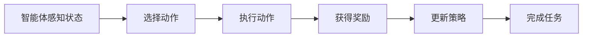

                 


# 多智能体强化学习：协作与竞争的AI Agent系统

## 关键词：
多智能体、强化学习、协作、竞争、AI系统

## 摘要：
多智能体强化学习（Multi-Agent Reinforcement Learning, MARL）是人工智能领域的重要分支，研究多个智能体在协作与竞争环境中通过学习和决策来实现复杂任务的技术。本文将深入探讨多智能体系统的定义、核心概念、算法原理、系统架构以及实际应用，通过案例分析和代码实现，帮助读者全面理解协作与竞争的AI Agent系统。

---

## 第一部分：多智能体强化学习的背景与基础

### 第1章：多智能体强化学习概述

#### 1.1 多智能体强化学习的定义与特点
- 多智能体强化学习（MARL）是指多个智能体在共享或独立的环境中通过相互作用和学习，以实现共同目标或个体目标的过程。
- MARL的核心特点：
  - **协作性**：智能体之间需要通过协作完成复杂任务。
  - **竞争性**：智能体之间可能存在竞争，争夺有限资源或目标。
  - **分布式性**：智能体通常分布在不同的位置或节点，具有独立性和自主性。
  - **动态性**：环境和智能体的状态随时间不断变化，具有不确定性。

#### 1.2 多智能体强化学习的应用场景
- **协作场景**：如游戏AI、机器人协作、智能家居控制。
- **竞争场景**：如自动驾驶、金融交易、网络安全。
- **混合场景**：如分布式系统中的任务分配、多团队协作。

#### 1.3 多智能体强化学习的挑战与机遇
- **挑战**：
  - 通信与协调问题：智能体之间的信息传递和决策同步。
  - 竞争与对抗问题：如何在竞争环境中制定有效策略。
  - 动态平衡问题：协作与竞争的动态切换与平衡。
- **机遇**：
  - 提高系统效率：通过协作优化资源利用。
  - 增强系统鲁棒性：通过竞争机制增强系统的抗干扰能力。
  - 拓展应用场景：多智能体系统在复杂环境中的广泛应用。

---

## 第二部分：多智能体强化学习的核心概念与联系

### 第2章：多智能体系统的核心概念

#### 2.1 多智能体系统的组成要素
- **智能体（Agent）**：智能体是具有感知和行动能力的实体，能够独立决策。
- **环境（Environment）**：智能体所处的外部世界，包含状态、动作和奖励。
- **状态（State）**：智能体在某一时刻的环境信息。
- **动作（Action）**：智能体在某一状态下采取的行为。
- **奖励（Reward）**：智能体行动后获得的反馈，用于评估行动的好坏。

#### 2.2 多智能体系统中的通信与协作
- **通信机制**：
  - 消息传递：智能体之间通过消息传递信息。
  - 语言交流：智能体使用自然语言或特定协议进行交流。
- **协作策略**：
  - 任务分配：智能体根据自身能力和环境需求分配任务。
  - 角色分工：智能体根据角色分工协作完成任务。

#### 2.3 多智能体系统中的竞争与对抗
- **竞争机制**：
  - 资源分配：智能体在有限资源中竞争。
  - 策略对抗：智能体通过策略对抗达到目标。
- **对抗策略**：
  - 博弈论基础：智能体在博弈环境中制定策略。
  - 纳什均衡：一种策略组合，使得每个智能体都无法通过单方面改变策略而获益。

#### 2.4 核心概念对比表
| 概念       | 属性             | 描述                                         |
|------------|------------------|--------------------------------------------|
| 智能体     | 主体性           | 具有独立决策能力的实体                   |
| 环境       | 外部世界         | 智能体所处的物理或虚拟空间               |
| 状态       | 当前情况         | 智能体在某一时刻的环境信息               |
| 动作       | 行为             | 智能体根据状态采取的行动                 |
| 奖励       | 反馈             | 智能体行动后获得的反馈，用于优化决策     |

#### 2.5 ER实体关系图
```mermaid
er
  actor 智能体
  actor 环境
  actor 状态
  actor 动作
  actor 奖励
  智能体 --> 环境
  环境 --> 状态
  状态 --> 动作
  动作 --> 奖励
```

---

## 第三部分：多智能体强化学习的算法原理

### 第3章：多智能体强化学习的算法原理

#### 3.1 协作式多智能体强化学习
- **定义**：智能体之间通过协作完成共同目标。
- **算法流程**：
  1. 智能体感知环境状态。
  2. 智能体之间通信，协商任务。
  3. 智能体根据协商结果制定行动策略。
  4. 智能体执行动作，获得奖励。
  5. 智能体更新策略，优化协作过程。

#### 3.2 竞争式多智能体强化学习
- **定义**：智能体之间通过竞争达到目标。
- **算法流程**：
  1. 智能体感知环境状态。
  2. 智能体制定竞争策略。
  3. 智能体执行动作，争夺资源。
  4. 智能体获得奖励，优化策略。

#### 3.3 混合式多智能体强化学习
- **定义**：智能体在协作与竞争之间动态切换。
- **算法流程**：
  1. 智能体感知环境状态。
  2. 智能体根据需求选择协作或竞争模式。
  3. 智能体执行相应动作。
  4. 智能体更新策略，适应环境变化。

#### 3.4 多智能体强化学习的数学模型
- **策略函数**：
  $$ \pi(a | s) = \arg \max_a Q(s, a) $$
- **价值函数**：
  $$ V(s) = \max_a Q(s, a) $$
- **奖励函数**：
  $$ R(s, a) = \text{奖励值} $$

#### 3.5 算法实现代码
```python
import numpy as np

class Agent:
    def __init__(self, state_space, action_space):
        self.state_space = state_space
        self.action_space = action_space
        self.Q = np.zeros((state_space, action_space))

    def get_action(self, state):
        return np.argmax(self.Q[state])

    def update_Q(self, state, action, reward):
        self.Q[state, action] += reward

# 初始化环境
state_space = 5
action_space = 3
agent = Agent(state_space, action_space)

# 智能体行动
state = 2
action = agent.get_action(state)
reward = 1 if action == 1 else 0
agent.update_Q(state, action, reward)
```

#### 3.6 算法流程图


---

## 第四部分：多智能体强化学习的系统架构设计

### 第4章：系统分析与架构设计方案

#### 4.1 问题场景介绍
- 系统目标：设计一个多智能体协作与竞争系统，实现任务分配与资源管理。
- 使用场景：智能家居中的设备协作与资源竞争。

#### 4.2 系统功能设计
- **领域模型类图**：
  ```mermaid
  classDiagram
      class 智能体 {
          id
          state
          action
      }
      class 环境 {
          state
          action
      }
      class 奖励 {
          value
      }
      智能体 --> 环境
      环境 --> 奖励
  ```

- **系统架构图**：
  ```mermaid
  architecture
      网络层
      应用层
      数据层
  ```

- **系统交互序列图**：
  ```mermaid
  sequenceDiagram
      智能体 -> 环境: 感知状态
      环境 -> 智能体: 返回状态
      智能体 -> 环境: 执行动作
      环境 -> 智能体: 返回奖励
      智能体 -> 系统: 更新策略
  ```

#### 4.3 项目实战

##### 4.3.1 环境搭建
- **安装依赖**：
  ```bash
  pip install gym
  pip install numpy
  ```

##### 4.3.2 系统核心实现
```python
import gym
import numpy as np

env = gym.make('Multi-Agent-Environment-v0')
env.reset()

for _ in range(1000):
    state = env.observation_space
    action = env.action_space
    next_state, reward, done, _ = env.step(action)
    if done:
        env.reset()
```

##### 4.3.3 案例分析与总结
- 案例分析：智能家居中的设备协作与资源竞争。
- 总结：通过多智能体协作与竞争，可以实现智能家居设备的高效管理和资源优化。

---

## 第五部分：多智能体强化学习的最佳实践

### 第5章：最佳实践与小结

#### 5.1 学习与应用建议
- **理论学习**：深入理解多智能体系统的概念与算法。
- **实践操作**：通过实际项目掌握多智能体系统的实现。
- **持续优化**：根据实际需求优化系统性能与策略。

#### 5.2 小结
- 多智能体强化学习是一种复杂的AI技术，涉及协作与竞争的核心机制。
- 通过理论学习与实践操作，可以掌握多智能体系统的实现与优化方法。

#### 5.3 注意事项
- **通信效率**：智能体之间的通信必须高效，避免信息瓶颈。
- **策略平衡**：协作与竞争策略需要动态平衡，避免冲突或内耗。
- **环境复杂性**：复杂环境中的多智能体系统需要更加精细的算法设计。

#### 5.4 拓展阅读
- 推荐书籍：《Reinforcement Learning: Theory and Algorithms》
- 推荐论文：《Multi-Agent Reinforcement Learning: A Survey》
- 推荐博客：[多智能体强化学习博客链接]

---

## 结语
多智能体强化学习是一个充满挑战与机遇的领域，通过深入学习与实践，可以掌握协作与竞争的AI Agent系统的核心技术，应用于多个实际场景，推动人工智能技术的发展。

--- 

希望这篇文章能够帮助读者全面理解多智能体强化学习的核心概念与实际应用！

