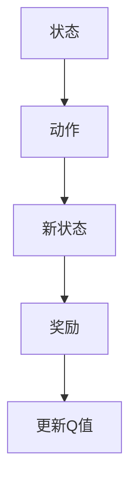
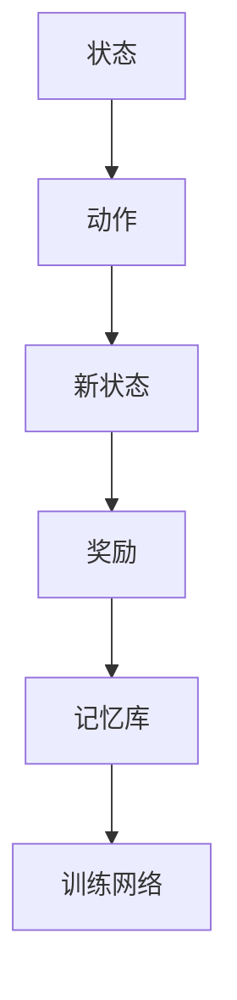
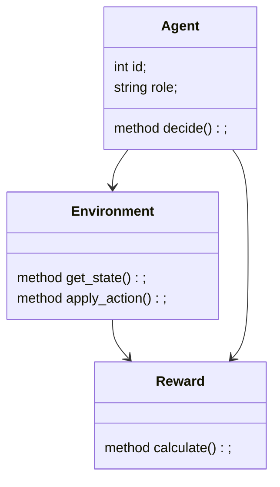
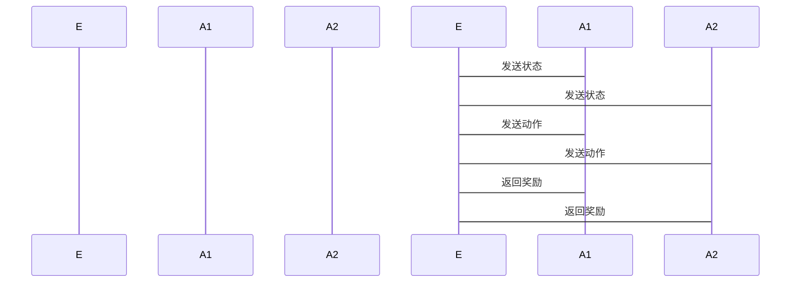

                 


# 多智能体强化学习：复杂环境下的AI Agent协作

> 关键词：多智能体强化学习, AI Agent协作, 复杂环境, 强化学习算法, 系统架构设计

> 摘要：多智能体强化学习是一种通过多个智能体在复杂环境中协作来实现目标的新兴技术。本文详细介绍了多智能体强化学习的核心概念、算法原理、系统架构设计以及实际应用案例。通过深入分析，帮助读者理解如何在复杂环境中实现高效协作，并提供了实际的代码实现和系统设计案例。

---

## 第1章: 多智能体强化学习概述

### 1.1 多智能体强化学习的背景与问题背景
#### 1.1.1 多智能体强化学习的定义
多智能体强化学习（Multi-Agent Reinforcement Learning, MARL）是指多个智能体在共享环境中通过协作和竞争来实现共同目标的学习过程。

#### 1.1.2 多智能体强化学习的核心问题
- **协作与竞争**：智能体需要在协作中寻求共同目标，同时可能面临资源分配和利益冲突。
- **信息共享与决策**：智能体需要处理局部信息，同时可能共享全局信息以做出最优决策。
- **环境动态性**：环境可能具有动态变化，智能体需要实时调整策略。

#### 1.1.3 多智能体强化学习的应用场景
- 智能交通管理
- 多机器人协作
- 网络资源分配
- 财务投资组合优化

### 1.2 多智能体强化学习的基本概念
#### 1.2.1 强化学习的基本概念
强化学习（Reinforcement Learning, RL）是通过智能体与环境交互，逐步学习策略以最大化累积奖励的过程。

#### 1.2.2 多智能体系统的特点
- **多智能体协作**：多个智能体共同完成任务。
- **环境共享**：所有智能体共享同一环境。
- **动作空间扩展**：每个智能体的动作空间相互影响。

#### 1.2.3 单智能体与多智能体的区别
| 特性             | 单智能体强化学习       | 多智能体强化学习       |
|------------------|----------------------|----------------------|
| 智能体数量       | 1                    | 多                  |
| 信息共享         | 无                   | 可能共享             |
| 竞争与协作       | 无                   | 存在                |

### 1.3 多智能体强化学习的挑战与解决方案
#### 1.3.1 协作与竞争问题
- **协作机制**：通过通信协议共享信息。
- **竞争机制**：通过竞争规则分配资源。

#### 1.3.2 状态与动作空间的扩展
- 状态空间增大：每个智能体的状态需要综合考虑。
- 动作空间复杂：每个智能体的动作相互影响。

#### 1.3.3 前瞻性与实时性问题
- **前瞻性**：智能体需要预测其他智能体的决策。
- **实时性**：需要快速响应环境变化。

### 1.4 多智能体强化学习的边界与外延
#### 1.4.1 多智能体与分布式系统的关系
多智能体系统是一种分布式系统，但分布式系统还包括其他类型，如任务分配系统。

#### 1.4.2 多智能体与博弈论的联系
多智能体系统的决策过程与博弈论中的纳什均衡有相似之处。

#### 1.4.3 多智能体与深度学习的结合
深度学习用于处理复杂状态空间，强化学习用于决策过程。

---

## 第2章: 多智能体强化学习的核心概念与联系

### 2.1 多智能体强化学习的核心原理
#### 2.1.1 状态空间的构建
- 状态空间由环境中的各个变量组成，每个智能体感知局部状态。

#### 2.1.2 动作空间的定义
- 动作空间包括所有可能的动作，智能体根据策略选择动作。

#### 2.1.3 奖励机制的设计
- 奖励函数定义智能体的行为价值，影响策略优化。

### 2.2 多智能体协作与竞争的分析
#### 2.2.1 协作机制
- **通信协议**：定义智能体之间的信息共享方式。
- **任务分配**：根据智能体的能力分配任务。

#### 2.2.2 竞争机制
- **资源分配**：智能体竞争有限资源。
- **策略对抗**：智能体采取对抗策略。

#### 2.2.3 协作与竞争的平衡
- **协作优先**：在团队任务中优先协作。
- **竞争优化**：在资源分配中引入竞争机制。

### 2.3 多智能体强化学习的ER实体关系图
```mermaid
er
actor: 智能体
actor -[1..n]-> environment: 环境
environment -[1]-> reward: 奖励
actor -[1..n]-> action: 动作
actor -[1..n]-> state: 状态
```

---

## 第3章: 多智能体强化学习的算法原理

### 3.1 基础算法
#### 3.1.1 Q-learning算法

代码示例：
```python
import numpy as np

class QLearning:
    def __init__(self, state_space, action_space, alpha=0.1, gamma=0.99):
        self.q_table = np.zeros((state_space, action_space))
        self.alpha = alpha
        self.gamma = gamma

    def update_q(self, state, action, reward, next_state):
        self.q_table[state][action] = self.q_table[state][action] + self.alpha * (reward + self.gamma * np.max(self.q_table[next_state]) - self.q_table[state][action])
```

#### 3.1.2 DQN算法

代码示例：
```python
import torch
import torch.nn as nn

class DQN(nn.Module):
    def __init__(self, input_size, output_size):
        super(DQN, self).__init__()
        self.fc = nn.Linear(input_size, output_size)
    
    def forward(self, x):
        return self.fc(x)
```

### 3.2 分布式多智能体

---

## 第4章: 系统分析与架构设计方案

### 4.1 问题场景介绍
- **场景描述**：智能体在动态环境中协作完成任务。
- **系统目标**：设计一个高效的多智能体协作系统。

### 4.2 系统功能设计


### 4.3 系统架构设计


### 4.4 系统接口设计
- **输入接口**：接收环境状态和智能体动作。
- **输出接口**：输出智能体决策和奖励信号。

### 4.5 系统交互序列图


---

## 第5章: 项目实战

### 5.1 环境安装
- 安装必要的库：如Python、TensorFlow、Keras、OpenAI Gym。

### 5.2 核心代码实现
```python
import gym
from gym import spaces
import numpy as np

class MultiAgentEnv(gym.Env):
    def __init__(self):
        super().__init__()
        self.observation_space = spaces.Tuple([spaces.Discrete(5), spaces.Discrete(5)])
        self.action_space = spaces.Tuple([spaces.Discrete(3), spaces.Discrete(3)])
        self.state = (0, 0)

    def step(self, action):
        state, reward, done, info = self._step(action)
        return state, reward, done, info

    def _step(self, action):
        # 实现环境的动态更新
        pass

    def reset(self):
        self.state = (0, 0)
        return self.state
```

### 5.3 代码解读与分析
- **环境定义**：定义多智能体环境的状态和动作空间。
- **智能体策略**：实现智能体的决策逻辑。
- **奖励机制**：根据环境反馈调整策略。

### 5.4 案例分析
- **案例选择**：交通信号灯控制。
- **实施过程**：部署多个智能体管理交通流量。
- **结果分析**：评估系统性能，优化智能体协作策略。

---

## 第6章: 最佳实践

### 6.1 小结
- 多智能体强化学习通过协作与竞争实现复杂任务。
- 系统设计需考虑信息共享和动态环境。

### 6.2 注意事项
- **信息过载**：避免过多信息共享导致计算开销。
- **同步与异步**：选择合适的同步机制。
- **安全性**：确保智能体决策的安全性。

### 6.3 拓展阅读
- 《Multi-Agent Reinforcement Learning: A Survey》
- 《Distributed Reinforcement Learning: A Comprehensive Survey》

---

## 附录

### 附录A: 数学公式汇总
- Q-learning更新公式：$$ Q(s,a) = Q(s,a) + \alpha (r + \gamma \max Q(s',a') - Q(s,a)) $$
- DQN目标网络更新公式：$$ \theta_{target} = \theta_{main} + \epsilon $$

### 附录B: 代码示例
```python
import gym
from gym import spaces
import numpy as np

class MultiAgentEnv(gym.Env):
    def __init__(self):
        super().__init__()
        self.observation_space = spaces.Tuple([spaces.Discrete(5), spaces.Discrete(5)])
        self.action_space = spaces.Tuple([spaces.Discrete(3), spaces.Discrete(3)])
        self.state = (0, 0)

    def step(self, action):
        state, reward, done, info = self._step(action)
        return state, reward, done, info

    def _step(self, action):
        # 实现环境的动态更新
        pass

    def reset(self):
        self.state = (0, 0)
        return self.state
```

---

# 结语
多智能体强化学习为复杂环境下的AI协作提供了新的思路。通过本文的详细讲解，读者可以掌握核心概念、算法原理和实际应用，为未来的研究和实践打下坚实基础。

