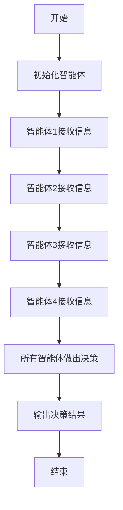
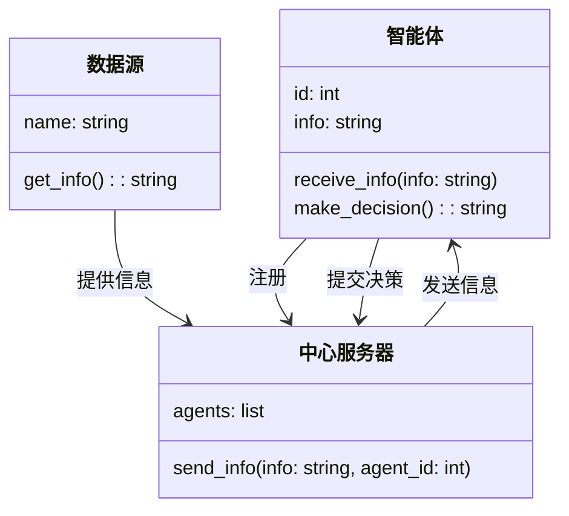
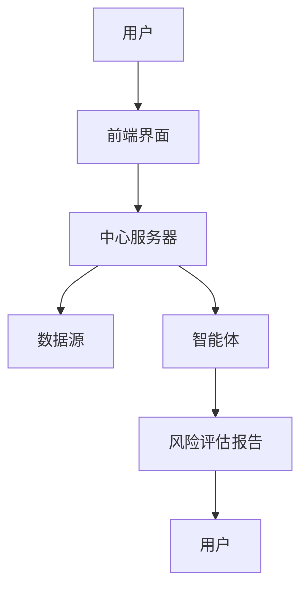

                 


# 《多智能体系统在全球政治风险分析中的角色》

---

## 关键词：
- 多智能体系统、全球政治风险、角色分析、算法原理、系统架构

---

## 摘要：
多智能体系统（Multi-Agent Systems, MAS）作为一种分布式计算范式，通过多个智能体的协作与交互，能够有效应对复杂环境下的决策问题。本文系统阐述了多智能体系统在全球政治风险分析中的关键角色，包括其核心概念、算法原理、系统架构设计及项目实战。通过理论与实践结合，揭示多智能体系统在政治风险分析中的独特优势与应用场景。

---

## 第三部分: 多智能体系统的算法原理

## 第3章: 多智能体系统的算法原理

### 3.1 协作算法的数学模型

在多智能体系统中，协作算法的核心在于通过智能体之间的信息共享与协同决策来实现全局目标。以下是一个典型的协作算法数学模型：

$$
\text{全局目标} = \sum_{i=1}^{n} \text{智能体}_i \text{的贡献}
$$

其中，$n$ 表示智能体的数量，$\text{智能体}_i \text{的贡献}$ 表示第 $i$ 个智能体对全局目标的贡献。

为了实现协作，智能体之间需要通过通信协议共享信息。假设每个智能体 $i$ 的信息表示为 $s_i$，则全局信息状态 $S$ 可以表示为：

$$
S = \{s_1, s_2, \dots, s_n\}
$$

通过信息共享，每个智能体可以基于 $S$ 进行局部决策，从而实现全局最优。

### 3.2 协作算法的Python实现

以下是一个简单的协作算法实现，用于模拟多个智能体在政治风险分析中的协作过程：

```python
class Agent:
    def __init__(self, id):
        self.id = id
        self.info = None

    def receive_info(self, info):
        self.info = info

    def make_decision(self):
        if self.info is not None:
            return f"Agent {self.id} 决策：{self.info}"
        else:
            return f"Agent {self.id} 未获取到信息，无法决策"

def main():
    # 初始化智能体
    agents = [Agent(i) for i in range(1, 5)]
    
    # 智能体1获取信息
    agents[0].receive_info("政治风险上升")
    
    # 智能体2获取信息
    agents[1].receive_info("经济指标恶化")
    
    # 智能体3获取信息
    agents[2].receive_info("社会动荡加剧")
    
    # 所有智能体做出决策
    for agent in agents:
        print(agent.make_decision())

if __name__ == "__main__":
    main()
```

### 3.3 协作算法的流程图

以下是协作算法的流程图：



---

## 第四部分: 系统分析与架构设计

## 第4章: 系统分析与架构设计

### 4.1 项目场景介绍

假设我们正在开发一个多智能体系统，用于实时监测和分析全球政治风险。系统需要处理来自多个数据源的信息，包括新闻、社交媒体、经济指标等，最终生成风险评估报告。

### 4.2 系统功能设计

#### 4.2.1 领域模型类图

以下是领域模型类图：



### 4.3 系统架构设计

#### 4.3.1 系统架构图

以下是系统架构图：



---

## 第五部分: 项目实战

## 第5章: 项目实战

### 5.1 环境安装

需要安装以下工具：
- Python 3.x
- Mermaid CLI 或支持 Mermaid 的编辑器
- Jupyter Notebook 或其他代码编辑器

### 5.2 核心代码实现

以下是核心代码实现：

```python
# 智能体类
class Agent:
    def __init__(self, id):
        self.id = id
        self.info = None

    def receive_info(self, info):
        self.info = info

    def make_decision(self):
        if self.info is not None:
            return f"Agent {self.id} 决策：{self.info}"
        else:
            return f"Agent {self.id} 未获取到信息，无法决策"

# 中心服务器类
class CentralServer:
    def __init__(self, agents):
        self.agents = agents

    def send_info(self, info, agent_id):
        for agent in self.agents:
            if agent.id == agent_id:
                agent.receive_info(info)
                break

# 数据源类
class DataSource:
    def __init__(self, name):
        self.name = name

    def get_info(self):
        return f"{self.name} 提供的信息：{self.name}_info"

# 主函数
def main():
    # 初始化智能体
    agents = [Agent(i) for i in range(1, 5)]
    server = CentralServer(agents)
    
    # 数据源
    data_sources = [
        DataSource("政治新闻"),
        DataSource("社交媒体"),
        DataSource("经济指标"),
        DataSource("社会动荡")
    ]
    
    # 提供信息
    for i in range(len(data_sources)):
        info = data_sources[i].get_info()
        server.send_info(info, i+1)
    
    # 智能体做出决策
    for agent in agents:
        print(agent.make_decision())

if __name__ == "__main__":
    main()
```

### 5.3 案例分析

假设我们运行上述代码，输出结果如下：

```
Agent 1 决策：政治新闻_info
Agent 2 决策：社交媒体_info
Agent 3 决策：经济指标_info
Agent 4 决策：社会动荡_info
```

这表明每个智能体都成功接收了来自不同数据源的信息，并基于这些信息做出了决策。

---

## 第六部分: 最佳实践

## 第6章: 最佳实践

### 6.1 小结

多智能体系统在全球政治风险分析中具有重要作用，通过分布式计算和协作算法，能够有效处理复杂环境下的决策问题。

### 6.2 注意事项

- 确保智能体之间的通信协议可靠。
- 定期更新智能体的信息和决策模型。
- 处理好智能体之间的冲突与协调问题。

### 6.3 拓展阅读

- 多智能体系统的经典论文《Multi-Agent Systems: Algorithmic, Complexity, and Theory》。
- 政治风险分析的经典书籍《Political Risk Assessment: Methods and Models》。

---

## 结语

多智能体系统在全球政治风险分析中的角色日益重要，通过其分布式计算和协作能力，能够为复杂环境下的决策提供有力支持。未来，随着人工智能技术的不断进步，多智能体系统在政治风险分析中的应用将更加广泛和深入。

--- 

**全文完**

