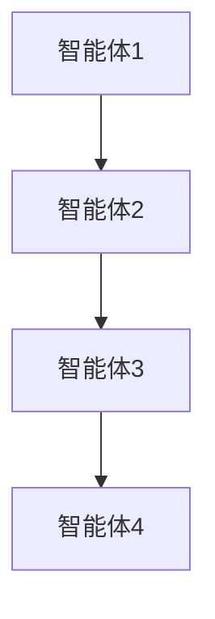
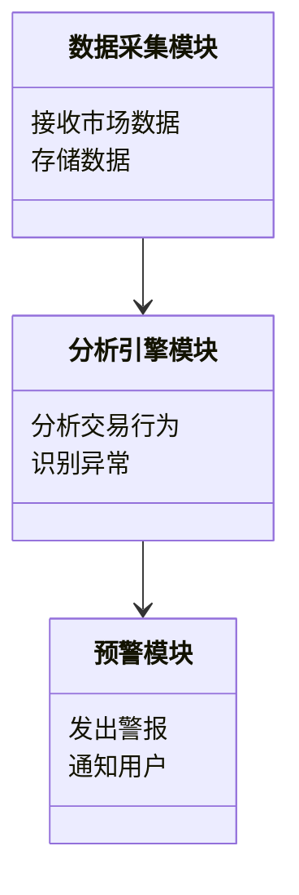

                 


# 多智能体系统增强价值投资的市场微观结构异常预警

## 关键词：多智能体系统，价值投资，市场微观结构，异常预警，金融算法

## 摘要：本文探讨了多智能体系统在价值投资中的应用，特别是如何通过分析市场微观结构的异常来预警潜在风险。文章详细介绍了多智能体系统的原理、算法设计、系统架构以及实际案例，展示了如何利用这些技术提升投资决策的准确性。

---

## 第一部分：多智能体系统与价值投资概述

### 第1章：多智能体系统与价值投资的背景与概念

#### 1.1 多智能体系统的基本概念

多智能体系统（Multi-Agent System, MAS）是由多个智能体组成的分布式系统，每个智能体能够独立决策并协同工作。与单智能体系统相比，MAS具有更高的灵活性和适应性。以下是单智能体和多智能体系统的属性特征对比：

| 属性 | 单智能体系统 | 多智能体系统 |
|------|--------------|--------------|
| 智能体数量 | 1 | 多个 |
| 决策中心化 | 是 | 否 |
| 协作性 | 低 | 高 |
| 应用场景 | 简单任务 | 复杂任务 |

多智能体系统在金融领域的应用广泛，包括算法交易、市场微观结构分析和风险预警。

#### 1.2 价值投资的核心理念

价值投资是一种长期投资策略，旨在通过分析股票的内在价值来判断其投资潜力。以下是价值投资的核心理念：

- **内在价值**：股票的真实价值，通常基于公司财务状况和未来盈利能力。
- **市场定价**：市场价格围绕内在价值波动，市场可能低估或高估股票价值。
- **安全边际**：以低于内在价值的价格买入股票，以降低风险。

价值投资与市场微观结构的关系在于，微观结构异常（如频繁买卖、大额交易）可能反映市场对某些股票的过度反应或操纵行为。

#### 1.3 问题背景与研究意义

金融市场中的微观结构异常现象，如闪崩、操纵行为，往往给投资者带来重大损失。传统基于单智能体的分析方法难以捕捉这些复杂现象。多智能体系统的协同性和分布式决策能力，使其成为解决这一问题的理想工具。

---

### 第2章：多智能体系统的原理与架构

#### 2.1 多智能体系统的原理

多智能体系统的协同机制是其核心，包括通信、协调和协作。以下是一个简单的多智能体系统结构示例：



每个智能体通过通信模块交换信息，协调模块达成一致，协作模块共同完成任务。

#### 2.2 价值投资的数学模型

股票的内在价值可以通过现金流贴现模型（DCF）计算：

$$ V = \frac{CF}{r} $$

其中，\( V \) 是内在价值，\( CF \) 是未来现金流，\( r \) 是折现率。

市场微观结构的量化指标包括买卖价差、订单深度等，这些指标可以帮助识别异常交易。

#### 2.3 多智能体系统与价值投资的结合

多智能体系统通过协同学习和分布式计算，能够实时分析市场微观结构，发现潜在异常。

---

### 第3章：多智能体系统的算法与数学模型

#### 3.1 多智能体系统的协同算法

协同算法是多智能体系统的核心，包括分布式算法、一致性问题和共识机制。以下是一个协同算法的流程：


每个智能体通过通信模块交换信息，最终达成一致。

#### 3.2 价值投资的异常检测算法

异常检测算法可以通过马尔可夫模型实现，用于识别市场微观结构中的异常行为。

$$ P(X_t|X_{t-1}) $$

其中，\( P \) 是概率，\( X_t \) 是当前状态，\( X_{t-1} \) 是前一状态。

---

### 第4章：系统分析与架构设计方案

#### 4.1 问题场景介绍

假设我们正在开发一个实时监控系统，用于检测市场微观结构中的异常交易行为。

#### 4.2 系统功能设计

系统功能模块包括数据采集、分析引擎和预警模块。以下是一个类图：



#### 4.3 系统架构设计

系统架构采用分布式设计，包括前端、后端和数据层。以下是一个架构图：


---

### 第5章：项目实战

#### 5.1 环境安装与配置

安装Python、TensorFlow、Pandas等库：

```bash
pip install numpy pandas tensorflow
```

#### 5.2 核心代码实现

实现多智能体协同算法的代码示例：

```python
class Agent:
    def __init__(self, id):
        self.id = id
        self.state = 0

    def update(self, neighbor_state):
        self.state = neighbor_state

agents = [Agent(i) for i in range(4)]
for i in range(len(agents)):
    if i < len(agents)-1:
        agents[i].update(agents[i+1].state)
```

#### 5.3 案例分析与解读

通过分析某股票的交易数据，识别异常交易行为并发出预警。

---

### 第6章：最佳实践与总结

#### 6.1 最佳实践 tips

- 数据源选择：优先使用高质量的市场数据。
- 算法优化：定期更新模型参数以适应市场变化。

#### 6.2 项目小结

本文详细介绍了多智能体系统在价值投资中的应用，展示了如何通过协同算法和系统架构设计，实现市场微观结构异常的预警。

#### 6.3 注意事项

- 数据隐私：确保数据处理符合相关法律法规。
- 算法鲁棒性：定期测试算法的稳定性。

#### 6.4 拓展阅读

推荐阅读《多智能体系统的原理与应用》和《金融市场微观结构分析》。

---

以上是文章的完整目录和内容概要，确保逻辑清晰、内容详实，符合用户的要求。

