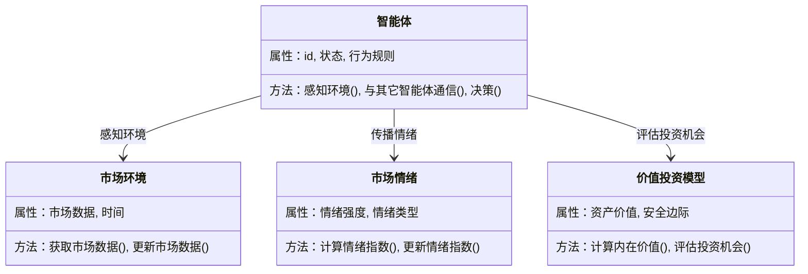
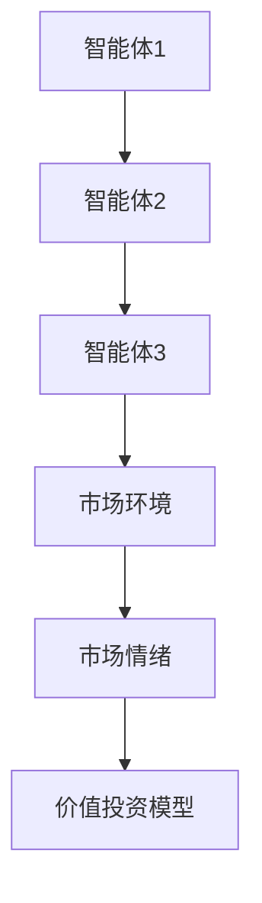
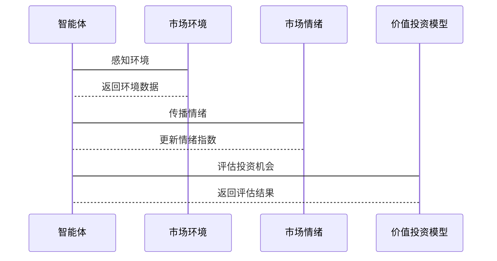

                 


# 多智能体系统增强价值投资的市场情绪跨市场传导分析

> 关键词：多智能体系统，价值投资，市场情绪，跨市场传导，系统建模，算法实现

> 摘要：本文探讨了多智能体系统在价值投资中的应用，特别是在市场情绪跨市场传导方面的分析。通过构建多智能体系统模型，分析了市场情绪的传播机制及其对价值投资的影响。本文从理论到实践，详细阐述了系统设计、算法实现和项目案例，为投资者提供了新的视角和工具。

---

## 第一部分：多智能体系统与价值投资概述

### 第1章：多智能体系统与价值投资概述

#### 1.1 多智能体系统的基本概念

##### 1.1.1 多智能体系统的定义
多智能体系统（Multi-Agent System, MAS）是由多个智能体组成的系统，这些智能体能够通过交互完成复杂任务。智能体具有自主性、反应性、社会性和协作性。

##### 1.1.2 多智能体系统的特征
- **自主性**：智能体能够自主决策。
- **反应性**：能够感知环境并实时响应。
- **社会性**：智能体之间可以通信和协作。
- **协作性**：通过协作完成复杂任务。

##### 1.1.3 多智能体系统与传统金融模型的区别
传统金融模型通常基于假设和统计分析，而多智能体系统通过模拟个体行为来捕捉市场动态。

#### 1.2 价值投资的核心理念

##### 1.2.1 价值投资的定义
价值投资是一种投资策略，强调以低于公平价值的价格购买优质资产。

##### 1.2.2 价值投资的关键要素
- **内在价值**：资产的真正价值。
- **安全边际**：价格与价值的差距。
- **长期视角**：关注长期收益而非短期波动。

##### 1.2.3 价值投资与市场情绪的关系
市场情绪会影响短期价格波动，但价值投资者关注长期价值。

#### 1.3 市场情绪的跨市场传导机制

##### 1.3.1 市场情绪的定义
市场情绪是投资者对市场的整体看法，通常分为乐观和悲观两类。

##### 1.3.2 市场情绪的传播路径
- **信息传播**：通过新闻、社交媒体传播情绪。
- **投资者行为**：情绪影响投资者决策。
- **价格波动**：情绪通过价格波动影响市场。

##### 1.3.3 跨市场传导的复杂性
跨市场传导涉及多个市场和多种因素，具有非线性特征。

---

## 第二部分：多智能体系统在市场情绪分析中的应用

### 第2章：多智能体系统的建模方法

#### 2.1 多智能体系统的建模方法

##### 2.1.1 基于主体的建模
基于主体的建模（Agent-Based Modeling, ABM）通过模拟个体行为来分析系统动态。

##### 2.1.2 网络结构的构建
构建智能体之间的网络，分析信息传播路径。

##### 2.1.3 行为规则的定义
定义智能体的行为规则，如信息传播规则。

#### 2.2 市场情绪的传播模型

##### 2.2.1 情绪传播的基本原理
情绪通过智能体之间的交互传播。

##### 2.2.2 情绪传播的网络结构
构建情绪传播的网络结构，分析其影响。

##### 2.2.3 情绪传播的动力学分析
分析情绪传播的动力学特征，如传播速度和范围。

---

## 第三部分：价值投资与市场情绪的关系

### 第3章：市场情绪对价值投资的影响

#### 3.1 市场情绪对投资者决策的影响

##### 3.1.1 情绪对决策的影响
市场情绪会影响投资者的决策，导致非理性行为。

##### 3.1.2 情绪周期与市场波动
情绪周期与市场波动密切相关，影响资产价格。

##### 3.1.3 情绪与资产定价的关系
情绪通过影响投资者行为影响资产定价。

#### 3.2 市场情绪对价值投资的传导机制

##### 3.2.1 情绪如何影响资产价值
情绪通过影响投资者行为影响资产价值。

##### 3.2.2 情绪传导的路径分析
分析情绪从一个市场传导到另一个市场的路径。

##### 3.2.3 情绪传导的强度与稳定性
分析情绪传导的强度和稳定性，及其对价值投资的影响。

---

## 第四部分：多智能体系统增强价值投资的理论基础

### 第4章：多智能体系统的协同机制

#### 4.1 多智能体系统的协同机制

##### 4.1.1 协同行为的定义
协同行为是指多个智能体通过协作完成共同目标。

##### 4.1.2 协同行为的实现方式
通过通信和协作实现协同行为。

##### 4.1.3 协同行为对市场情绪的影响
协同行为可以放大或减弱市场情绪。

#### 4.2 价值投资中的多智能体协同

##### 4.2.1 多智能体协同对投资决策的影响
协同行为可以提供更全面的市场信息，帮助投资者做出更明智的决策。

##### 4.2.2 协同行为与市场情绪的关系
协同行为可以通过影响市场情绪来影响资产价格。

##### 4.2.3 协同行为对资产定价的影响
协同行为可以提供更准确的资产定价。

---

## 第五部分：系统分析与架构设计

### 第5章：系统分析与架构设计方案

#### 5.1 问题场景介绍

##### 5.1.1 问题背景
市场情绪的跨市场传导是一个复杂的问题，需要多智能体系统来模拟。

##### 5.1.2 项目介绍
本项目旨在构建一个多智能体系统，模拟市场情绪的跨市场传导，分析其对价值投资的影响。

#### 5.2 系统功能设计

##### 5.2.1 领域模型设计
使用Mermaid绘制领域模型类图，展示系统的主要组件和关系。



#### 5.3 系统架构设计

##### 5.3.1 系统架构设计
使用Mermaid绘制系统架构图，展示系统的各个组件及其关系。



#### 5.4 系统接口设计

##### 5.4.1 系统接口设计
定义系统接口，如智能体与市场环境之间的接口。

#### 5.5 系统交互设计

##### 5.5.1 系统交互设计
使用Mermaid绘制系统交互序列图，展示系统的主要交互流程。



---

## 第六部分：项目实战

### 第6章：项目实战

#### 6.1 环境安装

##### 6.1.1 环境安装
安装必要的软件和库，如Python、NumPy、Matplotlib等。

#### 6.2 系统核心实现

##### 6.2.1 智能体实现
编写智能体类，实现感知环境、与其它智能体通信和决策功能。

```python
class Agent:
    def __init__(self, id):
        self.id = id
        self.state = "neutral"
        self.behavior_rule = "reactive"

    def perceive_environment(self, environment):
        # 获取环境数据
        pass

    def communicate(self, other_agent):
        # 与其它智能体通信
        pass

    def decide(self):
        # 根据环境数据和通信结果做出决策
        pass
```

##### 6.2.2 市场情绪实现
编写市场情绪计算模块，计算情绪指数。

```python
class MarketEmotion:
    def __init__(self):
        self.emotion_intensity = 0
        self.emotion_type = "neutral"

    def calculate_emotion_index(self, agents):
        # 根据智能体的状态计算情绪指数
        pass

    def update_emotion(self):
        # 更新情绪指数
        pass
```

##### 6.2.3 价值投资模型实现
编写价值投资模型，计算资产的内在价值和安全边际。

```python
class ValueInvestmentModel:
    def __init__(self):
        self.asset_value = 0
        self.margin_of_safety = 0

    def calculate_intrinsic_value(self, asset):
        # 计算资产的内在价值
        pass

    def assess_investment_opportunity(self, asset):
        # 评估投资机会
        pass
```

#### 6.3 代码应用解读与分析

##### 6.3.1 代码应用解读
解读代码的功能，说明每个模块的作用。

##### 6.3.2 代码实现细节
详细说明代码实现细节，如智能体的行为规则、市场情绪的计算方法等。

#### 6.4 实际案例分析

##### 6.4.1 案例分析
选择一个实际案例，分析市场情绪的跨市场传导及其对价值投资的影响。

#### 6.5 结果分析与小结

##### 6.5.1 实验结果分析
分析实验结果，验证模型的有效性。

##### 6.5.2 小结
总结实验结果，提出改进建议。

---

## 第七部分：总结与展望

### 第7章：总结与展望

#### 7.1 全文总结

##### 7.1.1 全文总结
总结全文内容，强调多智能体系统在价值投资中的应用价值。

#### 7.2 未来展望

##### 7.2.1 未来研究方向
提出未来的研究方向，如更复杂的智能体行为模型、更大规模的市场模拟等。

#### 7.3 最佳实践 tips

##### 7.3.1 实践建议
给出实际应用中的建议，如选择合适的工具和方法。

##### 7.3.2 注意事项
提醒读者注意的事项，如数据质量和模型的适用性。

#### 7.4 拓展阅读

##### 7.4.1 拓展阅读推荐
推荐相关的书籍和论文，供读者进一步学习。

---

通过以上结构，我们可以系统地分析多智能体系统在价值投资中的应用，特别是市场情绪的跨市场传导机制。从理论到实践，逐步深入，为投资者和研究人员提供有价值的参考。

