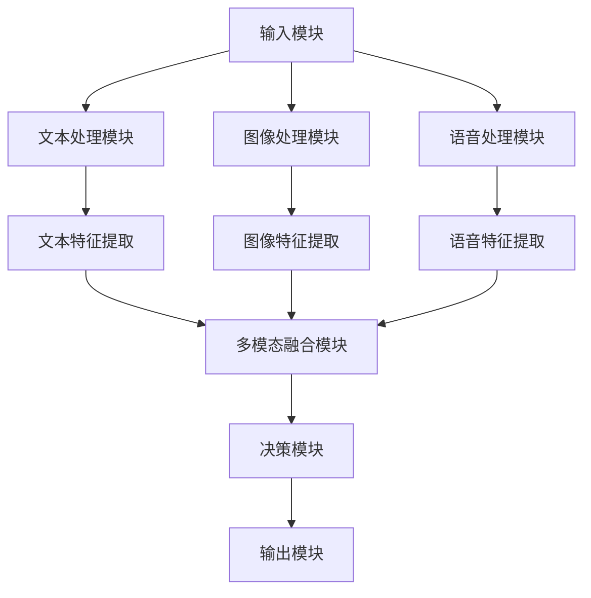

                 


# 多模态AI Agent：整合文本、图像和语音

## 关键词：多模态AI Agent，文本处理，图像处理，语音处理，深度学习，人机交互

## 摘要：  
本文探讨了多模态AI Agent在整合文本、图像和语音等多模态数据方面的最新进展和挑战。通过分析多模态数据的处理、融合和AI Agent的实现，本文为构建高效、智能的多模态AI系统提供了理论基础和实践指导。

---

## 第一部分：多模态AI Agent的背景与概念

### 1.1 多模态AI Agent的背景

随着人工智能技术的飞速发展，AI Agent（智能体）逐渐从单一模态处理向多模态整合方向演进。传统的AI系统通常只能处理单一类型的数据，例如文本、图像或语音，但在现实场景中，用户往往需要通过多种模态进行交互和信息传递。例如，在智能助手、智能客服、自动驾驶等领域，单一模态的处理能力已经无法满足复杂场景的需求。因此，整合文本、图像和语音等多种模态数据的AI Agent应运而生。

---

### 1.2 多模态AI Agent的核心概念

#### 1.2.1 多模态数据的整合与处理

多模态数据整合的核心目标是将文本、图像和语音等多种数据类型进行有效融合，以提升AI系统的理解和决策能力。以下是三种模态数据的主要特点对比：

| 数据类型 | 特点 | 应用场景 |
|----------|------|----------|
| 文本      | 结构化、可解释性高 | 自然语言处理、信息检索 |
| 图像      | 信息丰富、非结构化 | 图像识别、计算机视觉 |
| 语音      | 时间序列、情感信息丰富 | 语音识别、情感计算 |

通过对比可以看出，三种模态数据在信息特点和应用场景上有显著差异，但也存在互补性。

#### 1.2.2 AI Agent的原理与架构

AI Agent是一种能够感知环境、执行任务并做出决策的智能系统。其核心架构通常包括以下模块：

- **感知模块**：负责接收和处理多种模态的输入数据。
- **理解模块**：对输入数据进行语义理解和意图识别。
- **决策模块**：基于理解和上下文信息做出决策。
- **执行模块**：通过动作或输出与用户或环境进行交互。

多模态AI Agent的架构可以用以下ER图表示：

```mermaid
er
    title 多模态AI Agent架构
    User -->> Agent: 发出请求
    Agent --> Text_Processor: 处理文本输入
    Agent --> Image_Processor: 处理图像输入
    Agent --> Voice_Processor: 处理语音输入
    Agent --> Decision_Maker: 做出决策
    Agent -->> User: 返回结果
```

#### 1.2.3 多模态AI Agent的优势与挑战

优势：
- **信息互补性**：通过整合多种模态数据，AI Agent能够更全面地理解用户意图和环境信息。
- **用户体验提升**：多模态交互能够提供更自然、更高效的用户交互方式。

挑战：
- **数据融合的复杂性**：不同模态数据的特征维度和时间特性差异较大，如何有效融合是一个难题。
- **计算资源需求**：多模态数据处理通常需要较高的计算资源。

---

## 第二部分：多模态数据的处理与融合

### 2.1 多模态数据的整合与预处理

#### 2.1.1 数据格式的标准化

多模态数据通常以不同的格式存在，例如文本为字符串，图像为像素矩阵，语音为波形数据。为了方便处理，需要将这些数据转换为统一的表示形式。

例如，文本可以转换为词向量，图像可以转换为特征向量，语音可以转换为Mel频谱。以下是一个简单的文本向量化过程：

```python
from transformers import BertTokenizer, BertModel

tokenizer = BertTokenizer.from_pretrained('bert-base-uncased')
model = BertModel.from_pretrained('bert-base-uncased')

text = "Hello, how are you?"
encoded_input = tokenizer(text, return_tensors='numpy')
output = model(**encoded_input)
print(output.last_hidden_state)
```

#### 2.1.2 数据对齐与同步

在多模态数据处理中，时间对齐是一个关键问题。例如，在语音和文本的同步中，需要将语音信号的时间戳与文本的分词时间对齐。

---

### 2.2 多模态数据的特征提取

#### 2.2.1 文本特征提取

文本特征提取主要依赖于自然语言处理技术。常用的文本表示方法包括词袋模型、TF-IDF和词嵌入（如Word2Vec、BERT）。例如，使用BERT模型提取文本的上下文向量：

```python
from transformers import BertTokenizer, BertModel

tokenizer = BertTokenizer.from_pretrained('bert-base-uncased')
model = BertModel.from_pretrained('bert-base-uncased')

text = "This is an example sentence."
inputs = tokenizer(text, return_tensors='pt')
outputs = model(**inputs)
print(outputs.last_hidden_state)
```

#### 2.2.2 图像特征提取

图像特征提取主要依赖于卷积神经网络（CNN）。常用的图像表示方法包括AlexNet、VGG、ResNet和Inception系列。例如，使用ResNet提取图像特征：

```python
import torch
import torchvision

model = torchvision.models.resnet50(pretrained=True)
model.eval()

img = torch.randn(1, 3, 224, 224)
with torch.no_grad():
    outputs = model(img)
print(outputs)
```

#### 2.2.3 语音特征提取

语音特征提取通常使用梅尔频谱（Mel-Spectrogram）或MFCC（Mel-Frequency Cepstral Coefficients）。例如，使用 librosa 库提取语音特征：

```python
import librosa

audio_file = 'audio.wav'
y, sr = librosa.load(audio_file, sr=None)
mel_spectrogram = librosa.feature.melspectrogram(y, sr=sr)
print(mel_spectrogram)
```

---

### 2.3 多模态数据的融合策略

#### 2.3.1 晚期融合与早期融合

多模态数据的融合可以分为早期融合和晚期融合。早期融合是指在特征提取之前进行数据融合，而晚期融合是在特征提取之后进行融合。以下是一个晚期融合的示例：

```python
import numpy as np

text_feature = np.random.randn(10)
image_feature = np.random.randn(10)
combined_feature = np.concatenate([text_feature, image_feature])
print(combined_feature)
```

#### 2.3.2 基于注意力机制的融合

注意力机制是一种有效的多模态融合方法。以下是一个简单的注意力机制实现：

```python
import torch
import torch.nn as nn

class Attention(nn.Module):
    def __init__(self, input_size, hidden_size):
        super(Attention, self).__init__()
        self.W = nn.Linear(input_size, hidden_size)
        self.U = nn.Linear(hidden_size, 1)

    def forward(self, x):
        h = self.W(x)
        score = self.U(torch.tanh(h))
        weight = torch.softmax(score, dim=1)
        output = torch.sum(x * weight, dim=1)
        return output

attention = Attention(10, 5)
input_data = torch.randn(5, 10)
output = attention(input_data)
print(output)
```

---

## 第三部分：AI Agent的算法与实现

### 3.1 AI Agent的核心算法

#### 3.1.1 知识表示与推理

知识表示是AI Agent理解世界的基础。常用的知识表示方法包括符号逻辑、知识图谱和向量表示。以下是一个简单的知识图谱构建示例：

```python
from kgpedia import KgPedia

kg = KgPedia()
node = kg.get_node('Human')
print(node.properties)
```

#### 3.1.2 多模态融合算法

多模态融合算法的核心是将不同模态的特征进行有效整合。以下是一个基于注意力机制的多模态融合算法示例：

```python
import torch
import torch.nn as nn

class MultiModalFusion(nn.Module):
    def __init__(self, text_dim, image_dim, hidden_dim):
        super(MultiModalFusion, self).__init__()
        self.text_net = nn.Linear(text_dim, hidden_dim)
        self.image_net = nn.Linear(image_dim, hidden_dim)
        self.attention = nn.Linear(hidden_dim, 1)

    def forward(self, text_features, image_features):
        text_h = self.text_net(text_features)
        image_h = self.image_net(image_features)
        combined = torch.cat([text_h, image_h], dim=1)
        attention_score = self.attention(combined)
        attention_weight = torch.softmax(attention_score, dim=1)
        output = torch.sum(combined * attention_weight, dim=1)
        return output

fusion = MultiModalFusion(10, 10, 5)
text_feature = torch.randn(5, 10)
image_feature = torch.randn(5, 10)
output = fusion(text_feature, image_feature)
print(output)
```

#### 3.1.3 基于强化学习的AI Agent

强化学习是一种有效的AI Agent决策方法。以下是一个简单的强化学习实现示例：

```python
import gym
from gym import spaces

class AI-Agent(gym.Env):
    def __init__(self):
        super(AI-Agent, self).__init__()
        self.observation_space = spaces.Discrete(10)
        self.action_space = spaces.Discrete(5)

    def step(self, action):
        observation = ...  # 根据动作生成新的观测
        reward = ...       # 计算奖励
        done = ...         # 判断是否结束
        return observation, reward, done, {}

    def reset(self):
        observation = ...  # 重置环境
        return observation

env = AI-Agent()
observation = env.reset()
for _ in range(10):
    action = env.action_space.sample()
    observation, reward, done, info = env.step(action)
    print(observation, reward, done)
```

---

## 第四部分：系统架构与项目实战

### 4.1 系统架构设计

多模态AI Agent的系统架构通常包括以下几个模块：

- **输入模块**：接收文本、图像和语音输入。
- **处理模块**：分别处理三种模态的数据。
- **融合模块**：将三种模态的特征进行融合。
- **决策模块**：基于融合后的特征做出决策。
- **输出模块**：输出结果或执行动作。

以下是一个系统的架构图：



---

### 4.2 项目实战

#### 4.2.1 环境安装

需要安装以下库：

```bash
pip install numpy torch torchvision transformers librosa gym
```

#### 4.2.2 核心代码实现

以下是一个多模态AI Agent的简单实现：

```python
import torch
import torch.nn as nn
import torch.optim as optim
from transformers import BertTokenizer, BertModel
import librosa

class MultiModalAI:
    def __init__(self):
        self.text_model = BertModel.from_pretrained('bert-base-uncased')
        self.image_model = torchvision.models.resnet50(pretrained=True)
        self.voice_model = ...  # 自定义语音处理模型

    def process_text(self, text):
        # 文本处理逻辑
        pass

    def process_image(self, image):
        # 图像处理逻辑
        pass

    def process_voice(self, voice):
        # 语音处理逻辑
        pass

    def decide(self, text_feature, image_feature, voice_feature):
        # 多模态融合与决策逻辑
        pass

agent = MultiModalAI()
text_feature = agent.process_text("Hello, how are you?")
image_feature = agent.process_image(image)
voice_feature = agent.process_voice(audio)
decision = agent.decide(text_feature, image_feature, voice_feature)
print(decision)
```

---

## 第五部分：最佳实践与注意事项

### 5.1 最佳实践

- **数据预处理**：在处理多模态数据时，建议先对数据进行标准化和归一化处理，以避免不同模态数据之间的维度差异影响模型性能。
- **模型选择**：根据具体任务需求选择合适的模型。例如，对于图像处理，建议优先选择预训练的CNN模型；对于文本处理，建议使用BERT等预训练语言模型。
- **融合策略**：在多模态融合时，建议先尝试简单的晚期融合策略，再逐步尝试更复杂的注意力机制或对比学习方法。

### 5.2 小结

多模态AI Agent通过整合文本、图像和语音等多种模态数据，能够显著提升AI系统的理解和决策能力。然而，多模态数据的处理和融合也带来了较大的技术挑战。未来，随着深度学习和强化学习技术的不断发展，多模态AI Agent将在更多领域展现出广泛的应用前景。

### 5.3 注意事项

- 在实际应用中，需要注意多模态数据的隐私保护问题，尤其是在处理图像和语音数据时，需要遵守相关法律法规。
- 在模型训练过程中，建议使用分布式训练和数据增强技术，以提高模型的泛化能力和训练效率。

### 5.4 拓展阅读

-《Deep Learning》（Ian Goodfellow）
-《Pattern Recognition and Machine Learning》（Christopher M. Bishop）
-《Speech and Language Processing》（Dan Jurafsky）

---

通过以上步骤，我们可以系统地理解和实现多模态AI Agent，为未来的智能系统开发打下坚实的基础。

