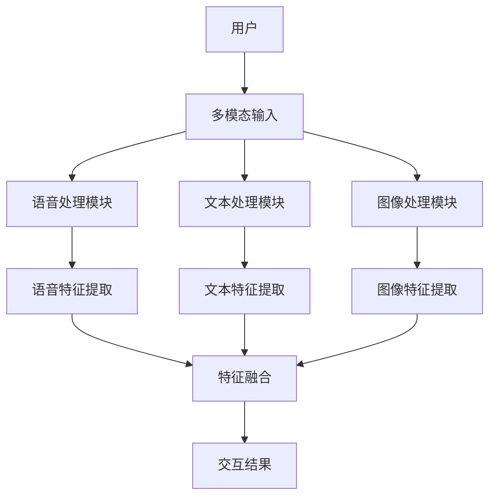
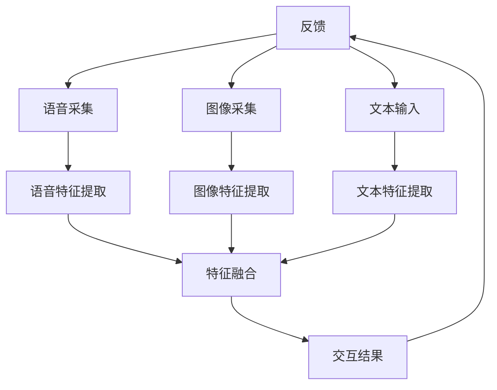

                 


---

# 多模态交互：语音、文本、图像的综合处理

## 关键词
多模态交互，语音处理，文本处理，图像处理，多模态融合，机器学习，深度学习

## 摘要
多模态交互是指通过整合语音、文本和图像等多种信息形式来实现更智能、更自然的人机交互方式。本文系统地探讨了多模态交互的核心概念、关键技术、算法原理、系统架构以及实际应用。通过详细讲解语音、文本和图像的处理技术，分析了多模态数据融合的方法，并结合实际项目案例，展示了如何设计和实现一个多模态交互系统。文章最后展望了多模态交互技术的未来发展方向，为读者提供了全面的视角和深入的见解。

---

# 第一部分: 多模态交互概述

## 第1章: 多模态交互概述

### 1.1 多模态交互的基本概念

#### 1.1.1 多模态交互的定义
多模态交互是一种结合多种信息形式（如语音、文本、图像等）进行人机交互的技术。通过整合不同模态的数据，系统能够更全面地理解用户意图，并提供更智能的响应。

#### 1.1.2 多模态交互的核心要素
- **语音**：通过声音信号进行交流，包括语音识别和语音合成。
- **文本**：基于自然语言处理技术，理解和生成文本信息。
- **图像**：利用计算机视觉技术，处理和分析图像数据。
- **融合**：将不同模态的数据进行整合，提升系统的理解和决策能力。

#### 1.1.3 多模态交互的背景与发展趋势
随着人工智能技术的快速发展，单一模态的交互方式逐渐暴露出局限性。通过结合多种模态数据，多模态交互能够提供更自然、更智能的用户体验，成为当前研究的热点。

### 1.2 多模态交互的背景与问题背景

#### 1.2.1 传统单模态处理的局限性
- 语音识别在噪声环境下的准确率受限。
- 文本处理难以捕捉语境和情感信息。
- 图像识别对光照、角度等条件敏感。

#### 1.2.2 多模态交互的需求与挑战
- **需求**：用户希望与系统进行更自然、更多样化的交互。
- **挑战**：不同模态数据的异构性、数据同步性以及融合方法的复杂性。

#### 1.2.3 多模态交互的应用场景与边界
- **应用场景**：智能客服、智能家居、虚拟助手、医疗诊断等。
- **边界**：多模态交互的边界在于如何有效融合不同模态的数据，同时确保系统的实时性和稳定性。

### 1.3 多模态交互的核心概念与联系

#### 1.3.1 多模态数据的特征与属性对比
通过对比分析语音、文本和图像的特点，可以更好地理解它们的异同点：

| 特征      | 语音          | 文本          | 图像          |
|-----------|---------------|---------------|---------------|
| 信息类型  | 声音信号       | 文本序列      | 视觉信息      |
| 表达能力  | 语调、语气     | 语义、情感     | 场景、物体     |
| 处理方式  | 语音识别      | 自然语言处理  | 计算机视觉    |

#### 1.3.2 多模态交互的ER实体关系图
通过ER图可以清晰地展示多模态交互系统中各实体之间的关系：

```mermaid
erDiagram
    user<->multi_modal_data : 提供
    multi_modal_data<->interaction_system : 输入
    interaction_system<->output : 输出
    output<->user : 反馈
```

#### 1.3.3 多模态交互的流程图
以下是一个多模态交互的流程图：



---

## 第二部分: 多模态交互核心技术

## 第2章: 语音处理技术

### 2.1 语音信号处理基础

#### 2.1.1 语音信号的基本特征
- 频率、振幅、时域和频域特征。
- 常见的语音编码方法：如MFCC（Mel-Frequency Cepstral Coefficients）。

#### 2.1.2 语音信号处理工具
- 开源库：如Kaldi、Python的 librosa。
- 算法：如短时傅里叶变换（STFT）。

### 2.2 语音识别与合成

#### 2.2.1 语音识别的核心算法
- 基于HMM的语音识别。
- 端到端的语音识别模型：如CTC（Connectionist Temporal Classfication）和Transformer架构。

#### 2.2.2 语音合成技术
- TTS（Text-to-Speech）技术：如Tacotron、FastSpeech。
- 基于深度学习的语音合成模型。

### 2.3 语音处理的数学模型

#### 2.3.1 MFCC提取
$$
\text{MFCC}(n) = \log\left(\sum_{k} w(k) \cdot m(k, n)\right)
$$
其中，\( w(k) \) 是三角形滤波器权重，\( m(k, n) \) 是倒谱系数。

#### 2.3.2 CTC损失函数
$$
\text{loss} = -\sum_{t=1}^{T} \log P(y_t)
$$
其中，\( y_t \) 是输出序列中的第 \( t \) 个字符。

---

## 第3章: 文本处理技术

### 3.1 自然语言处理基础

#### 3.1.1 NLP的核心任务
- 词性标注、句法分析、实体识别。
- 常见的NLP工具：如 spaCy、NLTK。

#### 3.1.2 词嵌入技术
- 传统的词嵌入：如Word2Vec。
- 现代的预训练模型：如BERT、GPT。

### 3.2 文本分类与生成

#### 3.2.1 文本分类算法
- 基于传统机器学习的文本分类：如SVM、随机森林。
- 深度学习模型：如RNN、LSTM、Transformer。

#### 3.2.2 文本生成模型
- 基于生成对抗网络（GAN）的文本生成。
- 基于预训练语言模型的文本生成：如GPT-3。

### 3.3 文本处理的数学模型

#### 3.3.1 BERT模型的输入层
$$
\text{Input} = \{X_1, X_2, \dots, X_n\}
$$
其中，\( X_i \) 是输入的第 \( i \) 个词的嵌入表示。

#### 3.3.2 Transformer的注意力机制
$$
\text{Attention}(Q, K, V) = \text{softmax}\left(\frac{QK^T}{\sqrt{d_k}}\right)V
$$
其中，\( Q \) 是查询向量，\( K \) 是键向量，\( V \) 是值向量，\( d_k \) 是向量的维度。

---

## 第4章: 图像处理技术

### 4.1 计算机视觉基础

#### 4.1.1 图像处理的基本操作
- 常见的图像变换：如缩放、旋转、平移。
- 图像增强技术：如随机裁剪、翻转、颜色抖动。

#### 4.1.2 常见的图像格式
- RGB、灰度图、二值图。
- 图像文件格式：如JPEG、PNG、BMP。

### 4.2 图像分类与目标检测

#### 4.2.1 常见的图像分类模型
- 传统分类器：如SVM、随机森林。
- 深度学习模型：如CNN（卷积神经网络）、ResNet。

#### 4.2.2 目标检测算法
- 基于区域建议的方法：如Faster R-CNN。
- 基于锚框的方法：如YOLO、SSD。

### 4.3 图像处理的数学模型

#### 4.3.1 卷积神经网络的卷积操作
$$
\text{Conv}(x, w) = \sum_{i=1}^{n} x[i] \cdot w[i] + b
$$
其中，\( x \) 是输入，\( w \) 是卷积核，\( b \) 是偏置项。

#### 4.3.2 激活函数
$$
f(x) = \text{ReLU}(x) = \max(0, x)
$$

---

## 第5章: 多模态数据融合技术

### 5.1 多模态数据融合的基本方法

#### 5.1.1 早期融合与晚期融合
- **早期融合**：在特征提取阶段进行融合。
- **晚期融合**：在高层语义表示阶段进行融合。

#### 5.1.2 常见的融合策略
- 对于语音和文本的融合，可以将语音特征和文本特征拼接后输入到一个全连接层。
- 对于图像和文本的融合，可以使用注意力机制来对齐图像和文本的特征。

### 5.2 多模态数据融合的数学模型

#### 5.2.1 注意力机制在多模态融合中的应用
$$
\alpha_i = \text{softmax}(\frac{Q_i K_i^T}{\sqrt{d_k}})
$$
其中，\( \alpha_i \) 是注意力权重，\( Q_i \) 和 \( K_i \) 分别是查询和键的表示。

#### 5.2.2 多模态变换模型
$$
y = f(x_1, x_2, \dots, x_n)
$$
其中，\( x_i \) 是不同模态的输入，\( f \) 是融合函数。

---

## 第6章: 多模态交互系统设计与实现

### 6.1 多模态交互系统的设计原则

#### 6.1.1 系统架构
- 分层架构：数据采集层、特征提取层、融合层、决策层。
- 模块化设计：每个模态的处理模块独立实现，再进行融合。

#### 6.1.2 系统接口设计
- 数据接口：语音、文本、图像数据的输入和输出接口。
- API接口：提供给上层应用调用的接口。

### 6.2 多模态交互系统的实现

#### 6.2.1 系统功能设计
- 多模态数据采集：通过麦克风、摄像头等设备采集语音和图像数据。
- 多模态数据处理：分别对语音、文本、图像进行特征提取。
- 数据融合：将不同模态的特征进行融合，得到最终的表示。
- 交互结果输出：根据融合后的结果生成响应，返回给用户。

#### 6.2.2 系统架构图


### 6.3 多模态交互系统的实现细节

#### 6.3.1 环境搭建
- 安装必要的库：如Python的 librosa、OpenCV、TensorFlow。
- 安装语音识别工具：如Kaldi、 pocketsphinx。
- 安装文本处理工具：如spaCy、NLTK。
- 安装图像处理工具：如OpenCV、TensorFlow。

#### 6.3.2 核心代码实现
以下是一个简单的多模态交互系统的代码示例：

```python
import librosa
import cv2
import numpy as np
from tensorflow.keras import layers, models

# 语音特征提取
def extract_audio_features(audio_path):
    y, sr = librosa.load(audio_path, sr=16000)
    mfcc = librosa.feature.mfcc(y=y, sr=sr, n_mfcc=13)
    return mfcc.T

# 图像特征提取
def extract_image_features(image_path):
    img = cv2.imread(image_path)
    img = cv2.resize(img, (224, 224))
    img = img / 255.0
    return img

# 文本特征提取
def extract_text_features(text):
    # 使用预训练的BERT模型进行文本特征提取
    model = load_bert_model()
    features = model.encode(text)
    return features

# 特征融合
def fuse_features(audio_features, image_features, text_features):
    # 将不同模态的特征拼接
    fused_features = np.concatenate([audio_features, image_features, text_features], axis=1)
    return fused_features

# 多模态分类模型
def build_multimodal_model(input_shape):
    inputs = layers.Input(shape=input_shape)
    x = layers.Dense(128, activation='relu')(inputs)
    x = layers.Dense(32, activation='relu')(x)
    outputs = layers.Dense(1, activation='sigmoid')(x)
    model = models.Model(inputs=inputs, outputs=outputs)
    return model
```

### 6.4 系统测试与优化

#### 6.4.1 系统测试
- 测试语音识别的准确率。
- 测试图像分类的准确率。
- 测试多模态融合后的分类准确率。

#### 6.4.2 系统优化
- 优化特征提取的算法。
- 优化多模态融合的策略。
- 优化模型的训练效率。

---

## 第7章: 多模态交互的未来展望

### 7.1 多模态交互的前沿技术
- **跨模态检索**：基于多模态数据进行高效检索。
- **多模态生成模型**：生成与输入模态匹配的输出。
- **实时性优化**：提升多模态交互的实时性。

### 7.2 多模态交互的应用前景
- **智能客服**：通过语音和文本实现更智能的客户服务。
- **医疗诊断**：结合图像和文本进行疾病诊断。
- **虚拟助手**：提供更自然的交互体验。

### 7.3 学习多模态交互技术的注意事项
- **数据质量**：多模态数据的质量直接影响系统的性能。
- **模型选择**：选择合适的模型架构和算法。
- **计算资源**：多模态交互需要大量的计算资源。

---

## 第8章: 项目实战——一个多模态客服系统

### 8.1 项目背景
- **目标**：实现一个多模态客服系统，能够通过语音和文本与用户进行交互。
- **需求**：支持语音识别、文本分类、意图识别等功能。

### 8.2 项目环境搭建
- **安装依赖**：
  - 语音处理：librosa、pyaudio。
  - 图像处理：OpenCV。
  - 文本处理：spaCy、NLTK。
  - 深度学习：TensorFlow、Keras。

### 8.3 核心代码实现
#### 8.3.1 语音识别模块
```python
import librosa
import sounddevice as sd

def record_audio():
    # 录音参数
    duration = 5  # 5秒
    fs = 16000  # 采样率
    myrec = sd.rec(duration * fs, fs, 2)
    sd.wait()
    # 保存音频
    librosa.output.write_wav('recorded_audio.wav', myrec.T, fs)

def transcribe_audio():
    # 语音识别
    y, sr = librosa.load('recorded_audio.wav', sr=16000)
    # 使用预训练模型进行语音识别
    # 这里假设有一个函数可以返回识别的文本
    text = speech_recognizer(y, sr)
    return text
```

#### 8.3.2 图像识别模块
```python
import cv2

def detect_face(image_path):
    # 加载预训练的Haar级联分类器
    faceCascade = cv2.CascadeClassifier(cv2.data.haarcascades + 'haarcascade_frontalface_default.xml')
    img = cv2.imread(image_path)
    gray = cv2.cvtColor(img, cv2.COLOR_BGR2GRAY)
    faces = faceCascade.detectMultiScale(gray, 1.1, 4)
    return faces
```

#### 8.3.3 文本处理模块
```python
import spacy

nlp = spacy.load("en_core_web_sm")

def analyze_text(text):
    doc = nlp(text)
    # 实体识别
    entities = [(ent.text, ent.label_) for ent in doc.ents]
    # 情感分析
    # 这里假设有一个函数可以返回情感分数
    sentiment = analyze_sentiment(doc)
    return entities, sentiment
```

#### 8.3.4 多模态融合模块
```python
def fuse_modalities(audio_features, image_features, text_features):
    # 将不同模态的特征拼接
    fused_features = np.concatenate([audio_features, image_features, text_features], axis=1)
    return fused_features
```

#### 8.3.5 分类模型
```python
def build_classifier(input_shape):
    model = models.Sequential()
    model.add(layers.Dense(64, activation='relu', input_shape=input_shape))
    model.add(layers.Dense(32, activation='relu'))
    model.add(layers.Dense(1, activation='sigmoid'))
    model.compile(optimizer='adam', loss='binary_crossentropy', metrics=['accuracy'])
    return model
```

### 8.4 项目测试与优化

#### 8.4.1 测试语音识别模块
- 记录一段语音，测试识别的准确率。
- 调整语音识别模型的参数，优化识别效果。

#### 8.4.2 测试图像识别模块
- 测试面部检测的准确性。
- 调整级联分类器的参数，优化检测效果。

#### 8.4.3 测试文本处理模块
- 测试实体识别的准确性。
- 测试情感分析的准确率。

#### 8.4.4 测试多模态融合模块
- 调整融合策略，优化分类准确率。
- 调整分类模型的参数，优化模型性能。

### 8.5 项目小结
通过本项目，读者可以掌握多模态交互系统的设计与实现方法，了解如何将语音、文本和图像处理技术结合在一起，实现一个多模态交互系统。

---

## 第9章: 总结与展望

### 9.1 总结
多模态交互是一种结合语音、文本和图像等多种信息形式的交互方式，能够提供更智能、更自然的用户体验。本文系统地探讨了多模态交互的核心概念、关键技术、算法原理和系统架构，并结合实际项目案例，展示了如何设计和实现一个多模态交互系统。

### 9.2 展望
随着人工智能技术的不断发展，多模态交互技术将得到更广泛的应用，未来的研究方向包括跨模态检索、多模态生成模型以及实时性优化等。

### 9.3 学习建议
- **理论学习**：深入学习语音、文本和图像处理的基础知识。
- **实践项目**：通过实际项目掌握多模态交互技术的实现方法。
- **持续关注**：关注多模态交互技术的最新研究进展。

---

## 参考文献
1. 《深度学习》—— Ian Goodfellow
2. 《自然语言处理入门》—— 维多利亚·斯托尔特
3. 《计算机视觉：算法与应用》—— Richard Szeliski
4. 《语音信号处理》—— 王军
5. 《多模态数据处理与融合》—— 李明

---

通过以上目录，读者可以系统地学习多模态交互的核心概念、关键技术以及实际应用，掌握如何设计和实现一个多模态交互系统，并能够将这些知识应用到实际项目中。

