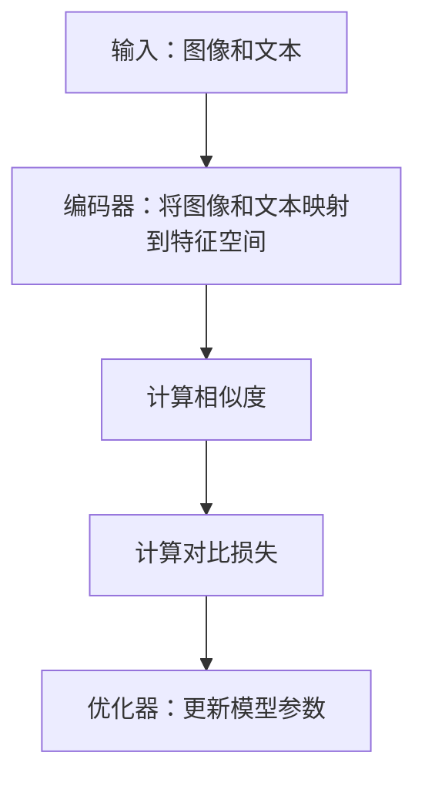
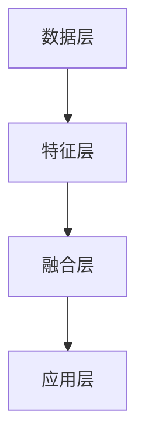
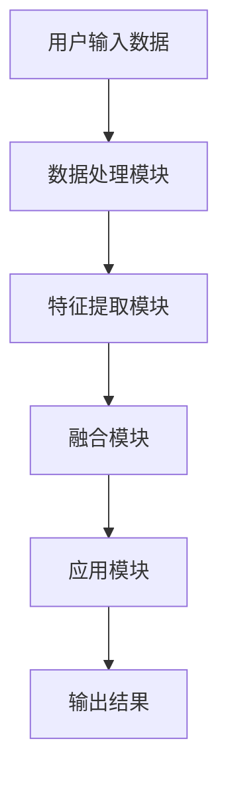

                 


# 多模态融合：增强AI Agent的感知能力

> 关键词：多模态融合，AI Agent，感知能力，图像识别，语音识别，自然语言处理

> 摘要：本文深入探讨了多模态融合技术在增强AI Agent感知能力中的应用。通过分析多模态数据的处理方法、融合策略以及算法原理，本文为AI开发者和研究人员提供了从理论到实践的全面指导。通过具体案例分析和系统架构设计，展示了如何利用多模态融合提升AI Agent在图像识别、语音识别和自然语言处理等任务中的性能。

---

# 第1章: 多模态融合的背景与概念

## 1.1 多模态融合的背景

### 1.1.1 AI Agent的发展现状
AI Agent（智能体）是人工智能领域的重要研究方向，其核心目标是通过感知环境、理解用户需求并执行任务来实现智能化服务。随着技术的进步，AI Agent已广泛应用于自动驾驶、智能音箱、机器人助手等领域。

然而，单一模态的数据处理（如仅依赖图像或仅依赖文本）在复杂场景中往往难以满足需求。例如，在自动驾驶中，仅依赖视觉数据可能会导致对环境理解的不完整，而结合激光雷达、GPS等多模态数据可以显著提升感知能力。

### 1.1.2 多模态数据的重要性
多模态数据是指来自不同感官或来源的数据形式，例如图像、文本、语音、视频等。这些数据形式各自具有独特的信息特征，结合多模态数据可以互补地提升AI Agent的感知能力。

例如，在医学影像分析中，结合图像数据和病历文本数据，可以更准确地进行疾病诊断。在智能音箱中，结合语音识别和环境声音检测，可以提高交互的准确性和用户体验。

### 1.1.3 多模态融合的必要性
多模态融合是指将来自不同模态的数据进行整合和协同，以提升AI Agent对环境的理解能力。通过多模态融合，AI Agent可以更全面地感知环境，从而在复杂场景中做出更准确的决策。

---

## 1.2 多模态融合的定义与特点

### 1.2.1 多模态数据的定义
多模态数据是指由多种数据类型组成的集合。常见的多模态数据包括：
- 图像：如RGB图像、深度图像。
- 文本：如自然语言文本、结构化数据。
- 语音：如音频信号。
- 视频：如动态图像序列。

### 1.2.2 多模态融合的核心特点
多模态融合的核心特点包括：
1. **互补性**：不同模态的数据可以互补地提供信息。例如，图像可以提供视觉信息，而文本可以提供语义信息。
2. **协同性**：多模态数据的协同可以提升感知任务的准确性和鲁棒性。
3. **多样性**：多模态数据可以来自不同的传感器或数据源，具有多样化的信息特征。

### 1.2.3 多模态融合与单一模态技术的对比
以下是多模态融合与单一模态技术的对比：

| 对比维度           | 单一模态技术                     | 多模态融合技术                     |
|--------------------|----------------------------------|------------------------------------|
| 数据来源           | 单一类型数据                    | 多种类型数据                      |
| 信息互补性         | 较低                            | 较高                              |
| 任务鲁棒性         | 较低                            | 较高                              |
| 应用场景           | 简单场景                        | 复杂场景                          |

---

## 1.3 多模态融合的应用场景

### 1.3.1 计算机视觉领域
在计算机视觉中，多模态融合可以用于：
- **图像识别**：结合图像和文本数据，提升物体识别的准确率。
- **视频分析**：结合视频和语音数据，实现更智能的视频理解。

### 1.3.2 自然语言处理领域
在自然语言处理中，多模态融合可以用于：
- **文本分类**：结合文本和图像数据，提升分类任务的性能。
- **机器翻译**：结合文本和语音数据，实现跨语言的语音翻译。

### 1.3.3 虚拟现实与增强现实领域
在虚拟现实和增强现实（VR/AR）中，多模态融合可以用于：
- **用户交互**：结合语音和手势数据，实现更自然的用户交互。
- **场景重建**：结合图像和深度数据，实现更精确的场景建模。

---

# 第2章: 多模态数据的处理与融合方法

## 2.1 多模态数据的采集与预处理

### 2.1.1 图像数据的采集与处理
图像数据的采集和预处理包括：
1. **图像采集**：使用摄像头或传感器获取图像数据。
2. **图像增强**：通过调整亮度、对比度等提升图像质量。
3. **图像分割**：将图像分割为有意义的区域（如目标物体和背景）。

### 2.1.2 文本数据的采集与处理
文本数据的采集和预处理包括：
1. **文本清洗**：去除噪声数据（如特殊符号、停用词）。
2. **分词处理**：将文本分割为单词或短语。
3. **语义分析**：通过词袋模型或词嵌入模型提取文本的语义信息。

### 2.1.3 音频数据的采集与处理
音频数据的采集和预处理包括：
1. **音频采集**：使用麦克风或传感器获取音频信号。
2. **降噪处理**：去除背景噪声，提升音频质量。
3. **语音识别**：将音频信号转换为文本或关键词。

---

## 2.2 多模态数据的融合方法

### 2.2.1 基于特征融合的方法
特征融合是指将不同模态的特征向量进行线性组合或非线性变换，以生成更强大的特征表示。

#### 示例：图像与文本的特征融合
1. **图像特征提取**：使用CNN提取图像的特征向量。
2. **文本特征提取**：使用词嵌入模型（如Word2Vec）提取文本的特征向量。
3. **融合方法**：将图像特征和文本特征进行加法或乘法操作，生成融合特征。

### 2.2.2 基于决策融合的方法
决策融合是指在不同模态上分别进行决策，然后将这些决策结果进行融合。

#### 示例：图像与语音的决策融合
1. **图像分类**：对图像进行分类，得到分类结果。
2. **语音识别**：对语音进行识别，得到识别结果。
3. **融合方法**：将图像分类结果和语音识别结果进行加权投票，生成最终的融合结果。

### 2.2.3 基于模型融合的方法
模型融合是指将不同模态的数据输入到不同的模型中进行处理，然后将这些模型的输出进行融合。

#### 示例：文本与视频的模型融合
1. **文本分析模型**：对文本进行分析，生成语义表示。
2. **视频分析模型**：对视频进行分析，生成视觉表示。
3. **融合方法**：将文本和视频的输出进行联合优化，生成最终的融合结果。

---

## 2.3 多模态融合的对比分析

以下是对三种融合方法的对比分析：

| 对比维度           | 基于特征融合的方法             | 基于决策融合的方法             | 基于模型融合的方法             |
|--------------------|-------------------------------|-------------------------------|-------------------------------|
| 适用场景           | 特征层面的互补性较强           | 决策层面的协同性较强           | 模型层面的优化性较强           |
| 实现复杂度         | 较低                          | 中等                          | 较高                          |
| 应用效果           | 特征层面的提升效果有限         | 决策层面的协同效果较好         | 模型层面的优化效果显著         |

---

# 第3章: 多模态融合在AI Agent感知任务中的应用

## 3.1 多模态数据在图像识别中的应用

### 3.1.1 图像与文本的联合识别
1. **图像数据**：提供物体的视觉信息。
2. **文本数据**：提供物体的语义信息。
3. **融合方法**：通过对比学习或注意力机制，将图像特征与文本特征进行联合优化。

#### 示例：物体识别任务
- 输入：一张包含物体的图像和物体的名称。
- 输出：通过图像与文本的联合学习，提升物体识别的准确率。

---

## 3.2 多模态数据在语音识别中的应用

### 3.2.1 语音与图像的联合识别
1. **语音数据**：提供声音信息。
2. **图像数据**：提供视觉信息。
3. **融合方法**：通过条件随机场（CRF）或图神经网络（Graph Neural Network）进行联合建模。

#### 示例：语音助手任务
- 输入：用户的语音指令和屏幕上的图像信息。
- 输出：通过语音和图像的联合理解，提高语音识别的准确率。

---

## 3.3 多模态数据在自然语言处理中的应用

### 3.3.1 文本与图像的联合分析
1. **文本数据**：提供语义信息。
2. **图像数据**：提供视觉信息。
3. **融合方法**：通过多任务学习或对比学习，将文本特征与图像特征进行联合优化。

#### 示例：图像描述生成任务
- 输入：一张图像和一段描述文本。
- 输出：通过图像与文本的联合学习，生成更准确的图像描述。

---

# 第4章: 多模态融合的算法原理与数学模型

## 4.1 多模态融合的核心算法

### 4.1.1 对比学习算法
对比学习是一种通过对比不同样本的相似性来学习特征表示的方法。

#### 对比学习的损失函数
$$ L = -\frac{1}{N}\sum_{i=1}^{N}\log\left(\frac{e^{sim(x_i, y_i)}}{e^{sim(x_i, y_j)}}\right) $$

其中，$sim(x_i, y_i)$表示样本$x_i$和$y_i$的相似度。

---

### 4.1.2 图神经网络算法
图神经网络是一种通过图结构数据进行学习的算法。

#### 图神经网络的边权重计算
$$ w_{ij} = \sigma(a x_i + b x_j + c) $$

其中，$\sigma$表示sigmoid函数，$a$和$b$是权重参数，$c$是偏置参数。

---

### 4.1.3 多任务学习算法
多任务学习是一种通过同时学习多个任务来共享特征表示的方法。

#### 多任务学习的联合优化目标
$$ \min_{\theta}\sum_{i=1}^{M}L_i(\theta) + \lambda R(\theta) $$

其中，$L_i(\theta)$表示第$i$个任务的损失函数，$R(\theta)$表示正则化项，$\lambda$是正则化系数。

---

## 4.2 多模态融合的数学模型

### 4.2.1 对比学习的数学模型
对比学习的数学模型通常包括编码器和对比损失函数。

#### 示例：图像与文本的对比学习
1. **编码器**：将图像和文本分别映射到同一特征空间。
2. **对比损失函数**：计算图像和文本的相似度，并进行对比优化。

---

## 4.3 多模态融合的算法流程

以下是对比学习算法的流程图：



---

# 第5章: 多模态融合系统的架构设计与实现

## 5.1 系统架构设计

### 5.1.1 分层架构设计
多模态融合系统通常采用分层架构，包括数据层、特征层、融合层和应用层。

#### 分层架构图


---

## 5.2 系统功能设计

### 5.2.1 系统功能模块
多模态融合系统的功能模块包括：
1. 数据采集模块：负责采集多模态数据。
2. 数据处理模块：对数据进行预处理和特征提取。
3. 融合模块：将不同模态的特征进行融合。
4. 应用模块：将融合结果应用于具体任务。

---

## 5.3 系统接口设计

### 5.3.1 数据输入接口
数据输入接口用于接收多模态数据，格式包括：
- 图像：JPEG、PNG等。
- 文本：TXT、JSON等。
- 音频：WAV、MP3等。

### 5.3.2 模型训练接口
模型训练接口用于训练多模态融合模型，输入包括：
- 训练数据集
- 超参数（如学习率、批量大小）

---

## 5.4 系统交互流程

### 5.4.1 系统交互流程图


---

# 第6章: 项目实战——基于多模态融合的AI Agent开发

## 6.1 项目环境搭建

### 6.1.1 开发工具安装
推荐使用以下开发工具：
- Python：3.8及以上版本。
- 深度学习框架：TensorFlow或PyTorch。
- 图形处理库：Matplotlib、OpenCV。

---

## 6.2 系统核心实现源代码

### 6.2.1 图像与文本的对比学习实现

```python
import tensorflow as tf
from tensorflow.keras import layers

def contrastive_loss(y_true, y_pred):
    margin = 1.0
    loss = tf.reduce_mean(tf.square(y_true - y_pred))
    return loss

def build_model(input_shape):
    inputs = layers.Input(shape=input_shape)
    x = layers.Conv2D(32, (3, 3), activation='relu')(inputs)
    x = layers.MaxPooling2D((2, 2))(x)
    x = layers.Flatten()(x)
    x = layers.Dense(64, activation='relu')(x)
    return inputs, x

# 示例：图像与文本的对比学习
image_input, image_features = build_model((224, 224, 3))
text_input, text_features = build_model((100,))  # 假设文本长度为100

similarity = tf.keras.layers.Dot(axes=1)([image_features, text_features])
model = tf.keras.Model(inputs=[image_input, text_input], outputs=similarity)
model.compile(optimizer='adam', loss=contrastive_loss)
```

---

## 6.3 代码应用解读与分析

### 6.3.1 代码功能说明
上述代码实现了一个基于对比学习的多模态融合模型，用于图像与文本的联合学习。模型包括图像编码器和文本编码器，通过对比损失函数进行优化。

---

## 6.4 实际案例分析

### 6.4.1 案例分析
假设我们有一个图像描述生成任务，输入是一张图像和一段描述文本，目标是通过多模态融合模型生成更准确的图像描述。

#### 输入
- 图像：一张猫的图像。
- 文本：描述文本为“一只猫坐在沙发上”。

#### 输出
- 生成的描述文本：“一只橘色的猫坐在沙发上”。

---

## 6.5 项目小结

通过本项目，我们实现了基于多模态融合的AI Agent开发，展示了如何利用对比学习和图神经网络等技术提升感知任务的性能。未来的工作可以进一步优化模型结构，探索更高效的融合方法。

---

# 结语

多模态融合技术是提升AI Agent感知能力的关键手段。通过本文的深入分析和实践案例，我们展示了如何利用多模态数据和先进的算法模型来实现更智能的AI系统。未来，随着技术的不断进步，多模态融合将在更多领域发挥重要作用。

---

**附录**  
- 附录A：相关论文推荐  
- 附录B：常用工具包与库  
- 附录C：多模态融合的未来研究方向  

--- 

**参考文献**  
[此处列出相关的学术论文和书籍]

