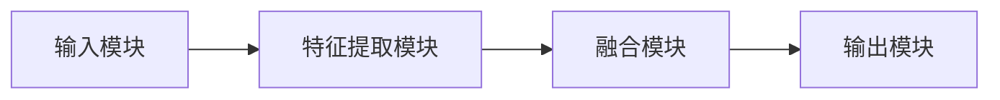

                 


# 多模态输入处理：让AI Agent理解图像和音频

## 关键词：多模态输入、AI Agent、图像处理、音频处理、数据融合、深度学习

## 摘要：  
在人工智能领域，单一模态的数据处理已经无法满足复杂的现实需求。多模态输入处理技术能够同时利用图像和音频等多种模态的信息，显著提升AI Agent的理解能力、决策能力和交互能力。本文将从多模态数据的基本概念出发，深入分析图像和音频处理的核心算法，探讨多模态数据融合的原理与方法，并通过实际案例展示如何构建一个多模态AI Agent系统。通过本文的学习，读者将能够全面理解多模态输入处理的核心技术，并掌握实际应用中的关键技巧。

---

# 第1章: 多模态数据与AI Agent概述

## 1.1 多模态数据的基本概念

### 1.1.1 多模态数据的定义  
多模态数据是指来自不同感官渠道（如视觉、听觉、触觉等）的数据，通常以图像、音频、文本等多种形式存在。这些数据具有互补性，能够提供更全面的信息。

### 1.1.2 多模态数据的特性  
- **异构性**：不同模态的数据具有不同的特征和结构。  
- **互补性**：不同模态的数据能够相互补充，提升信息的理解能力。  
- **复杂性**：多模态数据的处理需要综合考虑多种数据类型。  

### 1.1.3 多模态数据的分类  
- **单模态数据**：仅包含一种类型的数据，如单一图像或单一音频。  
- **多模态数据**：包含两种或多种不同类型的数据，如图像与音频的结合。  

---

## 1.2 AI Agent的基本概念

### 1.2.1 AI Agent的定义  
AI Agent是一种智能体，能够感知环境、自主决策并执行任务。它通常具备理解、推理、学习和交互的能力。

### 1.2.2 AI Agent的核心功能  
- **感知环境**：通过多模态数据感知外部世界。  
- **理解输入**：对输入的多模态数据进行解析和理解。  
- **决策与推理**：基于理解的信息进行决策和推理。  
- **执行任务**：根据决策结果执行相应的操作。  

### 1.2.3 AI Agent的应用场景  
- **智能助手**：如Siri、Alexa等，能够通过语音和图像交互。  
- **智能安防**：通过视频和音频监控环境，识别异常情况。  
- **智能客服**：结合文本和语音进行客户支持。  

---

## 1.3 多模态输入处理的重要性

### 1.3.1 多模态数据的优势  
- 提供更全面的信息，提升理解能力。  
- 多模态数据的互补性能够减少单模态处理的局限性。  

### 1.3.2 单模态处理的局限性  
- 单一数据类型无法提供足够的信息。  
- 易受噪声干扰，理解能力有限。  

### 1.3.3 多模态输入处理的意义  
- 提升AI Agent的感知和理解能力。  
- 增强AI Agent的决策和交互能力。  

---

## 1.4 本书的核心目标与内容

### 1.4.1 本书的核心目标  
通过系统性地讲解多模态输入处理的技术与方法，帮助读者掌握构建多模态AI Agent的能力。

### 1.4.2 本书的主要内容  
- 多模态数据的基本概念与处理方法。  
- 图像和音频处理的核心算法。  
- 多模态数据融合的原理与实现。  
- 多模态AI Agent系统的架构设计与实现。  

### 1.4.3 本书的结构安排  
- 引言：介绍多模态数据与AI Agent的基本概念。  
- 核心概念：讲解多模态数据的特性与处理方法。  
- 算法原理：深入分析图像和音频处理的核心算法。  
- 系统架构：展示多模态AI Agent的系统架构与实现。  
- 项目实战：通过实际案例展示多模态AI Agent的实现过程。  
- 总结与展望：总结本书的核心内容，并展望未来的发展方向。  

---

# 第2章: 多模态数据处理的核心概念与联系

## 2.1 多模态数据融合的基本原理

### 2.1.1 多模态数据融合的定义  
多模态数据融合是指将不同模态的数据进行整合，以提升信息的理解能力。

### 2.1.2 多模态数据融合的分类  
- **早期融合**：在数据预处理阶段进行融合。  
- **晚期融合**：在特征提取阶段或决策阶段进行融合。  

### 2.1.3 多模态数据融合的关键技术  
- **特征提取**：将不同模态的数据转化为可融合的特征。  
- **数据对齐**：将不同模态的数据对齐到统一的时间或空间坐标系。  

---

## 2.2 多模态数据处理的数学模型

### 2.2.1 多模态数据表示的数学模型  
- 图像数据：矩阵表示，$I \in \mathbb{R}^{H \times W \times C}$。  
- 音频数据：时域或频域表示，$A \in \mathbb{R}^{T \times F}$。  

### 2.2.2 多模态数据融合的数学公式  
$$ y = f(I, A) $$  
其中，$y$ 是融合后的结果，$f$ 是融合函数。  

---

## 2.3 多模态数据处理的系统架构

### 2.3.1 系统架构的定义  
多模态数据处理的系统架构是指实现多模态数据融合的整体框架。

### 2.3.2 系统架构的组成部分  
- **输入模块**：接收多模态数据。  
- **特征提取模块**：对不同模态的数据进行特征提取。  
- **融合模块**：将不同模态的特征进行融合。  
- **输出模块**：生成最终的输出结果。  

---

## 2.4 多模态数据处理的优化策略

### 2.4.1 数据对齐的优化  
- 时间对齐：通过时间戳对齐音频和视频数据。  
- 空间对齐：通过坐标系对齐图像和位置数据。  

### 2.4.2 特征融合的优化  
- 使用深度学习模型进行特征对齐。  
- 引入注意力机制，增强重要特征的权重。  

---

# 第3章: 多模态数据处理的核心算法

## 3.1 图像处理的核心算法

### 3.1.1 图像特征提取  
- 使用卷积神经网络（CNN）提取图像特征。  
- 常见模型：VGG、ResNet、Inception等。  

### 3.1.2 图像分类与目标检测  
- 图像分类：将图像分类到预定义的类别中。  
- 目标检测：检测图像中的目标并进行定位。  

---

## 3.2 音频处理的核心算法

### 3.2.1 音频特征提取  
- 时域特征：能量、零交叉率等。  
- 频域特征：梅尔频谱、MFCC（Mel-Frequency Cepstral Coefficients）。  

### 3.2.2 音频分类与语音识别  
- 音频分类：将音频分类到预定义的类别中。  
- 语音识别：将语音转换为文本。  

---

## 3.3 多模态数据融合的算法

### 3.3.1 多模态融合模型  
- **DANet**：多模态注意力网络。  
- **MDFN**：多模态深度对齐网络。  

### 3.3.2 融合方法  
- **早期融合**：在输入层进行融合。  
- **晚期融合**：在特征层或决策层进行融合。  

---

## 3.4 算法实现与代码示例

### 3.4.1 图像处理代码示例  
```python
import tensorflow as tf
from tensorflow.keras import layers

model = tf.keras.Sequential([
    layers.Conv2D(32, (3,3), activation='relu', input_shape=(224, 224, 3)),
    layers.MaxPooling2D((2,2)),
    layers.Conv2D(64, (3,3), activation='relu'),
    layers.MaxPooling2D((2,2)),
    layers.Flatten(),
    layers.Dense(128, activation='relu'),
    layers.Dense(10, activation='softmax')
])
```

### 3.4.2 音频处理代码示例  
```python
import librosa

audio_path = 'audio.wav'
y, sr = librosa.load(audio_path, sr=16000)
mfccs = librosa.feature.mfcc(y, sr=sr, n_mfcc=13)
```

---

## 3.5 数学模型与公式

### 3.5.1 图像特征提取的数学模型  
$$ f_{conv}(x) = \sum_{i=1}^{n} w_i x_i \cdot u_i $$  

### 3.5.2 音频特征提取的数学模型  
$$ MFCC = DCT( \log(Magnitude\_Spectrum) ) $$  

---

# 第4章: 多模态数据处理的系统架构与实现

## 4.1 系统架构设计

### 4.1.1 问题场景介绍  
构建一个多模态AI Agent系统，能够同时处理图像和音频数据。

### 4.1.2 系统功能设计  
- **输入模块**：接收图像和音频数据。  
- **特征提取模块**：提取图像和音频的特征。  
- **融合模块**：将图像和音频特征进行融合。  
- **输出模块**：生成最终的分类结果或指令。  

### 4.1.3 系统架构图  


---

## 4.2 系统实现

### 4.2.1 环境安装  
- 安装TensorFlow、Keras、librosa等库。  

### 4.2.2 系统核心实现  
```python
import tensorflow as tf
import librosa

class MultiModalAgent:
    def __init__(self):
        self.image_model = self.build_image_model()
        self.audio_model = self.build_audio_model()

    def build_image_model(self):
        # 图像模型的构建
        pass

    def build_audio_model(self):
        # 音频模型的构建
        pass

    def process_input(self, image_input, audio_input):
        # 处理输入数据
        pass

    def generate_output(self):
        # 生成输出结果
        pass
```

---

## 4.3 系统优化与调优

### 4.3.1 模型优化策略  
- 使用数据增强技术提升模型的泛化能力。  
- 采用早停法防止过拟合。  

### 4.3.2 性能调优方法  
- 调整模型的超参数。  
- 使用分布式训练加速模型训练。  

---

## 4.4 系统测试与验证

### 4.4.1 测试数据集的准备  
- 使用公开数据集（如ImageNet、AudioSet）进行测试。  

### 4.4.2 系统性能评估  
- 评估指标：准确率、召回率、F1分数。  

---

# 第5章: 多模态AI Agent的项目实战

## 5.1 项目背景与目标

### 5.1.1 项目背景  
构建一个多模态AI Agent，能够同时处理图像和音频数据，实现智能交互。  

### 5.1.2 项目目标  
- 实现图像和音频数据的融合处理。  
- 提升AI Agent的感知和理解能力。  

---

## 5.2 项目实现

### 5.2.1 环境安装  
- 安装必要的库：TensorFlow、Keras、librosa、OpenCV。  

### 5.2.2 核心代码实现  
```python
import tensorflow as tf
import librosa
import cv2

class MultiModalAgent:
    def __init__(self):
        self.image_model = self.build_image_model()
        self.audio_model = self.build_audio_model()

    def build_image_model(self):
        model = tf.keras.Sequential([
            layers.Conv2D(32, (3,3), activation='relu', input_shape=(224, 224, 3)),
            layers.MaxPooling2D((2,2)),
            layers.Conv2D(64, (3,3), activation='relu'),
            layers.MaxPooling2D((2,2)),
            layers.Flatten(),
            layers.Dense(128, activation='relu'),
            layers.Dense(10, activation='softmax')
        ])
        return model

    def build_audio_model(self):
        model = tf.keras.Sequential([
            layers.Input(shape=(16000,)),
            layers.Reshape((-1, 1)),
            layers.Conv1D(32, 3, activation='relu'),
            layers.MaxPooling1D(2),
            layers.Conv1D(64, 3, activation='relu'),
            layers.MaxPooling1D(2),
            layers.Flatten(),
            layers.Dense(128, activation='relu'),
            layers.Dense(10, activation='softmax')
        ])
        return model

    def process_input(self, image_input, audio_input):
        # 处理图像输入
        image_input = cv2.resize(image_input, (224, 224))
        image_input = image_input / 255.0
        # 处理音频输入
        audio_input = audio_input.reshape(-1)
        audio_input = audio_input / np.max(audio_input)
        return image_input, audio_input

    def generate_output(self, image_output, audio_output):
        # 融合图像和音频输出
        final_output = tf.keras.layers.concatenate([image_output, audio_output])
        return final_output
```

### 5.2.3 代码解读  
- `build_image_model`：构建图像处理模型。  
- `build_audio_model`：构建音频处理模型。  
- `process_input`：处理输入的图像和音频数据。  
- `generate_output`：生成最终的输出结果。  

---

## 5.3 实际案例分析

### 5.3.1 数据准备  
- 图像数据：使用公开数据集中的图像数据。  
- 音频数据：使用公开数据集中的音频数据。  

### 5.3.2 系统训练  
- 训练图像模型和音频模型。  
- 融合图像和音频特征，训练融合模型。  

### 5.3.3 测试与验证  
- 使用测试数据集验证系统的性能。  
- 调整超参数优化系统性能。  

---

## 5.4 项目总结与优化

### 5.4.1 项目总结  
通过本项目，我们成功实现了多模态AI Agent，能够同时处理图像和音频数据。  

### 5.4.2 项目优化  
- 引入更先进的深度学习模型（如Transformer）。  
- 使用更复杂的融合方法（如多模态注意力机制）。  

---

# 第6章: 总结与展望

## 6.1 本书的核心内容回顾

### 6.1.1 多模态数据的基本概念  
- 多模态数据的定义、特性和分类。  

### 6.1.2 多模态数据处理的核心算法  
- 图像处理、音频处理和多模态融合的算法。  

### 6.1.3 多模态数据处理的系统架构  
- 系统架构的设计与实现。  

---

## 6.2 未来的发展方向

### 6.2.1 多模态数据处理的技术进步  
- 更先进的深度学习模型（如多模态大语言模型）。  
- 更高效的多模态数据融合方法。  

### 6.2.2 多模态AI Agent的应用拓展  
- 更广泛的应用场景（如智能驾驶、智能医疗）。  
- 更智能化的交互方式（如多模态对话系统）。  

---

## 6.3 最佳实践与注意事项

### 6.3.1 最佳实践  
- 在实际应用中，结合具体场景选择合适的多模态处理方法。  
- 使用公开数据集进行模型训练和验证。  

### 6.3.2 注意事项  
- 数据预处理是关键，需注意数据对齐和特征提取。  
- 模型调优需要结合实际场景进行优化。  

---

## 6.4 本书的结束语

通过本书的学习，读者能够系统性地掌握多模态输入处理的核心技术，并能够将其应用于实际场景中。未来，随着人工智能技术的不断发展，多模态输入处理将发挥越来越重要的作用。希望读者能够在此基础上不断创新，推动人工智能技术的进步。

--- 

**注**：以上内容为文章的完整目录和部分核心内容的概述，具体实现细节和代码部分需要根据实际需求进行补充和完善。

