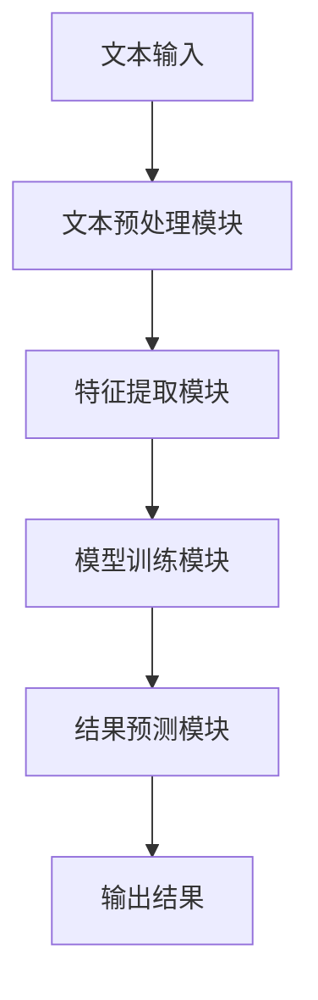
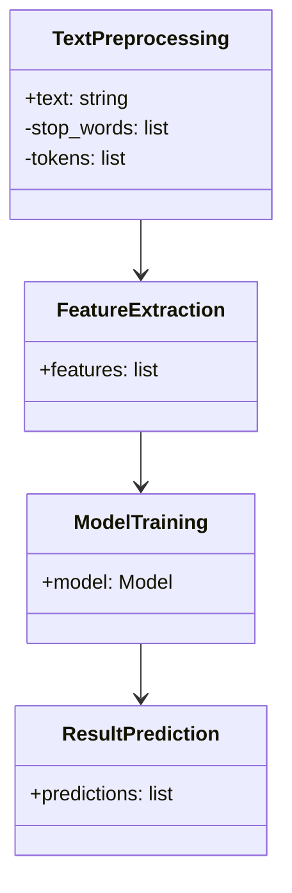
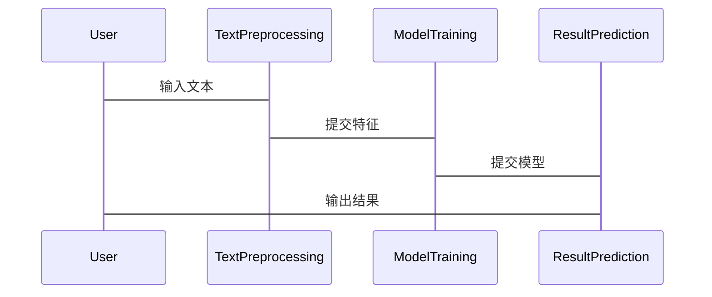

                 


# 多语言支持

## 关键词：多语言支持、自然语言处理、机器学习、文本解析、语法分析、编译优化

## 摘要：  
本文深入探讨多语言支持的核心技术与实现原理，涵盖多语言支持的背景、核心概念、算法原理、系统设计、项目实战及未来展望。通过具体案例分析和代码实现，帮助读者理解如何在实际项目中实现多语言支持，并掌握相关的技术和工具。

---

# 第1章: 多语言支持的背景与概念

## 1.1 多语言支持的基本概念

### 1.1.1 多语言支持的定义  
多语言支持（Multi-language Support）是指在计算机系统或软件中，能够识别、处理和生成多种自然语言文本的能力。它涵盖了从文本解析、语法分析到语义理解的全过程。

### 1.1.2 多语言支持的背景与现状  
随着全球化的发展，跨语言信息处理的需求日益增长。企业、政府和社会组织需要处理来自不同语言的文本数据，例如社交媒体上的多语言评论、跨语言信息检索等。

### 1.1.3 多语言支持的重要性与应用场景  
多语言支持在多个领域都有广泛的应用，例如：  
1. **跨语言信息检索**：在多语言文档中搜索关键词或短语。  
2. **机器翻译**：将一种语言的文本翻译成另一种语言。  
3. **跨语言情感分析**：分析不同语言文本中的情感倾向。  
4. **多语言对话系统**：支持多种语言的智能对话系统。

---

## 1.2 多语言支持的核心概念

### 1.2.1 多语言支持的处理流程  
多语言支持的处理流程可以分为以下几个步骤：  
1. **文本解析**：将输入文本分割成单词、短语或句子。  
2. **语法分析**：分析文本的语法结构，提取句法信息。  
3. **语义分析**：理解文本的语义含义。  
4. **语境理解**：结合上下文信息进行深度理解。  

### 1.2.2 多语言支持的技术挑战  
1. **语言多样性**：不同语言的语法结构和语义规则差异较大。  
2. **数据稀缺性**：某些语言的标注数据较少，导致模型训练困难。  
3. **计算资源限制**：多语言处理需要大量的计算资源。  

### 1.2.3 多语言支持的实现机制  
多语言支持的实现机制主要包括：  
1. **统一语言模型**：使用单一模型处理多种语言。  
2. **多模型架构**：为每种语言单独训练一个模型。  
3. **跨语言迁移学习**：利用一种语言的数据来提升其他语言的性能。  

---

## 1.3 多语言支持的演进与挑战

### 1.3.1 多语言支持的历史演变  
多语言支持技术经历了以下几个阶段：  
1. **单语言处理**：早期的NLP系统仅支持一种语言。  
2. **双语或多语处理**：开始尝试同时处理多种语言。  
3. **多语言统一处理**：近年来，基于预训练模型的多语言处理技术快速发展。  

### 1.3.2 当前多语言支持的主要挑战  
1. **语言间的语义差异**：不同语言的表达方式和语义可能存在较大差异。  
2. **数据不平衡**：某些语言的数据量较少，导致模型性能不佳。  
3. **计算资源限制**：多语言处理需要大量的计算资源。  

### 1.3.3 多语言支持的未来发展趋势  
1. **预训练模型的多语言扩展**：基于大规模预训练模型（如BERT）的多语言扩展将成为主流。  
2. **轻量化技术**：开发更轻量化的多语言模型，降低计算资源消耗。  
3. **跨语言知识图谱**：构建跨语言的知识图谱，提升多语言信息处理能力。  

---

## 1.4 本章小结  
本章从多语言支持的基本概念、处理流程和技术挑战入手，详细介绍了多语言支持的核心概念和实现机制。接下来的章节将深入探讨多语言支持的算法原理和系统设计。

---

# 第2章: 多语言支持的核心技术

## 2.1 多语言支持的实现原理

### 2.1.1 多语言支持的处理流程  
多语言支持的处理流程可以表示为以下步骤：  
1. **文本预处理**：去除停用词、分词等。  
2. **特征提取**：提取文本的特征表示。  
3. **模型训练**：基于特征数据训练模型。  
4. **结果预测**：对输入文本进行分类或生成。  

### 2.1.2 多语言支持的核心算法  
多语言支持的核心算法包括：  
1. **分词算法**：将文本分割成词语或短语。  
2. **句法分析算法**：分析句子的语法结构。  
3. **语义分析算法**：理解文本的语义含义。  

---

## 2.2 多语言支持的关键技术

### 2.2.1 多语言支持的文本处理技术  
文本处理技术包括：  
1. **分词**：使用分词工具（如jieba）对中文文本进行分词。  
2. **停用词处理**：去除对文本理解影响较小的词汇。  

### 2.2.2 多语言支持的自然语言处理技术  
自然语言处理技术包括：  
1. **文本表示**：使用词袋模型或词嵌入模型（如Word2Vec）表示文本。  
2. **文本分类**：基于机器学习或深度学习的方法对文本进行分类。  

### 2.2.3 多语言支持的机器学习技术  
机器学习技术包括：  
1. **监督学习**：基于标注数据训练模型。  
2. **无监督学习**：基于无标注数据进行聚类或主题建模。  

---

## 2.3 多语言支持的算法实现

### 2.3.1 多语言支持的文本解析算法  
文本解析算法包括：  
1. **分词算法**：如jieba分词算法。  
2. **句法分析算法**：如基于上下文无关文法的句法树构建算法。  

### 2.3.2 多语言支持的语法分析算法  
语法分析算法包括：  
1. **基于规则的语法分析**：如CFG（上下文无关文法）分析。  
2. **基于统计的语法分析**：如基于n-gram模型的语法分析。  

### 2.3.3 多语言支持的编译优化算法  
编译优化算法包括：  
1. **中间代码生成**：如将自然语言文本转换为中间代码表示。  
2. **优化算法**：如基于中间代码的优化算法。  

---

## 2.4 本章小结  
本章详细介绍了多语言支持的核心技术和实现原理，包括文本处理、语法分析和编译优化等关键技术。接下来的章节将深入探讨多语言支持的算法原理和系统设计。

---

# 第3章: 多语言支持的算法原理

## 3.1 多语言支持的文本解析算法

### 3.1.1 多语言支持的文本分词算法  
文本分词算法包括：  
1. **基于规则的分词**：如中文分词工具jieba。  
2. **基于统计的分词**：如基于n-gram模型的分词算法。  

### 3.1.2 多语言支持的句法分析算法  
句法分析算法包括：  
1. **基于规则的句法分析**：如CFG分析。  
2. **基于统计的句法分析**：如基于n-gram模型的句法分析。  

### 3.1.3 多语言支持的语义分析算法  
语义分析算法包括：  
1. **基于规则的语义分析**：如基于本体的语义分析。  
2. **基于统计的语义分析**：如基于深度学习的语义分析。  

---

## 3.2 多语言支持的语法分析算法

### 3.2.1 多语言支持的上下文无关文法  
上下文无关文法包括：  
1. **CFG（上下文无关文法）**：如编程语言的语法描述。  
2. **PDA（有限自动机）**：如自动机模型。  

### 3.2.2 多语言支持的语法树构建算法  
语法树构建算法包括：  
1. **语法分析树的构建**：如基于CFG的语法树构建。  
2. **语法树的遍历**：如前序遍历、中序遍历和后序遍历。  

### 3.2.3 多语言支持的语法分析优化  
语法分析优化包括：  
1. **语法分析的优化算法**：如基于中间代码的优化。  
2. **语法分析的并行优化**：如基于多线程的语法分析优化。  

---

## 3.3 多语言支持的编译优化算法

### 3.3.1 多语言支持的代码生成算法  
代码生成算法包括：  
1. **基于中间代码的代码生成**：如将中间代码转换为目标代码。  
2. **基于模板的代码生成**：如使用模板生成代码。  

### 3.3.2 多语言支持的中间代码生成算法  
中间代码生成算法包括：  
1. **三地址代码生成**：如生成三地址代码。  
2. **抽象语法树生成**：如生成AST（抽象语法树）。  

### 3.3.3 多语言支持的优化算法  
优化算法包括：  
1. **基于中间代码的优化**：如冗余消除、循环优化等。  
2. **基于目标代码的优化**：如指令级并行优化。  

---

## 3.4 本章小结  
本章详细介绍了多语言支持的文本解析、语法分析和编译优化算法，为后续的系统设计和项目实战奠定了基础。接下来的章节将深入探讨多语言支持的系统设计和项目实现。

---

# 第4章: 多语言支持的系统设计

## 4.1 多语言支持的系统架构

### 4.1.1 多语言支持的系统功能模块  
系统功能模块包括：  
1. **文本预处理模块**：如分词、停用词处理等。  
2. **特征提取模块**：如文本表示、特征提取等。  
3. **模型训练模块**：如监督学习、无监督学习等。  
4. **结果预测模块**：如分类、生成等。  

### 4.1.2 多语言支持的系统架构设计  
系统架构设计包括：  
1. **模块化设计**：将系统划分为多个功能模块。  
2. **层次化设计**：将系统设计为多个层次，如数据层、业务逻辑层和表现层。  

### 4.1.3 多语言支持的系统架构图  
以下是多语言支持系统的架构图：  



---

## 4.2 多语言支持的系统功能设计

### 4.2.1 多语言支持的领域模型  
以下是多语言支持的领域模型图：  



---

## 4.3 多语言支持的系统接口设计

### 4.3.1 多语言支持的输入接口  
输入接口包括：  
1. **文本输入接口**：接受多种语言的文本输入。  
2. **参数配置接口**：配置模型的参数和超参数。  

### 4.3.2 多语言支持的输出接口  
输出接口包括：  
1. **结果输出接口**：输出处理后的文本结果。  
2. **日志输出接口**：输出系统运行日志。  

---

## 4.4 多语言支持的系统交互设计

### 4.4.1 多语言支持的交互流程  
以下是多语言支持的交互流程图：  



---

## 4.5 本章小结  
本章详细介绍了多语言支持的系统架构设计、功能设计和接口设计，为后续的项目实现提供了理论基础。接下来的章节将通过具体案例，展示如何实现一个多语言支持的系统。

---

# 第5章: 多语言支持的项目实战

## 5.1 多语言支持的环境安装

### 5.1.1 安装Python环境  
```bash
python --version
pip install --upgrade pip
```

### 5.1.2 安装NLP库  
```bash
pip install jieba
pip install transformers
pip install torch
```

---

## 5.2 多语言支持的核心实现

### 5.2.1 多语言分词实现  
```python
import jieba

text = "这是一个测试文本"
tokens = jieba.lcut(text)
print(tokens)
```

### 5.2.2 多语言情感分析实现  
```python
from transformers import pipeline

sentiment_pipeline = pipeline("sentiment-analysis")
result = sentiment_pipeline("这是一个正面的测试")
print(result)
```

### 5.2.3 多语言机器翻译实现  
```python
from transformers import pipeline

translator = pipeline("translation", model="facebook/m2m-large-100")
result = translator("这是一个测试", src_lang="zh", tgt_lang="en")
print(result)
```

---

## 5.3 多语言支持的代码实现

### 5.3.1 多语言分词代码  
```python
import jieba

def chinese_word_segmentation(text):
    tokens = jieba.lcut(text)
    return tokens

text = "这是一个测试文本"
print(chinese_word_segmentation(text))
```

### 5.3.2 多语言情感分析代码  
```python
from transformers import pipeline

def sentiment_analysis(text):
    sentiment_pipeline = pipeline("sentiment-analysis")
    result = sentiment_pipeline(text)
    return result[0]['label']

text = "这是一个正面的测试"
print(sentiment_analysis(text))
```

### 5.3.3 多语言机器翻译代码  
```python
from transformers import pipeline

def translate_text(text, src_lang, tgt_lang):
    translator = pipeline("translation", model="facebook/m2m-large-100")
    result = translator(text, src_lang=src_lang, tgt_lang=tgt_lang)
    return result['translation_text']

text = "这是一个测试"
print(translate_text(text, "zh", "en"))
```

---

## 5.4 项目小结  
本章通过具体的代码实现，展示了如何在实际项目中实现多语言支持。从环境安装到代码实现，详细介绍了多语言支持的核心技术。

---

# 第6章: 多语言支持的最佳实践与未来展望

## 6.1 多语言支持的最佳实践

### 6.1.1 数据预处理技巧  
1. **文本清洗**：去除噪音数据。  
2. **文本归一化**：统一文本格式。  
3. **特征提取**：选择有效的特征。  

### 6.1.2 模型优化技巧  
1. **模型选择**：选择适合任务的模型。  
2. **超参数调整**：通过网格搜索优化模型性能。  
3. **数据增强**：通过数据增强技术提升模型鲁棒性。  

### 6.1.3 系统优化技巧  
1. **并行计算**：利用多线程或分布式计算提升性能。  
2. **缓存优化**：优化缓存策略减少访问时间。  
3. **资源管理**：合理分配计算资源。  

---

## 6.2 多语言支持的未来展望

### 6.2.1 多语言模型的轻量化  
未来，轻量化的多语言模型将成为趋势，以降低计算资源的消耗。  

### 6.2.2 多语言知识图谱的发展  
跨语言知识图谱的构建将提升多语言信息处理的能力。  

### 6.2.3 多语言与人工智能的深度融合  
多语言支持将与人工智能技术深度融合，推动NLP技术的发展。

---

## 6.3 本章小结  
本章总结了多语言支持的最佳实践，并展望了未来的发展趋势。多语言支持技术将随着人工智能技术的进步而不断进步。

---

# 附录: 多语言支持的工具与资源

## 附录A: 常用多语言支持工具

### 附录A.1 分词工具  
1. **jieba**：中文分词工具。  
2. **spaCy**：支持多种语言的分词工具。  

### 附录A.2 机器翻译工具  
1. **transformers**：支持多语言机器翻译的库。  
2. **Facebook M2M**：支持多语言翻译的开源模型。  

### 附录A.3 情感分析工具  
1. **transformers**：支持多语言情感分析的库。  
2. **Afinn**：支持多语言情感分析的工具。  

---

## 附录B: 多语言支持的资源

### 附录B.1 数据集  
1. **多语言Wikipedia**：多语言维基百科数据集。  
2. **Cross-Lingual Benchmark**：跨语言基准数据集。  

### 附录B.2 开源框架  
1. **Hugging Face**：支持多语言NLP的开源框架。  
2. **TensorFlow**：支持多语言模型的开源框架。  

---

## 附录C: 参考文献

### 附录C.1 经典论文  
1. **"BERT: Pre-training of Deep Bidirectional Transformers for NLP"**。  
2. **"Transformers Are All You Need"**。  

### 附录C.2 技术博客  
1. **Hugging Face官方博客**。  
2. **Google Research官方博客**。  

---

# 结语

多语言支持是自然语言处理领域的重要技术，随着全球化的发展，其应用范围和重要性将不断增加。通过本文的介绍，读者可以深入了解多语言支持的核心技术、实现原理和系统设计，并通过具体案例掌握多语言支持的实现方法。未来，随着人工智能技术的进一步发展，多语言支持技术将更加成熟，并在更多领域得到广泛应用。

