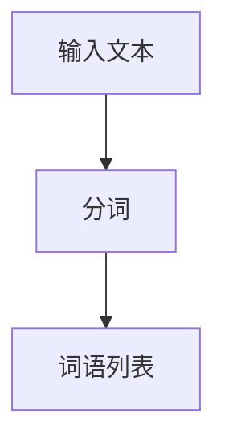
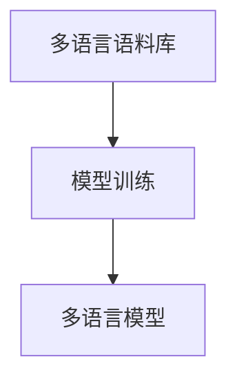
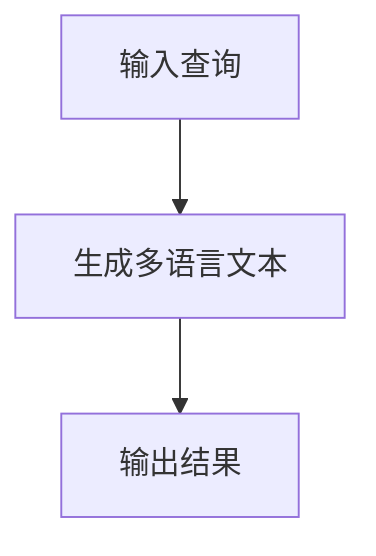
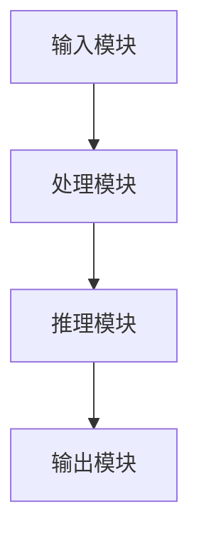
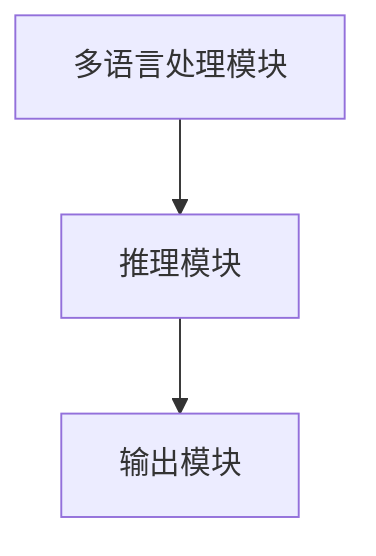
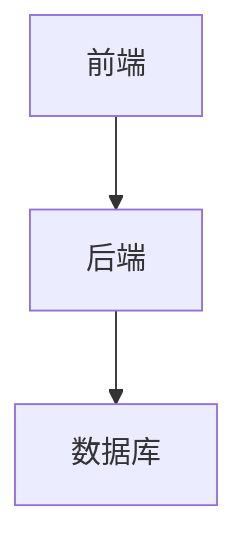
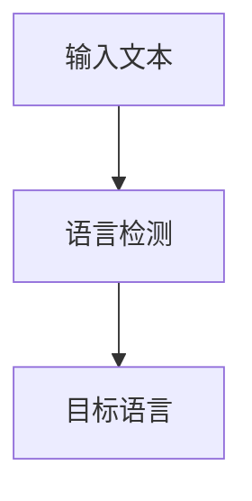
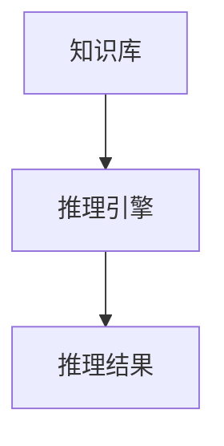

                 


# 多语言支持：构建国际化的AI Agent

## 关键词：多语言支持、AI Agent、自然语言处理、国际化构建、人工智能、跨语言对话

## 摘要：  
在当今全球化和技术驱动的数字时代，多语言支持成为构建国际化AI Agent的核心挑战。本文深入探讨了如何设计和实现一个多语言AI Agent，涵盖从自然语言处理技术到系统架构设计的各个方面。通过详细的技术分析和实际案例，本文展示了如何将多语言支持与AI Agent相结合，构建一个能够在全球范围内高效交互的智能系统。

---

## 目录

1. **多语言支持与AI Agent概述**  
   - 1.1 多语言支持的重要性  
   - 1.2 AI Agent的基本概念  
   - 1.3 多语言支持与AI Agent的结合  

2. **多语言处理的核心技术**  
   - 2.1 多语言自然语言处理基础  
   - 2.2 多语言语言模型  
   - 2.3 多语言文本生成技术  

3. **AI Agent的设计与实现**  
   - 3.1 AI Agent的体系结构  
   - 3.2 多语言AI Agent的开发框架  
   - 3.3 多语言AI Agent的实现步骤  

4. **多语言AI Agent的系统架构**  
   - 4.1 系统功能模块设计  
   - 4.2 系统架构设计  
   - 4.3 系统接口与交互设计  

5. **多语言AI Agent的构建关键技术**  
   - 5.1 跨语言对话管理  
   - 5.2 多语言推理与知识表示  
   - 5.3 多语言模型的训练与优化  

6. **项目实战：构建一个多语言AI Agent**  
   - 6.1 环境安装与配置  
   - 6.2 核心功能实现  
   - 6.3 测试与优化  

7. **总结与展望**  
   - 7.1 全文总结  
   - 7.2 未来发展方向  

---

## 正文

### 第1章：多语言支持与AI Agent概述

#### 1.1 多语言支持的重要性

在当今的全球化社会中，语言是人类交流的核心工具。多语言支持不仅能够满足不同语言背景用户的沟通需求，还能够提升AI系统在国际市场中的竞争力。以下是多语言支持的重要性：

- **用户覆盖范围扩大**：支持多种语言的AI系统可以为全球用户提供服务，扩大市场。
- **用户体验优化**：用户能够以母语与AI系统交互，提高使用效率和满意度。
- **跨文化适应性**：多语言支持使AI系统能够在不同文化背景下提供本地化的服务。

#### 1.2 AI Agent的基本概念

AI Agent（人工智能代理）是一种能够感知环境、自主决策并执行任务的智能实体。它可以通过多种方式与用户交互，包括文本、语音、图形界面等。AI Agent的核心功能包括：

- **感知环境**：通过传感器或用户输入获取信息。
- **分析与推理**：利用算法对信息进行处理和分析。
- **决策与执行**：基于分析结果做出决策并执行任务。
- **自适应与学习**：通过反馈机制不断优化自身的性能。

#### 1.3 多语言支持与AI Agent的结合

将多语言支持与AI Agent结合，能够构建一个能够理解并生成多种语言的智能系统。这种结合不仅提升了AI Agent的功能性，还使其能够在全球范围内提供服务。以下是多语言AI Agent的核心优势：

- **跨语言交互能力**：支持多种语言的对话，满足不同用户的需求。
- **文化适配性**：能够根据用户语言提供本地化的服务。
- **全球部署能力**：可以在不同语言环境中无缝运行。

---

### 第2章：多语言处理的核心技术

#### 2.1 多语言自然语言处理基础

自然语言处理（NLP）是实现多语言支持的核心技术之一。以下是多语言NLP的关键点：

- **多语言分词**：将文本分割成词语或符号，支持多种语言的分词。
- **多语言词性标注**：为每个词语标注其词性，如名词、动词、形容词等。
- **多语言句法分析**：分析句子的语法结构，理解文本的语义。

**示例：中文分词流程图**



---

#### 2.2 多语言语言模型

语言模型是实现多语言文本生成的关键技术。以下是多语言语言模型的核心内容：

- **多语言模型的训练**：使用多语言语料库进行训练，使模型能够理解多种语言。
- **多语言模型的评估**：通过交叉验证和基准测试评估模型的性能。

**多语言模型训练流程图**



---

#### 2.3 多语言文本生成技术

文本生成是多语言支持的重要组成部分。以下是多语言文本生成的关键技术：

- **多语言文本生成模型**：如GPT-4，支持多种语言的文本生成。
- **跨语言迁移学习**：通过迁移学习技术，提升多语言生成的性能。

**多语言文本生成流程图**



---

### 第3章：AI Agent的设计与实现

#### 3.1 AI Agent的体系结构

AI Agent的体系结构设计是实现多语言支持的关键。以下是多语言AI Agent的体系结构：

- **输入模块**：接收多语言输入，如文本、语音等。
- **处理模块**：对输入进行多语言处理，如分词、翻译等。
- **推理模块**：基于处理后的信息进行推理和决策。
- **输出模块**：生成多语言输出，如文本、语音等。

**多语言AI Agent架构图**



---

#### 3.2 多语言AI Agent的开发框架

以下是常用的多语言AI Agent开发框架：

- **Rasa**：支持多语言对话的开源框架。
- **Microsoft Bot Framework**：支持多语言对话的框架。

**Rasa框架核心代码示例**

```python
from rasa.nlu.model import Interpreter
from rasa.core.agent import Agent

# 加载模型
interpreter = Interpreter.load("models/nlu")
agent = Agent.load("models/stories")

# 处理输入
input_text = "Hello, how are you?"
response = agent.handle_message(input_text)
print(response)
```

---

#### 3.3 多语言AI Agent的实现步骤

以下是实现一个多语言AI Agent的步骤：

1. **需求分析**：明确多语言支持的语言种类和功能需求。
2. **模块划分**：划分多语言处理模块、推理模块等。
3. **功能实现**：实现各模块的功能，如分词、生成等。
4. **测试与优化**：测试系统性能并进行优化。

---

### 第4章：多语言AI Agent的系统架构

#### 4.1 系统功能模块设计

以下是多语言AI Agent的功能模块设计：

- **多语言处理模块**：负责多语言文本的处理。
- **推理模块**：负责基于多语言信息进行推理。
- **输出模块**：负责生成多语言输出。

**系统功能模块设计图**



---

#### 4.2 系统架构设计

以下是多语言AI Agent的系统架构设计：

- **前端**：用户与AI Agent交互的界面。
- **后端**：处理多语言信息的核心逻辑。
- **数据库**：存储多语言数据和模型。

**系统架构设计图**



---

### 第5章：多语言AI Agent的构建关键技术

#### 5.1 跨语言对话管理

跨语言对话管理是实现多语言支持的关键技术。以下是其实现步骤：

1. **语言检测**：检测输入语言。
2. **翻译与转换**：将输入翻译为目标语言。
3. **对话历史管理**：记录多语言对话历史。

**语言检测流程图**



---

#### 5.2 多语言推理与知识表示

多语言推理是基于多语言信息进行推理的过程。以下是其实现步骤：

1. **知识表示**：将知识表示为多语言形式。
2. **推理引擎**：基于知识进行推理。

**多语言推理流程图**



---

### 第6章：项目实战：构建一个多语言AI Agent

#### 6.1 环境安装与配置

以下是构建环境的安装步骤：

1. **安装Python**：安装Python 3.8以上版本。
2. **安装依赖库**：安装必要的依赖库，如TensorFlow、Keras等。

**环境安装代码示例**

```bash
pip install python3 python3-pip
pip install tensorflow keras numpy
```

---

#### 6.2 核心功能实现

以下是多语言AI Agent的核心功能实现：

1. **多语言分词**：实现多语言文本的分词功能。
2. **多语言生成**：实现多语言文本的生成功能。

**多语言分词代码示例**

```python
def tokenize(text):
    # 分词实现
    pass
```

---

#### 6.3 测试与优化

测试系统性能并进行优化。以下是优化步骤：

1. **性能测试**：测试系统在不同语言下的性能。
2. **优化调整**：根据测试结果进行优化。

---

### 第7章：总结与展望

#### 7.1 全文总结

本文详细探讨了多语言支持与AI Agent的结合，从核心技术到系统架构，再到项目实战，为构建一个多语言AI Agent提供了全面的指导。

#### 7.2 未来展望

未来，随着技术的进步，多语言AI Agent将更加智能化和个性化。我们需要进一步研究多语言模型的优化和跨语言对话的提升，以满足更复杂的需求。

---

以上是《多语言支持：构建国际化的AI Agent》的完整目录和内容概要。希望对您有所帮助！

