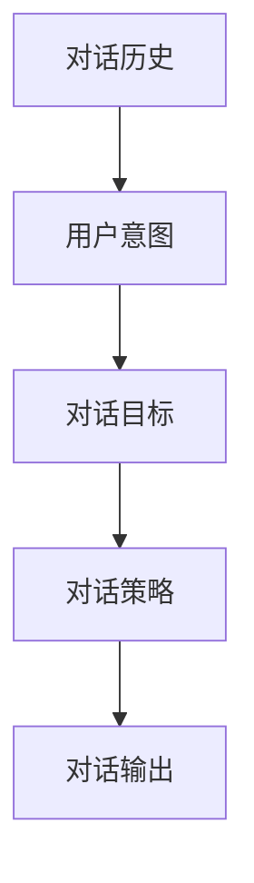
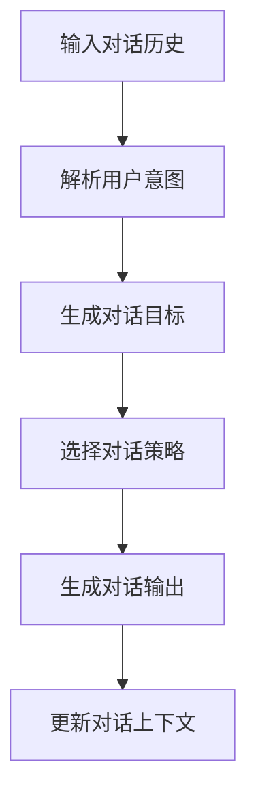
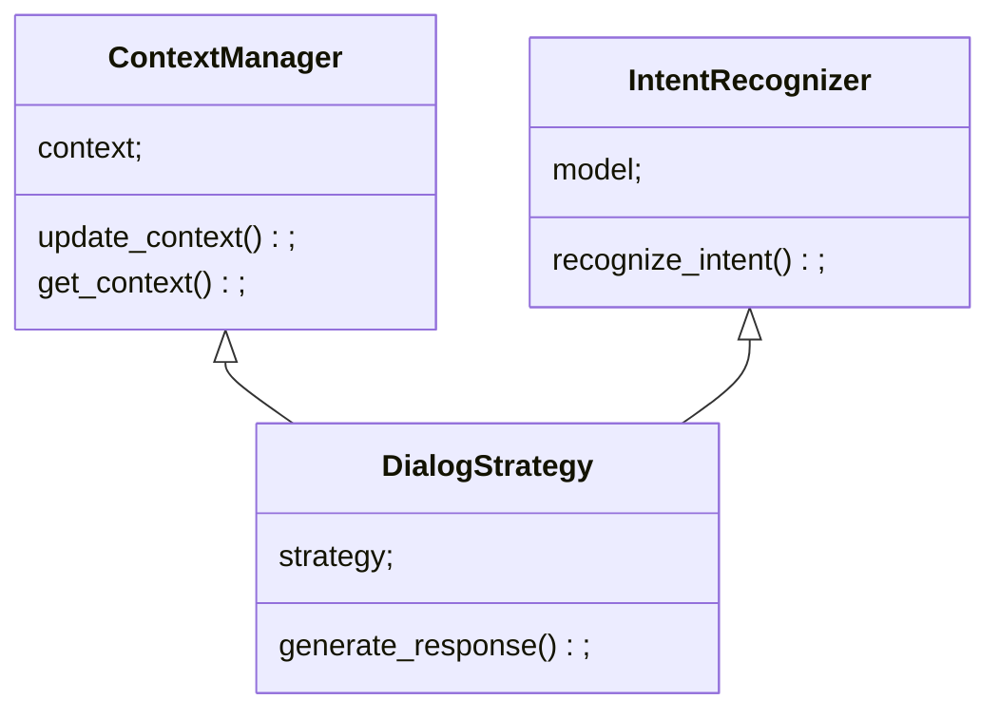
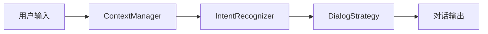
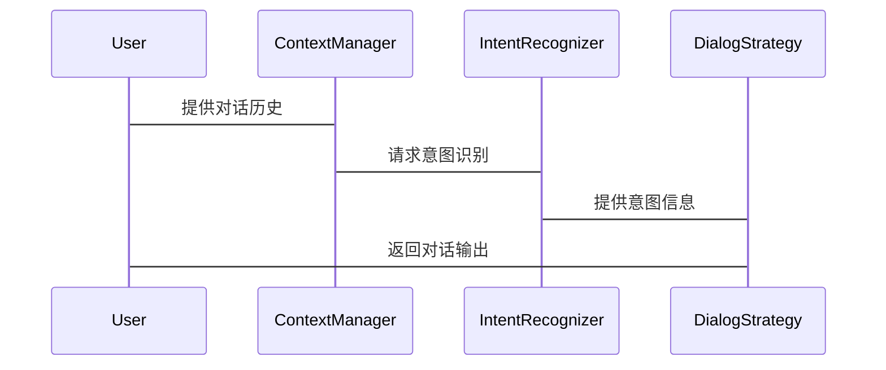

                 


# 多轮对话处理：提高AI Agent的交互质量

## 关键词：多轮对话处理，AI Agent，自然语言处理，对话系统，用户意图理解

## 摘要：多轮对话处理是提升AI Agent交互质量的核心技术。本文从背景、核心概念、算法原理、系统架构、项目实战到最佳实践，全面解析多轮对话处理的关键要素，包括对话上下文管理、用户意图识别、对话策略制定等，并通过实际案例和系统设计，帮助读者深入理解并掌握多轮对话处理的技术要点，从而显著提升AI Agent的交互能力。

---

## 第一章：多轮对话处理的背景与核心概念

### 1.1 多轮对话处理的背景
#### 1.1.1 自然语言处理的发展历程
- 自然语言处理（NLP）的演变：从规则驱动到数据驱动。
- 多轮对话处理在NLP中的地位：从单轮问答到多轮交互的转变。

#### 1.1.2 多轮对话的定义与特点
- 多轮对话的定义：用户与AI Agent之间进行的连续、上下文相关的交互。
- 多轮对话的特点：上下文依赖性、动态意图调整、对话目标的多样性。

#### 1.1.3 AI Agent在多轮对话中的角色
- AI Agent作为对话主体的功能：理解用户意图、维护对话上下文、生成合适的回应。
- 多轮对话中AI Agent的核心能力：记忆能力、推理能力、自适应能力。

### 1.2 多轮对话处理的核心问题
#### 1.2.1 对话上下文的理解与记忆
- 对话上下文的定义：对话历史、用户状态、环境信息的综合。
- 上下文管理的挑战：信息的完整性和准确性，上下文的有效利用。

#### 1.2.2 对话目标的动态调整
- 对话目标的定义：根据用户输入和对话进展，实时调整对话目标。
- 动态目标调整的难点：目标的识别和更新，多目标冲突的处理。

#### 1.2.3 用户意图的准确识别
- 用户意图的分类：显式意图、隐含意图。
- 多轮对话中意图识别的复杂性：上下文依赖、意图变化。

### 1.3 多轮对话处理的边界与外延
#### 1.3.1 对话系统的输入输出边界
- 输入：用户的自然语言输入、对话历史。
- 输出：AI Agent的自然语言回应、对话状态更新。

#### 1.3.2 多轮对话与单轮对话的对比
- 单轮对话的局限性：缺乏上下文，无法处理复杂意图。
- 多轮对话的优势：上下文依赖，支持复杂交互。

#### 1.3.3 多轮对话处理的适用场景
- 适用场景：客服、医疗咨询、智能助手。
- 不适用场景：实时性要求极高、信息量极小的任务。

### 1.4 多轮对话处理的核心要素
#### 1.4.1 对话上下文的记录与管理
- 上下文管理的策略：基于规则的上下文管理，基于机器学习的上下文管理。
- 上下文表示的方法：基于关键词的表示，基于向量的表示。

#### 1.4.2 用户意图的理解与推理
- 意图理解的方法：基于规则的意图分类，基于机器学习的意图分类。
- 意图推理的挑战：上下文信息的不完整性和不确定性。

#### 1.4.3 对话策略的制定与执行
- 对话策略的类型：基于规则的策略，基于模型的策略。
- 策略执行的流程：目标设定、动作选择、结果评估。

---

## 第二章：多轮对话处理的核心概念与联系

### 2.1 多轮对话处理的核心概念
#### 2.1.1 对话上下文的定义与作用
- 对话上下文的定义：对话过程中积累的所有相关信息。
- 上下文的作用：帮助AI Agent理解用户意图，生成连贯的回应。

#### 2.1.2 用户意图的分类与层次
- 用户意图的分类：直接意图、间接意图。
- 意图的层次：显式意图、隐含意图。

#### 2.1.3 对话策略的类型与特点
- 对话策略的类型：目标驱动策略，用户驱动策略。
- 策略的特点：灵活性、目标导向性。

### 2.2 核心概念的属性特征对比
#### 2.2.1 对话上下文的属性特征
| 属性 | 特征 |
|------|------|
| 时间性 | 连续性、动态性 |
| 关联性 | 上下文依赖性 |
| 完整性 | 信息的完整性 |

#### 2.2.2 用户意图的属性特征
| 属性 | 特征 |
|------|------|
| 明确性 | 显式或隐式 |
| 动态性 | 随对话变化 |
| 多样性 | 多个意图并存 |

#### 2.2.3 对话策略的属性特征
| 属性 | 特征 |
|------|------|
| 灵活性 | 根据上下文调整 |
| 目标导向性 | 面向特定目标 |
| 可解释性 | 策略的可解释性 |

### 2.3 多轮对话处理的ER实体关系图


---

## 第三章：多轮对话处理的算法原理

### 3.1 多轮对话处理的算法流程


### 3.2 对话上下文管理的算法
```python
class ContextManager:
    def __init__(self):
        self.context = {}

    def update_context(self, new_context):
        self.context.update(new_context)
        return self.context

    def get_context(self, key):
        return self.context.get(key, None)
```

### 3.3 用户意图识别的算法
```python
import spacy

nlp = spacy.load("en_core_web_sm")

def identify_intent(text):
    doc = nlp(text)
    intent = max(doc.ents, key=lambda x: x.score)
    return intent.label_
```

### 3.4 对话策略生成的算法
```python
def generate_response(context, intent):
    response = f"Based on your context {context}, your intent is {intent}. How can I assist you further?"
    return response
```

### 3.5 数学模型与公式
#### 3.5.1 概率计算公式
$$ P(\text{intent} | \text{input}) = \frac{P(\text{input} | \text{intent}) \cdot P(\text{intent})}{P(\text{input})} $$

#### 3.5.2 损失函数公式
$$ \text{Loss} = -\sum_{i=1}^{N} \log P(y_i | x_i) $$

---

## 第四章：系统分析与架构设计方案

### 4.1 问题场景介绍
- 问题场景：用户与AI Agent进行多轮对话，系统需要处理复杂的上下文和意图。

### 4.2 系统功能设计
- 系统功能：对话历史记录、用户意图识别、对话策略生成、对话输出生成。

### 4.3 领域模型类图


### 4.4 系统架构图


### 4.5 接口设计与交互序列图


---

## 第五章：项目实战

### 5.1 环境安装与配置
- 环境需求：Python 3.8+, spaCy, TensorFlow.

### 5.2 核心代码实现
```python
import spacy
from tensorflow.keras import models

class DialogSystem:
    def __init__(self):
        self.nlp = spacy.load("en_core_web_sm")
        self.model = models.load_model("dialog_model.h5")

    def process_input(self, text):
        context = self.get_context(text)
        intent = self.predict_intent(text)
        response = self.generate_response(context, intent)
        return response

    def get_context(self, text):
        # 简单的上下文管理
        return {"intent": "unknown"}

    def predict_intent(self, text):
        doc = self.nlp(text)
        return doc.ents[0].label_

    def generate_response(self, context, intent):
        return f"I understand you need {intent}. How can I help further?"
```

### 5.3 代码解读与分析
- 代码解读：对话系统的初始化、输入处理、意图预测、响应生成。
- 代码分析：上下文管理、意图识别、对话策略生成的具体实现。

### 5.4 实际案例分析
- 案例分析：用户与AI Agent的多轮对话过程。
- 代码运行结果：每一步的输出和上下文更新。

### 5.5 项目小结
- 项目总结：实现一个多轮对话系统的流程和关键点。
- 经验分享：代码实现中的注意事项和优化建议。

---

## 第六章：最佳实践与总结

### 6.1 小结
- 多轮对话处理的核心要素：上下文管理、意图识别、对话策略生成。
- 系统设计的关键点：模块化设计、接口设计、架构优化。

### 6.2 注意事项
- 注意上下文的有效性：避免信息冗余和不相关。
- 注意意图识别的准确性：结合上下文和领域知识。
- 注意对话策略的灵活性：根据用户反馈动态调整。

### 6.3 拓展阅读
- 推荐书籍：《对话系统入门》、《自然语言处理实战》。
- 推荐论文：多轮对话处理的最新研究成果。

---

## 总结
通过本文的详细讲解，读者可以系统地了解多轮对话处理的核心概念、算法原理、系统架构和实际应用。掌握这些知识和技能，将有助于显著提升AI Agent的交互质量，为实现更智能、更自然的对话系统奠定坚实基础。

