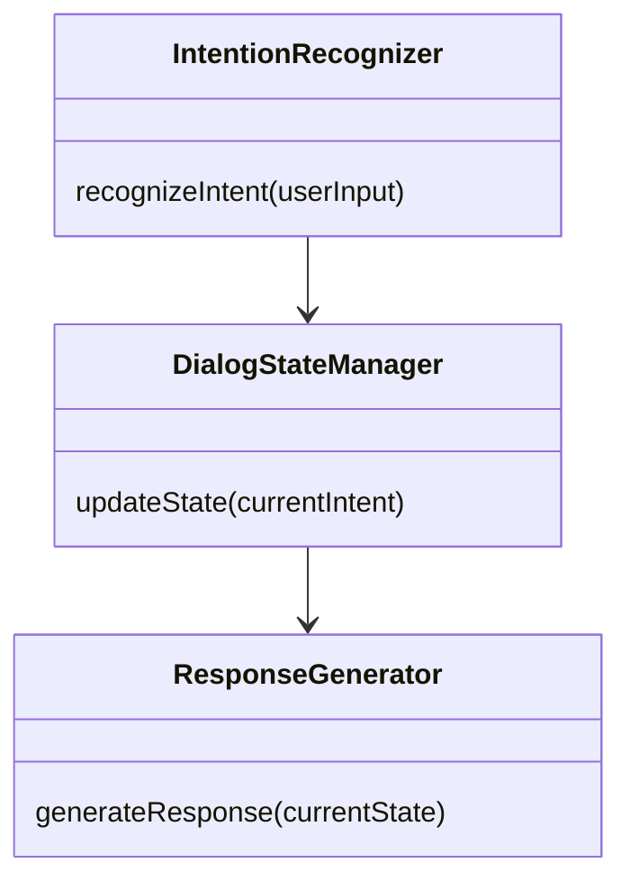

                 


# 多轮对话管理：提升AI Agent的交互体验

## 关键词：多轮对话管理、AI Agent、对话交互、自然语言处理、对话系统、用户体验

## 摘要：  
多轮对话管理是AI Agent实现高效人机交互的核心技术，通过理解用户意图、维护对话上下文和生成连贯的响应，显著提升了用户的交互体验。本文系统地探讨了多轮对话管理的核心概念、算法原理、系统架构设计以及项目实战，结合实际案例分析，提供了从理论到实践的全面指导，帮助读者掌握多轮对话管理的关键技术。

---

# 第1章: 多轮对话管理概述

## 1.1 多轮对话的定义与背景

### 1.1.1 多轮对话的定义  
多轮对话是指用户与AI Agent之间通过多条消息交互，逐步完成特定任务或达成目标的过程。与单轮对话（如搜索引擎）不同，多轮对话能够处理复杂场景，支持上下文理解和动态调整对话策略。

### 1.1.2 多轮对话的应用场景  
多轮对话广泛应用于智能客服、虚拟助手（如Siri、Alexa）、教育机器人、智能家居控制等领域。例如，用户可以通过多轮对话与AI Agent协作完成预订酒店、安排日程等复杂任务。

### 1.1.3 多轮对话的发展历程  
从基于规则的简单对话系统，到现代的深度学习驱动的多轮对话系统，技术不断进步。早期系统依赖预定义规则，现在则更多采用自然语言处理技术，如Transformer模型，实现更自然的对话交互。

## 1.2 多轮对话管理的重要性

### 1.2.1 提升用户体验的核心作用  
多轮对话管理通过维护对话上下文，确保每次交互都与之前的信息相关联，从而提供更连贯和个性化的服务。

### 1.2.2 多轮对话在AI Agent中的地位  
多轮对话管理是AI Agent实现复杂任务的关键模块，决定了系统的交互能力和用户体验。

### 1.2.3 多轮对话管理的挑战与机遇  
挑战包括对话上下文的维护、意图识别的准确性、对话策略的动态调整等；机遇在于技术进步（如大语言模型）为多轮对话管理提供了更强大的工具。

## 1.3 多轮对话管理的核心要素

### 1.3.1 对话上下文的重要性  
对话上下文记录了当前对话的状态，包括用户意图、已提及的信息等，是生成后续回复的基础。

### 1.3.2 对话历史的作用  
对话历史记录了之前的交互内容，帮助系统理解对话的整体脉络，避免重复和矛盾。

### 1.3.3 对话目标的设定  
明确对话目标有助于系统在多轮对话中保持方向，确保逐步接近最终目标。

---

# 第2章: 多轮对话管理的核心概念

## 2.1 对话管理的模块划分

### 2.1.1 意图识别模块  
意图识别通过分析用户的输入，确定用户的意图，如“查询天气”或“预订机票”。

### 2.1.2 对话状态管理模块  
对话状态管理维护当前对话的状态，包括已处理的信息和未完成的任务。

### 2.1.3 响应生成模块  
响应生成模块根据对话状态和用户输入，生成合适的回复。

## 2.2 对话管理的关键属性

### 2.2.1 对话的连贯性  
连贯性指对话内容之间的逻辑衔接，确保用户感觉自然流畅。

### 2.2.2 对话的相关性  
相关性指每次回复都与对话目标相关，避免偏离主题。

### 2.2.3 对话的自然性  
自然性指回复符合人类对话习惯，避免机械化的表达。

## 2.3 对话管理的核心原理

### 2.3.1 基于规则的对话管理  
通过预定义的规则处理对话，适用于简单场景，但灵活性有限。

### 2.3.2 基于模板的对话生成  
利用模板生成回复，确保格式统一，但缺乏灵活性。

### 2.3.3 基于检索的对话生成  
从预存的语料库中检索最匹配的回复，适用于知识库丰富的场景。

---

# 第3章: 多轮对话管理的算法原理

## 3.1 对话管理的算法分类

### 3.1.1 基于规则的对话管理  
通过编写规则处理对话，如条件判断语句。

### 3.1.2 基于模板的对话生成  
使用模板生成回复，如预定义的句子结构。

### 3.1.3 基于检索的对话生成  
从语料库中检索匹配的回复，如基于关键词匹配。

### 3.1.4 基于端到端深度学习的对话管理  
端到端模型（如Transformer）直接生成回复，无需手动规则。

## 3.2 基于规则的对话管理

### 3.2.1 规则的定义与设计  
通过条件判断语句定义规则，例如：

```python
if user_input == '天气':
    response = '今天天气晴朗。'
```

### 3.2.2 规则的执行流程  
1. 分析用户输入，匹配规则。
2. 执行匹配的规则，生成回复。

### 3.2.3 规则的优化与维护  
定期更新规则以适应新的需求，减少规则冲突。

---

# 第4章: 系统分析与架构设计

## 4.1 系统架构设计

### 4.1.1 系统功能模块  
- 意图识别模块
- 对话状态管理模块
- 响应生成模块

### 4.1.2 模块之间的关系  
使用Mermaid类图展示各模块的交互关系：



## 4.2 接口设计

### 4.2.1 接口定义  
- `recognizeIntent(userInput): intent`
- `updateState(intent): state`
- `generateResponse(state): response`

### 4.2.2 交互流程  
1. 用户输入，传递给意图识别模块。
2. 意图识别模块返回意图，传递给对话状态管理模块。
3. 对话状态管理模块更新状态，传递给响应生成模块。
4. 响应生成模块生成回复，返回给用户。

---

# 第5章: 项目实战

## 5.1 环境安装

### 5.1.1 安装Python和必要的库  
```bash
pip install numpy pandas scikit-learn
```

### 5.1.2 安装深度学习框架  
```bash
pip install tensorflow transformers
```

## 5.2 核心代码实现

### 5.2.1 意图识别模块

```python
def recognize_intent(user_input):
    # 示例：简单的关键词匹配
    if '天气' in user_input:
        return '查询天气'
    elif '预订' in user_input:
        return '预订服务'
    else:
        return '其他'
```

### 5.2.2 对话状态管理模块

```python
class DialogState:
    def __init__(self, intent):
        self.intent = intent
        self.history = []
    
    def update_state(self, new_intent):
        self.intent = new_intent
        self.history.append(new_intent)
```

### 5.2.3 响应生成模块

```python
def generate_response(dialog_state):
    if dialog_state.intent == '查询天气':
        return '今天天气很好，温度在25度左右。'
    elif dialog_state.intent == '预订服务':
        return '请问您需要预订什么时间的服务？'
    else:
        return '抱歉，我还没有学会回答这个问题。'
```

## 5.3 实际案例分析

### 5.3.1 案例描述  
用户与AI Agent进行多轮对话，查询天气和预订酒店。

### 5.3.2 代码实现分析  
通过意图识别模块识别用户的查询类型，更新对话状态，生成相应回复。

## 5.4 项目小结  
通过本项目，我们实现了基本的多轮对话管理功能，验证了系统架构的有效性。

---

# 第6章: 最佳实践与小结

## 6.1 最佳实践

### 6.1.1 模块化设计  
将系统划分为独立模块，便于维护和扩展。

### 6.1.2 数据质量管理  
确保训练数据的质量和多样性，提升模型性能。

### 6.1.3 持续优化  
定期收集用户反馈，优化对话系统。

## 6.2 小结  
多轮对话管理是提升AI Agent交互体验的关键技术，通过模块化设计、深度学习算法和持续优化，可以实现更自然、高效的对话交互。

## 6.3 注意事项

### 6.3.1 对话上下文的有效管理  
确保对话状态的准确维护，避免信息丢失或混淆。

### 6.3.2 用户隐私保护  
在处理用户数据时，确保隐私安全，遵守相关法律法规。

## 6.4 拓展阅读

### 6.4.1 推荐书籍  
- 《深度学习》—— Ian Goodfellow
- 《自然语言处理实战》—— 李航

### 6.4.2 推荐论文  
- Transformer模型的相关论文
- 最新对话系统研究论文

---

# 结语  
多轮对话管理是一项复杂但极具挑战性的技术，通过不断学习和实践，我们可以为用户提供更智能、更自然的交互体验。希望本文对您在AI Agent开发中的实践有所帮助！

