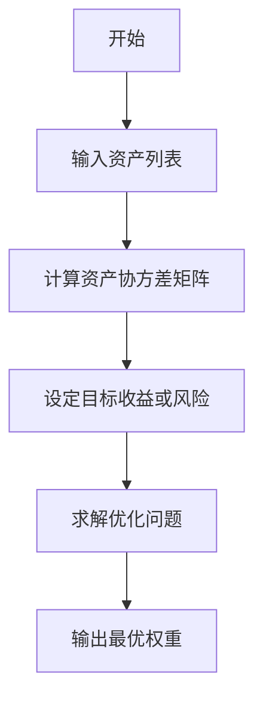
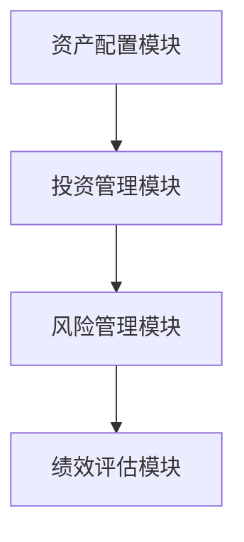

                 


# 大学捐赠基金模式：长期机构投资者的标杆

---

## 关键词：
大学捐赠基金, 长期投资, 机构投资者, 资产配置, 风险管理, 投资策略

---

## 摘要：
大学捐赠基金作为一类特殊的长期机构投资者，以其稳健的投资策略、科学的资产配置和严格的风险管理而闻名。本文将从捐赠基金的起源、核心概念、数学模型、系统架构等多个维度展开分析，揭示其成功背后的关键因素。通过详细的数学模型和实际案例分析，本文旨在为读者提供一个全面理解大学捐赠基金模式的视角，同时为其他长期机构投资者提供借鉴。

---

## 第1章: 大学捐赠基金的起源与运作机制

### 1.1 大学捐赠基金的起源
大学捐赠基金起源于美国，其历史可以追溯到19世纪末。最初，捐赠基金主要依赖于校友和富商的捐赠，目的是为大学提供稳定的资金来源。随着时间的推移，捐赠基金逐渐从单纯的财务支持工具演变为一种复杂的长期投资工具。

#### 1.1.1 捐赠基金的定义与历史发展
捐赠基金是指由大学接收的捐赠资产，用于支持大学的运营、教学和科研活动。其历史发展可以分为以下几个阶段：
- **初创阶段（19世纪末至20世纪初）**：捐赠基金规模较小，主要用于覆盖大学的日常开支。
- **发展阶段（20世纪中叶）**：捐赠基金开始尝试进行市场化投资，以实现资产增值。
- **成熟阶段（20世纪末至21世纪初）**：捐赠基金采用现代投资组合理论，成为机构投资者的标杆。

#### 1.1.2 大学捐赠基金的运作机制
捐赠基金的运作机制包括以下几个关键环节：
- **资产接收**：接收来自校友、企业和个人的捐赠资产。
- **资产配置**：根据大学的财务需求和市场环境，制定资产配置策略。
- **投资管理**：通过专业的投资团队或外部机构进行投资运作。
- **收益分配**：将投资收益用于支持大学的运营和发展。

#### 1.1.3 捐赠基金的目标与特点
捐赠基金的主要目标是实现资产的保值与增值，同时为大学提供稳定的财务支持。其特点包括：
- **长期性**：捐赠基金的投资期限通常为数十年，注重长期收益。
- **多样性**：通过多元化投资降低风险，实现收益最大化。
- **透明性**：捐赠基金的运作通常公开透明，接受社会监督。

### 1.2 捐赠基金与其他机构投资者的比较
捐赠基金作为一种特殊的机构投资者，与养老基金、保险基金等其他机构投资者相比，具有以下特点：
- **目标的特殊性**：捐赠基金的核心目标是支持大学的运营和发展，而非单纯的财务回报。
- **投资期限的灵活性**：捐赠基金可以根据大学的需求灵活调整投资策略。
- **风险管理的严格性**：捐赠基金通常采用保守的投资策略，注重风险控制。

---

## 第2章: 捐赠基金作为长期机构投资者的核心概念

### 2.1 长期机构投资者的定义与特征
长期机构投资者是指那些以长期投资为目标，追求资产稳定增值的机构。其主要特征包括：
- **投资期限长**：通常为数年以上，注重长期收益。
- **资金规模大**：管理的资金规模通常较大。
- **风险管理严格**：通过多元化投资和严格的风控体系降低风险。

#### 2.1.1 长期投资的内涵
长期投资是指将资金投入具有长期增长潜力的资产，通过时间的积累实现资产增值。其核心在于通过持续的资本增值为机构提供稳定的财务支持。

#### 2.1.2 机构投资者的核心特征
机构投资者通常具有以下核心特征：
- **专业团队**：拥有专业的投资团队进行决策和管理。
- **严格的风控体系**：通过科学的方法和工具控制投资风险。
- **规范的运作流程**：从资产配置到投资执行，均遵循严格的规范。

### 2.2 捐赠基金的核心概念与属性
捐赠基金作为长期机构投资者的标杆，其核心概念包括：
- **资产配置**：通过科学的资产配置实现收益与风险的平衡。
- **风险管理**：通过多元化投资和严格的风险控制确保资产安全。
- **投资策略**：采用积极与防御相结合的投资策略，灵活应对市场变化。

---

## 第3章: 捐赠基金的投资策略与风险管理

### 3.1 捐赠基金的主要投资策略
#### 3.1.1 资产配置策略
捐赠基金的资产配置策略是其投资成功的关键。通常，捐赠基金采用以下几种资产配置策略：
- **股债平衡策略**：将资产分配到股票和债券等不同资产类别中，以平衡风险和收益。
- **行业分散策略**：选择不同行业的资产，降低行业风险。
- **地域分散策略**：在全球范围内配置资产，降低地域风险。

#### 3.1.2 积极型与防御型投资策略
捐赠基金可以根据市场环境选择积极型或防御型投资策略：
- **积极型策略**：在市场上涨时加大权益类资产配置，追求超额收益。
- **防御型策略**：在市场下跌时增加固定收益类资产配置，降低风险。

#### 3.1.3 多元化投资组合的构建
通过多元化投资构建投资组合，可以有效降低非系统性风险。捐赠基金通常会将资产分散投资于股票、债券、房地产等多种资产类别。

### 3.2 捐赠基金的风险管理框架
#### 3.2.1 风险识别与评估
捐赠基金需要定期识别和评估潜在风险，包括市场风险、流动性风险和信用风险等。

#### 3.2.2 风险分散与对冲策略
通过多元化投资和对冲交易，捐赠基金可以有效分散和对冲风险。例如，使用股指期货对冲市场风险。

#### 3.2.3 捐赠基金的流动性管理
捐赠基金需要在满足大学资金需求的同时，保持一定的流动性。通常，捐赠基金会预留一部分短期资产用于应对突发事件。

---

## 第4章: 捐赠基金的数学模型与算法原理

### 4.1 资产配置模型
#### 4.1.1 均值-方差优化模型
均值-方差优化模型是现代投资组合理论的核心，用于在给定风险下寻找收益最大的资产组合，或在给定收益下寻找风险最小的资产组合。

$$
\min_w \sigma^2 \quad \text{subject to} \quad \mu^T w = \text{target return}
$$

其中，$w$ 是资产权重向量，$\mu$ 是资产收益向量，$\sigma^2$ 是资产组合的方差。

#### 4.1.2 风险平价模型
风险平价模型是一种基于风险的资产配置方法，通过分配相同的风险权重来构建投资组合。

$$
w_i = \frac{1}{\sigma_i^2} \sum \frac{1}{\sigma_j^2}
$$

其中，$w_i$ 是第 $i$ 个资产的权重，$\sigma_i^2$ 是第 $i$ 个资产的风险（方差）。

---

### 4.2 投资组合优化算法
#### 4.2.1 Markowitz优化算法
Markowitz优化算法是一种基于均值-方差模型的投资组合优化方法，适用于寻找最优资产配置。



---

## 第5章: 捐赠基金的风险管理模型

### 5.1 风险价值（VaR）模型
风险价值（VaR）模型是衡量投资组合风险的重要工具，用于估计在一定置信水平下可能承受的最大损失。

#### 5.1.1 VaR的定义与计算方法
$$
\text{VaR} = \text{P}(\text{损失} \leq L) \geq \text{置信水平}
$$

其中，$L$ 是损失金额，置信水平通常为95%或99%。

#### 5.1.2 VaR的计算方法
VaR的计算方法包括历史模拟法、方差-协方差法和蒙特卡洛模拟法。

---

### 5.2 信用风险模型
信用风险模型用于评估投资组合中信用类资产的风险。

#### 5.2.1 Merton违约模型
Merton违约模型是一种基于期权定价理论的信用风险模型，用于估计债券发行人的违约概率。

$$
\text{违约概率} = \Phi\left( \frac{\mu - \sigma z}{\sigma} \right)
$$

其中，$\Phi$ 是标准正态分布的累积分布函数，$\mu$ 是资产收益率的均值，$\sigma$ 是资产收益率的标准差，$z$ 是基于信用等级的阈值。

---

## 第6章: 捐赠基金的系统架构设计

### 6.1 捐赠基金管理系统架构
捐赠基金管理系统是一个复杂的金融系统，包括资产配置、投资管理、风险管理等多个模块。

#### 6.1.1 系统功能设计
- **资产配置模块**：负责资产的分类、权重计算和配置优化。
- **投资管理模块**：负责投资组合的构建和交易执行。
- **风险管理模块**：负责风险识别、评估和对冲。
- **绩效评估模块**：负责投资组合的绩效评估和反馈。

#### 6.1.2 系统架构图


---

## 第7章: 捐赠基金的项目实战

### 7.1 项目背景
本项目旨在设计和实现一个捐赠基金管理系统，帮助大学实现资产的长期稳健投资。

### 7.2 核心代码实现
以下是一个简单的资产配置优化算法的Python代码示例：

```python
import numpy as np
from scipy.optimize import minimize

def portfolio_variance(weights, covariance_matrix):
    return np.dot(weights.T, np.dot(covariance_matrix, weights))

def optimize_portfolio(return_vector, covariance_matrix, target_return):
    n = len(weights)
    constraints = [{'type': 'eq', 'fun': lambda w: np.sum(w) - 1.0},
                   {'type': 'eq', 'fun': lambda w: np.dot(return_vector, w) - target_return}]
    bounds = [(0.0, 1.0) for _ in range(n)]
    result = minimize(portfolio_variance, np.ones(n)/n, args=covariance_matrix, 
                      method='SLSQP', constraints=constraints, bounds=bounds)
    return result.x

# 示例数据
return_vector = np.array([0.1, 0.15, 0.08])
covariance_matrix = np.array([[0.04, 0.02, 0.01],
                              [0.02, 0.06, 0.03],
                              [0.01, 0.03, 0.05]])
target_return = 0.12

weights = optimize_portfolio(return_vector, covariance_matrix, target_return)
print("Optimal weights:", weights)
```

### 7.3 案例分析
以某大学捐赠基金为例，假设其资产规模为10亿美元，投资目标为年化收益8%。通过优化算法，得到最优资产配置为：股票40%，债券30%，房地产20%，现金10%。

### 7.4 项目总结
通过本项目，我们可以看到捐赠基金的科学投资策略和严格的风险管理是其成功的关键。同时，系统的实现也为捐赠基金的长期稳健投资提供了有力支持。

---

## 第8章: 捐赠基金的成功经验与启示

### 8.1 成功经验总结
- **科学的资产配置**：通过均值-方差优化和风险平价模型实现最优配置。
- **严格的风险管理**：通过VaR模型和信用风险模型控制投资风险。
- **专业的团队支持**：依靠专业的投资团队和系统支持实现稳健投资。

### 8.2 对其他机构投资者的启示
- **长期投资的重要性**：捐赠基金的成功证明了长期投资的潜在收益。
- **风险管理的核心地位**：严格的风控体系是实现稳健投资的关键。
- **系统的支持作用**：先进的系统架构能够提高投资效率和决策精度。

---

## 第9章: 捐赠基金的未来展望与挑战

### 9.1 未来展望
- **技术进步**：人工智能和大数据技术将为捐赠基金的投资决策提供更强大的支持。
- **全球化投资**：随着全球市场的深度融合，捐赠基金将更加注重全球化配置。

### 9.2 当前挑战
- **市场波动**：全球经济不确定性增加，投资风险加大。
- **政策变化**：各国金融政策的变化可能对捐赠基金的投资策略产生影响。

---

## 第10章: 最佳实践与小结

### 10.1 最佳实践
- **坚持长期投资**：捐赠基金的成功源于其长期投资理念。
- **科学的资产配置**：通过数学模型实现最优配置。
- **严格的风险管理**：通过VaR等工具控制投资风险。

### 10.2 小结
大学捐赠基金作为长期机构投资者的标杆，其成功经验值得借鉴。通过科学的投资策略和严格的风险管理，捐赠基金为大学的持续发展提供了坚实的财务支持。

---

## 第11章: 注意事项与拓展阅读

### 11.1 注意事项
- **谨慎选择投资策略**：根据市场环境和大学需求灵活调整。
- **加强风险管理**：确保资产安全是投资的第一要务。
- **注重团队建设**：专业团队是实现投资目标的关键。

### 11.2 拓展阅读
- **书籍推荐**：《机构投资者的机构投资》
- **学术论文**：现代投资组合理论的相关研究
- **行业报告**：各大机构发布的捐赠基金投资报告

---

## 总结
大学捐赠基金作为长期机构投资者的标杆，其成功背后离不开科学的投资策略、严格的风险管理和专业的团队支持。通过本文的分析，我们可以看到捐赠基金在投资领域的独特地位，同时也可以为其他机构投资者提供宝贵的借鉴。

