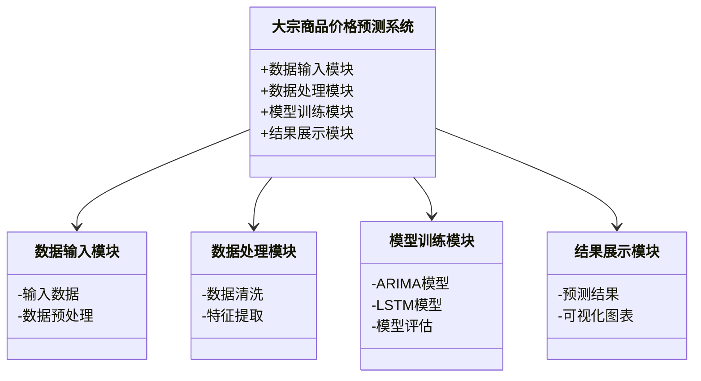
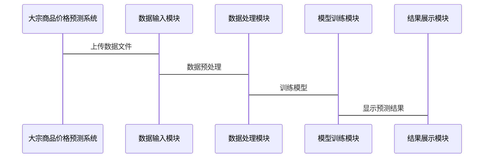

                 


# 大宗商品价格周期与投资机会

> 关键词：大宗商品，价格周期，投资机会，时间序列分析，机器学习，风险管理

> 摘要：大宗商品作为全球经济的重要组成部分，其价格波动受到多种因素的影响，包括宏观经济环境、地缘政治和技术创新等。本文将深入探讨大宗商品价格周期的形成机制，分析其与投资机会的关系，并结合实际案例，介绍如何利用数学模型和算法原理来预测价格波动，抓住投资机遇。

---

# 第一部分: 大宗商品价格周期与投资机会概述

## 第1章: 大宗商品的基本概念与市场背景

### 1.1 大宗商品的定义与分类

#### 1.1.1 大宗商品的定义
大宗商品是指那些具有高度流动性和标准化的实物商品，通常包括能源（如原油）、金属（如黄金、铜）和农产品（如小麦、大豆）等。它们在国际贸易中占据重要地位，是许多经济体的核心资源。

#### 1.1.2 大宗商品的分类与特点
大宗商品可以分为以下几类：
1. **能源类**：原油、天然气、煤炭等。
2. **金属类**：黄金、白银、铜、铝等。
3. **农产品类**：小麦、大豆、玉米等。
4. **其他**：包括牲畜、木材等。

#### 1.1.3 大宗商品市场的基本结构
大宗商品市场由生产者、消费者、中间商和交易场所组成。交易场所包括期货交易所和现货市场，其中期货市场是最重要的交易场所之一。

### 1.2 大宗商品价格波动的背景与影响

#### 1.2.1 经济周期与大宗商品价格的关系
经济周期直接影响大宗商品的需求和价格。例如，在经济繁荣时期，工业金属的需求会增加，而在经济衰退时期，需求会下降。

#### 1.2.2 地缘政治对大宗商品价格的影响
地缘政治事件（如战争、制裁）会直接影响某些大宗商品的供应，从而推高价格。例如，中东地区的冲突会影响原油价格。

#### 1.2.3 环境与技术进步对大宗商品市场的推动
环保政策和技术进步（如新能源技术）会影响大宗商品的需求。例如，可再生能源的发展减少了对化石燃料的需求。

### 1.3 大宗商品价格周期的形成机制

#### 1.3.1 市场供需关系的周期性
供需关系的变化是价格周期形成的核心因素。当需求超过供给时，价格上涨；当供给超过需求时，价格下跌。

#### 1.3.2 价格波动的内在规律
价格波动具有周期性，通常表现为上升、下降和稳定阶段。这些周期受市场参与者的预期、生产成本和技术进步等因素影响。

#### 1.3.3 周期性与非周期性因素的结合
价格周期的形成是周期性因素（如供需波动）和非周期性因素（如突发事件）共同作用的结果。

### 1.4 大宗商品投资的基本逻辑

#### 1.4.1 投资者如何识别价格周期
通过分析历史价格数据和市场趋势，投资者可以识别价格周期的特征，从而做出投资决策。

#### 1.4.2 市场情绪与价格波动的关系
市场情绪（如贪婪和恐惧）会放大价格波动。投资者需要关注市场情绪的变化，以抓住投资机会。

#### 1.4.3 投资机会的潜在来源
大宗商品价格波动为投资者提供了套利和投机的机会。例如，通过期货市场进行套期保值或投机交易。

## 1.5 本章小结
本章介绍了大宗商品的基本概念、分类和市场结构，分析了价格波动的背景和影响因素，并探讨了价格周期的形成机制和投资机会的潜在来源。

---

## 第2章: 大宗商品价格波动的核心概念

### 2.1 大宗商品市场的核心要素

#### 2.1.1 市场参与者分析
- 生产者：如矿业公司、农业合作社。
- 消费者：如制造企业、零售商。
- 中间商：如贸易公司、银行。
- 交易场所：如纽约商品交易所（NYMEX）、伦敦金属交易所（LME）。

#### 2.1.2 价格形成机制
价格由供需关系、市场参与者的行为和宏观经济因素共同决定。

#### 2.1.3 市场信息的传递与反馈
信息（如生产数据、政策变化）通过市场参与者传递，影响价格走势。

### 2.2 价格周期的特征与分类

#### 2.2.1 周期的长短与强度
- 长周期：持续数年，如原油价格的长期波动。
- 短周期：持续数月或数周，如农产品价格的季节性波动。
- 强度：价格波动的幅度越大，周期的强度越高。

#### 2.2.2 周期性与随机性的区别
- 周期性：价格波动有规律可循。
- 随机性：价格波动无明显规律，受突发事件影响较大。

#### 2.2.3 不同大宗商品价格周期的对比
不同大宗商品的价格周期因行业特点而异。例如，能源类大宗商品的价格周期通常较长，而农产品的价格周期较短。

### 2.3 大宗商品价格波动的驱动因素

#### 2.3.1 宏观经济因素
- 经济增长：需求增加，价格上涨。
- 通货膨胀：货币贬值，商品价格上涨。
- 利率变化：影响投资行为，进而影响价格。

#### 2.3.2 供需关系的变化
- 生产成本变化：如劳动力、原材料价格上涨。
- 技术进步：如开采技术的改进，降低生产成本。

#### 2.3.3 市场预期与情绪
- 投资者预期：如预期价格上涨，投资者大量买入，推高价格。
- 市场情绪：如恐慌情绪导致价格快速下跌。

### 2.4 价格波动的数学模型与分析工具

#### 2.4.1 时间序列分析的基本概念
时间序列分析是一种统计方法，用于分析数据随时间的变化趋势。

#### 2.4.2 价格波动的统计特征
- 均值：价格的平均值。
- 方差：价格波动的幅度。
- 自相关性：价格在不同时间点的相关性。

#### 2.4.3 常用的分析工具与方法
- 移动平均法：用于平滑价格数据。
- 差分法：用于消除趋势和季节性影响。
- 自回归模型：用于预测未来价格。

## 2.5 本章小结
本章分析了大宗商品市场的核心要素，探讨了价格周期的特征和驱动因素，并介绍了常用的时间序列分析工具和方法。

---

## 第3章: 时间序列分析与大宗商品价格预测

### 3.1 时间序列分析的基本原理

#### 3.1.1 时间序列的基本特征
时间序列数据具有趋势、季节性和随机性。

#### 3.1.2 时间序列分析的目标
识别数据中的模式，预测未来价格。

#### 3.1.3 时间序列分析的步骤
1. 数据收集与预处理。
2. 模型选择与参数估计。
3. 模型验证与预测。

### 3.2 自回归积分滑动平均模型（ARIMA）

#### 3.2.1 ARIMA模型的原理
ARIMA模型由自回归（AR）和滑动平均（MA）部分组成，用于捕捉数据中的趋势和季节性。

#### 3.2.2 ARIMA模型的参数
- p：AR部分的阶数。
- d：差分的阶数。
- q：MA部分的阶数。

#### 3.2.3 ARIMA模型的优缺点
- 优点：适合线性时间序列数据。
- 缺点：对非线性数据拟合效果较差。

### 3.3 长短期记忆网络（LSTM）

#### 3.3.1 LSTM模型的原理
LSTM是一种深度学习模型，能够捕捉数据中的长期依赖关系，适合处理非线性时间序列数据。

#### 3.3.2 LSTM模型的结构
- 输入门（Input Gate）：决定输入数据是否进入记忆单元。
- 遗忘门（Forget Gate）：决定记忆单元中的数据是否保留。
- 输出门（Output Gate）：决定输出数据。

#### 3.3.3 LSTM模型的优缺点
- 优点：适合非线性数据，预测精度高。
- 缺点：训练时间较长，参数较多。

### 3.4 时间序列分析的代码实现

#### 3.4.1 使用Python进行ARIMA模型实现
```python
from statsmodels.tsa.arima_model import ARIMA
import pandas as pd
import numpy as np

# 示例数据
data = pd.Series(np.random.randn(100), index=pd.date_range('2000-01-01', periods=100))

# 拟合ARIMA模型
model = ARIMA(data, order=(1, 1, 1))
model_fit = model.fit()

# 预测未来5天的价格
forecast = model_fit.forecast(steps=5)
print(forecast)
```

#### 3.4.2 使用Python进行LSTM模型实现
```python
from keras.models import Sequential
from keras.layers import LSTM, Dense
import numpy as np
import pandas as pd
from sklearn.preprocessing import MinMaxScaler

# 示例数据
data = pd.Series(np.random.randn(100), index=pd.date_range('2000-01-01', periods=100))

# 数据归一化
scaler = MinMaxScaler()
data_scaled = scaler.fit_transform(data.values.reshape(-1, 1))

# 数据分割
train_size = int(len(data_scaled) * 0.7)
train_data = data_scaled[:train_size]
test_data = data_scaled[train_size:]

# 构建数据集
def create_dataset(data, look_back=1):
    X, y = [], []
    for i in range(len(data) - look_back):
        X.append(data[i:i + look_back])
        y.append(data[i + look_back])
    return np.array(X), np.array(y)

look_back = 3
X_train, y_train = create_dataset(train_data, look_back)
X_test, y_test = create_dataset(test_data, look_back)

# 模型训练
model = Sequential()
model.add(LSTM(50, input_shape=(look_back, 1)))
model.add(Dense(1))
model.compile(loss='mean_squared_error', optimizer='adam')
model.fit(X_train, y_train, epochs=50, batch_size=1, verbose=1)

# 预测
X_test_padded = np.reshape(X_test, (X_test.shape[0], look_back, 1))
y_pred = model.predict(X_test_padded)
y_pred = scaler.inverse_transform(y_pred)
y_true = scaler.inverse_transform(y_test)

print(y_pred[:5], y_true[:5])
```

### 3.5 本章小结
本章介绍了时间序列分析的基本原理，详细讲解了ARIMA和LSTM模型的原理、优缺点以及代码实现，为后续的大宗商品价格预测提供了理论基础和实践指导。

---

## 第4章: 大宗商品价格预测系统的架构与实现

### 4.1 项目介绍

#### 4.1.1 项目背景
随着大数据和人工智能技术的发展，利用数学模型和算法原理预测大宗商品价格已成为可能。

#### 4.1.2 项目目标
构建一个基于时间序列分析的大宗商品价格预测系统，帮助投资者识别价格周期，抓住投资机会。

### 4.2 系统功能设计

#### 4.2.1 领域模型（Mermaid 类图）


#### 4.2.2 系统架构设计（Mermaid 架构图）
```mermaid
container 大宗商品价格预测系统 {
    大宗商品价格预测系统
    --> 数据输入模块
    --> 数据处理模块
    --> 模型训练模块
    --> 结果展示模块
}
```

#### 4.2.3 系统接口设计
- 数据输入接口：接收原始数据，如CSV文件。
- 数据处理接口：处理数据，提取特征。
- 模型训练接口：训练ARIMA和LSTM模型。
- 结果展示接口：显示预测结果和可视化图表。

#### 4.2.4 系统交互流程图（Mermaid 序列图）


### 4.3 本章小结
本章设计了一个大宗商品价格预测系统，详细介绍了系统的功能模块、架构设计和接口设计，并通过Mermaid图展示了系统的交互流程。

---

## 第5章: 项目实战——基于时间序列分析的大宗商品价格预测

### 5.1 环境安装与配置

#### 5.1.1 安装Python
```bash
# 安装Python
# 请根据系统选择合适的安装方式
```

#### 5.1.2 安装依赖库
```bash
pip install pandas numpy matplotlib statsmodels keras
```

### 5.2 核心代码实现

#### 5.2.1 数据预处理
```python
import pandas as pd
import numpy as np

# 示例数据
data = pd.Series(np.random.randn(100), index=pd.date_range('2000-01-01', periods=100))
print(data)
```

#### 5.2.2 ARIMA模型实现
```python
from statsmodels.tsa.arima_model import ARIMA
import pandas as pd
import numpy as np

# 示例数据
data = pd.Series(np.random.randn(100), index=pd.date_range('2000-01-01', periods=100))

# 拟合ARIMA模型
model = ARIMA(data, order=(1, 1, 1))
model_fit = model.fit()

# 预测未来5天的价格
forecast = model_fit.forecast(steps=5)
print(forecast)
```

#### 5.2.3 LSTM模型实现
```python
from keras.models import Sequential
from keras.layers import LSTM, Dense
import numpy as np
import pandas as pd
from sklearn.preprocessing import MinMaxScaler

# 示例数据
data = pd.Series(np.random.randn(100), index=pd.date_range('2000-01-01', periods=100))

# 数据归一化
scaler = MinMaxScaler()
data_scaled = scaler.fit_transform(data.values.reshape(-1, 1))

# 数据分割
train_size = int(len(data_scaled) * 0.7)
train_data = data_scaled[:train_size]
test_data = data_scaled[train_size:]

# 构建数据集
def create_dataset(data, look_back=1):
    X, y = [], []
    for i in range(len(data) - look_back):
        X.append(data[i:i + look_back])
        y.append(data[i + look_back])
    return np.array(X), np.array(y)

look_back = 3
X_train, y_train = create_dataset(train_data, look_back)
X_test, y_test = create_dataset(test_data, look_back)

# 模型训练
model = Sequential()
model.add(LSTM(50, input_shape=(look_back, 1)))
model.add(Dense(1))
model.compile(loss='mean_squared_error', optimizer='adam')
model.fit(X_train, y_train, epochs=50, batch_size=1, verbose=1)

# 预测
X_test_padded = np.reshape(X_test, (X_test.shape[0], look_back, 1))
y_pred = model.predict(X_test_padded)
y_pred = scaler.inverse_transform(y_pred)
y_true = scaler.inverse_transform(y_test)

print(y_pred[:5], y_true[:5])
```

### 5.3 代码功能解读与分析

#### 5.3.1 ARIMA模型代码解读
- 数据预处理：将数据转换为时间序列格式。
- 模型拟合：使用ARIMA模型拟合数据。
- 预测：基于模型预测未来价格。

#### 5.3.2 LSTM模型代码解读
- 数据归一化：将数据转换到0-1范围。
- 数据分割：将数据分为训练集和测试集。
- 数据集构建：将数据转换为适合模型输入的格式。
- 模型训练：训练LSTM模型。
- 预测：基于模型预测未来价格。

### 5.4 实际案例分析

#### 5.4.1 数据来源
使用真实的原油价格数据，例如从2010年到2023年的每日原油价格。

#### 5.4.2 数据分析与建模
通过数据分析，选择合适的模型参数，训练模型。

#### 5.4.3 结果解读
通过可视化图表，展示预测结果与实际价格的对比，评估模型的准确性。

### 5.5 本章小结
本章通过实际案例，详细讲解了如何使用ARIMA和LSTM模型进行大宗商品价格预测，帮助读者掌握模型的实现和应用。

---

## 第6章: 最佳实践与投资策略

### 6.1 投资策略

#### 6.1.1 长期投资策略
- 基于宏观经济分析，选择具有长期上涨趋势的大宗商品。
- 例如，投资黄金作为长期保值工具。

#### 6.1.2 短期投资策略
- 基于技术分析，捕捉短期价格波动。
- 例如，利用期货市场进行套利交易。

### 6.2 风险管理

#### 6.2.1 风险来源
- 市场风险：价格波动导致的损失。
- 利率风险：利率变化影响投资收益。
- 操作风险：交易过程中的错误或欺诈。

#### 6.2.2 风险管理策略
- 分散投资：通过投资不同种类的大宗商品降低风险。
- 设置止损：当价格达到一定亏损幅度时，立即卖出。

### 6.3 技术应用

#### 6.3.1 时间序列分析的应用
- 使用ARIMA和LSTM模型预测价格波动。
- 基于模型结果制定投资策略。

#### 6.3.2 机器学习的应用
- 使用深度学习模型捕捉复杂的价格模式。
- 基于模型预测进行交易决策。

### 6.4 持续学习与技术更新

#### 6.4.1 关注行业动态
- 关注宏观经济政策变化。
- 关注新技术的发展，如量子计算在金融中的应用。

#### 6.4.2 参与专业培训
- 参加金融分析培训。
- 学习大数据和人工智能技术，提升分析能力。

### 6.5 本章小结
本章总结了大宗商品投资中的最佳实践，包括投资策略、风险管理、技术应用和持续学习的重要性。

---

## 第7章: 小结与展望

### 7.1 小结

#### 7.1.1 核心内容回顾
本文详细探讨了大宗商品价格周期的形成机制，分析了其与投资机会的关系，并结合时间序列分析和机器学习技术，介绍了如何预测价格波动，抓住投资机会。

#### 7.1.2 实践价值
通过实际案例分析，帮助投资者掌握大宗商品价格预测的技术和方法，提升投资收益。

### 7.2 未来展望

#### 7.2.1 技术进步
随着人工智能和大数据技术的发展，大宗商品价格预测的精度将进一步提高。

#### 7.2.2 市场变化
地缘政治和环境政策的变化将继续影响大宗商品价格，投资者需要保持敏感性和适应性。

#### 7.2.3 研究方向
未来研究可以关注多因素模型和复杂网络分析，进一步提升价格预测的准确性。

### 7.3 本章小结
本章总结了全文的核心内容，并展望了未来的研究方向和技术进步。

---

## 第8章: 注意事项与风险提示

### 8.1 投资风险提示

#### 8.1.1 市场风险
大宗商品价格波动剧烈，投资者需做好风险管理。

#### 8.1.2 利率风险
利率变化会影响大宗商品的投资收益。

#### 8.1.3 操作风险
交易过程中的错误或欺诈行为可能导致损失。

### 8.2 技术风险提示

#### 8.2.1 模型局限性
ARIMA和LSTM模型可能无法捕捉所有价格波动因素。

#### 8.2.2 数据质量问题
数据的准确性和完整性直接影响模型的预测效果。

#### 8.2.3 技术更新
技术进步可能导致现有模型和方法被淘汰。

### 8.3 风险管理建议

#### 8.3.1 分散投资
通过投资不同种类的大宗商品降低风险。

#### 8.3.2 设置止损
当价格达到一定亏损幅度时，立即卖出。

#### 8.3.3 持续学习
关注行业动态，学习新技术，提升分析能力。

### 8.4 本章小结
本章提醒读者注意大宗商品投资中的各种风险，并提出了相应的风险管理建议。

---

## 第9章: 拓展阅读与资源推荐

### 9.1 拓展阅读

#### 9.1.1 专业书籍
- 《 commodities trading secrets 》
- 《 financial time series modeling 》

#### 9.1.2 学术论文
- 时间序列分析的经典论文。
- 机器学习在金融领域的最新研究。

### 9.2 在线资源

#### 9.2.1 数据来源
- 彭博社（Bloomberg）
- 路透社（Reuters）
- 金融时报（Financial Times）

#### 9.2.2 工具与平台
- Python的Pandas和NumPy库。
- TensorFlow和Keras用于深度学习。
- Matplotlib用于数据可视化。

### 9.3 专业培训与课程

#### 9.3.1 在线课程
- Coursera上的《金融数据分析》。
- edX上的《时间序列分析》。

#### 9.3.2 专业认证
- 特许金融分析师（CFA）。
- 特许市场分析师（CMT）。

### 9.4 本章小结
本章为读者提供了丰富的拓展阅读资源、在线工具和专业培训机会，帮助读者进一步学习和提升。

---

## 第10章: 结语

### 10.1 内容总结
本文系统地探讨了大宗商品价格周期的形成机制，分析了其与投资机会的关系，并结合时间序列分析和机器学习技术，介绍了如何预测价格波动，抓住投资机会。

### 10.2 作者寄语
大宗商品投资既是一门科学，也是一门艺术。希望读者能够通过本文掌握大宗商品价格预测的技术和方法，提升投资收益。

### 10.3 谢谢阅读
感谢读者的耐心阅读，希望本文对您有所帮助！

---

以上是《大宗商品价格周期与投资机会》的技术博客文章的完整目录和内容框架。

