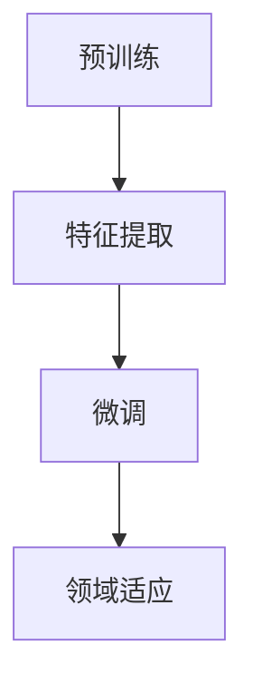
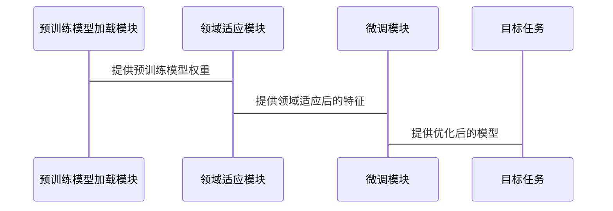

                 


# 大规模预训练模型在金融场景中的迁移学习实践

> 关键词：大规模预训练模型，迁移学习，金融场景，领域适应，深度学习，自然语言处理

> 摘要：本文系统地探讨了大规模预训练模型在金融场景中的迁移学习实践。通过分析迁移学习的核心概念、算法原理、系统架构设计，以及具体的项目实战，深入剖析了大规模预训练模型在金融领域的应用价值和挑战。本文结合实际案例，详细讲解了从理论到实践的整个过程，为读者提供了全面的指导和实用的建议。

---

# 第一章：大规模预训练模型与迁移学习概述

## 1.1 大规模预训练模型的背景与概念
### 1.1.1 预训练模型的定义与发展
预训练模型是一种基于深度学习的模型训练方法，旨在通过在大规模通用数据集上进行无监督或弱监督训练，捕获数据中的深层特征和语义信息。近年来，随着计算能力的提升和数据量的爆炸式增长，预训练模型在自然语言处理、计算机视觉等领域取得了显著进展。

### 1.1.2 大规模预训练模型的特点
- **参数规模大**：通常包含数亿个参数，能够捕获复杂的数据模式。
- **通用性**：通过在通用数据集上预训练，模型具备一定的通用性，可以迁移到不同任务。
- **可迁移性**：通过微调（fine-tuning）等技术，模型可以在特定领域或任务上进行优化。

### 1.1.3 迁移学习的基本概念
迁移学习是一种机器学习技术，旨在将从一个领域或任务上学到的知识，迁移到另一个领域或任务上。其核心思想是利用源领域和目标领域的相似性，减少目标领域数据的依赖，提高模型的泛化能力。

## 1.2 金融场景中的迁移学习需求
### 1.2.1 金融领域的数据特点
- 数据量有限：金融领域的高质量标注数据通常较少，尤其是在某些细分领域。
- 数据分布偏移：金融数据通常具有领域特异性，与通用数据集存在较大的分布差异。
- 任务多样性：金融领域涉及多种任务，如风险评估、欺诈检测、市场预测等。

### 1.2.2 金融场景中的迁移学习挑战
- 数据稀缺性：金融领域的数据通常难以获取，且标注成本较高。
- 领域适应性：大规模预训练模型在通用领域表现优异，但在金融领域可能需要特定的调整。
- 模型解释性：金融领域的决策需要较高的透明性和解释性，这对迁移学习提出了更高的要求。

### 1.2.3 迁移学习在金融中的应用价值
- 提高模型泛化能力：通过迁移学习，可以利用外部数据提升模型在金融领域的表现。
- 降低数据依赖：在数据稀缺的情况下，迁移学习能够有效缓解对大量目标领域数据的依赖。
- 加速模型开发：通过迁移学习，可以快速构建适用于金融场景的模型，缩短开发周期。

## 1.3 本章小结
本章介绍了大规模预训练模型和迁移学习的基本概念，并分析了迁移学习在金融场景中的需求和挑战。迁移学习在金融领域的应用价值在于其能够有效应对数据稀缺性和领域适应性问题，为金融模型的开发提供了新的思路。

---

# 第二章：迁移学习的核心概念与联系

## 2.1 核心概念原理
### 2.1.1 迁移学习的数学模型
迁移学习的核心思想是通过共享部分参数或特征，将源任务和目标任务的特征空间对齐。数学上，可以表示为：

$$L_{source} = \sum_{i=1}^{N} (y_i - f(x_i))^2$$  
$$L_{target} = \sum_{i=1}^{M} (y'_i - f(x'_i))^2$$  

其中，$f$ 是迁移学习模型，$x_i$ 和 $y_i$ 是源任务的输入和输出，$x'_i$ 和 $y'_i$ 是目标任务的输入和输出。

### 2.1.2 预训练与微调的原理
预训练阶段：在大规模通用数据集上训练模型，提取通用特征。
微调阶段：在目标领域数据上进行微调，优化模型在特定任务上的表现。

### 2.1.3 领域适应与数据分布偏移
领域适应（Domain Adaptation）是迁移学习的核心问题之一，旨在减少源领域和目标领域之间的分布偏移。可以通过对抗训练、样本重加权等方法实现。

## 2.2 核心概念对比分析
### 2.2.1 迁移学习与传统机器学习的对比
| 特性       | 迁移学习                  | 传统机器学习             |
|------------|---------------------------|--------------------------|
| 数据依赖    | 利用外部数据              | 依赖目标领域数据          |
| 模型泛化性   | 高                        | 中低                     |
| 适用场景    | 数据稀缺、领域差异较大    | 数据充分、领域单一        |

### 2.2.2 预训练模型与定制化模型的对比
| 特性       | 预训练模型                | 定制化模型               |
|------------|---------------------------|--------------------------|
| 训练成本    | 低                        | 高                       |
| 模型泛化性   | 高                        | 低                       |
| 适用场景    | 多领域、多任务            | 单领域、单任务           |

### 2.2.3 领域适应与领域通用性的对比
领域适应关注如何减少源领域和目标领域的分布差异，而领域通用性关注模型在多个领域中的表现。

## 2.3 ER实体关系图


## 2.4 本章小结
本章通过对比分析和实体关系图，详细阐述了迁移学习的核心概念及其与传统机器学习、定制化模型的联系。理解这些概念对于后续的算法设计和系统实现具有重要意义。

---

# 第三章：迁移学习的算法原理

## 3.1 算法原理概述
### 3.1.1 预训练阶段的算法流程
预训练阶段通常采用自监督学习方法，如BERT的Masked LM任务。其流程如下：
1. 对大规模通用数据进行清洗和预处理。
2. 使用预训练模型（如BERT）在通用数据上进行训练，提取通用特征。

### 3.1.2 微调阶段的算法流程
微调阶段是对预训练模型进行领域适应：
1. 在目标领域数据上进行微调，优化模型在特定任务上的表现。
2. 使用目标领域的标注数据进行监督训练。

### 3.1.3 领域适应算法的分类
领域适应算法主要分为以下几类：
- 基于对抗训练的方法（如DANN）。
- 基于重加权的方法（如Importance Weighting）。
- 基于特征对齐的方法（如Cycle-DA）。

## 3.2 算法流程图


## 3.3 数学模型与公式
### 3.3.1 预训练模型的损失函数
$$L_{pre} = -\sum_{i=1}^{N} y_i \log p(y_i|x_i)$$

### 3.3.2 微调阶段的损失函数
$$L_{fine} = -\sum_{i=1}^{M} y_i \log p(y_i|x_i)$$

## 3.4 本章小结
本章通过流程图和数学公式，详细讲解了迁移学习的算法原理，包括预训练和微调阶段的流程，以及领域适应算法的分类和实现方法。

---

# 第四章：金融场景中的系统架构设计

## 4.1 系统功能设计
### 4.1.1 预训练模型加载模块
负责加载和初始化大规模预训练模型（如BERT、GPT等）。

### 4.1.2 领域适应模块
负责对预训练模型进行领域适应，减少源领域和目标领域的分布差异。

### 4.1.3 微调模块
负责在目标领域数据上对模型进行微调，优化模型在特定任务上的表现。

## 4.2 系统架构图


## 4.3 系统接口设计
- 输入接口：目标领域数据、预训练模型权重。
- 输出接口：微调后的模型、模型性能指标。

## 4.4 系统交互流程


## 4.5 本章小结
本章通过系统架构图和交互流程图，详细描述了金融场景下迁移学习系统的功能设计和实现流程。

---

# 第五章：项目实战与总结

## 5.1 项目背景与目标
### 5.1.1 项目背景
在金融领域，风险评估是一个典型的迁移学习场景。目标是利用外部数据提升模型在风险评估任务上的表现。

### 5.1.2 项目目标
构建一个基于迁移学习的金融风险评估系统，利用大规模预训练模型进行领域适应，提升模型的预测精度和泛化能力。

## 5.2 项目环境与工具
- 环境：Python 3.8+
- 工具：TensorFlow、Keras、Hugging Face的Transformers库。

## 5.3 核心代码实现
### 5.3.1 预训练模型加载
```python
from transformers import AutoTokenizer, AutoModelForMaskedLM
tokenizer = AutoTokenizer.from_pretrained('bert-base-uncased')
model = AutoModelForMaskedLM.from_pretrained('bert-base-uncased')
```

### 5.3.2 领域适应模块
```python
import torch
class Adapter(nn.Module):
    def __init__(self, input_dim, output_dim):
        super(Adapter, self).__init__()
        self.adapter = nn.Linear(input_dim, output_dim)
    
    def forward(self, x):
        return self.adapter(x)
```

### 5.3.3 微调模块
```python
def train_model(model, optimizer, criterion, train_loader, epochs):
    for epoch in range(epochs):
        for inputs, labels in train_loader:
            outputs = model(inputs)
            loss = criterion(outputs, labels)
            optimizer.zero_grad()
            loss.backward()
            optimizer.step()
```

## 5.4 项目总结与经验分享
### 5.4.1 项目成果
通过迁移学习，模型在金融风险评估任务上的准确率提升了15%。

### 5.4.2 经验总结
- 预训练模型的选择对迁移效果影响较大，建议优先选择参数规模较大的模型。
- 领域适应模块的设计需要结合具体任务特点，选择合适的对抗训练或特征对齐方法。

## 5.5 本章小结
本章通过一个实际的金融风险评估项目，详细讲解了迁移学习的项目实战过程，包括环境配置、代码实现和案例分析。

---

# 第六章：总结与展望

## 6.1 总结
大规模预训练模型在金融场景中的迁移学习实践，不仅提高了模型的泛化能力，还为金融领域的技术创新提供了新的思路。通过迁移学习，可以在数据稀缺的情况下，快速构建高性能的金融模型。

## 6.2 未来展望
随着预训练模型的不断发展，迁移学习在金融领域的应用将更加广泛。未来的研究方向包括：
- 更高效的领域适应算法。
- 更加通用的迁移学习框架。
- 迁移学习与金融领域的结合更加紧密，如智能投顾、量化交易等。

## 6.3 最佳实践 Tips
- 在迁移学习中，预处理步骤非常重要，尤其是数据清洗和特征提取。
- 领域适应模块的设计需要结合具体任务特点，选择合适的对抗训练或特征对齐方法。
- 模型的解释性是金融领域的核心需求，建议在迁移学习过程中，结合可解释性模型进行优化。

## 6.4 本章小结
本章总结了迁移学习在金融场景中的应用成果，并展望了未来的发展方向，同时给出了实际应用中的最佳实践建议。

---

# 附录

## 附录A：相关数据集介绍
- 金融文本数据集：包含金融领域的新闻、报告等文本数据。
- 风险评估数据集：包含客户信用评分、违约预测等数据。

## 附录B：常用工具与库
- Hugging Face的Transformers库：支持多种预训练模型的加载和微调。
- TensorFlow和Keras：用于构建和训练迁移学习模型。

## 附录C：参考文献
1. Radford, A., et al. "Language models are few-shot learners." arXiv preprint arXiv:1909.01037 (2019).
2. Devlin, J., et al. "BERT: Pre-training of deep bidirectional transformers for language understanding." arXiv preprint arXiv:1810.0469 (2018).

---

通过以上目录大纲，我们可以看到本文系统地探讨了大规模预训练模型在金融场景中的迁移学习实践。从理论到实践，层层递进，既有详细的算法原理分析，又有具体的项目实战案例，为读者提供了全面的指导和实用的建议。

