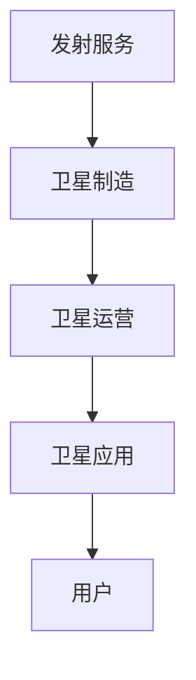

                 


# 太空经济：新兴投资领域的风险与回报

## 关键词：太空经济, 投资, 风险, 回报, 商业航天, 卫星技术, 深空探索

## 摘要：太空经济作为一个新兴的投资领域，正吸引着越来越多的资金和关注。本文从太空经济的定义、产业链、核心概念、风险分析、投资策略和案例等方面进行深入探讨，分析其潜在的回报与风险，为投资者提供有价值的参考。

---

# 第1章: 太空经济的概述

## 1.1 太空经济的定义与范围

### 1.1.1 太空经济的定义

太空经济是指与太空探索、开发和利用相关的经济活动，包括卫星通信、太空资源开发、深空探索等领域。它涵盖了从地球轨道到深空的所有经济活动。

### 1.1.2 太空经济的范围与边界

太空经济的范围包括：

- **上游产业**：火箭制造、卫星制造、发射服务。
- **中游产业**：卫星运营、地面设备制造。
- **下游产业**：卫星应用（通信、导航、遥感）。

### 1.1.3 太空经济的核心要素

- **技术**：核心技术包括火箭技术、卫星技术、通信技术。
- **市场**：市场需求包括政府需求、商业需求。
- **政策**：政策支持包括国家航天政策、国际法律。

---

## 1.2 太空经济的发展历程

### 1.2.1 太空经济的起源

太空经济的起源可以追溯到20世纪50年代，苏联发射了第一颗人造卫星“斯普特尼克1号”，标志着太空探索的开始。

### 1.2.2 太空经济的演变

- **政府主导阶段**：20世纪50年代至90年代，主要由政府主导太空探索。
- **商业化阶段**：21世纪以来，商业航天公司如SpaceX、Blue Origin等崛起，推动太空经济的商业化。

### 1.2.3 当前太空经济的现状

- **技术进步**： reusable rockets（可重复使用火箭）技术的发展降低了发射成本。
- **市场需求增长**：卫星互联网、太空旅游等市场需求迅速增长。

---

## 1.3 太空经济的产业链

### 1.3.1 产业链的上游环节

- **火箭制造**：SpaceX的猎鹰9号火箭。
- **卫星制造**：波音、洛克希德·马丁等公司。

### 1.3.2 产业链的中游环节

- **卫星运营**：铱星通信、全球星系统。
- **地面设备制造**：天线、终端设备。

### 1.3.3 产业链的下游环节

- **卫星应用**：通信、导航、遥感。
- **太空旅游**：维珍银河、蓝色起源等公司。

---

## 1.4 太空经济的未来趋势

### 1.4.1 技术进步对太空经济的影响

- **人工智能**：用于太空任务的自动化控制。
- **新材料**：轻质材料用于航天器制造。

### 1.4.2 市场需求的变化

- **太空旅游**：市场需求增长迅速。
- **卫星互联网**：全球互联网覆盖的需求。

### 1.4.3 政策环境的演变

- **国际合作**：《外空法》、《月球协定》等国际法律的完善。

---

## 1.5 本章小结

本章从太空经济的定义、发展历程、产业链和未来趋势四个方面进行了概述，为后续分析奠定了基础。

---

# 第2章: 太空经济的核心概念

## 2.1 太空经济的核心要素

### 2.1.1 技术创新

技术创新是太空经济发展的核心驱动力，例如 reusable rockets 和卫星互联网技术。

### 2.1.2 市场需求

市场需求包括政府需求和商业需求，例如卫星通信、太空旅游。

### 2.1.3 政策支持

政策支持包括政府资金投入和国际法律的完善。

---

## 2.2 太空经济的产业链分析

### 2.2.1 上游产业的关键环节

上游产业包括火箭制造和卫星制造，技术门槛高，成本高昂。

### 2.2.2 中游产业的核心技术

中游产业包括卫星运营和地面设备制造，技术相对成熟，但市场竞争激烈。

### 2.2.3 下游产业的应用场景

下游产业包括卫星应用和太空旅游，市场需求多样化。

---

## 2.3 太空经济的商业模式

### 2.3.1 政府主导的模式

政府主导的模式主要通过政府合同和补贴支持太空经济的发展。

### 2.3.2 商业驱动的模式

商业驱动的模式通过市场化运作，例如SpaceX的可重复使用火箭技术降低了发射成本。

### 2.3.3 公私合作的模式

公私合作模式结合了政府和企业的优势，例如NASA与SpaceX的合作。

---

## 2.4 太空经济的风险与挑战

### 2.4.1 技术风险

技术风险包括火箭发射失败和卫星技术故障。

### 2.4.2 市场风险

市场需求不足或竞争激烈可能导致企业亏损。

### 2.4.3 政策风险

政策变化可能影响太空经济的发展。

---

## 2.5 本章小结

本章分析了太空经济的核心要素、产业链、商业模式和风险挑战，为后续分析提供了理论基础。

---

# 第3章: 太空经济的风险评估

## 3.1 风险评估的方法

### 3.1.1 定性分析法

定性分析法通过分析风险的性质和影响进行评估。

### 3.1.2 定量分析法

定量分析法通过数学模型和数据进行风险量化。

### 3.1.3 综合评估法

综合评估法结合定性分析和定量分析，全面评估风险。

---

## 3.2 风险的分类与影响

### 3.2.1 技术风险

技术风险包括火箭发射失败和卫星技术故障。

### 3.2.2 市场风险

市场需求不足或竞争激烈可能导致企业亏损。

### 3.2.3 政策风险

政策变化可能影响太空经济的发展。

### 3.2.4 财务风险

财务风险包括资金链断裂和投资回报不确定。

---

## 3.3 风险的量化与管理

### 3.3.1 风险的量化指标

- **技术风险**：技术失败的概率和损失。
- **市场风险**：市场需求的变化和竞争程度。
- **政策风险**：政策变化的概率和影响。

### 3.3.2 风险的管理策略

- **技术风险**：加强技术研发和风险管理。
- **市场风险**：多元化市场和产品线。
- **政策风险**：关注政策变化和合规性。

### 3.3.3 风险的监控与预警

通过实时监控和预警系统，及时发现和应对风险。

---

## 3.4 本章小结

本章从风险分类、量化和管理策略三个方面分析了太空经济的风险，为投资决策提供了依据。

---

# 第4章: 太空经济的投资策略与案例分析

## 4.1 投资策略的制定

### 4.1.1 投资目标的确定

根据投资者的财务状况和风险偏好，确定投资目标。

### 4.1.2 投资组合的优化

通过多元化投资降低风险，例如同时投资卫星制造和卫星应用。

### 4.1.3 风险控制的措施

制定风险控制计划，例如设定止损点。

---

## 4.2 投资案例分析

### 4.2.1 成功案例：SpaceX

SpaceX通过 reusable rockets 技术降低了发射成本，成为太空经济的领导者。

### 4.2.2 失败案例：铱星通信

铱星通信因市场需求不足和成本过高而破产。

---

## 4.3 本章小结

本章通过投资策略的制定和实际案例分析，为投资者提供了参考。

---

# 附录

## 附录A: 相关公式与模型

### 1. 投资回报率计算公式

$$ \text{投资回报率} = \frac{\text{投资收益} - \text{初始投资}}{\text{初始投资}} \times 100\% $$

### 2. 风险评估模型

$$ R = \sum_{i=1}^{n} w_i \cdot r_i $$

其中，$w_i$ 是第 $i$ 个风险因素的权重，$r_i$ 是第 $i$ 个风险因素的风险值。

---

## 附录B: 系统架构图



---

## 附录C: 项目实战代码

```python
import numpy as np

def calculate_risk(weights, risks):
    return np.dot(weights, risks)

def calculate_return(weights, returns):
    return np.dot(weights, returns)

# 示例数据
weights = [0.3, 0.4, 0.3]
risks = [0.2, 0.5, 0.1]
returns = [0.1, 0.2, 0.15]

risk = calculate_risk(weights, risks)
return_ = calculate_return(weights, returns)

print(f"风险值为：{risk}")
print(f"投资回报率为：{return_}")
```

---

## 附录D: 参考文献

1. 美国国家航空航天局(NASA)官网。
2. SpaceX官方网站。
3. 麦肯锡关于太空经济的报告。

---

# 结语

太空经济作为新兴的投资领域，具有巨大的潜力和挑战。投资者需要全面评估风险和回报，制定合理的投资策略。未来，随着技术进步和市场需求的增加，太空经济将更加繁荣。

