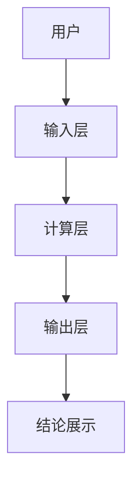
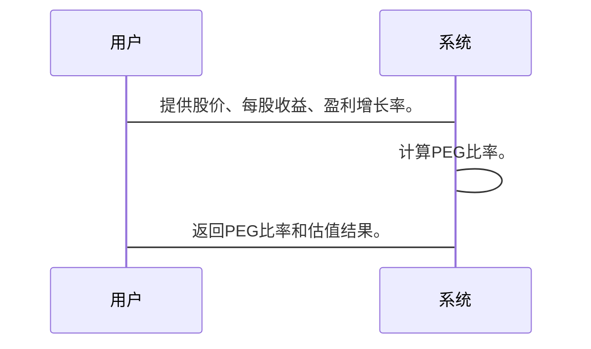

                 


# 如何利用PEG比率进行企业估值

## 关键词：
- PEG比率, 企业估值, 投资分析, 股票估值, 盈利增长率

## 摘要：
本文深入探讨如何利用PEG比率进行企业估值，从基本概念到实际应用，结合理论分析和实战案例，系统性地解析PEG比率的计算方法及其在投资决策中的应用价值。文章旨在帮助读者理解PEG比率的核心原理，并通过实际案例分析，掌握如何运用PEG比率进行企业估值，做出更明智的投资决策。

---

## 第一部分：PEG比率的基础知识

### 第1章：PEG比率的定义与背景

#### 1.1 PEG比率的基本概念

- **PEG比率的定义**  
  PEG（Price Earnings Growth）比率是市盈率（P/E）与盈利增长率（G）的比率。公式为：  
  $$ \text{PEG} = \frac{\text{市盈率（P/E）}}{\text{盈利增长率（G）}} $$  

- **市盈率（P/E）的定义**  
  市盈率是股票的市场价格与每股收益的比率，公式为：  
  $$ \text{P/E} = \frac{\text{股价}}{\text{每股收益}} $$  

- **盈利增长率（G）的定义**  
  盈利增长率是公司净利润的年增长率，通常基于过去几年的平均增长率。

- **PEG比率的意义**  
  PEG比率衡量了股票价格相对于其盈利增长率的合理性。当PEG < 1时，股票可能被低估；当PEG = 1时，股票价格合理；当PEG > 1时，股票可能被高估。

---

### 第2章：企业估值的基本概念

#### 2.1 企业估值的定义

- **企业估值**  
  企业估值是指对企业的整体价值进行评估的过程，通常包括股权价值和债权价值的评估。

#### 2.2 企业估值的主要方法

- **相对估值法**  
  - 基于可比公司分析，使用市盈率、市净率等指标。
- **绝对估值法**  
  - 基于 discounted cash flow（DCF）模型，计算企业内在价值。
- **其他方法**  
  - 股权自由现金流模型、重置成本法等。

---

## 第二部分：PEG比率的理论与计算

### 第3章：PEG比率的计算方法

#### 3.1 PEG比率的计算公式

- **公式推导**  
  $$ \text{PEG} = \frac{\text{P/E}}{G} $$  
  其中，P/E是市盈率，G是盈利增长率。

- **示例计算**  
  某公司股价为30元，每股收益为5元，盈利增长率为10%。  
  则P/E = 30 / 5 = 6，PEG = 6 / 10% = 6。

---

### 第4章：PEG比率与其他估值指标的对比

#### 4.1 市盈率（P/E）

- **优点**  
  - 简单易懂，广泛使用。
- **缺点**  
  - 未考虑公司的盈利增长率，可能高估或低估股票价值。

#### 4.2 市净率（P/B）

- **优点**  
  - 更适合金融和制造业等资产密集型行业。
- **缺点**  
  - 未考虑盈利增长，且净资产价值可能受会计政策影响。

#### 4.3 市销率（P/S）

- **优点**  
  - 适用于收入不稳定或亏损的公司。
- **缺点**  
  - 未考虑成本和利润，适用性有限。

---

## 第三部分：PEG比率在企业估值中的应用

### 第5章：企业估值的系统架构

#### 5.1 问题场景介绍

- **目标**  
  构建一个基于PEG比率的企业估值系统，帮助投资者快速评估股票价值。

#### 5.2 系统功能设计

- **输入**  
  - 股价、每股收益、盈利增长率。
- **输出**  
  - PEG比率、股票估值结论。

#### 5.3 系统架构设计



#### 5.4 接口设计

- **输入接口**  
  - 股价、每股收益、盈利增长率。
- **输出接口**  
  - PEG比率、估值结果。

#### 5.5 交互流程



---

### 第6章：实战案例分析

#### 6.1 环境安装

- **工具**  
  - Python编程语言。
  - 数据分析库（Pandas、NumPy）。

#### 6.2 代码实现

```python
def calculate_peg(pe_ratio, growth_rate):
    return pe_ratio / growth_rate

# 示例数据
pe_ratio = 15
growth_rate = 0.08

peg = calculate_peg(pe_ratio, growth_rate)
print(f"PEG比率: {peg}")
```

#### 6.3 案例分析

- **案例公司**：假设某公司股价为40元，每股收益为5元，盈利增长率为8%。  
  P/E = 40 / 5 = 8，PEG = 8 / 0.08 = 10。  
  由于PEG > 1，该股票可能被高估。

---

## 第四部分：总结与注意事项

### 第7章：总结与注意事项

#### 7.1 最佳实践

- **结合其他指标**  
  - 仅依赖PEG可能不够全面，建议结合市盈率、市净率等指标。
- **考虑行业特性**  
  - 不同行业的PEG合理范围不同，需根据行业特点调整。

#### 7.2 小结

- PEG比率是一种有效的估值工具，但需结合实际情况灵活运用。
- 投资者应根据市场环境和公司基本面调整估值策略。

---

### 第8章：拓展阅读

- 建议阅读书籍《投资学基础》和《价值投资实战》。

---

通过以上内容，读者可以系统地了解PEG比率的理论与应用，掌握如何利用PEG比率进行企业估值，做出更明智的投资决策。

