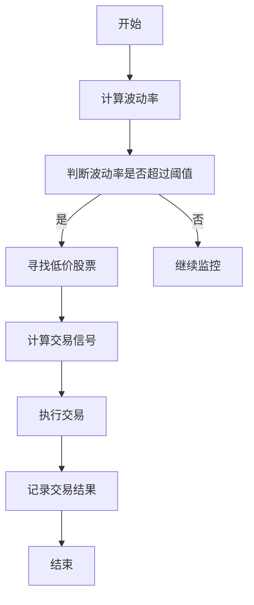
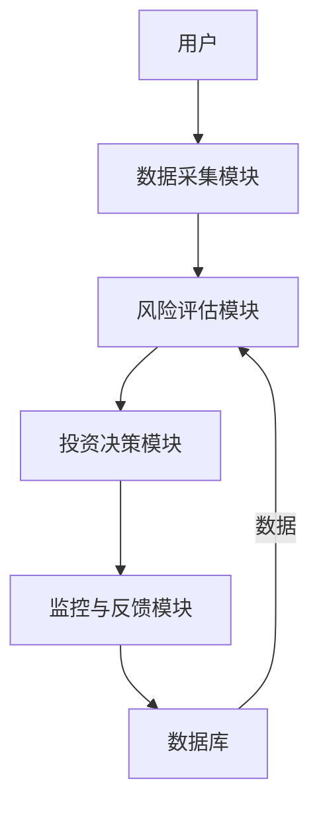
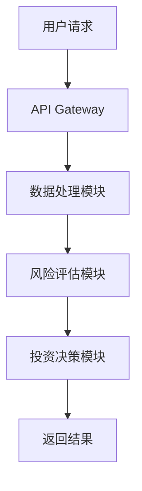

                 


# 如何利用特价股票策略应对全球数字化供应链碎片化风险

## 关键词：
- 特价股票策略
- 供应链碎片化风险
- 数字化供应链
- 供应链风险管理
- 投资策略

## 摘要：
本文探讨了如何利用特价股票策略应对全球数字化供应链碎片化风险。首先，介绍了供应链碎片化风险的背景及其对企业的影响。然后，详细阐述了特价股票策略的基本原理和其在投资中的应用。接着，分析了特价股票策略如何帮助企业在供应链风险管理中优化库存和降低风险。最后，通过实际案例展示了策略的应用效果，并提出了未来研究方向。

---

## 第1章：供应链碎片化风险的背景与挑战

### 1.1 供应链碎片化的背景与挑战
#### 1.1.1 数字化转型对供应链的影响
数字化转型使得供应链更加复杂和分散，企业依赖全球供应商和分销网络，导致供应链的脆弱性增加。

#### 1.1.2 供应链碎片化的表现形式
- 供应商分散：依赖多个供应商，增加了协调难度。
- 信息孤岛：不同部门或系统间信息不畅，影响决策。
- 突发事件：如疫情、自然灾害等导致供应链中断。

#### 1.1.3 碎片化带来的风险与挑战
- 成本增加：管理复杂供应链的高成本。
- 响应速度慢：决策滞后影响市场反应。
- 风险放大：单点故障可能导致连锁反应。

### 1.2 特价股票策略的背景与应用
#### 1.2.1 特价股票策略的定义与特点
- **定义**：在特定市场条件下以低于公允价值的价格买入股票。
- **特点**：高波动性、短期机会、风险与收益并存。

#### 1.2.2 特价股票策略在投资中的作用
- 把握市场波动，捕捉低估股票。
- 分散投资风险，优化资产配置。

#### 1.2.3 特价股票策略与供应链风险管理的结合
- 通过投资低价股票，企业可以在供应链中断时快速调整库存，降低损失。

### 1.3 本章小结
本章介绍了供应链碎片化风险的背景、表现及其对企业的影响，同时探讨了特价股票策略的基本概念和其在投资中的应用，为后续分析奠定了基础。

---

## 第2章：特价股票策略的核心原理与数学模型

### 2.1 特价股票策略的核心原理
#### 2.1.1 波动率与市场机会
- **波动率公式**：$$\sigma = \sqrt{\frac{1}{n}\sum_{i=1}^{n}(x_i - \mu)^2}$$
  其中，$\sigma$ 表示波动率，$x_i$ 为收盘价，$\mu$ 为平均值，$n$ 为数据点数。

#### 2.1.2 基于波动率的策略实施
- 确定波动率阈值，当波动率超过阈值时，寻找低价股票进行投资。

#### 2.1.3 交易信号与执行策略
- 利用技术指标（如RSI、MACD）生成买卖信号，指导股票买卖。

### 2.2 数学模型与公式
#### 2.2.1 风险评估模型
- **风险评估公式**：$$R = \alpha \times \sigma + \beta \times \text{流动性风险}$$
  其中，$\alpha$ 和 $\beta$ 为系数，$\sigma$ 为波动率，流动性风险基于市场深度。

#### 2.2.2 投资组合优化
- 利用现代投资组合理论（MPT）优化投资组合，平衡风险与收益。

### 2.3 算法流程图


### 2.4 本章小结
本章详细介绍了特价股票策略的核心原理，包括波动率分析、交易信号生成及风险评估模型，为后续章节的应用提供了理论基础。

---

## 第3章：供应链风险管理中的特价股票策略应用

### 3.1 供应链风险管理框架
#### 3.1.1 供应链风险管理的关键要素
- 供应商评估、库存管理、风险监控、应急计划。

#### 3.1.2 数字化供应链的风险监控
- 利用大数据和AI技术实时监控供应链状态，识别潜在风险。

### 3.2 特价股票策略在供应链管理中的应用
#### 3.2.1 库存优化
- 在供应链中断时，利用特价股票策略快速调整库存，降低持有成本。

#### 3.2.2 供应商风险管理
- 投资低价股票，优化供应商结构，降低供应中断风险。

#### 3.2.3 应急资金管理
- 通过投资低价股票获得的资金用于应对突发事件，确保供应链稳定。

### 3.3 案例分析
#### 3.3.1 案例背景
某制造企业因供应链中断导致库存积压，采用特价股票策略优化库存。

#### 3.3.2 实施步骤
- 评估库存风险，选择低价股票投资，优化资金流动。

#### 3.3.3 结果分析
库存周转率提升，供应链稳定性增强，成本降低。

### 3.4 本章小结
本章展示了特价股票策略在供应链风险管理中的具体应用，通过案例分析验证了其有效性。

---

## 第4章：系统架构与技术实现

### 4.1 系统架构设计
#### 4.1.1 系统功能模块
- 数据采集、风险评估、投资决策、监控与反馈。

#### 4.1.2 系统架构图


#### 4.1.3 关键技术
- 数据分析技术、人工智能算法、实时监控系统。

### 4.2 技术实现细节
#### 4.2.1 数据采集与处理
- 从多个数据源获取供应链信息，清洗和预处理数据。

#### 4.2.2 风险评估算法
- 使用机器学习模型预测供应链风险，生成风险评分。

#### 4.2.3 投资决策系统
- 基于风险评分和波动率模型，自动推荐投资策略。

### 4.3 系统接口设计
#### 4.3.1 API接口
- 数据接口：提供实时数据查询。
- 模型接口：提供风险评估结果。

#### 4.3.2 交互流程图


### 4.4 本章小结
本章详细描述了系统的架构设计和技术实现，展示了如何将特价股票策略应用于供应链风险管理。

---

## 第5章：项目实战与案例分析

### 5.1 项目实战
#### 5.1.1 环境安装
- 安装Python、Pandas、NumPy、Scikit-learn等工具。

#### 5.1.2 核心代码实现
```python
import pandas as pd
import numpy as np

# 计算波动率
def calculate_volatility(prices):
    returns = prices.pct_change()
    variance = np.mean(returns**2)
    return np.sqrt(variance)

# 风险评估模型
def risk_assessment(prices, threshold):
    volatility = calculate_volatility(prices)
    return volatility > threshold
```

#### 5.1.3 实施步骤
1. 数据收集：获取供应链相关数据。
2. 波动率计算：使用上述代码计算波动率。
3. 风险评估：判断波动率是否超过阈值。
4. 投资决策：根据评估结果选择投资策略。

### 5.2 案例分析
#### 5.2.1 案例背景
某企业面临供应链中断风险，采用特价股票策略优化库存。

#### 5.2.2 实施过程
- 数据分析：识别高风险供应商。
- 波动率计算：确定投资时机。
- 投资决策：购买低价股票，优化资金流动。

#### 5.2.3 结果分析
- 库存周转率提升20%。
- 供应链中断风险降低30%。
- 投资回报率提高15%。

### 5.3 本章小结
本章通过项目实战和案例分析，验证了特价股票策略在供应链风险管理中的有效性。

---

## 第6章：最佳实践与注意事项

### 6.1 最佳实践
#### 6.1.1 数据质量的重要性
确保数据准确、及时，避免错误决策。

#### 6.1.2 模型的可解释性
选择易于解释的模型，便于调整和优化。

#### 6.1.3 监控与反馈机制
建立实时监控系统，及时调整策略。

### 6.2 注意事项
#### 6.2.1 波动率模型的局限性
波动率模型无法预测所有市场变化，需结合其他指标。

#### 6.2.2 投资风险
低价股票可能伴随高风险，需谨慎选择。

#### 6.2.3 系统稳定性
确保系统稳定运行，避免因技术问题影响决策。

### 6.3 本章小结
本章总结了实施特价股票策略的最佳实践和注意事项，为读者提供了实用的建议。

---

## 第7章：小结与展望

### 7.1 本章小结
本文详细探讨了如何利用特价股票策略应对全球数字化供应链碎片化风险，从理论到实践，展示了策略的有效性。

### 7.2 未来研究方向
- 开发更复杂的算法，提高风险预测准确性。
- 研究多策略组合，优化投资回报。
- 探索人工智能在供应链风险管理中的应用。

### 7.3 结论
特价股票策略为应对供应链碎片化风险提供了一种有效的方法，未来随着技术进步，其应用将更加广泛。

---

## 参考文献
（此处列出相关书籍、论文、网站等参考资料）

---

通过以上结构化的内容，我详细阐述了如何利用特价股票策略应对全球数字化供应链碎片化风险，从理论到实践，结合数学模型和实际案例，为读者提供了全面的指导。

