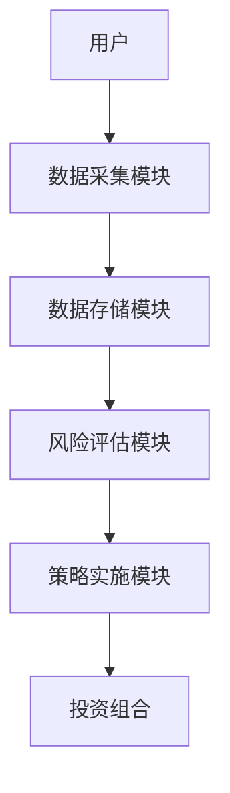
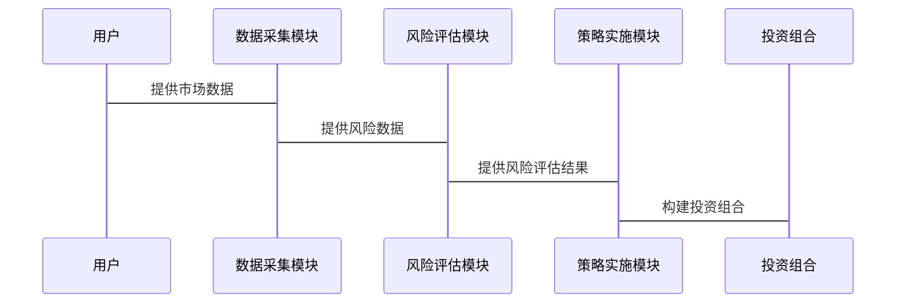

                 


# 如何利用特价股票策略应对地缘政治风险

> 关键词：特价股票策略、地缘政治风险、股票投资、风险管理、系统架构

> 摘要：地缘政治风险对股市的影响日益显著，投资者需要采用有效的策略来应对这些不确定性。本文详细探讨了如何利用特价股票策略来应对地缘政治风险，从策略的理论基础到实际应用，结合数学模型、系统架构和案例分析，为投资者提供了一套完整的解决方案。

---

# 第1章 地缘政治风险与特价股票策略的背景

## 1.1 地缘政治风险的定义与特征

地缘政治风险是指由于政治、经济和社会等外部因素的变化，导致某个地区或国家的政治不稳定，进而对全球经济和市场产生负面影响。其主要特征包括：

- **突发性**：地缘政治事件往往出人意料，难以预测。
- **广泛性**：影响范围可能覆盖多个行业和市场。
- **长期性**：某些风险可能持续多年，对市场产生深远影响。

地缘政治风险对企业的影响包括：

- **股价波动**：突发事件可能导致股价剧烈波动。
- **供应链中断**：政治冲突可能影响企业的供应链。
- **政策变化**：地缘政治事件可能导致政策变化，影响企业经营。

## 1.2 特价股票策略的定义与特点

### 1.2.1 特价股票的定义

特价股票是指那些市场价格低于其内在价值的股票。这些股票通常被认为被市场低估，具有较大的上涨潜力。

### 1.2.2 特价股票策略的核心特点

- **逆向投资**：在市场低迷时买入，市场高涨时卖出。
- **价值导向**：注重基本面分析，寻找被市场低估的股票。
- **长期投资**：注重长期价值，而非短期波动。

### 1.2.3 特价股票与传统股票投资的区别

| 特性 | 特价股票策略 | 传统股票策略 |
|------|--------------|--------------|
| 投资理念 | 价值导向，寻找低估股票 | 市场导向，关注市场趋势 |
| 投资期限 | 长期投资 | 短期交易 |
| 风险承受 | 较高 | 较低 |

## 1.3 地缘政治风险与特价股票策略的关联

### 1.3.1 地缘政治事件对股市的影响

地缘政治事件可能导致股市出现剧烈波动，某些行业或地区的股票价格可能大幅下跌。

### 1.3.2 特价股票策略在应对地缘政治风险中的作用

- **价值发现**：在地缘政治风险下，某些股票可能被市场低估，提供投资机会。
- **风险分散**：通过投资多个行业的特价股票，分散地缘政治风险的影响。

### 1.3.3 特价股票策略的优势与局限性

- **优势**：
  - 能够在市场低迷时找到被低估的股票。
  - 长期来看，投资价值型企业具有较高的回报潜力。
- **局限性**：
  - 需要较高的市场分析能力，寻找低估股票。
  - 短期内可能面临股价继续下跌的风险。

---

# 第2章 特价股票策略的核心概念与原理

## 2.1 特价股票的识别与评估

### 2.1.1 特价股票的识别标准

- **市盈率（P/E）**：市场价格与每股收益的比率，低于行业平均水平的股票可能被视为低估。
- **市净率（P/B）**：市场价格与每股净资产的比率，低于1的股票可能被视为低估。
- **股息率**：高股息率的股票可能具有较高的投资价值。

### 2.1.2 特价股票的评估方法

#### 2.1.2.1 市盈率法

$$ \text{市盈率} = \frac{\text{股价}}{\text{每股收益}} $$

如果市盈率低于行业平均水平，说明股票可能被低估。

#### 2.1.2.2 市净率法

$$ \text{市净率} = \frac{\text{股价}}{\text{每股净资产}} $$

如果市净率低于1，说明股票可能被低估。

### 2.1.3 特价股票的风险评估

- **行业风险**：某些行业可能受到地缘政治风险的影响较大。
- **公司基本面**：公司财务状况、管理团队等因素影响股票风险。

## 2.2 特价股票策略的实施步骤

### 2.2.1 确定投资目标

- **投资目标**：明确投资目标，例如长期资本增值。
- **投资期限**：确定投资的长期性。

### 2.2.2 选择合适的特价股票

- **行业分析**：选择受地缘政治风险影响较小的行业。
- **公司基本面分析**：分析公司的财务状况、管理团队等。
- **市场情绪分析**：关注市场情绪，寻找被低估的股票。

### 2.2.3 制定投资计划

- **投资组合**：构建多元化投资组合，分散风险。
- **风险管理**：设定止损点，避免过度亏损。

### 2.2.4 监控与调整投资组合

- **定期监控**：定期检查投资组合的表现。
- **调整策略**：根据市场变化调整投资策略。

---

# 第3章 地缘政治风险的来源与影响

## 3.1 地缘政治风险的来源

### 3.1.1 国际贸易摩擦

国际贸易摩擦可能导致出口限制、关税增加等，影响企业的经营。

### 3.1.2 政治动荡与政权更迭

政治动荡可能导致政策变化，影响企业的经营环境。

### 3.1.3 地缘政治冲突与战争

地缘政治冲突可能导致供应链中断、资源短缺等，影响市场。

## 3.2 地缘政治风险对股市的影响

### 3.2.1 市场波动性增加

地缘政治事件可能导致股市波动性增加，股价可能出现剧烈波动。

### 3.2.2 特定行业或地区的股票价格波动

某些行业或地区的股票可能受到地缘政治风险的直接影响，股价波动较大。

### 3.2.3 投资者情绪的影响

地缘政治风险可能导致投资者情绪恶化，影响市场的整体表现。

## 3.3 地缘政治风险的预测与评估

### 3.3.1 风险预测模型的建立

- **模型选择**：使用时间序列分析、回归分析等方法。
- **数据来源**：包括历史数据、新闻媒体、政府公告等。

### 3.3.2 风险评估的指标与方法

- **指标**：包括波动率、相关性、市场情绪等。
- **方法**：包括情景分析、压力测试等。

### 3.3.3 风险预测的准确性与局限性

- **准确性**：地缘政治事件的不可预测性可能导致模型准确性有限。
- **局限性**：模型可能无法捕捉到所有影响因素。

---

# 第4章 特价股票策略在地缘政治风险应对中的应用

## 4.1 确定投资目标与策略

### 4.1.1 投资目标的设定

- **长期目标**：实现资本增值。
- **短期目标**：应对地缘政治风险带来的市场波动。

### 4.1.2 投资策略的选择

- **价值投资**：寻找被低估的股票。
- **分散投资**：通过多元化投资分散风险。

## 4.2 选择合适的特价股票

### 4.2.1 行业分析与选择

- **行业选择**：选择受地缘政治风险影响较小的行业，例如科技、消费等行业。
- **行业评估**：分析行业前景、竞争格局等。

### 4.2.2 公司基本面分析

- **财务状况**：分析公司的盈利能力、资产负债情况等。
- **管理团队**：评估公司的管理团队能力。

### 4.2.3 市场情绪与流动性分析

- **市场情绪**：关注市场的整体情绪，寻找被低估的股票。
- **流动性**：选择流动性较高的股票，避免流动性风险。

## 4.3 制定投资计划与风险管理

### 4.3.1 投资组合的构建

- **多元化投资**：通过投资多个行业和地区的股票，分散风险。
- **权重分配**：根据风险承受能力分配投资权重。

### 4.3.2 风险管理策略

- **止损点**：设定止损点，避免过度亏损。
- **仓位管理**：根据市场情况调整仓位，避免集中投资。

### 4.3.3 投资计划的调整与优化

- **定期评估**：定期评估投资计划的执行情况。
- **动态调整**：根据市场变化和风险评估结果调整投资策略。

## 4.4 监控与调整投资组合

### 4.4.1 定期监控投资组合的表现

- **绩效评估**：定期评估投资组合的绩效。
- **市场分析**：分析市场的变化，识别新的投资机会。

### 4.4.2 根据市场变化调整投资策略

- **策略调整**：根据市场变化调整投资策略。
- **风险管理**：根据市场变化调整风险管理策略。

### 4.4.3 风险事件后的应对

- **事件后分析**：分析风险事件的影响，评估投资组合的表现。
- **策略优化**：根据事件后的分析结果优化投资策略。

---

# 第5章 特价股票策略的系统架构与实现

## 5.1 问题场景介绍

- **问题**：地缘政治风险导致股市波动，投资者需要一种有效的策略来应对这些风险。
- **目标**：构建一个基于特价股票策略的投资系统，帮助投资者在地缘政治风险下实现稳健投资。

## 5.2 系统功能设计

### 5.2.1 数据采集模块

- **数据来源**：包括股票价格、公司财务数据、新闻数据等。
- **数据预处理**：清洗数据，提取有用信息。

### 5.2.2 风险评估模块

- **风险预测**：使用数学模型预测地缘政治风险。
- **风险评估**：评估股票的风险等级。

### 5.2.3 策略实施模块

- **策略选择**：根据风险评估结果选择合适的投资策略。
- **投资组合构建**：根据策略选择合适的股票，构建投资组合。

## 5.3 系统架构设计



## 5.4 系统接口设计

- **输入接口**：接收用户的投资需求和市场数据。
- **输出接口**：输出投资组合和风险管理建议。

## 5.5 系统交互设计



---

# 第6章 项目实战：基于特价股票策略的投资系统实现

## 6.1 环境安装

- **工具安装**：安装Python、Pandas、Matplotlib等工具。
- **数据源**：获取股票数据，例如使用Yahoo Finance API。

## 6.2 系统核心实现源代码

### 6.2.1 数据采集模块

```python
import pandas as pd
import requests

def get_stock_data(ticker):
    url = f"https://query1.finance.yahoo.com/v8/finance/chart/{ticker}"
    response = requests.get(url)
    data = response.json()
    df = pd.DataFrame(data['chart']['result'][0]['indicators']['quote'][0])
    return df
```

### 6.2.2 风险评估模块

```python
import numpy as np

def calculate_risk(ticker, df):
    # 计算波动率
    df['return'] = np.log(df['close'] / df['close'].shift(1))
    volatility = df['return'].std()
    return volatility
```

### 6.2.3 策略实施模块

```python
def implement_strategy(ticker, df, threshold=0.1):
    # 计算市盈率
    df['PE'] = df['close'] / df['earnings_per_share']
    # 筛选PE低于阈值的股票
    undervalued_stocks = df[df['PE'] < threshold]
    return undervalued_stocks
```

## 6.3 代码应用解读与分析

- **数据采集**：从Yahoo Finance获取股票数据。
- **风险评估**：计算股票的波动率，评估风险。
- **策略实施**：筛选市盈率低于阈值的股票，构建投资组合。

## 6.4 实际案例分析

### 6.4.1 案例背景

假设地缘政治风险导致某行业股票价格大幅下跌，寻找该行业的特价股票。

### 6.4.2 数据分析

- **数据来源**：某行业的股票数据。
- **数据分析**：计算市盈率、市净率等指标，筛选低估股票。

### 6.4.3 投资决策

- **投资组合构建**：选择低估股票，构建投资组合。
- **风险管理**：设定止损点，避免过度亏损。

## 6.5 项目小结

- **成功经验**：通过数学模型和系统架构，实现了基于特价股票策略的投资系统。
- **经验教训**：地缘政治风险具有不确定性，模型需要不断优化。

---

# 第7章 最佳实践、小结与注意事项

## 7.1 最佳实践

- **持续学习**：关注地缘政治风险的变化，及时调整投资策略。
- **风险管理**：设定止损点，避免过度亏损。
- **分散投资**：通过多元化投资分散风险。

## 7.2 小结

本文详细探讨了如何利用特价股票策略应对地缘政治风险，从理论到实践，结合数学模型和系统架构，为投资者提供了一套完整的解决方案。

## 7.3 注意事项

- **风险提示**：投资有风险，需谨慎决策。
- **模型局限**：数学模型可能无法捕捉所有影响因素，需结合实际情况使用。

---

# 参考文献

1. 书籍：《投资学》
2. 网站：Yahoo Finance API
3. 学术论文：《地缘政治风险对股市的影响》

---

通过以上步骤，您可以系统地理解和实现基于特价股票策略的投资系统，以应对地缘政治风险带来的挑战。

