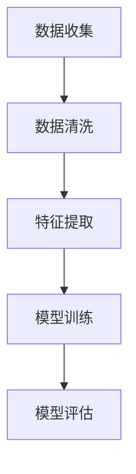
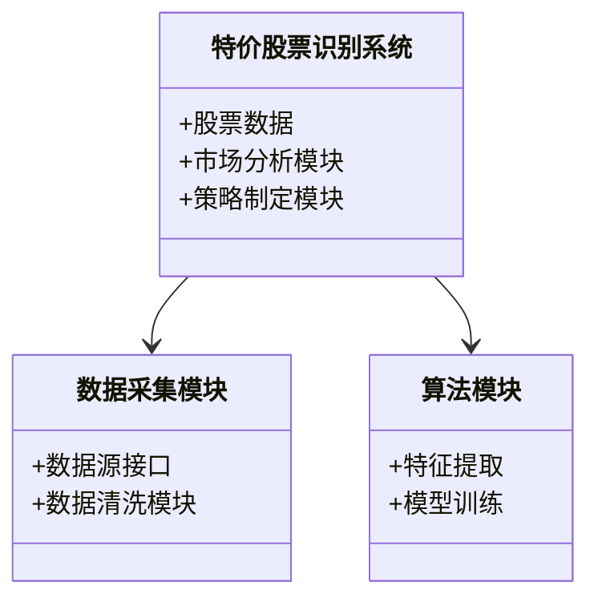
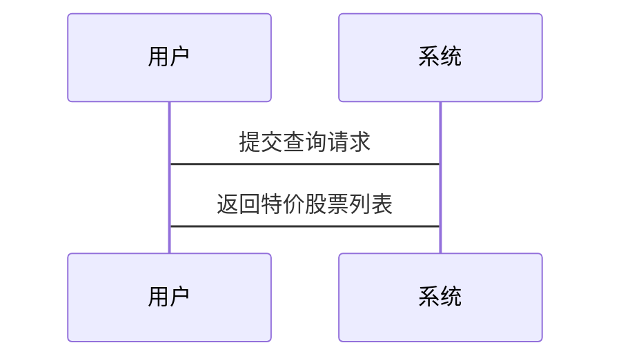

                 


# 如何利用特价股票策略应对市场流动性风险

> 关键词：特价股票，流动性风险，投资策略，算法，数据分析

> 摘要：本文详细探讨了如何利用特价股票策略应对市场流动性风险。通过分析市场流动性风险的基本概念和特价股票的识别方法，结合数据分析和算法模型，提出了一种基于特价股票策略的投资方法，以降低市场流动性风险对投资组合的影响。文章还详细介绍了算法的实现过程，并通过案例分析验证了策略的有效性。

---

# 第一部分: 特价股票策略与市场流动性风险概述

## 第1章: 市场流动性风险与特价股票策略

### 1.1 市场流动性风险的基本概念

#### 1.1.1 什么是市场流动性风险
市场流动性风险是指在金融市场中，由于交易量不足、价格波动剧烈或缺乏买方/卖方而导致资产难以以合理价格迅速变现的风险。这种风险通常在市场下跌或恐慌性交易中表现得尤为明显。

#### 1.1.2 流动性风险的来源与表现形式
流动性风险的主要来源包括市场波动、交易量下降、投资者情绪变化以及宏观经济因素等。其表现形式包括资产价格大幅波动、买卖价差扩大、订单深度不足等。

#### 1.1.3 流动性风险对企业的影响
流动性风险对企业的影响主要体现在资产贬值、融资成本上升、资本流动受限等方面。特别是在市场流动性不足的情况下，企业可能面临难以及时变现资产或获得资金支持的问题。

### 1.2 特价股票策略的核心概念

#### 1.2.1 特价股票的定义与特征
特价股票通常指市场价格显著低于其内在价值的股票。其特征包括低市盈率（P/E）、低市净率（P/B）以及高股息率等。

#### 1.2.2 特价股票策略的应用场景
特价股票策略适用于市场低迷、投资者情绪低落、市场流动性不足等情况。在这种情况下，投资者可以通过购买被市场低估的股票，等待市场恢复时获利。

#### 1.2.3 特价股票策略与市场流动性风险的关系
在市场流动性风险较高的情况下，特价股票策略可以帮助投资者在市场底部布局，通过持有低估资产来规避流动性风险带来的资产损失。

---

# 第二部分: 特价股票策略的核心概念与原理

## 第2章: 特价股票识别的核心原理

### 2.1 特价股票识别的关键指标

#### 2.1.1 市盈率（P/E）分析
市盈率是衡量股票估值的重要指标，公式为：
$$ P/E = \frac{\text{股价}}{\text{每股收益}} $$

#### 2.1.2 市净率（P/B）分析
市净率是衡量股票价值的另一个重要指标，公式为：
$$ P/B = \frac{\text{股价}}{\text{每股净资产}} $$

#### 2.1.3 股息率（Dividend Yield）分析
股息率是衡量股票分红能力的指标，公式为：
$$ \text{股息率} = \frac{\text{每股股息}}{\text{股价}} $$

### 2.2 特价股票识别的数学模型

#### 2.2.1 市盈率计算公式
$$ P/E = \frac{\text{股价}}{\text{每股收益}} $$

#### 2.2.2 市净率计算公式
$$ P/B = \frac{\text{股价}}{\text{每股净资产}} $$

### 2.3 特价股票识别的算法流程



### 2.4 本章小结

---

# 第三部分: 特价股票策略在市场流动性风险中的应用

## 第3章: 市场流动性风险下的特价股票策略

### 3.1 流动性风险对股票价格的影响

#### 3.1.1 流动性不足对股票价格的冲击
当市场流动性不足时，投资者可能需要以更低的价格出售资产，导致资产价格进一步下跌。

#### 3.1.2 流动性过剩对股票价格的稳定作用
高流动性可以减少买卖价差，提高市场稳定性。

### 3.2 特价股票策略在流动性风险管理中的作用

#### 3.2.1 特价股票策略如何缓解流动性风险
通过购买低估资产，投资者可以在市场流动性不足时避免资产贬值，同时在市场恢复时获得超额收益。

#### 3.2.2 特价股票策略在不同市场环境下的应用
在市场流动性充裕时，投资者可以利用特价股票策略进行长期投资；在市场流动性不足时，该策略可以帮助投资者规避风险。

---

## 第4章: 系统分析与架构设计

### 4.1 问题场景介绍
在市场流动性风险加剧的情况下，投资者需要一个高效、可靠的系统来识别特价股票并制定投资策略。

### 4.2 系统功能设计



### 4.3 系统架构设计


### 4.4 接口设计与交互



---

## 第5章: 项目实战

### 5.1 环境安装
需要安装Python、Pandas、NumPy、Scikit-learn等工具。

### 5.2 核心代码实现

```python
import pandas as pd
import numpy as np

# 数据预处理
data = pd.read_csv('stock_data.csv')
data = data.dropna()

# 特征提取
features = data[['P/E', 'P/B', '股息率']]
target = data['是否特价股票']

# 模型训练
from sklearn.tree import DecisionTreeClassifier
model = DecisionTreeClassifier()
model.fit(features, target)

# 预测与评估
预测结果 = model.predict(features)
print(预测结果)
```

### 5.3 代码解读与分析
上述代码展示了如何利用Python进行数据预处理、特征提取和模型训练，最终实现特价股票的识别。

### 5.4 案例分析
通过具体案例分析，验证特价股票策略在市场流动性风险中的有效性。

### 5.5 项目总结

---

## 第6章: 总结与展望

### 6.1 总结
本文详细探讨了如何利用特价股票策略应对市场流动性风险，结合数据分析和算法模型，提出了有效的投资策略。

### 6.2 未来研究方向
未来可以进一步研究市场流动性风险的其他影响因素，优化特价股票识别算法，并探索更多投资策略。

### 6.3 最佳实践 tips
在实际投资中，建议投资者结合市场环境和自身风险承受能力，灵活运用特价股票策略。

### 6.4 注意事项
投资者需注意市场波动风险，合理配置资产，避免过度依赖单一策略。

### 6.5 拓展阅读
推荐阅读相关领域的书籍和论文，深入理解市场流动性风险和投资策略的最新研究成果。

---

通过以上结构和内容安排，本文系统地介绍了如何利用特价股票策略应对市场流动性风险，为投资者提供了理论支持和实践指导。

