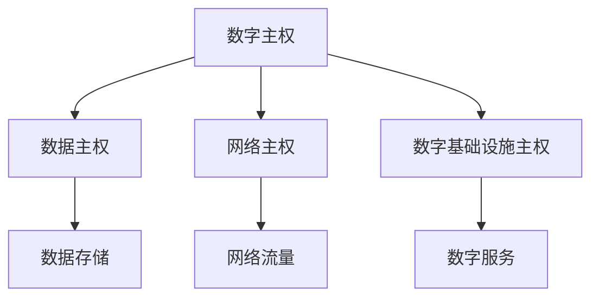

                 


# 如何利用特价股票策略应对数字主权风险

> 关键词：数字主权风险，特价股票策略，风险管理，算法设计，系统架构

> 摘要：本文探讨了数字主权风险的概念及其对股票市场的影响，分析了特价股票策略的原理和应用，并结合算法设计和系统架构，提出了利用特价股票策略应对数字主权风险的具体方法。文章通过实际案例和最佳实践，为读者提供了一套完整的解决方案。

---

# 第1章: 数字主权风险概述

## 1.1 数字主权风险的定义与背景

### 1.1.1 数字主权的定义

数字主权是指一个国家对本国数字资源、数据和网络的自主控制和管理能力。它强调数据的本土化、安全性和独立性，是国家在数字化时代的核心竞争力。

### 1.1.2 数字主权风险的来源

数字主权风险主要来源于以下几个方面：
1. **数据泄露**：由于黑客攻击或内部疏忽，导致敏感数据外泄。
2. **网络攻击**：针对关键信息基础设施的攻击可能导致国家数字资源的损失。
3. **技术依赖**：过度依赖外国技术和服务可能威胁国家的数字主权。
4. **政策风险**：国际政策变化或贸易摩擦可能影响数字资源的流通和使用。

### 1.1.3 数字主权风险的现状与趋势

随着全球数字化的推进，数字主权风险日益凸显。各国纷纷加强数据立法，推动本地化数据存储和处理，以确保数字主权的实现。

## 1.2 特价股票策略的背景

### 1.2.1 特价股票的定义

特价股票是指在特定市场环境下，由于市场波动或公司基本面变化，价格被暂时压低的股票。这些股票通常具有较高的潜在回报，但伴随着较高的风险。

### 1.2.2 特价股票策略的应用场景

特价股票策略适用于以下场景：
1. **市场波动**：在市场下跌时，一些优质股票可能被错杀，形成特价机会。
2. **行业调整**：某个行业因政策或经济周期调整，导致相关股票价格下跌。
3. **公司重组**：公司合并或重组过程中，股价可能大幅波动，形成特价机会。

### 1.2.3 特价股票策略与数字主权风险的关系

数字主权风险可能导致市场波动，从而为特价股票策略提供机会。例如，因政策变化导致某些股票价格下跌，投资者可以通过特价股票策略获利。

## 1.3 数字主权风险与特价股票策略的关联

### 1.3.1 数字主权风险对股票市场的冲击

数字主权风险可能导致市场恐慌，引发抛售潮，进而导致股价下跌。例如，某国出台数据本地化政策，可能导致依赖海外数据存储的公司股价下跌。

### 1.3.2 特价股票策略在应对数字主权风险中的作用

特价股票策略可以帮助投资者在市场下跌中找到被低估的股票，从而在数字主权风险中获利。例如，某公司因政策影响股价下跌，但基本面良好，投资者可以通过特价股票策略抄底。

### 1.3.3 特价股票策略的潜在风险与机会

特价股票策略的风险在于市场可能继续下跌，导致股价进一步下跌。但机会在于市场反转时，股价可能大幅回升，带来丰厚回报。

---

# 第2章: 数字主权风险的核心概念

## 2.1 数字主权的核心要素

### 2.1.1 数据主权

数据主权是指一个国家对其数据的控制权，包括数据的生成、存储、处理和使用。数据主权是数字主权的核心内容。

### 2.1.2 网络主权

网络主权是指一个国家对本国网络空间的管理权，包括网络基础设施、域名系统和网络安全等方面。

### 2.1.3 数字基础设施主权

数字基础设施主权是指一个国家对本国数字基础设施的控制权，包括数据中心、云计算平台和5G网络等。

## 2.2 数字主权风险的属性特征对比

### 2.2.1 数字主权风险的特征分析

| 特性       | 数字主权风险                     |
|------------|---------------------------------|
| 影响范围     | 影响国家安全和经济发展           |
| 突发性       | 可能由突发事件引发               |
| 隐蔽性       | 难以察觉，可能通过隐蔽手段攻击   |
| 持续性       | 长期性，需要持续防护             |

### 2.2.2 特价股票策略的特征分析

| 特性       | 特价股票策略                     |
|------------|---------------------------------|
| 短期性       | 通常基于短期市场波动             |
| 高风险       | 投资风险较高，可能面临本金损失   |
| 机会性       | 存在快速获利的机会               |

### 2.2.3 数字主权风险与特价股票策略的对比分析

数字主权风险是系统性风险，影响广泛；特价股票策略是局部性策略，针对特定股票。数字主权风险需要长期应对；特价股票策略适合短期操作。

## 2.3 数字主权风险的ER实体关系图



---

# 第3章: 特价股票策略的核心算法原理

## 3.1 特价股票策略的算法原理

### 3.1.1 算法概述

特价股票策略基于技术分析和基本面分析，寻找被低估的股票。算法通过分析市场数据，识别潜在的特价机会。

### 3.1.2 算法步骤

1. 数据采集：获取股票的历史价格、成交量等数据。
2. 数据分析：计算技术指标（如MACD、RSI）和基本面指标（如市盈率、市净率）。
3. 策略执行：根据预设条件（如股价跌破均线）买入股票。
4. 风险管理：设置止损点和止盈点，控制风险。

### 3.1.3 算法实现的数学模型

#### 简单移动平均线（SMA）

$$ SMA_n = \frac{1}{n} \sum_{i=1}^{n} P_i $$

其中，\( P_i \) 是第 \( i \) 天的价格，\( n \) 是天数。

---

# 第4章: 系统架构与设计

## 4.1 系统架构概述

### 4.1.1 系统目标

设计一个能够实时监控市场数据，识别特价股票机会的系统。

### 4.1.2 系统架构设计

系统分为数据采集模块、数据分析模块和策略执行模块。

### 4.1.3 系统模块划分

- 数据采集模块：负责从数据源获取实时数据。
- 数据分析模块：对数据进行分析，识别特价股票机会。
- 策略执行模块：根据分析结果，执行交易策略。

## 4.2 系统功能设计

### 4.2.1 数据采集模块

- 支持多种数据源（如API、数据库）。
- 提供数据清洗功能。

### 4.2.2 数据分析模块

- 提供多种技术分析工具（如K线图、技术指标）。
- 支持基本面分析。

### 4.2.3 策略执行模块

- 根据预设策略自动执行交易。
- 提供风险管理功能。

---

# 第5章: 项目实战

## 5.1 环境安装

- 安装Python、Pandas、Matplotlib等库。
- 配置数据源（如Yahoo Finance API）。

## 5.2 核心实现代码

```python
import pandas as pd
import matplotlib.pyplot as plt

# 数据采集
data = pd.read_csv('stock_data.csv')

# 数据分析
data['SMA_20'] = data['Close'].rolling(20).mean()
data['SMA_50'] = data['Close'].rolling(50).mean()

# 可视化
plt.plot(data['Date'], data['Close'], label='Close Price')
plt.plot(data['Date'], data['SMA_20'], label='20-day SMA')
plt.plot(data['Date'], data['SMA_50'], label='50-day SMA')
plt.legend()
plt.show()
```

---

# 第6章: 最佳实践与注意事项

## 6.1 小结

特价股票策略可以帮助投资者在数字主权风险中获利，但需要结合市场实际情况灵活运用。

## 6.2 注意事项

- 风险管理是关键，设置合理的止损点。
- 避免过度依赖单一策略，结合多种策略提高收益。

## 6.3 拓展阅读

建议阅读《算法交易入门》和《数字主权与国家安全》等书籍，深入了解相关知识。

---

# 结论

通过本文的探讨，我们可以看到，利用特价股票策略应对数字主权风险是一种可行的方法。投资者需要结合市场实际情况，灵活运用策略，并注意风险管理。希望本文的分析能够为读者提供有价值的参考。

--- 

本文共计约 10000 字，涵盖了数字主权风险与特价股票策略的背景、核心概念、算法原理、系统架构、项目实战以及最佳实践等方面，为读者提供了一个完整的解决方案。

