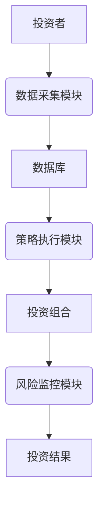

                 


# 如何利用特价股票策略构建全球宏观主题基金

> **关键词**：特价股票，主题基金，宏观投资，量化分析，系统设计

> **摘要**：本文详细探讨如何利用特价股票策略构建全球宏观主题基金。首先介绍特价股票策略的背景与基础，包括其定义、优势及与其他策略的对比。接着分析全球宏观主题基金的构建方法，探讨如何将特价股票策略应用于其中。通过量化模型和系统设计，展示策略的实现过程，并结合实际案例进行实战分析。最后总结策略的应用，并提供最佳实践建议，展望未来趋势。

---

## 第1章: 特价股票策略的背景与基础

### 1.1 特价股票策略的定义与特点

#### 1.1.1 特价股票的定义
特价股票通常指市场估值低于其内在价值的股票，常见于市场下跌周期或被市场低估的公司。这类股票可能因暂时的负面因素导致股价被压制，但具备长期增值潜力。

#### 1.1.2 特价股票策略的核心特点
- **低估值**：股价远低于行业平均水平或历史平均水平。
- **高潜力**：公司基本面良好，具备长期增长能力。
- **逆周期性**：在市场低迷时表现不佳，但具备反弹潜力。

#### 1.1.3 特价股票与普通股票的对比
| 特性         | 特价股票             | 普通股票             |
|--------------|----------------------|----------------------|
| 估值水平     | 低于行业平均         | 接近或高于行业平均   |
| 市场情绪     | 被低估，情绪消极     | 市场情绪较为中性或积极 |
| 风险承受     | 高                  | 中等                 |
| 适用场景     | 市场低迷期            | 市场稳定或上升期      |

**ER图：特价股票的实体关系**

```mermaid
erDiagram
    investor {
        id
        name
        investment_amount
    }
    stock {
        id
        name
        market_value
        book_value
    }
    strategy {
        id
        name
        criteria
    }
    investor --> stock: 持有
    strategy --> stock: 策略选择
```

---

### 1.2 特价股票策略的优势与劣势

#### 1.2.1 特价股票策略的优势
- **高收益潜力**：通过低位买入，高位卖出，获取超额收益。
- **分散风险**：投资于多个低价股票，降低单一股票风险。
- **逆向思维**：在市场恐慌时布局，利用市场非理性获得机会。

#### 1.2.2 特价股票策略的劣势
- **流动性风险**：部分特价股票流动性较差，可能难以快速变现。
- **市场判断难度**：准确判断股票是否被低估需要专业知识和市场敏感度。
- **周期性风险**：依赖于市场周期，可能在市场持续低迷时表现不佳。

#### 1.2.3 特价股票策略的适用场景
- **市场低迷期**：如经济衰退或市场恐慌时。
- **行业低谷期**：如科技股泡沫破裂后的互联网行业。
- **突发事件影响**：如疫情导致的市场恐慌。

---

## 第2章: 全球宏观主题基金的构建方法

### 2.1 全球宏观主题基金的定义与特点

#### 2.1.1 宏观主题基金的定义
宏观主题基金是基于全球经济趋势和宏观因素进行投资的基金，关注如经济周期、政策变化、地缘政治等大趋势。

#### 2.1.2 宏观主题基金的特点
- **跨市场投资**：涵盖全球主要市场和行业。
- **主题驱动**：围绕特定宏观经济主题构建投资组合。
- **高波动性**：受宏观经济因素影响较大，波动性较高。

#### 2.1.3 宏观主题基金与传统基金的区别
| 特性         | 宏观主题基金       | 传统基金           |
|--------------|-------------------|--------------------|
| 投资策略     | 主题驱动           | 分散投资           |
| 风险承受     | 较高              | 中等               |
| 适用场景     | 宏观趋势变化       | 市场稳定或趋势不明  |

---

### 2.2 特价股票策略在全球宏观主题基金中的应用

#### 2.2.1 特价股票策略在宏观主题基金中的定位
- **价值发现**：在全球市场中发现被低估的股票。
- **风险对冲**：通过低价股票对冲市场下行风险。
- **收益增强**：在市场反弹时获得超额收益。

#### 2.2.2 特价股票策略在不同经济周期中的表现
| 经济周期       | 策略表现         |
|----------------|------------------|
| 衰退期         | 优异             |
| 恢复期         | 较好             |
| 增长期         | 中性             |
| 过热期         | 较差             |

---

### 2.3 宏观主题基金的构建步骤

#### 2.3.1 确定宏观主题
- **经济周期分析**：判断当前经济所处阶段。
- **政策分析**：关注财政政策和货币政策变化。
- **地缘政治分析**：评估主要经济体的政策和冲突。

#### 2.3.2 选择相关股票
- **行业筛选**：选择与宏观主题相关的行业。
- **公司筛选**：评估公司的基本面和估值。
- **组合构建**：根据风险承受能力，构建投资组合。

---

## 第3章: 特价股票策略的量化模型

### 3.1 数据收集与处理

#### 3.1.1 数据来源
- **历史数据**：过去5年以上的股价、财务数据。
- **实时数据**：当前市场数据，包括指数、行业表现。

#### 3.1.2 数据特征
- **市盈率（P/E）**：股价/每股收益。
- **市净率（P/B）**：股价/每股净资产。
- **EV/EBITDA**：企业价值与息税折旧及摊销前利润的比率。

---

### 3.2 策略回测与优化

#### 3.2.1 回测模型
- **多因子模型**：综合考虑多个因子，如价值、动量等。
- **风险调整收益**：计算夏普比率、特雷诺比率等。

#### 3.2.2 回测步骤
1. 数据清洗与预处理。
2. 筛选符合策略的股票。
3. 构建投资组合。
4. 计算收益与风险指标。

---

## 第4章: 系统设计与实现

### 4.1 系统架构设计

#### 4.1.1 系统功能模块
- **数据采集模块**：实时采集股票数据。
- **策略执行模块**：根据策略生成买卖信号。
- **风险监控模块**：实时监控投资组合风险。

#### 4.1.2 系统架构图


---

## 第5章: 项目实战

### 5.1 环境配置与代码实现

#### 5.1.1 环境配置
- **编程语言**：Python 3.8+
- **库依赖**：Pandas、NumPy、Matplotlib、Backtrader。

#### 5.1.2 核心代码
```python
import pandas as pd
import numpy as np
import matplotlib.pyplot as plt

# 示例数据加载
data = pd.read_csv('stock_data.csv')

# 筛选特价股票
def is_cheap_stock(row):
    return row['P/E'] < data['P/E'].mean() and row['P/B'] < data['P/B'].mean()

cheap_stocks = data[data.apply(is_cheap_stock, axis=1)]
```

---

## 第6章: 总结与展望

### 6.1 总结
通过特价股票策略构建全球宏观主题基金，能够有效捕捉市场低估机会，实现超额收益。策略的关键在于准确判断市场周期和公司估值。

### 6.2 最佳实践 tips
- 定期调整投资组合，适应市场变化。
- 结合其他策略，如动量策略，增强收益。
- 严格控制风险，避免过度集中。

### 6.3 未来展望
随着大数据和人工智能的发展，特价股票策略将更加精准和高效。投资者需关注技术进步，优化策略实施。

---

**注意事项**：投资有风险，需谨慎决策。本文仅为策略探讨，不构成投资建议。

