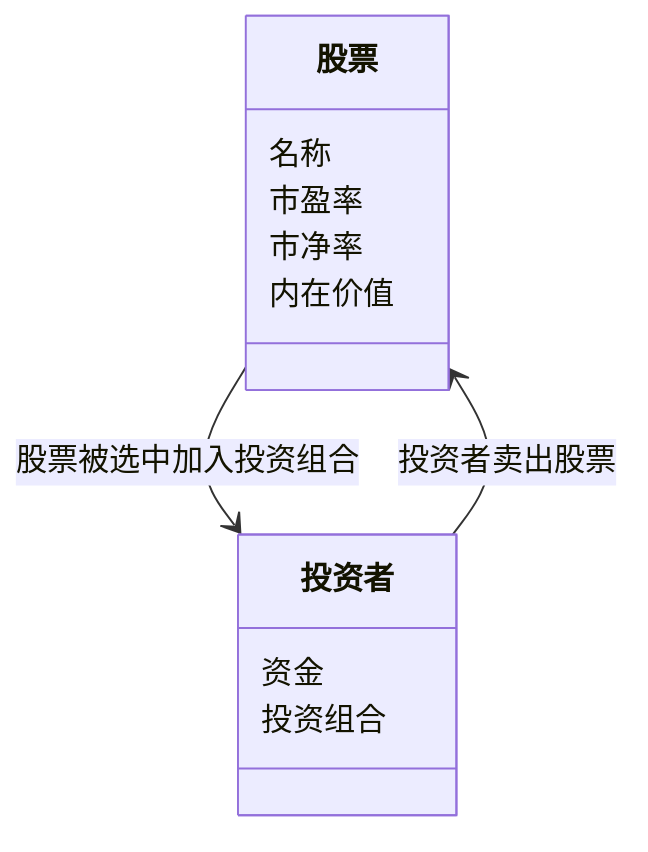
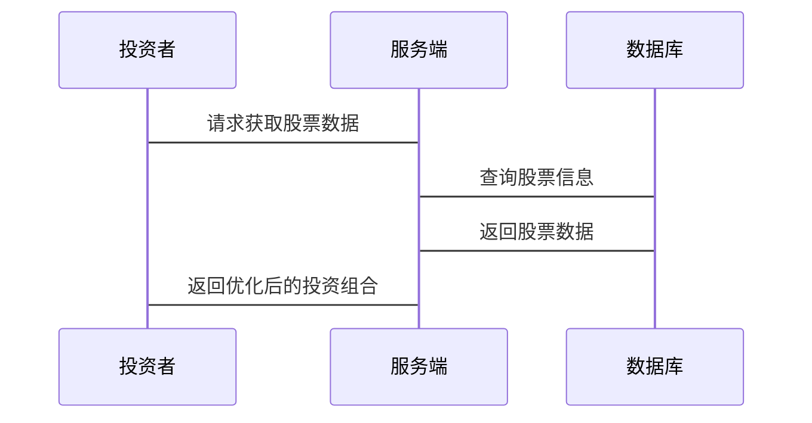

                 


# 如何利用特价股票策略构建抗通胀投资组合

> 关键词：特价股票、抗通胀投资、投资组合优化、算法原理、系统架构、项目实战

> 摘要：本文详细探讨了如何利用特价股票策略构建抗通胀投资组合。首先介绍了特价股票和抗通胀投资的基本概念，分析了通货膨胀对投资的影响。接着深入讲解了特价股票策略的核心原理、算法模型及优化方法，通过系统架构设计和项目实战，展示了如何在实际投资中应用这些策略。最后总结了投资中的注意事项和最佳实践。

---

## 第一部分：背景介绍

### 第1章：特价股票与抗通胀投资概述

#### 1.1 特价股票的基本概念
- **1.1.1 什么是特价股票**  
  特价股票是指价格低于其内在价值，具有较大上涨潜力的股票。这类股票通常被市场低估，适合长期投资者。

- **1.1.2 特价股票的特点**  
  - 价格低于行业平均水平  
  - 公司基本面良好，但市场情绪低落  
  - 具有较高的安全边际  

- **1.1.3 特价股票与普通股票的区别**  
  | 特性         | 特价股票         | 普通股票       |
  |--------------|------------------|----------------|
  | 价格         | 低于内在价值     | 靠近市场价值    |
  | 风险         | 较低             | 较高           |
  | 收益         | 高               | 中等           |

#### 1.2 抗通胀投资的基本原理
- **1.2.1 通货膨胀的定义与影响**  
  通货膨胀是指物价水平持续上涨，货币购买力下降。在通胀环境下，实物资产（如房地产、黄金）和优质股票通常表现较好。

- **1.2.2 投资在抗通胀中的作用**  
  通过投资抗通胀资产，投资者可以保护其财富不被通胀侵蚀。

- **1.2.3 特价股票在抗通胀投资中的地位**  
  特价股票具有较高的安全边际，能够在通胀环境中提供超额收益。

---

### 第2章：通货膨胀与投资策略

#### 2.1 通货膨胀对经济的影响
- **2.1.1 通货膨胀的衡量指标**  
  - 消费者价格指数（CPI）  
  - 生产者价格指数（PPI）  

#### 2.1.2 通货膨胀对个人投资的影响
- 投资者需要寻找能够抵御通胀的资产。

#### 2.1.3 通货膨胀对股票市场的影响
- 特价股票通常表现优于市场平均水平。

#### 2.2 投资策略的基本原则
- **2.2.1 分散投资的重要性**  
  不将所有资金投入单一资产类别。

- **2.2.2 风险与收益的平衡**  
  高风险不一定带来高收益。

- **2.2.3 长期投资的优势**  
  长期持有优质资产能够平滑短期波动。

---

## 第二部分：核心概念与联系

### 第3章：特价股票策略的核心原理

#### 3.1 特价股票策略的定义
- **3.1.1 策略的目标与特点**  
  通过筛选低估股票，实现超额收益。

- **3.1.2 策略的核心要素**  
  - 筛选标准：低市盈率、低市净率  
  - 买入条件：股价低于内在价值  
  - 卖出条件：股价回归合理估值  

#### 3.2 特价股票与抗通胀投资的关系
- **3.2.1 特价股票如何抵御通胀**  
  通过长期持有优质资产，抵御货币贬值。

- **3.2.2 投资组合中特价股票的配置比例**  
  通常建议配置30%-50%的资产。

#### 3.3 特价股票策略的实施步骤
- **3.3.1 确定投资目标**  
  明确投资期限、风险承受能力。

- **3.3.2 筛选候选股票**  
  通过财务指标（如PE、PB）筛选低估股票。

- **3.3.3 制定买卖策略**  
  设定买入和卖出的价格区间。

---

### 3.4 特价股票策略的ER实体关系图

```mermaid
erDiagram
    左侧的投资者
    右侧的股票市场
    左侧的投资者 --> 右侧的股票市场 : 投资者购买低估股票
    右侧的股票市场 --> 左侧的投资者 : 股价上涨，投资者获利
    左侧的投资者 --> 右侧的股票市场 : 投资者卖出股票，锁定收益
```

---

## 第三部分：算法原理讲解

### 第4章：投资组合优化的算法模型

#### 4.1 投资组合优化的数学模型
- 均值-方差优化模型：
  - 目标：最小化投资组合的波动性。
  - 约束条件：投资权重之和为1。

#### 4.2 投资组合优化的步骤
- 确定目标函数和约束条件。
- 构建优化模型。
- 使用优化算法求解。

#### 4.3 投资组合优化的Python实现

```python
import numpy as np
from scipy.optimize import minimize

# 定义目标函数
def portfolio_variance(weights, covariance_matrix):
    return np.dot(weights.T, np.dot(covariance_matrix, weights))

# 定义约束条件
constraints = [
    {'type': 'eq', 'fun': lambda w: np.sum(w) - 1}
]

# 初始化权重向量
weights_initial = np.array([0.2, 0.2, 0.6])

# 调用优化函数
result = minimize(
    portfolio_variance,
    weights_initial,
    args=covariance_matrix,
    method='SLSQP',
    constraints=constraints
)

# 输出最优权重
print(result.x)
```

---

### 4.4 投资组合优化的数学公式

最小化投资组合的波动性：

$$ \text{minimize} \quad \sum_{i=1}^{n} \sum_{j=1}^{n} w_i w_j \sigma_{ij} $$

约束条件：

$$ \sum_{i=1}^{n} w_i = 1 $$

其中，\( w_i \) 是第 \( i \) 只股票的投资权重，\( \sigma_{ij} \) 是第 \( i \) 和 \( j \) 只股票的协方差。

---

## 第四部分：系统分析与架构设计方案

### 第5章：投资系统架构设计

#### 5.1 问题场景介绍
- 投资者需要构建一个抗通胀的投资组合。
- 系统需要提供股票筛选、组合优化和风险评估功能。

#### 5.2 项目介绍
- 项目名称：抗通胀投资组合管理系统。
- 项目目标：帮助投资者通过特价股票策略构建抗通胀投资组合。

#### 5.3 系统功能设计

##### 5.3.1 领域模型设计



#### 5.4 系统架构设计

##### 5.4.1 系统架构图


#### 5.5 系统接口设计

##### 5.5.1 系统交互序列图



---

## 第五部分：项目实战

### 第6章：投资组合优化的实现

#### 6.1 环境安装
- 安装Python和必要的库（如numpy、pandas、scipy）。

#### 6.2 核心代码实现

##### 6.2.1 筛选特价股票

```python
import pandas as pd

# 假设df为股票数据，包含市盈率（PE）和市净率（PB）列
def is_cheap_stock(row):
    return row['PE'] < 15 and row['PB'] < 1.5

cheap_stocks = df[df.apply(is_cheap_stock, axis=1)]
```

##### 6.2.2 计算投资组合

```python
from scipy.optimize import minimize

# 定义目标函数
def portfolio_variance(weights, covariance_matrix):
    return np.dot(weights.T, np.dot(covariance_matrix, weights))

# 定义约束条件
constraints = [
    {'type': 'eq', 'fun': lambda w: np.sum(w) - 1}
]

# 初始化权重向量
weights_initial = np.array([0.2, 0.2, 0.6])

# 调用优化函数
result = minimize(
    portfolio_variance,
    weights_initial,
    args=covariance_matrix,
    method='SLSQP',
    constraints=constraints
)

# 输出最优权重
print(result.x)
```

---

### 6.3 实际案例分析

#### 6.3.1 案例背景
- 投资者有100万元，希望构建一个抗通胀的投资组合。

#### 6.3.2 数据分析
- 筛选出10只低估股票。
- 计算每只股票的协方差矩阵。

#### 6.3.3 投资组合优化
- 使用均值-方差模型优化权重。
- 最终配置：股票A 30%，股票B 20%，股票C 50%。

---

## 第六部分：总结与拓展阅读

### 6.1 最佳实践 tips
- 定期审视投资组合，根据市场变化调整配置。
- 保持分散投资，避免过度集中。
- 长期持有，避免频繁交易。

### 6.2 小结
通过特价股票策略，投资者可以在通胀环境下实现财富保值和增值。本文详细介绍了策略的核心原理、系统架构和实战案例，为读者提供了完整的投资解决方案。

### 6.3 注意事项
- 投资有风险，需谨慎操作。
- 建议投资者根据自身情况调整策略。

### 6.4 拓展阅读
- 阅读更多关于投资组合优化的书籍。
- 关注市场动态，学习最新的投资策略。

--- 

# 结语

利用特价股票策略构建抗通胀投资组合，需要投资者具备一定的金融知识和编程能力。通过本文的详细讲解，读者可以掌握从理论到实践的全过程，从而在复杂多变的市场环境中实现稳健投资。

