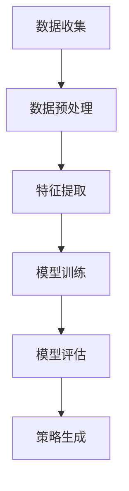

                 

# 如何利用特价股票策略构建新兴科技主题基金

> 关键词：特价股票策略、新兴科技主题基金、股票投资、量化分析、系统架构

> 摘要：本文详细探讨如何利用特价股票策略构建新兴科技主题基金，从背景介绍、核心概念、算法原理、系统架构设计到项目实战，全面分析并提供解决方案，帮助投资者有效利用特价股票策略在科技主题基金中获得超额收益。

## 目录大纲

### 第一部分：背景介绍

#### 第1章：特价股票策略与新兴科技主题基金概述

##### 1.1 特价股票策略的定义与特点
- 1.1.1 特价股票的定义
- 1.1.2 特价股票策略的核心特点
- 1.1.3 特价股票与普通股票的区别

##### 1.2 新兴科技主题基金的定义与特点
- 1.2.1 新兴科技主题的定义
- 1.2.2 新兴科技主题基金的特点
- 1.2.3 新兴科技主题基金的投资优势

##### 1.3 特价股票策略在科技主题基金中的应用前景
- 1.3.1 特价股票策略在科技主题基金中的潜力
- 1.3.2 特价股票策略与科技主题基金的结合方式
- 1.3.3 特价股票策略在科技主题基金中的风险与机遇

### 第二部分：核心概念与联系

#### 第2章：特价股票策略的核心原理

##### 2.1 特价股票策略的原理
- 2.1.1 市场有效性的分析
- 2.1.2 特价股票的发现机制
- 2.1.3 特价股票的交易策略

##### 2.2 科技主题分析的核心要素
- 2.2.1 科技行业的核心驱动因素
- 2.2.2 科技公司的财务指标分析
- 2.2.3 科技公司的市场表现分析

##### 2.3 特价股票策略与科技主题分析的联系
- 2.3.1 特价股票策略在科技主题分析中的应用
- 2.3.2 科技主题分析对特价股票策略的优化作用
- 2.3.3 两者的协同效应

### 第三部分：算法原理讲解

#### 第3章：特价股票策略的算法实现

##### 3.1 算法概述
- 3.1.1 算法目标
- 3.1.2 算法输入
- 3.1.3 算法输出

##### 3.2 算法实现步骤
- 3.2.1 数据收集与预处理
- 3.2.2 特征提取与选择
- 3.2.3 模型训练与优化
- 3.2.4 模型评估与验证

##### 3.3 算法流程图（Mermaid）

### 第四部分：系统分析与架构设计

#### 第4章：系统架构设计方案

##### 4.1 系统功能模块划分
- 4.1.1 数据获取模块
- 4.1.2 数据分析模块
- 4.1.3 策略生成模块
- 4.1.4 策略评估模块

##### 4.2 系统架构设计图（Mermaid）

### 第五部分：项目实战

#### 第5章：基于特价股票策略的科技主题基金构建实战

##### 5.1 环境安装与配置
- 5.1.1 数据获取工具安装
- 5.1.2 数据分析工具安装
- 5.1.3 策略回测工具安装

##### 5.2 系统核心实现源代码

##### 5.3 代码应用解读与分析

##### 5.4 实际案例分析和详细讲解剖析

##### 5.5 项目小结

### 第六部分：最佳实践与总结

#### 第6章：总结与展望

##### 6.1 最佳实践 tips
- 6.1.1 策略优化建议
- 6.1.2 风险控制方法
- 6.1.3 系统维护建议

##### 6.2 小结
- 6.2.1 本文总结
- 6.2.2 未来研究方向
- 6.2.3 致谢与参考文献

## 附录

#### 附录A：相关术语解释

#### 附录B：代码示例

#### 附录C：数据来源说明

#### 附录D：参考文献

---

通过以上目录大纲，您可以逐步展开每个部分，详细撰写每章的内容，确保逻辑清晰、结构紧凑、简单易懂。

