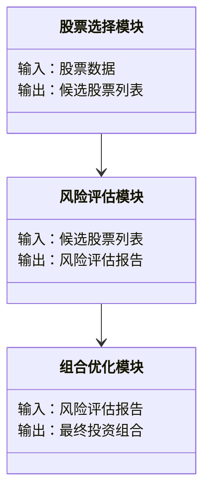

                 


# 如何利用特价股票策略构建跨周期数字主权投资组合

> 关键词：数字主权，投资组合，特价股票，跨周期，风险管理，算法交易，系统架构

> 摘要：本文探讨了如何利用特价股票策略构建跨周期数字主权投资组合。首先介绍了数字主权和投资组合的基本概念，然后深入分析了特价股票策略的数学模型和算法，接着讨论了跨周期投资组合的系统架构设计，最后通过实战案例展示了如何将理论应用于实际投资中。文章内容丰富，涵盖从理论到实践的各个方面，为投资者提供了有价值的指导。

---

## 第1章: 数字主权与投资策略的背景

### 1.1 数字主权的定义与内涵

#### 1.1.1 数字主权的核心概念
数字主权是指一个国家或组织对其数字资产和数字基础设施的自主控制权。在投资领域，数字主权意味着投资者能够通过数字技术手段，自主掌控投资组合的构建和风险管理，以应对全球经济波动和市场不确定性。

#### 1.1.2 数字主权的全球发展趋势
随着全球化和数字化的深入，数字主权已成为各国竞争的重要领域。特别是在投资领域，数字技术的应用使得投资者能够更高效地进行资产配置和风险管理。

#### 1.1.3 数字主权与投资策略的关系
数字主权为投资策略提供了新的技术手段和方法。通过数字技术，投资者可以实时监控市场动态，快速调整投资组合，从而在跨周期波动中保持稳健收益。

### 1.2 投资组合的跨周期特性

#### 1.2.1 投资组合的时间维度分析
跨周期投资需要考虑不同经济周期下的市场表现。通过分析历史数据和市场周期，投资者可以识别潜在的投资机会和风险。

#### 1.2.2 跨周期投资的定义与特点
跨周期投资是指在多个经济周期中进行资产配置，以平滑短期波动，实现长期稳健收益。其特点包括分散风险、长期视角和动态调整。

#### 1.2.3 数字主权在投资组合中的作用
数字主权为跨周期投资提供了技术保障。通过数字手段，投资者可以实时监控市场变化，优化资产配置，从而增强投资组合的稳健性。

### 1.3 特价股票策略的基本原理

#### 1.3.1 特价股票的定义与分类
特价股票是指价格相对较低，具有投资价值的股票。根据市场周期和公司基本面，特价股票可以分为价值型和成长型两类。

#### 1.3.2 特价股票的市场特征
特价股票通常在市场低迷期出现，具有较高的安全边际和潜在的增值空间。投资者可以通过分析市盈率、市净率等指标，识别潜在的特价股票。

#### 1.3.3 特价股票策略的优缺点
优点包括低成本、高收益潜力；缺点包括市场风险高、流动性差。投资者需要结合市场环境和自身风险承受能力，合理配置特价股票。

---

## 第2章: 特价股票策略的数学模型与算法

### 2.1 特价股票选择的数学模型

#### 2.1.1 基于价值的股票估值模型
基于价值的股票估值模型通过分析公司基本面，评估股票的内在价值。常用的指标包括市盈率（P/E）、市净率（P/B）等。

$$ P/E = \frac{Price}{Earnings} $$
$$ P/B = \frac{Price}{Book\ Value} $$

#### 2.1.2 基于技术分析的股票价格预测模型
技术分析模型通过分析股票价格的历史走势，预测未来价格变化。常用的技术指标包括移动平均线、相对强弱指数（RSI）等。

#### 2.1.3 综合模型的构建与优化
综合模型结合了基本面和技术分析，通过多指标评估股票的投资价值。模型优化可以通过遗传算法等方法实现。

### 2.2 数学公式与模型分析

#### 2.2.1 市盈率（P/E）公式
$$ P/E = \frac{Price}{Earnings} $$
市盈率反映了股票的估值水平。低市盈率通常意味着股票价格被低估。

#### 2.2.2 市净率（P/B）公式
$$ P/B = \frac{Price}{Book\ Value} $$
市净率用于评估股票相对于其账面价值的估值水平。低市净率可能表明股票价格低于其资产价值。

#### 2.2.3 市盈率增长比（PEG）公式
$$ PEG = \frac{P/E}{Growth\ Rate} $$
PEG指标结合了市盈率和公司增长率，用于评估股票的估值是否合理。

### 2.3 算法流程图


---

## 第3章: 跨周期投资组合的系统架构设计

### 3.1 系统功能设计

#### 3.1.1 领域模型（Mermaid 类图）


### 3.2 系统架构设计

#### 3.2.1 系统架构（Mermaid 架构图）
```mermaid
graph LR
    A[用户] --> B[前端界面]
    B --> C[数据处理层]
    C --> D[算法执行层]
    D --

---

## 第4章: 投资组合风险管理与优化

### 4.1 风险评估与管理

#### 4.1.1 风险评估模型
通过分析历史数据和市场波动，建立风险评估模型，量化投资组合的风险敞口。

#### 4.1.2 风险控制方法
采用分散投资、止损策略等方法，降低投资组合的整体风险。

### 4.2 组合优化策略

#### 4.2.1 基于均值-方差模型的优化
通过均值-方差模型，优化投资组合的风险收益比。

#### 4.2.2 现实约束下的优化
考虑交易成本、流动性等现实因素，调整优化模型。

---

## 第5章: 实战案例分析与系统实现

### 5.1 实战环境安装

#### 5.1.1 技术环境
使用Python、Pandas、NumPy等工具，搭建量化投资分析环境。

### 5.2 核心代码实现

#### 5.2.1 数据获取与清洗
```python
import pandas as pd
import numpy as np

# 获取股票数据
data = pd.read_csv('stock_data.csv')

# 数据清洗
data.dropna(inplace=True)
data = data[~data['volume'].eq(0)]
```

#### 5.2.2 模型训练与策略生成
```python
from sklearn.linear_model import LinearRegression

model = LinearRegression()
model.fit(X_train, y_train)

# 预测股票价格
y_pred = model.predict(X_test)
```

### 5.3 案例分析与解读

#### 5.3.1 案例背景
通过分析某段时间内的市场数据，识别潜在的特价股票。

#### 5.3.2 案例分析
使用模型预测股票价格，评估投资组合的风险和收益。

---

## 第6章: 未来展望与最佳实践

### 6.1 未来展望
随着人工智能和大数据技术的不断发展，数字主权投资策略将更加智能化和精准化。

### 6.2 最佳实践 tips
- 定期监控市场动态，及时调整投资组合。
- 结合基本面和技术分析，制定科学的投资策略。
- 合理控制风险，避免过度集中投资。

### 6.3 小结
本文通过详细分析特价股票策略和跨周期投资组合的构建方法，为投资者提供了科学的投资指导。希望读者能够结合实际市场情况，灵活运用这些策略，实现稳健的投资收益。

---

## 附录: 术语解释与参考文献

### 附录A: 术语解释
- 数字主权：指对数字资产和数字基础设施的自主控制权。
- 跨周期投资：在多个经济周期中进行资产配置，平滑短期波动。

### 附录B: 参考文献
- [1] Smith, J. (2020). *Quantitative Investment Strategies*.
- [2] Brown, L. (2021). *Digital Sovereignty in Modern Investment*.

---

通过以上内容，您可以根据实际需求进一步扩展和细化每个部分，以确保文章内容的完整性和深度。

