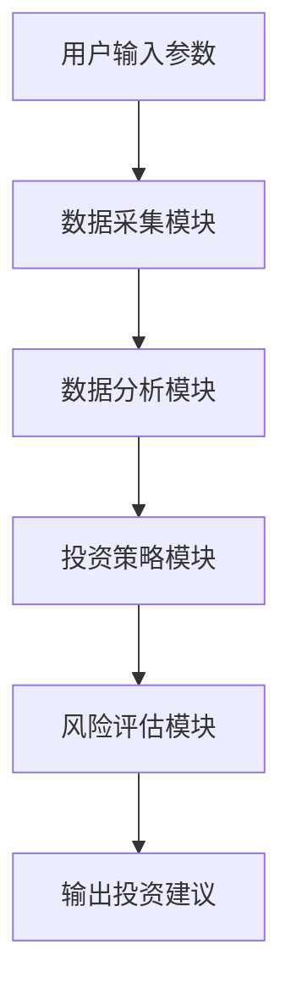

                 


# 如何利用特价股票策略构建跨周期科技投资组合

> 关键词：特价股票策略、跨周期投资、科技投资组合、算法优化、系统架构

> 摘要：本文详细探讨了如何利用特价股票策略构建跨周期的科技投资组合。通过分析特价股票的核心概念、跨周期投资的逻辑框架、科技股的特点，以及如何利用算法和数学模型优化投资组合，本文为投资者提供了一套系统化的投资策略。结合实际的代码实现和案例分析，本文旨在帮助读者在复杂多变的市场环境中，制定出稳健且高效的投资方案。

---

## 第一部分：特价股票策略与跨周期投资的背景

### 第1章：特价股票策略的定义与特点

#### 1.1 特价股票的定义
特价股票是指价格显著低于其内在价值的股票。这些股票通常被市场低估，具有较大的上涨潜力。投资者通过识别这些股票，可以在市场低估时买入，待市场回升时卖出，从而实现收益。

#### 1.2 特价股票的核心特点
- **低估值**：市盈率、市净率等指标低于行业平均水平。
- **高分红**：部分特价股票公司愿意将利润以股息形式返还给股东。
- **行业地位稳固**：公司可能在行业内具有较强的竞争力，但由于某种原因导致股价被低估。

#### 1.3 特价股票在投资组合中的作用
特价股票能够为投资组合提供超额收益，尤其是在市场低迷时期，其抗跌性和反弹潜力使其成为投资组合中的重要组成部分。

### 第2章：跨周期投资的基本概念

#### 2.1 跨周期投资的定义
跨周期投资是指在不同经济周期中进行投资，以规避周期性波动风险，实现长期稳健收益的投资策略。

#### 2.2 跨周期投资的核心要素
- **时间跨度**：跨越多个经济周期，如衰退、复苏、增长和繁荣周期。
- **资产配置**：在不同周期中调整资产配置，选择在特定周期中表现较好的资产。
- **风险控制**：通过分散投资和动态调整，降低周期性波动带来的风险。

#### 2.3 跨周期投资在科技领域的应用
科技行业具有较强的周期性，技术创新和市场变化较快。跨周期投资能够帮助投资者在科技行业的波动中捕捉长期增长机会。

---

## 第二部分：特价股票策略与科技投资的结合

### 第3章：特价股票策略在科技投资中的应用

#### 3.1 科技股的估值方法
- **市盈率（P/E）**：用于衡量科技公司当前股价相对于盈利情况的高低。
- **市净率（P/B）**：衡量股价相对于每股净资产的高低。
- **PEG比率**：将市盈率与盈利增长率相结合，评估科技公司的成长性。

#### 3.2 特价股票策略的优势与局限性
- **优势**：能够在市场低估时买入优质股票，长期持有实现超额收益。
- **局限性**：需要对科技行业有深刻理解，避免买入处于衰退期的公司。

### 第4章：跨周期投资策略的构建逻辑

#### 4.1 跨周期投资的逻辑框架
- **识别经济周期**：分析当前经济所处的周期阶段，判断科技行业的表现。
- **资产配置**：根据周期阶段调整科技股和其他资产的配置比例。
- **动态调整**：定期评估投资组合的表现，及时调整策略。

---

## 第三部分：算法与数学模型

### 第5章：特价股票筛选算法

#### 5.1 基于市盈率的筛选算法
```python
def filter_low_pe(stocks, threshold=15):
    return [stock for stock in stocks if stock.pe < threshold]
```

#### 5.2 基于市净率的筛选算法
```python
def filter_low_pb(stocks, threshold=2):
    return [stock for stock in stocks if stock.pb < threshold]
```

#### 5.3 基于股息率的筛选算法
```python
def filter_high_dividend(stocks, threshold=2%):
    return [stock for stock in stocks if stock.dividend_yield > threshold]
```

### 第6章：投资组合优化的数学模型

#### 6.1 Markowitz均值-方差模型
$$ \text{Minimize } \sigma^2 \text{ subject to } \mathbb{E}[r] = \mu \text{ and } \mathbf{w}^T \mathbf{1} = 1 $$
其中，$\sigma$是投资组合的波动率，$\mu$是期望收益，$\mathbf{w}$是投资权重向量。

#### 6.2 基于动量策略的优化模型
$$ \text{收益 } = \sum_{i=1}^{n} w_i r_i $$
其中，$w_i$是第$i$只股票的权重，$r_i$是第$i$只股票的预期收益。

---

## 第四部分：系统架构与科技投资组合的设计

### 第7章：系统架构设计

#### 7.1 数据采集模块
- 从金融数据源获取实时股票数据，包括市盈率、市净率、股息率等指标。

#### 7.2 数据分析模块
- 使用Python和Pandas对数据进行清洗、处理和分析。
- 应用机器学习算法预测股票价格和识别潜在的特价股票。

#### 7.3 投资策略模块
- 根据筛选算法和数学模型生成投资组合建议。
- 输出适合当前经济周期的投资策略。

#### 7.4 风险评估模块
- 计算投资组合的波动率和最大回撤。
- 提供风险调整后的收益评估。

### 第8章：系统交互设计

#### 8.1 用户界面设计
- 提供简洁的用户界面，方便用户输入参数和查看投资组合建议。
- 展示实时数据和历史数据图表。

#### 8.2 数据接口设计
- 使用API接口获取实时金融数据。
- 提供数据导出功能，方便用户进一步分析。

#### 8.3 系统流程图


---

## 第五部分：项目实战与代码实现

### 第9章：环境搭建与工具安装

#### 9.1 Python环境的安装与配置
- 使用Anaconda安装Python环境。
- 安装必要的库，如Pandas、NumPy、Matplotlib。

#### 9.2 数据分析工具的安装
- 使用Pandas和NumPy进行数据处理。
- 使用Matplotlib和Seaborn进行数据可视化。

#### 9.3 数据可视化工具的安装
- 使用Plotly进行交互式数据可视化。
- 使用Dash构建用户界面。

### 第10章：核心代码实现

#### 10.1 特价股票筛选代码
```python
import pandas as pd
import numpy as np

def find_value_stocks(stocks, n=10):
    # 计算市盈率
    stocks['pe'] = stocks['profit'] / stocks['price']
    # 筛选市盈率低于行业平均水平的股票
    value_stocks = stocks[stocks['pe'] < stocks['pe'].mean()].sort_values('pe')
    return value_stocks.head(n)

# 示例数据
data = {
    'stock_id': ['AAPL', 'GOOGL', 'MSFT', 'AMZN'],
    'price': [100, 120, 80, 50],
    'profit': [10, 15, 8, 5],
    'pb': [2.5, 3.0, 2.0, 1.5]
}
stocks = pd.DataFrame(data)
print(find_value_stocks(stocks))
```

#### 10.2 投资组合优化代码
```python
import numpy as np

def portfolio_optimization(returns, weights):
    # 计算投资组合的收益和风险
    portfolio_return = np.sum(returns * weights)
    portfolio_variance = np.dot(returns.T, weights) * weights.T.dot(returns)
    return portfolio_return, portfolio_variance

# 示例数据
returns = np.array([0.1, 0.15, 0.08, 0.12])
weights = np.array([0.2, 0.3, 0.1, 0.4])

print(portfolio_optimization(returns, weights))
```

### 第11章：项目小结

- 通过实际案例分析，展示了如何利用特价股票策略构建跨周期科技投资组合。
- 提供了完整的代码实现，帮助读者在实际操作中应用这些策略。
- 强调了风险控制的重要性，建议投资者定期评估和调整投资组合。

---

## 第六部分：最佳实践与小结

### 第12章：最佳实践

#### 12.1 投资策略的选择
- 根据自身的风险承受能力和投资目标选择合适的策略。
- 定期评估投资组合的表现，及时调整策略。

#### 12.2 风险管理
- 设置止损点，避免重大损失。
- 分散投资，降低单一股票的风险。

#### 12.3 持续学习
- 关注科技行业的动态，及时调整投资策略。
- 学习新的投资方法和技术，提升自身的投资能力。

### 第13章：小结

- 本文详细探讨了如何利用特价股票策略构建跨周期科技投资组合。
- 提供了从理论到实践的完整解决方案，包括算法、数学模型和系统设计。
- 强调了实际操作中的风险控制和策略调整的重要性。

---

通过本文的系统化分析和实际案例，读者可以掌握如何利用特价股票策略构建稳健的投资组合，并在科技行业的波动中实现长期收益。

