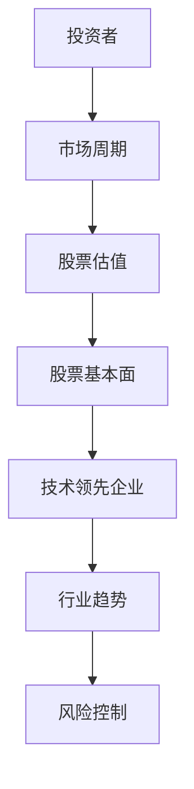
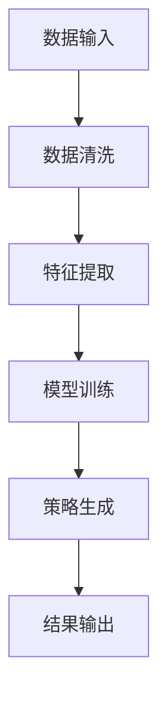
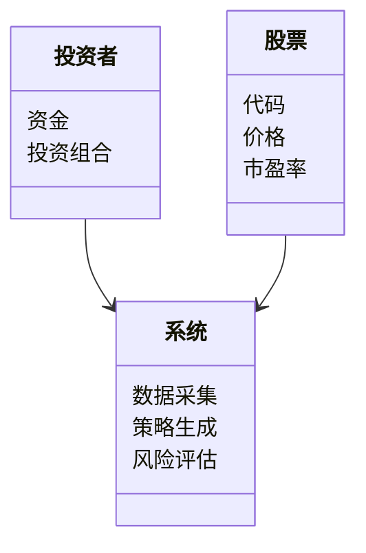
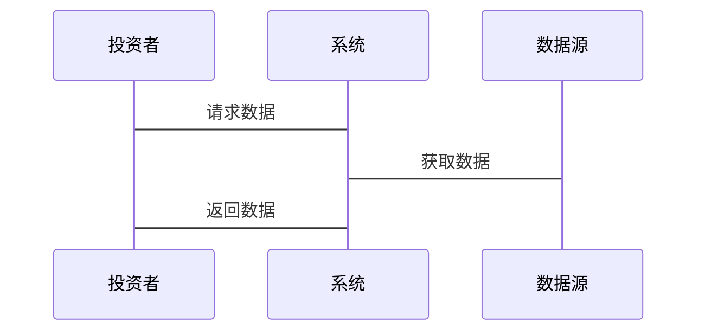

                 


# 如何利用特价股票策略构建长期技术主权投资组合

> 关键词：特价股票策略，长期投资，技术主权，投资组合，风险管理

> 摘要：本文详细探讨了如何利用特价股票策略构建长期技术主权投资组合。通过分析特价股票的定义、长期投资的原理、技术主权的内涵，结合技术分析、量化分析和系统设计等方法，为投资者提供了一套科学的投资策略。文章还通过实际案例分析和系统架构设计，展示了如何将理论应用于实践，并提供了风险管理的最佳实践建议。

---

## 第一部分: 特价股票策略与长期技术主权投资组合基础

### 第1章: 特价股票策略与长期投资概述

#### 1.1 特价股票策略的定义与特点
##### 1.1.1 特价股票的定义
特价股票是指市场价格低于其内在价值的股票。这种股票通常被视为被市场低估的投资标的，具有较大的增值潜力。

##### 1.1.2 特价股票的核心特点
- **低估值**：市盈率（P/E）、市净率（P/B）等估值指标低于行业平均水平。
- **高分红**：部分特价股票公司具有较高的股息率，能够为投资者提供稳定的现金流。
- **风险较低**：相对于高价股，特价股票的投资风险较低，适合长期投资。

##### 1.1.3 长期投资与特价股票策略的结合
长期投资的核心理念是通过持有优质资产，获得复利效应。特价股票策略通过筛选低估资产，为长期投资提供了低成本、高收益的潜在机会。

#### 1.2 技术主权投资的内涵
##### 1.2.1 技术主权的定义
技术主权是指一个国家或个人在关键科技领域具备自主可控的能力，避免对外部技术的过度依赖。

##### 1.2.2 技术主权与投资的关系
通过投资于具有技术领先优势的公司，投资者可以间接支持关键技术创新，同时获得投资收益。

##### 1.2.3 长期技术主权投资的目标与意义
- **目标**：构建一个能够长期抵御外部技术风险的投资组合。
- **意义**：通过技术主权投资，投资者不仅能够获得经济回报，还能支持国家或企业的技术独立性。

#### 1.3 本章小结
本章通过定义特价股票和长期投资，探讨了技术主权投资的内涵及其与投资策略的结合。为后续策略分析奠定了基础。

---

### 第2章: 特价股票策略的核心概念与联系

#### 2.1 特价股票策略的核心原理
##### 2.1.1 市场周期分析
股票市场存在周期性波动，投资者需要通过技术分析和基本面分析，识别市场的底部区域，寻找特价股票。

##### 2.1.2 估值分析
通过对比股票的市场价格与内在价值，识别被低估的股票。常用指标包括市盈率、市净率、股息率等。

##### 2.1.3 股票基本面分析
基本面分析包括对公司财务状况、盈利能力、行业地位等的全面评估，以识别具有长期增长潜力的特价股票。

#### 2.2 技术主权投资的核心要素
##### 2.2.1 技术领先企业的识别
选择那些在关键科技领域具有领先技术的企业，如人工智能、半导体、生物医药等。

##### 2.2.2 行业趋势分析
通过分析行业发展趋势，识别那些具有长期增长潜力的行业，集中投资于这些行业中的技术领先企业。

##### 2.2.3 风险管理
通过分散投资、设置止损等方法，降低投资组合的整体风险。

#### 2.3 系统架构与实体关系图


#### 2.4 本章小结
本章从市场周期、估值分析、基本面分析等方面，详细探讨了特价股票策略的核心原理，并通过系统架构图展示了技术主权投资的核心要素。

---

### 第3章: 特价股票策略的算法原理

#### 3.1 技术分析算法
##### 3.1.1 移动平均线（MA）
移动平均线是一种常用的股票价格趋势分析工具，通过计算一定时期内的平均价格，判断市场的多空趋势。

##### 3.1.2 相对强弱指数（RSI）
RSI用于衡量股票的超买或超卖状态，通常在0-100之间波动，高于70表示超买，低于30表示超卖。

##### 3.1.3 MACD指标
MACD指标通过计算短期和长期移动平均线的差值，帮助投资者判断市场的趋势和动能变化。

#### 3.2 量化分析算法
##### 3.2.1 均值回归模型
均值回归模型假设市场价格会回归其历史平均值，适用于识别被低估的股票。

##### 3.2.2 马科维茨均值-方差模型
马科维茨均值-方差模型用于优化投资组合，通过最小化风险（方差）来实现收益最大化。

##### 3.2.3 时间序列分析
时间序列分析用于预测股票价格的未来走势，常用ARIMA模型等方法。

#### 3.3 算法流程图


#### 3.4 本章小结
本章通过技术分析和量化分析，详细讲解了特价股票策略的算法原理，并通过流程图展示了策略生成的全过程。

---

### 第4章: 系统分析与架构设计方案

#### 4.1 问题场景介绍
##### 4.1.1 投资者需求分析
投资者希望通过特价股票策略，构建一个低风险、高收益的长期技术主权投资组合。

##### 4.1.2 市场环境分析
当前市场环境下，科技行业的技术领先企业具有较高的投资价值。

##### 4.1.3 系统目标设定
系统目标包括数据采集、策略生成、风险评估等功能。

#### 4.2 系统功能设计
##### 4.2.1 领域模型


#### 4.3 系统架构设计
##### 4.3.1 分层架构
系统分为数据层、业务逻辑层和用户界面层。

##### 4.3.2 微服务架构
系统采用微服务架构，包括数据采集服务、策略生成服务、风险评估服务等。

##### 4.3.3 系统交互图


#### 4.4 本章小结
本章通过系统分析和架构设计，展示了如何将特价股票策略应用于实际投资组合构建中，并通过系统交互图明确了各组件之间的关系。

---

### 第5章: 项目实战与案例分析

#### 5.1 环境安装
投资者需要安装数据分析工具（如Python、Pandas、Matplotlib）和投资分析软件（如TradingView、Excel）。

#### 5.2 系统核心实现源代码
##### 5.2.1 数据清洗代码
```python
import pandas as pd

# 读取数据
data = pd.read_csv('stock_data.csv')

# 删除缺失值
data = data.dropna()

# 去除异常值
data = data[(data['价格'] < data['价格'].quantile(0.99)) & (data['价格'] > data['价格'].quantile(0.01))]
```

##### 5.2.2 特征提取代码
```python
# 计算移动平均线
data['MA5'] = data['价格'].rolling(5).mean()

# 计算相对强弱指数
def calculate_rsi(data, period=14):
    diff = data['价格'].diff()
    up = diff.where(diff > 0, 0)
    down = -diff.where(diff < 0, 0)
    rm_up = up.rolling(period).mean()
    rm_down = down.rolling(period).mean()
    rsi = 100 * (rm_up / (rm_up + rm_down))
    return rsi

data['RSI'] = calculate_rsi(data)
```

##### 5.2.3 模型训练代码
```python
from sklearn.linear_model import LinearRegression

# 训练模型
model = LinearRegression()
model.fit(X, y)

# 预测未来价格
future_prices = model.predict(future_X)
```

#### 5.3 代码应用解读与分析
通过上述代码，投资者可以实现数据清洗、特征提取和模型训练，构建自己的特价股票策略模型。

#### 5.4 实际案例分析
以某科技公司为例，分析其股价走势，应用特价股票策略进行投资决策。

#### 5.5 项目小结
本章通过实际案例分析，展示了如何将理论应用于实践，并通过代码实现特价股票策略。

---

### 第6章: 风险管理与最佳实践

#### 6.1 风险管理的核心原则
##### 6.1.1 风险分散
通过投资不同行业和公司的股票，降低投资组合的整体风险。

##### 6.1.2 设置止损
在投资组合中设置止损点，避免单只股票的大幅亏损影响整体收益。

##### 6.1.3 定期复盘
定期评估投资组合的表现，调整投资策略，确保长期收益。

#### 6.2 风险管理的数学模型
##### 6.2.1 夏普比率
$$夏普比率 = \frac{E[r_p] - r_f}{\sigma_p}$$

##### 6.2.2 最大回撤
最大回撤是指在一定时间段内，投资组合从峰值到谷值的最大跌幅。

#### 6.3 风险管理的注意事项
- 避免过度集中投资。
- 保持长期投资心态，避免频繁交易。
- 定期监控市场环境变化，及时调整投资策略。

#### 6.4 本章小结
本章通过风险管理的数学模型和最佳实践，帮助投资者在构建长期技术主权投资组合时，降低投资风险。

---

### 第7章: 进阶策略与未来发展

#### 7.1 进阶策略
##### 7.1.1 机器学习模型
通过机器学习算法，如随机森林、神经网络等，提高投资策略的预测精度。

##### 7.1.2 因子投资
基于多个因子（如价值因子、动量因子）构建投资组合，实现超额收益。

#### 7.2 技术主权投资的未来发展方向
##### 7.2.1 新兴科技领域
人工智能、量子计算、生物技术等新兴科技领域将成为未来技术主权投资的重点。

##### 7.2.2 数字化转型
随着数字化转型的推进，科技企业的投资价值将更加显著。

#### 7.3 本章小结
本章探讨了进阶策略和未来发展方向，为投资者提供了更广阔的投资视野。

---

### 第8章: 总结与展望

#### 8.1 总结
本文详细探讨了如何利用特价股票策略构建长期技术主权投资组合，通过技术分析、量化分析和系统设计等方法，为投资者提供了科学的投资策略。

#### 8.2 展望
随着科技的不断进步，技术主权投资将变得更加重要。未来，投资者需要更加关注新兴科技领域，灵活调整投资策略，以应对市场变化。

#### 8.3 注意事项
- 投资者需具备一定的金融知识和风险管理能力。
- 投资需结合市场环境和自身需求，避免盲目跟风。

#### 8.4 拓展阅读
建议投资者阅读相关书籍和文献，深入学习投资策略和风险管理知识。

---

## 附录: 术语表

- **特价股票**：市场价格低于内在价值的股票。
- **技术主权**：在关键科技领域具备自主可控能力。
- **风险管理**：通过分散投资、设置止损等方法降低投资风险。

---

通过本文的详细讲解，投资者可以更好地理解如何利用特价股票策略构建长期技术主权投资组合，并在实际操作中灵活运用这些策略，实现投资目标。

