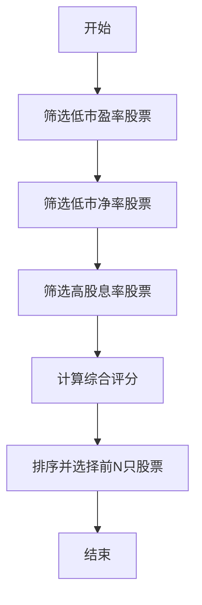
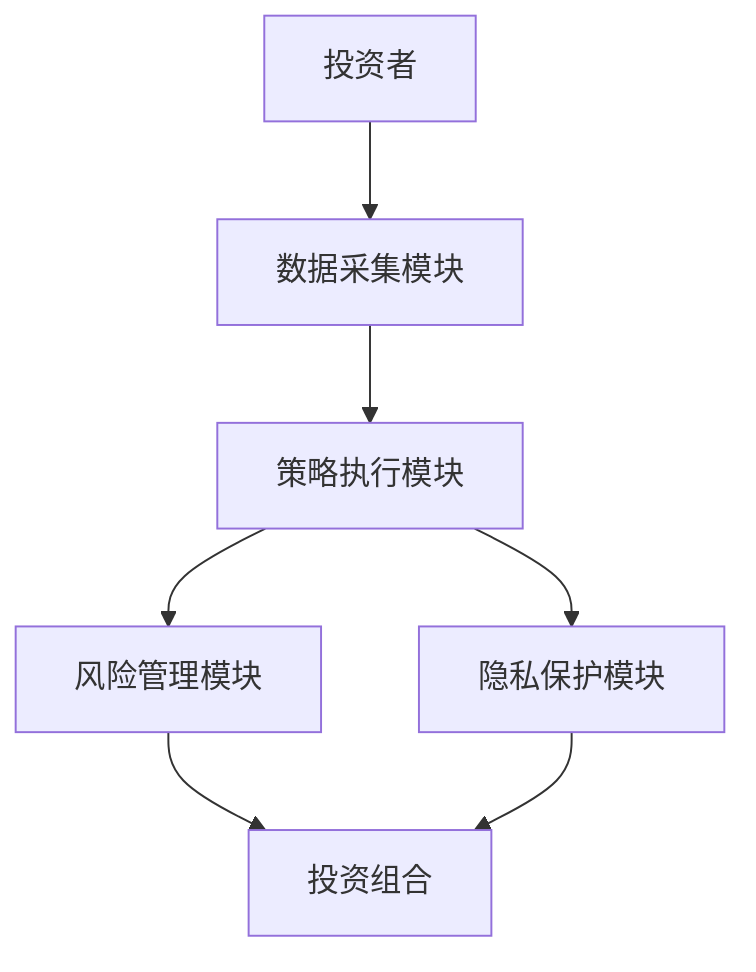

                 


# 如何利用特价股票策略构建长期数字主权与隐私保护投资组合

## 关键词：特价股票策略、数字主权、隐私保护、投资组合、风险管理

## 摘要：本文将详细探讨如何利用特价股票策略构建一个既能保障数字主权又注重隐私保护的长期投资组合。通过分析特价股票的筛选机制、数字主权的核心实现方式以及隐私保护的重要性，本文旨在为投资者提供一种新的视角和策略，以在数字化时代中实现稳健的投资回报。

---

## 第一部分：背景与概述

### 第1章：特价股票策略与数字主权概述

#### 1.1 特价股票策略的定义与特点

- **1.1.1 特价股票的定义**
  特价股票是指市场价格低于其内在价值的股票，通常被认为具有较高的投资潜力。这类股票通常被低估，可能因为市场情绪或短期因素导致价格波动。

- **1.1.2 特价股票的核心特点**
  - **低市盈率（P/E）**：市盈率低于行业平均水平，表明股票价格相对于 earnings per share (EPS) 较低。
  - **低市净率（P/B）**：市净率低于行业平均水平，表明股票价格相对于 book value per share (BVPS) 较低。
  - **高股息率**：股息率较高，通常吸引追求稳定收入的投资者。

- **1.1.3 特价股票在投资中的作用**
  特价股票为投资者提供了以较低价格购买高质量资产的机会，能够在市场波动中捕捉低估资产的价值回归机会。

#### 1.2 数字主权与隐私保护的重要性

- **1.2.1 数字主权的定义**
  数字主权指的是国家或个人对其数字资产和数据的自主控制权，强调在数字时代维护自身的利益和安全。

- **1.2.2 隐私保护在投资中的重要性**
  投资者的数据安全和隐私保护直接关系到投资决策的安全性和有效性，尤其是在数字化交易中，防止数据泄露和滥用至关重要。

- **1.2.3 数字主权与隐私保护的相互关系**
  数字主权的实现依赖于有效的隐私保护措施，而隐私保护则是数字主权的重要组成部分。

#### 1.3 投资组合构建的背景与目标

- **1.3.1 投资组合的基本概念**
  投资组合是将资金分配到不同资产类别中的策略，旨在在风险可控的前提下实现最大化的投资回报。

- **1.3.2 数字主权与隐私保护对投资组合的影响**
  数字化投资环境要求投资者在构建投资组合时，必须考虑数据安全和隐私保护，以避免因数据泄露或滥用导致的投资损失。

- **1.3.3 构建长期投资组合的目标**
  通过精选特价股票，结合数字主权和隐私保护的策略，构建一个风险可控、回报稳定且具有长期增长潜力的投资组合。

---

## 第二部分：核心概念与联系

### 第2章：特价股票策略的核心原理

#### 2.1 特价股票的筛选机制

- **2.1.1 市盈率（P/E）分析**
  市盈率是股票价格与每股收益的比率，用于衡量股票的估值水平。低市盈率通常意味着股票价格被低估。

- **2.1.2 市净率（P/B）分析**
  市净率是股票价格与每股净资产的比率，用于评估股票相对于其账面价值的高低。低市净率表明股票可能被市场低估。

- **2.1.3 股息率分析**
  股息率是每股股息与股票价格的比率，高股息率的股票通常被视为收益稳定的资产。

#### 2.2 数字主权的实现方式

- **2.2.1 数据主权**
  数据主权是指数据的拥有者对数据的完全控制，包括存储、处理和访问权限。通过使用区块链技术，可以实现数据的分布式存储和不可篡改性，从而确保数据主权。

- **2.2.2 加密技术**
  使用加密算法对数据进行加密，确保只有授权方能够解密和访问数据。例如，使用 AES 加密算法对敏感数据进行加密存储。

- **2.2.3 区块链技术**
  区块链技术通过去中心化的账本记录数据，确保数据的透明性和不可篡改性，从而增强数据主权。

#### 2.3 概念对比表

| 概念         | 特价股票策略                        | 数字主权与隐私保护                  |
|--------------|------------------------------------|------------------------------------|
| 核心目标     | 捕捉低估资产，实现超额收益          | 保护数据主权，确保隐私安全          |
| 实现方式     | 基于估值指标的股票筛选              | 数据加密、区块链技术、访问控制      |
| 相关风险     | 估值偏差、市场波动                 | 数据泄露、技术漏洞、合规风险        |

#### 2.4 ER实体关系图

```mermaid
erDiagram
    actor 投资者 {
        <属性>
        资金: 长期资金
        风险偏好: 低风险
    }
    actor 数据提供方 {
        <属性>
        数据类型: 交易数据
        数据隐私: 加密
    }
    actor 监管机构 {
        <属性>
        监管政策: 数据保护法规
        执行力度: 严格
    }
    entity 特价股票 {
        <属性>
        股票代码: 字符串
        市盈率: 数值
        市净率: 数值
    }
    entity 投资组合 {
        <属性>
        股票配置: 数值
        风险敞口: 数值
        预期收益: 数值
    }
    entity 数据安全协议 {
        <属性>
        加密算法: 字符串
        访问权限: 数组
        审计日志: 布尔值
    }
    投资者 --> 特价股票: 选择
    投资者 --> 投资组合: 构建
    投资者 --> 数据安全协议: 遵循
    数据提供方 --> 数据安全协议: 提供
    监管机构 --> 数据安全协议: 监督
```

---

## 第三部分：算法原理讲解

### 第3章：特价股票策略的算法实现

#### 3.1 算法流程图



#### 3.2 Python代码实现

```python
import pandas as pd
import numpy as np

# 假设 df 是股票数据 DataFrame，包含 'PE', 'PB', 'DIV_YIELD' 列
def screen_cheap Stocks(df):
    # 筛选市盈率低于行业平均的股票
    df = df[df['PE'] < df['PE'].mean()]
    # 筛选市净率低于行业平均的股票
    df = df[df['PB'] < df['PB'].mean()]
    # 筛选股息率高于行业平均的股票
    df = df[df['DIV_YIELD'] > df['DIV_YIELD'].mean()]
    # 计算综合评分
    df['SCORE'] = 0.3 * df['PE'] + 0.3 * df['PB'] + 0.4 * df['DIV_YIELD']
    # 按评分排序并选择前N只股票
    return df.sort_values('SCORE').head(10)

# 示例数据
data = {
    'PE': [12, 15, 8, 10, 18],
    'PB': [1.5, 2.0, 1.2, 1.8, 2.5],
    'DIV_YIELD': [3, 2, 4, 3, 1]
}
df = pd.DataFrame(data)
result = screen_cheap Stocks(df)
print(result)
```

#### 3.3 数学模型与公式

- **综合评分公式**：
  $$ SCORE = 0.3 \times PE + 0.3 \times PB + 0.4 \times DIV\_YIELD $$
  
- **市盈率与市净率的比较**：
  $$ PE < \text{行业平均PE} $$
  $$ PB < \text{行业平均PB} $$
  
---

## 第四部分：系统分析与架构设计

### 第4章：投资组合管理系统的架构设计

#### 4.1 系统功能模块

- **数据采集模块**：收集市场数据和投资者信息。
- **策略执行模块**：根据筛选标准选择特价股票。
- **风险管理模块**：监控投资组合的风险敞口。
- **隐私保护模块**：确保数据的安全性和隐私性。

#### 4.2 系统架构图



---

## 第五部分：项目实战

### 第5章：投资组合管理系统实现

#### 5.1 环境安装

- **工具**：Python、Jupyter Notebook、Pandas、Mermaid
- **依赖库**：安装 `pandas`, `numpy`, `mermaid` 等。

#### 5.2 核心代码实现

```python
import pandas as pd
import numpy as np

# 数据模拟
data = {
    '股票代码': ['A', 'B', 'C', 'D', 'E'],
    'PE': [12, 15, 8, 10, 18],
    'PB': [1.5, 2.0, 1.2, 1.8, 2.5],
    'DIV_YIELD': [3, 2, 4, 3, 1]
}

df = pd.DataFrame(data)

# 筛选逻辑
def screen Cheap Stocks(df):
    mean_pe = df['PE'].mean()
    mean_pb = df['PB'].mean()
    mean_div_yield = df['DIV_YIELD'].mean()
    df = df[(df['PE'] < mean_pe) & 
            (df['PB'] < mean_pb) & 
            (df['DIV_YIELD'] > mean_div_yield)]
    return df

result = screen Cheap Stocks(df)
print("筛选结果：")
print(result)
```

#### 5.3 案例分析与解读

- **案例背景**：假设当前市场中有多只股票符合特价股票的筛选标准。
- **投资组合构建**：通过筛选，选择具有低市盈率、低市净率和高股息率的股票，构建一个分散化的投资组合。
- **风险评估**：定期监控投资组合的风险指标，如波动率、最大回撤等。

---

## 第六部分：最佳实践

### 第6章：总结与建议

#### 6.1 小结

- 通过特价股票策略，投资者可以在数字化时代中捕捉低估资产的投资机会。
- 数字主权与隐私保护的结合，为投资组合的安全性和稳定性提供了保障。

#### 6.2 注意事项

- **数据质量**：确保数据的准确性和完整性，避免因数据错误导致的投资决策失误。
- **风险管理**：定期评估投资组合的风险敞口，及时调整投资策略。
- **技术实现**：采用先进的技术手段，如区块链和加密算法，确保数据的安全性和隐私性。

#### 6.3 拓展阅读

- **参考文献**：
  1. 加密技术在投资组合管理中的应用。
  2. 区块链技术在数字主权保护中的作用。
  3. 人工智能在投资组合优化中的应用。

---

## 结语

通过本文的详细讲解，读者可以了解到如何利用特价股票策略构建一个长期、稳健且注重隐私保护的投资组合。希望本文的分析和建议能够为投资者在数字化时代中提供有益的指导和启示。

