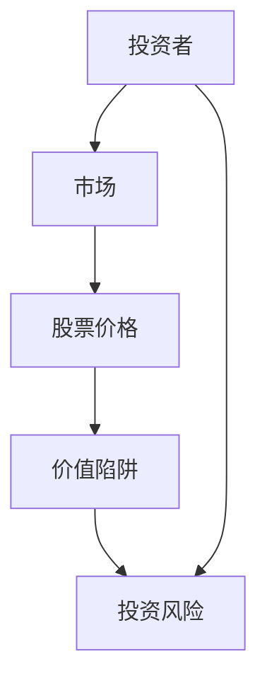
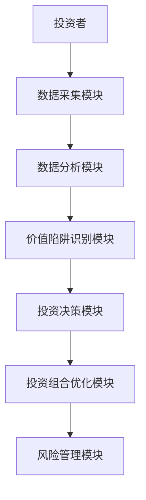
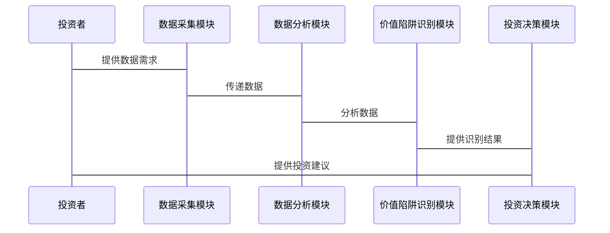

                 


# 如何利用特价股票策略进行价值陷阱规避

> 关键词：特价股票，价值陷阱，投资策略，风险规避，价值投资

> 摘要：本文将详细探讨如何利用特价股票策略进行价值陷阱的规避。首先，我们将介绍特价股票和价值陷阱的基本概念及其相互关系。接着，我们将深入分析价值陷阱的成因及其对投资者的影响，并提供有效的识别和规避策略。随后，我们将探讨特价股票策略的理论基础，包括价值投资的基本原理和投资组合的构建与优化。最后，我们通过系统分析和实战案例，帮助读者掌握如何在实际投资中应用这些策略，从而实现长期稳健的投资收益。

---

# 第1章: 特价股票与价值陷阱的定义与背景

## 1.1 特价股票的定义与特点

### 1.1.1 什么是特价股票
特价股票是指在特定市场条件下，价格被低估的股票。这些股票通常具有较高的投资潜力，但由于市场波动或其他因素，其价格暂时低于其内在价值。

### 1.1.2 特价股票的市场表现特征
- **低估值**：市盈率、市净率等指标远低于行业平均水平。
- **高波动性**：价格波动较大，容易受到市场情绪影响。
- **潜在增长**：公司基本面良好，未来具有增长潜力。

### 1.1.3 特价股票与正常股票的区别
| 特性 | 特价股票 | 正常股票 |
|------|----------|-----------|
| 价格 | 通常低于内在价值 | 价格反映市场预期 |
| 波动性 | 高 | 中等或低 |
| 投资机会 | 低估带来的增值机会 | 更稳定的市场表现 |

### 1.1.4 特价股票的分类
- **周期性股票**：受经济周期影响较大的行业股票。
- **成长型股票**：未来增长潜力大但当前估值低。
- **价值型股票**：基本面良好但被市场低估。

---

## 1.2 价值陷阱的定义与成因

### 1.2.1 什么是价值陷阱
价值陷阱是指那些表面上看似低估，但实际上存在严重问题的股票。投资者误以为其价格低廉，实则可能面临无法逆转的困境，导致长期亏损。

### 1.2.2 价值陷阱的主要成因
1. **行业衰退**：所在行业需求下降，难以恢复。
2. **公司基本面恶化**：财务状况恶化，盈利能力持续下降。
3. **管理问题**：公司治理不善，管理层决策失误。
4. **竞争加剧**：行业竞争激烈，难以维持竞争优势。

### 1.2.3 价值陷阱与投资风险的关系
- 价值陷阱增加了投资风险，可能导致投资者本金损失。
- 误判价值陷阱可能导致长期亏损，甚至引发连锁反应。

---

## 1.3 特价股票与价值陷阱的关系

### 1.3.1 特价股票为何容易成为价值陷阱
- **低估值吸引投资者**：投资者可能忽视了公司基本面的问题。
- **市场情绪影响**：市场恐慌或低迷时，特价股票可能进一步被低估。

### 1.3.2 价值陷阱对投资者的影响
- **资金损失**：投资者可能因买入价值陷阱股票而遭受损失。
- **信任危机**：多次误判可能导致投资者对市场失去信心。

### 1.3.3 如何区分真正的特价股票和价值陷阱
- **基本面分析**：深入分析公司财务状况和行业前景。
- **市场情绪分析**：结合市场情绪判断股票价格的合理性。

---

## 1.4 本章小结

本章介绍了特价股票和价值陷阱的基本概念，并分析了它们之间的关系。通过理解这些概念，投资者可以更好地识别潜在的投资机会和风险。

---

# 第2章: 价值陷阱的识别与规避策略

## 2.1 价值陷阱的识别方法

### 2.1.1 基本面分析法

#### 2.1.1.1 财务指标分析
- **市盈率（P/E）**：衡量股票价格与盈利能力的指标。
- **市净率（P/B）**：衡量股票价格与资产价值的指标。
- **ROE（净资产收益率）**：衡量公司盈利能力的指标。

#### 2.1.1.2 财务报表分析
- **利润表**：分析公司盈利能力。
- **资产负债表**：分析公司资产和负债情况。
- **现金流量表**：分析公司现金流状况。

### 2.1.2 技术分析法

#### 2.1.2.1 K线图分析
- **趋势线**：判断股票价格的走势。
- **成交量**：判断市场情绪。

#### 2.1.2.2 技术指标分析
- **MACD**：衡量股票价格的动量和趋势。
- **RSI**：衡量股票价格的超买和超卖状态。

### 2.1.3 综合分析法

#### 2.1.3.1 行业分析
- **行业前景**：分析行业未来发展趋势。
- **竞争格局**：分析公司竞争优势。

#### 2.1.3.2 市场情绪分析
- **市场情绪指标**：分析投资者情绪对股价的影响。

---

## 2.2 特价股票的筛选标准

### 2.2.1 市盈率分析
- **合理市盈率范围**：根据行业和市场情况确定合理的市盈率区间。

### 2.2.2 市净率分析
- **合理市净率范围**：根据行业和市场情况确定合理的市净率区间。

### 2.2.3 财务指标分析
- **ROE**：净资产收益率越高，公司盈利能力越强。
- **毛利率**：毛利率越高，公司产品盈利能力越强。

---

## 2.3 避免价值陷阱的具体策略

### 2.3.1 长期投资策略
- **价值投资**：选择具有长期增长潜力的公司。
- **分散投资**：避免过度集中投资，降低风险。

### 2.3.2 分散投资策略
- **行业分散**：投资多个行业的股票，降低行业风险。
- **地域分散**：投资不同地区的股票，降低区域风险。

### 2.3.3 定期复盘与调整策略
- **定期复盘**：分析投资组合的表现，及时调整。
- **动态调整**：根据市场变化和个人财务状况调整投资组合。

---

## 2.4 案例分析: 历史上的价值陷阱与教训

### 2.4.1 某公司价值陷阱案例
- **背景**：某公司因行业衰退导致股价暴跌。
- **分析**：公司基本面恶化，财务状况持续恶化。
- **教训**：投资者在选择股票时，必须深入分析公司基本面。

### 2.4.2 从案例中总结的经验与教训
- **经验**：深入分析公司基本面，避免盲目跟风。
- **教训**：市场情绪可能影响股价，但基本面才是决定因素。

---

## 2.5 本章小结

本章详细介绍了价值陷阱的识别方法和规避策略，通过案例分析帮助投资者更好地理解和应用这些策略。

---

# 第3章: 特价股票策略的理论基础

## 3.1 价值投资的基本原理

### 3.1.1 价值投资的定义
- **价值投资**：以低于内在价值的价格买入股票，等待价格回归。

### 3.1.2 价值投资的核心理念
- **安全边际**：买入价格低于内在价值，确保投资的安全性。
- **长期持有**：长期持有优质股票，获得复利效应。

### 3.1.3 价值投资与投机的区别
| 特性 | 价值投资 | 投机 |
|------|----------|------|
| 投资目标 | 企业内在价值 | 股票价格波动 |
| 投资期限 | 长期 | 短期 |
| 风险 | 较低 | 较高 |

---

## 3.2 特价股票策略的理论支持

### 3.2.1 市场有效性的分析
- **有效市场假说**：市场价格反映所有可用信息，投资者无法通过技术分析获得超额收益。
- **弱有效市场**：市场价格未完全反映信息，存在一定的套利机会。

### 3.2.2 投资者心理与行为分析
- **从众心理**：投资者跟随市场趋势，可能导致股价偏离基本面。
- **恐惧与贪婪**：市场恐慌时，股票价格可能被低估；贪婪时，股票价格可能被高估。

### 3.2.3 经济周期与市场波动的影响
- **经济周期**：经济衰退时，特价股票可能被低估；经济复苏时，股票价格可能回归。
- **市场波动**：市场波动加剧时，特价股票可能提供投资机会。

---

## 3.3 投资组合的构建与优化

### 3.3.1 投资组合的基本原理
- **分散投资**：通过投资不同股票降低风险。
- **风险与收益平衡**：根据个人风险承受能力调整投资组合。

### 3.3.2 特价股票在投资组合中的作用
- **增加收益**：通过买入低估股票获得超额收益。
- **降低风险**：通过分散投资降低特定股票的风险。

### 3.3.3 如何优化投资组合以规避价值陷阱
- **定期调整**：根据市场变化和个人财务状况调整投资组合。
- **基本面分析**：确保投资组合中的股票具有良好的基本面。

---

## 3.4 本章小结

本章介绍了价值投资的基本原理和特价股票策略的理论支持，帮助投资者更好地理解这些策略的理论基础。

---

# 第4章: 价值陷阱与特价股票的系统分析

## 4.1 价值陷阱的系统分析

### 4.1.1 系统架构设计


### 4.1.2 系统功能设计
- **数据采集**：收集股票价格、财务数据等信息。
- **模型设计**：建立价值陷阱识别模型。
- **风险控制**：制定风险控制策略。

---

## 4.2 特价股票策略的系统架构设计

### 4.2.1 系统架构图


### 4.2.2 系统功能模块
- **数据采集模块**：收集股票价格、财务数据等信息。
- **数据分析模块**：对数据进行清洗、分析和建模。
- **价值陷阱识别模块**：基于模型识别价值陷阱。
- **投资决策模块**：根据分析结果制定投资策略。
- **投资组合优化模块**：优化投资组合以规避风险。
- **风险管理模块**：制定和实施风险控制策略。

---

## 4.3 系统接口设计

### 4.3.1 数据接口
- **数据输入接口**：接收外部数据。
- **数据输出接口**：输出分析结果。

### 4.3.2 交互接口
- **用户界面**：投资者与系统交互的界面。
- **算法接口**：算法模块之间的交互接口。

---

## 4.4 系统交互序列图

### 4.4.1 投资者与系统的交互流程


---

## 4.5 本章小结

本章通过系统分析的方法，详细介绍了价值陷阱和特价股票的识别与规避策略。

---

# 第5章: 特价股票策略的实战应用

## 5.1 选择特价股票的实战技巧

### 5.1.1 行业分析
- **选择行业前景好的行业**：如科技、消费等。
- **避免衰退行业**：如传统制造业。

### 5.1.2 财务分析
- **关注ROE和毛利率**：选择ROE高、毛利率稳定的公司。
- **避免财务状况恶化的公司**：如负债率高、现金流差的公司。

### 5.1.3 市场分析
- **关注市场情绪**：在市场低迷时寻找低估股票。
- **避免市场过度投机的行业**：如某些科技股。

---

## 5.2 实战案例分析

### 5.2.1 某公司案例分析
- **背景**：某公司因行业竞争加剧导致股价下跌。
- **分析**：公司基本面良好，具有长期增长潜力。
- **投资策略**：买入并持有，等待股价回升。

### 5.2.2 某行业案例分析
- **背景**：某行业因经济衰退导致股价整体下跌。
- **分析**：选择行业内具有竞争优势的公司。
- **投资策略**：分散投资，降低风险。

---

## 5.3 代码实现与应用解读

### 5.3.1 数据获取与处理
```python
import pandas as pd
import yfinance as yf

# 获取股票数据
def get_stock_data(ticker, start, end):
    data = yf.download(ticker, start=start, end=end)
    return data

# 处理数据
def preprocess_data(data):
    data = data[['Close', 'Volume']]
    data = data.dropna()
    return data
```

### 5.3.2 价值陷阱识别模型
```python
def identify_value_traps(data):
    # 计算市盈率
    data['PE'] = data['Close'] / data['EPS']
    # 计算市净率
    data['PB'] = data['Close'] / data['BVPS']
    # 识别价值陷阱
    traps = data[(data['PE'] < data['PE'].quantile(0.25)) & 
                 (data['PB'] < data['PB'].quantile(0.25))]
    return traps
```

### 5.3.3 投资组合优化
```python
def optimize_portfolio(stocks, returns, weights):
    import numpy as np
    # 计算协方差矩阵
    cov_matrix = np.cov(returns)
    # 计算最优权重
    inv_cov = np.linalg.inv(cov_matrix)
    weights_opt = inv_cov.dot(np.ones(len(stocks)))
    weights_opt = weights_opt / sum(weights_opt)
    return weights_opt
```

---

## 5.4 本章小结

本章通过实战案例和代码实现，帮助投资者更好地理解和应用特价股票策略。

---

# 第6章: 总结与展望

## 6.1 本书总结

- **核心内容**：介绍了如何利用特价股票策略进行价值陷阱的规避。
- **主要方法**：通过基本面分析、技术分析和系统分析识别价值陷阱，制定有效的投资策略。
- **实践经验**：提供了丰富的实战案例和代码实现，帮助读者更好地理解和应用这些策略。

---

## 6.2 投资策略的未来展望

- **智能化投资**：利用人工智能和大数据技术优化投资策略。
- **全球化投资**：拓展国际市场，分散投资风险。
- **风险管理**：加强风险管理，确保投资安全。

---

## 6.3 最佳实践 Tips

- **长期投资**：避免短期波动，选择具有长期增长潜力的公司。
- **分散投资**：避免过度集中，降低投资风险。
- **持续学习**：关注市场变化，不断优化投资策略。

---

## 6.4 本章小结

本章总结了本书的核心内容，并展望了未来投资策略的发展方向，为读者提供了进一步学习和实践的建议。

---

# 附录: 参考文献与拓展阅读

- 《价值投资实战策略》
- 《投资学原理》
- 《股票技术分析入门》
- 《风险管理与投资组合优化》

---

# 结束语

通过系统地学习和实践，投资者可以更好地利用特价股票策略进行价值陷阱的规避，实现长期稳健的投资收益。希望本书能够为投资者提供有价值的指导和启示。

--- 

> 本文版权归作者所有，转载请注明出处。

