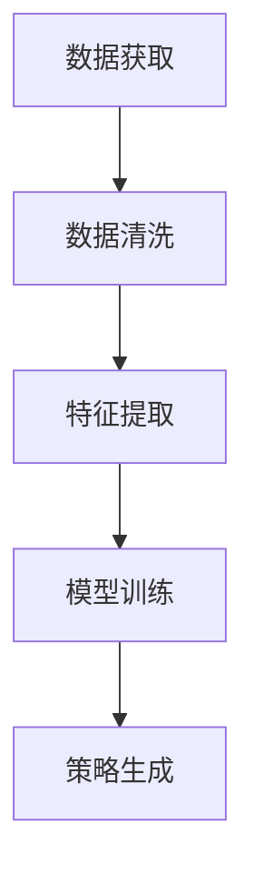
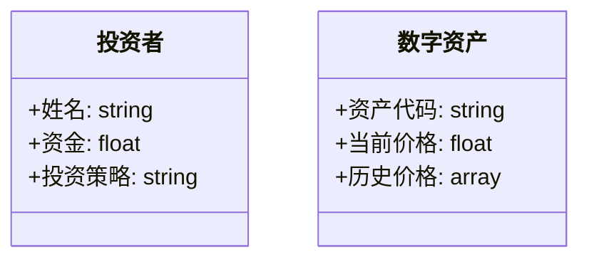

                 


# 如何利用特价股票策略进行全球数字价值网络投资

## 关键词
特价股票、全球数字价值网络、量化投资、算法交易、投资策略

## 摘要
本文探讨如何利用特价股票策略在全球数字价值网络中进行投资。通过分析特价股票的定义、原理及全球数字价值网络的概念，结合量化投资和算法交易，构建一个高效的数字价值网络投资系统。文章详细讲解了特价股票识别算法、数学模型、系统架构设计及实际案例分析，为投资者提供科学的投资策略。

## 第一章: 特价股票策略的定义与背景

### 1.1 特价股票策略的定义
#### 1.1.1 特价股票的定义与特征
特价股票是指市场估值低于其内在价值的股票。其特征包括低市盈率、低市净率、高股息率等。

#### 1.1.2 特价股票策略的起源与发展
起源于价值投资理论，发展过程中结合了技术分析和量化方法。

#### 1.1.3 特价股票策略的核心目标
通过识别低估股票，实现超额收益。

### 1.2 全球数字价值网络的概念
#### 1.2.1 数字经济的定义与特征
数字经济是基于数字技术的经济活动，具有高效、透明、可扩展的特点。

#### 1.2.2 全球数字价值网络的构建
通过数字技术将全球市场、资产和参与者连接起来，形成价值传递网络。

#### 1.2.3 数字价值网络与投资的关系
数字技术降低了投资门槛，提高了信息透明度，促进了全球投资。

## 第二章: 特价股票策略的核心概念与联系

### 2.1 特价股票策略的核心原理
#### 2.1.1 市场情绪与股票价格的关系
市场情绪影响股票价格波动，可以通过情绪指标预测价格变化。

#### 2.1.2 市场波动性与投资机会
市场波动性高的时期，特价股票更容易出现。

#### 2.1.3 特价股票的识别方法
通过财务指标、估值指标和技术指标筛选低估股票。

### 2.2 全球数字价值网络的实体关系图


## 第三章: 特价股票策略的算法原理

### 3.1 特价股票识别算法


## 第四章: 数学模型与公式

### 4.1 特价股票识别的数学模型
$$ P = \alpha \times M + \beta \times V + \epsilon $$

### 4.2 数字价值网络的价值评估公式
$$ V = \sum_{i=1}^{n} w_i \times f_i $$

## 第五章: 系统分析与架构设计

### 5.1 系统功能设计


## 第六章: 项目实战

### 6.1 环境配置
安装必要的Python库，如pandas、numpy、scikit-learn等。

### 6.2 核心代码实现
```python
import pandas as pd
import numpy as np

def calculate_market_momentum(data):
    return data['收盘价'].rolling(20).mean()

data = pd.read_csv('stock_data.csv')
momentum = calculate_market_momentum(data)
```

### 6.3 案例分析
分析某只股票的历史数据，计算其市场动量，验证模型的有效性。

## 第七章: 总结与展望

### 7.1 小结
本文详细讲解了如何利用特价股票策略进行全球数字价值网络投资，从理论到实践提供了全面指导。

### 7.2 注意事项
投资者需注意市场风险，避免过度依赖单一策略。

### 7.3 拓展阅读
推荐阅读《量化投资入门》等书籍，深入学习相关知识。

