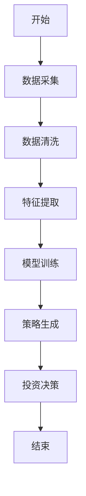
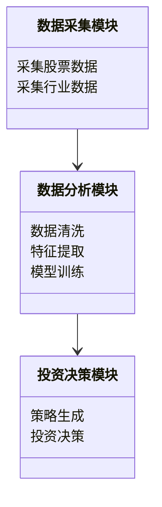

                 


# 如何利用特价股票策略进行逆向数字产业生态投资

> 关键词：特价股票策略、逆向投资、数字产业生态、股票投资、投资策略

> 摘要：本文详细介绍了如何利用特价股票策略进行逆向数字产业生态投资。首先，从特价股票策略和逆向投资的基本概念出发，分析了两者在数字产业生态中的应用。接着，通过详细讲解特价股票策略的核心概念、算法原理、系统架构设计等，结合实际案例，展示了如何在数字产业中实现逆向投资。最后，总结了最佳实践和投资注意事项，为读者提供了全面的指导。

---

## 第一部分: 特价股票策略与逆向投资概述

### 第1章: 特价股票策略的背景与概念

#### 1.1 特价股票策略的定义与特点
特价股票策略是一种基于市场波动和公司基本面分析的投资策略，旨在在市场低估时买入优质股票，长期持有，待市场回升时卖出获利。其核心特点包括：
- **低估值**：重点关注市盈率、市净率等估值指标，寻找被市场低估的股票。
- **逆周期性**：在市场低迷时寻找机会，逆市买入。
- **长期持有**：避免频繁交易，降低交易成本，追求长期收益。

#### 1.2 逆向投资的基本原理
逆向投资是一种与市场情绪相反的投资策略，即在市场恐慌时买入，在市场狂热时卖出。其核心思想是“别人恐惧时我贪婪，别人贪婪时我恐惧”。在数字产业中，逆向投资需要结合行业周期和公司基本面，寻找被市场忽视的投资机会。

#### 1.3 数字产业生态的现状与趋势
数字产业包括科技、互联网、人工智能、大数据等多个领域。随着技术进步和数字化转型的加速，数字产业成为经济增长的重要驱动力。然而，数字产业也存在周期性波动，投资者需要结合行业趋势和市场情绪，寻找逆向投资的机会。

---

### 第2章: 特价股票策略与逆向投资的结合

#### 2.1 特价股票策略在数字产业中的应用
在数字产业中，特价股票策略可以通过以下步骤实现：
1. **筛选低估值股票**：通过市盈率、市净率等指标筛选出被市场低估的股票。
2. **行业分析**：结合行业周期和市场趋势，选择具有长期增长潜力的行业。
3. **公司基本面分析**：分析公司的财务状况、盈利能力、管理团队等，选择优质公司。

#### 2.2 逆向投资在数字产业中的应用
逆向投资在数字产业中的应用包括：
1. **市场恐慌时买入**：当市场因短期波动而恐慌时，寻找被错杀的优质股票。
2. **行业低谷时布局**：在行业周期性低谷时，布局具有长期增长潜力的公司。
3. **风险控制**：通过分散投资、设置止损位等方法，降低投资风险。

#### 2.3 特价股票策略与逆向投资的联系
特价股票策略与逆向投资的结合，可以最大化投资收益。逆向投资提供了市场时机选择的依据，而特价股票策略提供了具体的选股标准。两者结合，可以在市场低估时买入优质股票，长期持有，获得超额收益。

---

## 第二部分: 特价股票策略的核心概念与联系

### 第3章: 特价股票策略的核心原理

#### 3.1 特价股票的筛选标准
1. **市盈率（P/E）**：P/E < 市场平均值或行业平均值。
2. **市净率（P/B）**：P/B < 1。
3. **股息率**：股息率 > 市场平均值。
4. **ROE**：ROE > 10%。

#### 3.2 特价股票的估值方法
1. **相对估值法**：市盈率、市净率等指标与行业或市场平均水平进行比较。
2. **绝对估值法**：DCF模型、股息贴现模型等方法估算公司内在价值。

#### 3.3 特价股票的市场周期分析
市场周期分为牛市、熊市、震荡市等阶段。在熊市中，市场估值较低，是寻找特价股票的好时机。

---

### 第4章: 逆向投资的核心原理

#### 4.1 逆向投资的市场时机选择
1. **市场恐慌时**：市场恐慌时，投资者情绪低落，股票价格可能被低估。
2. **市场狂热时**：市场狂热时，投资者情绪高涨，股票价格可能被高估。

#### 4.2 逆向投资的行业分析方法
1. **行业周期分析**：选择处于周期低谷的行业，布局具有长期增长潜力的公司。
2. **行业竞争分析**：选择具有竞争优势的公司。

#### 4.3 逆向投资的风险控制策略
1. **分散投资**：避免集中投资于单一行业或公司。
2. **设置止损位**：当股价下跌到一定程度时，及时止损。

---

## 第三部分: 特价股票策略的算法原理与系统架构

### 第5章: 特价股票策略的算法原理

#### 5.1 算法流程图


#### 5.2 数学模型与公式
1. **市盈率计算公式**：
   $$ P/E = \frac{\text{股价}}{\text{每股收益}} $$
2. **市净率计算公式**：
   $$ P/B = \frac{\text{股价}}{\text{每股净资产}} $$

---

### 第6章: 系统架构设计

#### 6.1 系统功能设计
1. **数据采集模块**：采集股票数据、行业数据等。
2. **数据分析模块**：对数据进行清洗、特征提取和模型训练。
3. **投资决策模块**：根据模型结果生成投资策略。

#### 6.2 系统架构图


---

## 第四部分: 项目实战与最佳实践

### 第7章: 项目实战

#### 7.1 环境安装
1. **Python环境**：安装Python 3.x。
2. **库的安装**：安装pandas、numpy、scikit-learn等库。

#### 7.2 核心代码实现
```python
import pandas as pd
import numpy as np

# 数据采集
data = pd.read_csv('stock_data.csv')

# 数据清洗
data = data.dropna()

# 特征提取
features = data[['P/E', 'P/B', 'ROE', '股息率']]
```

#### 7.3 案例分析
案例：假设某数字公司股票市盈率为10，行业平均市盈率为15，公司ROE为12%，股息率为5%。根据特价股票策略，该股票具有投资价值。

---

### 第8章: 最佳实践与小结

#### 8.1 投资策略总结
1. **逆向思维**：在市场恐慌时寻找机会。
2. **价值投资**：选择低估值、高ROE的公司。
3. **风险控制**：分散投资、设置止损位。

#### 8.2 注意事项
1. **市场风险**：市场波动可能影响投资收益。
2. **公司风险**：公司基本面变化可能影响股价。
3. **操作风险**：投资策略的执行可能受到市场环境的影响。

#### 8.3 小结
通过特价股票策略和逆向投资的结合，投资者可以在数字产业中寻找低估的投资机会，实现长期稳健的收益。然而，投资需谨慎，建议投资者结合市场环境和自身风险承受能力，制定合理的投资策略。

---

## 结语

利用特价股票策略进行逆向数字产业生态投资，需要结合市场周期、公司基本面和行业趋势，选择低估的优质股票。通过科学的算法和系统的架构设计，投资者可以更好地把握投资机会，实现超额收益。希望本文的分析和案例能够为投资者提供有价值的参考。

