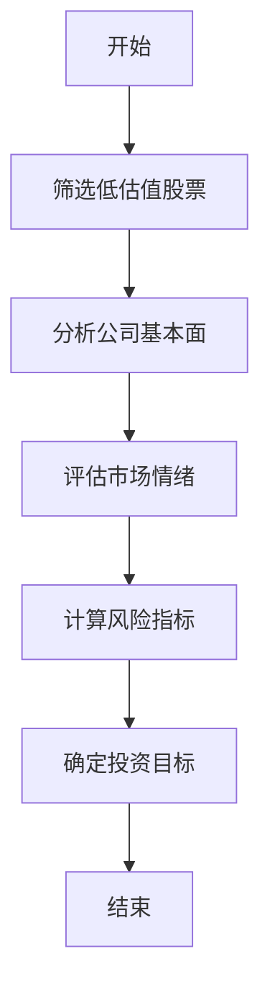
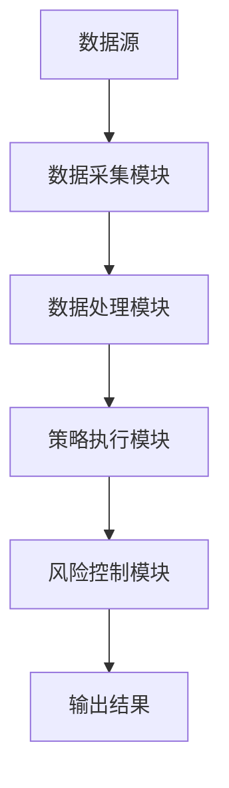
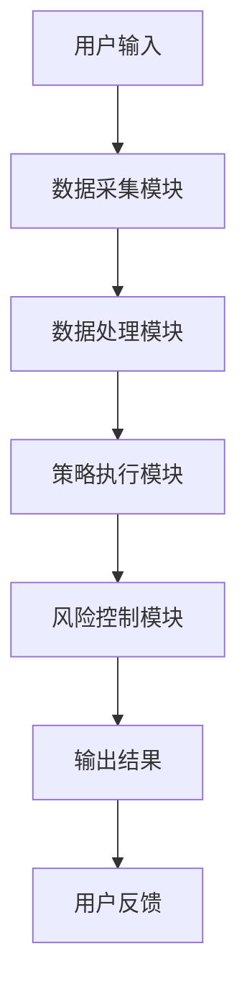

                 


# 如何利用特价股票策略进行长期财富积累

> 关键词：特价股票，长期投资，价值投资，股票策略，财富积累

> 摘要：本文详细探讨了如何通过特价股票策略实现长期财富积累。从特价股票的基本概念到具体的策略实施，文章系统地介绍了特价股票策略的核心原理、算法模型、系统架构以及实际案例。通过本文，读者可以全面理解特价股票策略的优势，并掌握如何在实际投资中应用这些策略来实现财富的稳步增长。

---

## 目录

### 第1章 特价股票策略的背景与概念

#### 1.1 特价股票的定义与特点
- 1.1.1 什么是特价股票
- 1.1.2 特价股票的特点
- 1.1.3 特价股票与普通股票的区别

#### 1.2 特价股票策略的背景
- 1.2.1 股票市场的基本运作机制
- 1.2.2 特价股票策略的起源与发展
- 1.2.3 特价股票策略的适用场景

#### 1.3 特价股票策略的核心优势
- 1.3.1 成本优势
- 1.3.2 风险控制
- 1.3.3 长期收益潜力

#### 1.4 特价股票策略的局限性
- 1.4.1 市场波动风险
- 1.4.2 信息不对称问题
- 1.4.3 时间成本与耐心投资

---

### 第2章 特价股票策略的核心概念与联系

#### 2.1 特价股票策略的核心原理
- 2.1.1 市场有效性的假设
- 2.1.2 价值发现的逻辑
- 2.1.3 股价波动与投资机会

#### 2.2 特价股票策略的关键要素
- 2.2.1 公司基本面分析
- 2.2.2 市场情绪分析
- 2.2.3 财务指标筛选

#### 2.3 特价股票策略与其它投资策略的对比
- 2.3.1 价值投资 vs. 股价投资
- 2.3.2 长期投资 vs. 短期交易
- 2.3.3 特价股票策略的定位

---

### 第3章 特价股票策略的算法原理

#### 3.1 特价股票筛选算法
- 3.1.1 算法的基本思路
- 3.1.2 算法的实现步骤
- 3.1.3 算法的优化与改进

#### 3.2 算法流程图


#### 3.3 算法的数学模型
- 3.3.1 市盈率（P/E）计算公式
  $$ P/E = \frac{\text{股价}}{\text{每股收益}} $$
- 3.3.2 市净率（P/B）计算公式
  $$ P/B = \frac{\text{股价}}{\text{每股净资产}} $$
- 3.3.3 预测模型（简单线性回归）
  $$ y = a + bx $$

#### 3.4 算法的Python实现
```python
import pandas as pd

def filter_cheap_stocks(dataframe):
    # 计算市盈率和市净率
    dataframe['PE'] = dataframe['股价'] / dataframe['每股收益']
    dataframe['PB'] = dataframe['股价'] / dataframe['每股净资产']
    
    # 筛选低估值股票
    cheap_stocks = dataframe[(dataframe['PE'] < dataframe['PE'].mean()) &
                              (dataframe['PB'] < dataframe['PB'].mean())]
    
    return cheap_stocks

# 示例数据
data = {
    '股票代码': ['A', 'B', 'C', 'D'],
    '股价': [10, 20, 15, 25],
    '每股收益': [2, 5, 3, 6],
    '每股净资产': [5, 8, 4, 10]
}

df = pd.DataFrame(data)
result = filter_cheap_stocks(df)
print(result)
```

---

### 第4章 特价股票策略的系统分析与架构设计

#### 4.1 系统功能设计
- 4.1.1 数据采集模块
- 4.1.2 数据处理模块
- 4.1.3 策略执行模块
- 4.1.4 风险控制模块

#### 4.2 系统架构图


#### 4.3 系统接口设计
- 4.3.1 数据接口
- 4.3.2 策略接口
- 4.3.3 风险控制接口

#### 4.4 系统交互流程图


---

### 第5章 特价股票策略的项目实战

#### 5.1 环境安装与配置
- 5.1.1 安装Python环境
- 5.1.2 安装数据处理库（Pandas, NumPy）
- 5.1.3 数据源获取与清洗

#### 5.2 核心代码实现
```python
import pandas as pd
import numpy as np

def main():
    # 示例数据
    data = {
        '股票代码': ['A', 'B', 'C', 'D'],
        '股价': [10, 20, 15, 25],
        '每股收益': [2, 5, 3, 6],
        '每股净资产': [5, 8, 4, 10]
    }
    
    df = pd.DataFrame(data)
    
    # 筛选低估值股票
    cheap_stocks = filter_cheap_stocks(df)
    print(" Cheap Stocks:")
    print(cheap_stocks)
    
    # 风险评估
    risk_assessment(cheap_stocks)
    
if __name__ == "__main__":
    main()
```

#### 5.3 实际案例分析
- 5.3.1 案例背景
- 5.3.2 数据分析与策略选择
- 5.3.3 策略执行与结果评估

---

### 第6章 特价股票策略的最佳实践与注意事项

#### 6.1 最佳实践
- 6.1.1 长期投资的重要性
- 6.1.2 风险控制的必要性
- 6.1.3 信息收集的全面性

#### 6.2 小结
- 6.2.1 策略总结
- 6.2.2 投资心态的重要性
- 6.2.3 持续学习与优化

#### 6.3 注意事项
- 6.3.1 避免情绪化决策
- 6.3.2 控制仓位与杠杆
- 6.3.3 定期复盘与调整

#### 6.4 拓展阅读
- 6.4.1 推荐书籍
- 6.4.2 相关研究论文
- 6.4.3 在线资源与工具

---

### 结语

通过本文的系统讲解，读者可以全面了解特价股票策略的核心原理、算法模型、系统架构以及实际案例。希望本文能为投资者提供有价值的参考，帮助他们在股票市场中实现长期财富积累。投资有风险，入市需谨慎，读者在实际操作中应结合自身情况，审慎决策。

