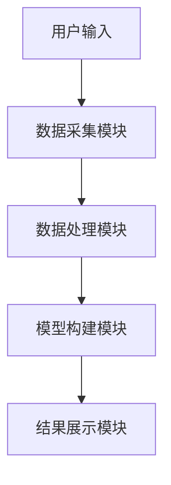

                 

# 如何在企业估值中考虑宏观经济因素

> 关键词：企业估值，宏观经济因素，经济周期，利率，汇率，行业风险，财务模型

> 摘要：本文详细探讨了在企业估值过程中如何考虑宏观经济因素。从基本概念到具体影响，再到实际应用，系统性地分析了宏观经济因素对企业估值的多方面影响。通过实际案例和数学模型，本文为读者提供了如何将宏观经济因素纳入企业估值过程的方法和工具。

---

## 第一部分：宏观经济对企业估值的背景介绍

### 第1章：企业估值的基本概念

#### 1.1 宏观经济的定义与作用
- 宏观经济是研究整体经济系统的行为和现象，包括GDP、利率、通货膨胀等核心指标。
- 宏观经济因素直接影响企业经营环境，进而影响企业估值。

#### 1.2 企业估值的核心概念
- 企业估值是通过财务指标、市场数据和模型计算企业价值的过程。
- 常见的估值方法包括市盈率法、现金流折现法（DCF）等。

#### 1.3 宏观经济与企业估值的关系
- 宏观经济因素如经济周期、利率和汇率直接影响企业的收入、成本和利润，从而影响估值。
- 宏观经济分析是企业估值的重要组成部分，帮助投资者做出更准确的决策。

---

## 第二部分：宏观经济因素对企业估值的核心影响

### 第2章：宏观经济因素的分类与影响机制

#### 2.1 经济周期对企业估值的影响
- 经济周期分为扩张期、衰退期、萧条期和复苏期。
- 在扩张期，企业收入和利润增长，估值上升；在衰退期，反之。

#### 2.2 利率对企业估值的影响
- 利率上升会增加企业融资成本，降低企业利润和估值。
- 利率下降通常会提高企业估值，因为资本成本降低。

#### 2.3 汇率对企业估值的影响
- 汇率波动影响出口型企业收入和利润，进而影响估值。
- 外汇波动可能导致企业财务状况变化，影响估值模型的输入参数。

---

## 第三部分：宏观经济因素对企业价值的具体分析

### 第3章：收入和成本的宏观经济分析

#### 3.1 收入的宏观经济驱动因素
- 经济增长：GDP增长带动企业收入增长。
- 就业率：高就业率通常意味着更高的消费能力，间接影响企业收入。

#### 3.2 成本的宏观经济驱动因素
- 原材料价格：通货膨胀可能导致成本上升。
- 劳动力成本：工资水平上升直接影响企业成本。

#### 3.3 利润的宏观经济分析
- 利润 = 收入 - 成本，宏观经济因素直接影响收入和成本，从而影响利润。

---

## 第四部分：宏观经济分析在企业估值中的应用

### 第4章：宏观经济分析的基本框架

#### 4.1 宏观经济分析的步骤
1. 确定宏观经济指标：GDP、CPI、失业率、利率等。
2. 分析经济周期：判断当前所处的经济周期阶段。
3. 评估行业风险：不同行业对宏观经济因素的敏感性不同。
4. 结合财务数据：将宏观经济因素与企业财务数据结合，调整估值模型。

#### 4.2 宏观经济分析的具体工具
- 财务模型：使用Excel或Python进行DCF模型构建。
- 行业趋势分析：分析行业历史数据和未来趋势。

---

## 第五部分：系统分析与架构设计

### 第5章：企业估值系统的架构设计

#### 5.1 系统功能设计
- 数据采集：收集宏观经济指标和企业财务数据。
- 数据处理：清洗和转换数据，为模型准备数据。
- 模型构建：基于宏观经济因素构建企业估值模型。
- 结果展示：可视化估值结果和敏感性分析。

#### 5.2 系统架构设计

#### 5.3 系统接口设计
- 数据接口：与宏观经济数据库和企业财务系统的接口。
- 用户接口：友好的用户界面，方便输入数据和查看结果。

---

## 第六部分：项目实战

### 第6章：实际案例分析

#### 6.1 案例背景
- 某制造企业，面临原材料价格上涨和利率上升的宏观经济环境。

#### 6.2 数据收集与处理
- 收集过去5年的GDP、CPI、利率数据。
- 整理企业过去5年的收入、成本和利润数据。

#### 6.3 模型构建与调整
- 使用DCF模型，将宏观经济因素纳入模型，调整折现率和现金流预测。

#### 6.4 结果分析
- 宏观经济因素对企业估值的影响显著，原材料价格上涨导致估值下调，利率上升进一步加剧影响。

---

## 第七部分：总结与展望

### 第7章：总结与注意事项

#### 7.1 核心结论
- 宏观经济因素对企业估值有显著影响，需在模型中充分考虑。
- 不同行业对宏观经济因素的敏感性不同，需针对性分析。

#### 7.2 小结
- 通过系统化的宏观经济分析，可以提高企业估值的准确性和可靠性。
- 宏观经济分析是企业估值的重要组成部分，值得深入研究和应用。

---

## 第八部分：扩展阅读

### 第8章：深入学习与实践

#### 8.1 相关书籍推荐
- 《企业估值实战：宏观经济视角》
- 《财务模型构建与宏观经济分析》

#### 8.2 实践建议
- 多进行实际案例分析，结合宏观经济数据和企业财务数据。
- 持续关注宏观经济变化，及时调整估值模型。

---

通过以上步骤，我们可以系统性地考虑宏观经济因素对企业估值的影响，帮助投资者和企业在复杂多变的经济环境中做出更明智的决策。

