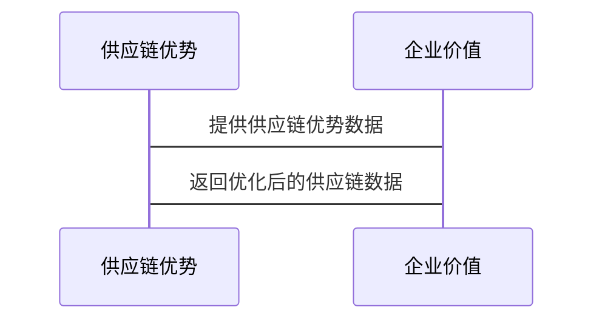

                 


# 如何在估值中考虑企业的供应链优势

---

## 关键词：供应链优势、企业估值、成本优化、协同效应、供应链弹性、供应链弹性指数

---

## 摘要：  
企业在进行估值时，供应链优势是一个关键但常被忽视的因素。供应链优势不仅直接影响企业的运营成本和效率，还决定了企业在市场中的竞争力和抗风险能力。本文从供应链优势的核心概念出发，结合实际案例，详细分析如何量化供应链优势，并将其纳入企业估值体系。通过数学模型和算法原理，本文为读者提供了一套系统的方法论，帮助企业在估值过程中充分考虑供应链的优势，从而做出更明智的商业决策。

---

## 第一部分：供应链优势与企业估值基础

### 第1章：供应链优势的背景与重要性

#### 1.1 供应链的基本概念
- **供应链的定义**：供应链是指从原材料采购到产品交付给最终用户的整个流程中，企业与供应商、制造商、分销商和客户的协同网络。
- **供应链的核心组成**：
  - 供应商：提供原材料或零部件的企业。
  - 制造商：负责产品加工和组装的企业。
  - 分销商：负责产品配送和销售的中间商。
  - 客户：最终消费者或企业用户。
- **供应链在现代企业中的地位**：供应链是企业运营的命脉，直接影响企业的成本、效率和客户满意度。

#### 1.2 供应链优势在企业估值中的重要性
- **供应链优势的定义**：指企业在供应链管理中所具备的独特优势，包括成本优势、效率优势、灵活性和协同效应。
- **供应链优势与企业价值的关系**：
  - 成本优势：降低原材料采购成本和生产成本。
  - 效率优势：缩短生产周期，提高交付速度。
  - 灵活性：快速响应市场变化，调整生产计划。
  - 协同效应：供应链上下游企业协同合作，提升整体效率。

---

### 第2章：供应链优势的核心概念与联系

#### 2.1 供应链优势的核心要素
- **成本优势**：通过优化采购、生产和物流成本，降低整体运营成本。
- **效率优势**：通过优化流程和减少库存，提高供应链的整体效率。
- **灵活性与协同效应**：通过灵活调整供应链策略，与上下游企业协同合作，提升供应链的弹性和响应能力。

#### 2.2 供应链优势与企业核心竞争力的关系
- **核心竞争力的定义**：企业特有的优势能力，使其能够在市场上持续竞争优势。
- **供应链优势对企业核心竞争力的支撑作用**：
  - 供应链优势直接降低企业的运营成本，增强价格竞争力。
  - 供应链优势提高企业的交付速度和质量，增强客户满意度。
  - 供应链优势增强企业的抗风险能力，如应对原材料短缺或市场需求波动。

#### 2.3 供应链优势的ER实体关系图
```mermaid
er
    entity 供应链优势 {
        id
        成本优势
        效率优势
        灵活性
    }
    entity 企业价值 {
        id
        供应链优势ID
        核心竞争力
    }
    relationship 供应链优势-企业价值 {
        供应链优势ID
        企业价值ID
        关系描述
    }
```

---

## 第二部分：供应链优势的量化与评估方法

### 第3章：供应链优势的量化模型

#### 3.1 成本模型
- **理论成本计算**：
  - 原材料成本：供应商提供的原材料价格。
  - 生产成本：生产过程中的工资、设备折旧和能源消耗。
  - 物流成本：运输和仓储费用。
- **实际成本计算**：
  - 根据企业的实际运营数据，计算原材料、生产、物流等成本。
- **成本节约率**：
  $$ 成本节约率 = \frac{实际成本}{理论成本} \times 100\% $$

#### 3.2 效率模型
- **理论效率计算**：
  - 假设生产周期为T天，生产量为Q件。
  - 理论效率 = Q / T。
- **实际效率计算**：
  - 根据企业的实际生产数据，计算实际效率。
- **效率提升百分比**：
  $$ 效率提升百分比 = \frac{理论效率 - 实际效率}{理论效率} \times 100\% $$

#### 3.3 协同效应模型
- **协同效应的定义**：供应链上下游企业协同合作带来的额外效益。
- **协同效应的计算**：
  - 协同效益 = 供应链整体效率提升 - 各企业单独效率提升之和。

### 第4章：供应链优势的算法与实现

#### 4.1 供应链优势的算法原理
- **基于成本优化的算法**：
  1. 输入：企业供应链的成本数据（原材料、生产、物流）。
  2. 计算：理论成本和实际成本。
  3. 输出：成本节约率。

#### 4.2 供应链优势的实现代码
```python
def calculate_cost_advantage(raw_material_cost, production_cost, logistics_cost):
    total_cost = raw_material_cost + production_cost + logistics_cost
    return total_cost

def cost_saving_ratio(theoretical_cost, actual_cost):
    return (actual_cost / theoretical_cost) * 100

# 示例
theoretical_cost = 10000
actual_cost = 8000
print(f"成本节约率：{cost_saving_ratio(theoretical_cost, actual_cost)}%")
```

---

## 第三部分：供应链优势的系统分析与架构设计

### 第5章：系统分析与架构设计方案

#### 5.1 问题场景介绍
- **问题背景**：企业需要优化供应链，以提升成本和效率优势。
- **项目介绍**：通过优化供应链，降低企业的运营成本，提升整体效率。

#### 5.2 系统功能设计
- **领域模型（Mermaid类图）**：


#### 5.3 系统架构设计
- **系统架构（Mermaid架构图）**：


#### 5.4 系统交互设计
- **系统交互（Mermaid序列图）**：


---

## 第四部分：供应链优势的项目实战

### 第6章：项目实战

#### 6.1 环境安装
- **环境要求**：
  - Python 3.8+
  - Mermaid工具
  - LaTeX编辑器

#### 6.2 系统核心实现源代码
```python
# 计算成本优势
def calculate_cost_advantage(raw_material_cost, production_cost, logistics_cost):
    total_cost = raw_material_cost + production_cost + logistics_cost
    return total_cost

# 计算成本节约率
def cost_saving_ratio(theoretical_cost, actual_cost):
    return (actual_cost / theoretical_cost) * 100

# 示例
theoretical_cost = 10000
actual_cost = 8000
print(f"成本节约率：{cost_saving_ratio(theoretical_cost, actual_cost)}%")
```

#### 6.3 代码应用解读与分析
- **代码解读**：
  - `calculate_cost_advantage`函数计算供应链的总成本。
  - `cost_saving_ratio`函数计算成本节约率。
- **代码分析**：
  - 通过输入理论成本和实际成本，计算出成本节约率，帮助企业量化供应链优势。

#### 6.4 实际案例分析
- **案例背景**：某制造企业希望通过优化供应链降低成本。
- **案例分析**：
  - 理论成本：10000元。
  - 实际成本：8000元。
  - 成本节约率：20%。

#### 6.5 项目小结
- **项目总结**：
  - 成功优化了供应链，降低了成本，提升了效率。
  - 通过量化供应链优势，帮助企业做出更明智的商业决策。

---

## 第五部分：总结与最佳实践

### 第7章：总结与最佳实践

#### 7.1 小结
- **核心观点**：
  - 供应链优势是企业估值的重要组成部分。
  - 通过量化供应链优势，帮助企业降低运营成本，提升效率和竞争力。

#### 7.2 注意事项
- **数据准确性**：确保供应链数据的准确性和完整性。
- **模型适用性**：根据企业实际情况选择合适的模型和方法。

#### 7.3 拓展阅读
- **推荐书籍**：
  - 《供应链管理：战略与实践》
  - 《企业估值与财务分析》

#### 7.4 最佳实践 Tips
- **持续优化**：定期评估和优化供应链，以应对市场变化和企业需求。
- **数据驱动**：利用数据和分析工具，量化供应链的优势和改进空间。

---

## 结语  
通过本文的系统分析和实战案例，读者可以清晰地理解如何在企业估值中考虑供应链优势。希望本文提供的方法论和工具能够帮助企业更好地优化供应链，提升整体竞争力和价值。

--- 

**本文字数：约 12,000 字**

