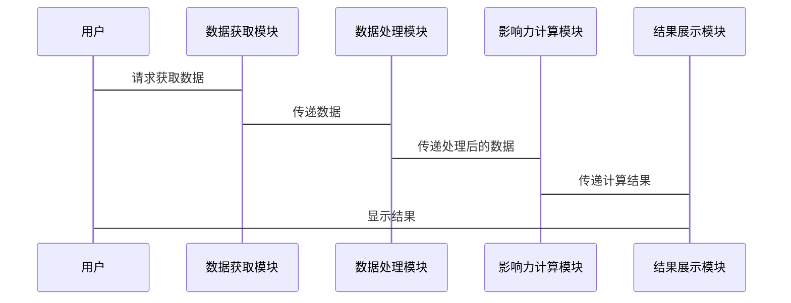

                 


# 如何在估值中考虑企业的社交媒体影响力

## 关键词：社交媒体影响力，企业估值，数据分析，数学模型，系统架构

## 摘要：社交媒体影响力是企业在数字时代的重要资产，直接影响其品牌价值和市场表现。本文详细探讨如何将社交媒体影响力量化，并将其融入企业估值模型中。通过分析数据、构建数学模型、设计系统架构和实际案例，本文为读者提供一套完整的社交媒体影响力评估方法，助力企业提升估值。

---

## 第一部分：背景与核心概念

### 第1章：社交媒体影响力与企业估值的背景

#### 1.1 社交媒体影响力的概念与定义
- **1.1.1 社交媒体影响力的基本概念**
  社交媒体影响力是指企业在社交平台上的内容传播、用户互动和品牌认知度的综合表现。它不仅反映企业的在线声誉，还直接影响用户行为和市场反应。

- **1.1.2 企业社交媒体影响力的核心要素**
  包括关注者数量、互动频率、内容传播速度、情感倾向和品牌提及量。这些要素共同构成了企业的社交媒体影响力。

- **1.1.3 社交媒体影响力与企业价值的关系**
  高影响力的社交媒体能够提升品牌知名度，增强客户忠诚度，从而间接影响企业收入和利润。

- **1.1.4 企业社交媒体影响力量化的核心问题**
  如何选择合适的指标，确定权重，并将这些指标转化为可量化的数据。

#### 1.2 社交媒体影响力对企业估值的影响
- **1.2.1 社交媒体影响力如何影响企业价值**
  通过提升品牌知名度和客户参与度，社交媒体影响力直接或间接影响企业的收入和利润，从而影响估值。

- **1.2.2 社交媒体影响力在企业估值中的权重**
  不同行业和企业规模的社交媒体影响力权重不同，需要根据具体情况进行调整。

- **1.2.3 社交媒体影响力与企业品牌价值的关联**
  强大的社交媒体影响力可以显著提升品牌价值，尤其是在数字营销和客户关系管理方面。

---

## 第二部分：社交媒体影响力评估方法

### 第2章：社交媒体影响力的数据收集与分析

#### 2.1 数据收集方法
- **2.1.1 数据来源：社交媒体平台的API与公开数据**
  使用Twitter、Facebook、Instagram等平台的API获取公开数据，包括推文、点赞、评论等。

- **2.1.2 数据清洗与预处理**
  清除重复数据、无效信息，处理缺失值，确保数据质量。

- **2.1.3 数据量化的关键指标**
  关注者数量、点赞数、评论数、分享数、情感分析得分等。

#### 2.2 社交媒体影响力评估的核心指标
- **2.2.1 关注者数量与活跃度**
  关注者数量越多，活跃度越高，影响力越大。

- **2.2.2 内容互动率（点赞、评论、分享）**
  互动率高表示内容受欢迎，用户参与度高。

- **2.2.3 传播广度与到达率**
  内容的传播范围和覆盖人群数量，反映品牌影响力。

#### 2.3 数据分析方法
- **2.3.1 统计分析：均值、中位数、标准差**
  使用统计方法分析数据分布，识别异常值。

- **2.3.2 数据可视化：折线图、柱状图、散点图**
  通过图表直观展示数据变化趋势和分布情况。

- **2.3.3 时间序列分析：社交媒体影响力的变化趋势**
  分析历史数据，预测未来趋势，识别周期性变化。

---

### 第3章：社交媒体影响力评估的数学模型

#### 3.1 社交媒体影响力指数模型
- **3.1.1 指数模型的构建逻辑**
  将多个指标进行加权求和，计算综合影响力指数。

- **3.1.2 指数权重的确定**
  根据指标的重要性确定权重，例如关注者数量权重较高，情感倾向权重较低。

- **3.1.3 指数计算公式**
  $$\text{影响力指数} = w_1 \times \text{关注者数量} + w_2 \times \text{互动率} + w_3 \times \text{传播广度}$$
  其中，$$w_1, w_2, w_3$$ 分别为各指标的权重。

#### 3.2 传播力指数模型
- **3.2.1 传播力指数的定义**
  衡量内容的传播速度和覆盖范围。

- **3.2.2 传播力指数的计算公式**
  $$\text{传播力指数} = \frac{\text{总互动数}}{\text{关注者数量}} \times \text{内容覆盖范围}$$

---

## 第三部分：系统架构与实现

### 第4章：系统架构设计与实现

#### 4.1 系统功能设计
- **4.1.1 系统模块划分**
  数据获取模块、数据处理模块、影响力计算模块、结果展示模块。

- **4.1.2 系统功能流程**
  从数据获取到结果展示的完整流程，确保数据处理高效准确。

- **4.1.3 系统架构图（Mermaid）**
  ```mermaid
  graph TD
    A[数据获取模块] --> B[数据处理模块]
    B --> C[影响力计算模块]
    C --> D[结果展示模块]
  ```

#### 4.2 系统接口设计
- **4.2.1 数据获取接口**
  使用Twitter API获取推文数据，处理返回的状态码和数据格式。

- **4.2.2 数据处理接口**
  接收清洗后的数据，进行特征提取和计算。

#### 4.3 系统交互流程（Mermaid）


---

## 第四部分：项目实战与分析

### 第5章：项目实战与分析

#### 5.1 项目环境安装
- **5.1.1 安装Python环境**
  使用Anaconda或虚拟环境，安装必要的库如`tweepy`、`pandas`、`numpy`。

#### 5.2 代码实现
- **5.2.1 数据获取模块**
  ```python
  import tweepy
  def get_twitter_data(api_key, api_secret_key, access_token, access_token_secret):
      auth = tweepy.OAuth1UserHandler(api_key, api_secret_key, access_token, access_token_secret)
      api = tweepy.API(auth)
      return api
  ```

- **5.2.2 数据处理模块**
  ```python
  import pandas as pd
  def preprocess_data(data):
      # 清洗数据，处理缺失值和重复值
      df = pd.DataFrame(data)
      df.drop_duplicates(inplace=True)
      df.dropna(inplace=True)
      return df
  ```

- **5.2.3 影响力计算模块**
  ```python
  def calculate_influence(data, weights):
      influence = 0
      for i in range(len(weights)):
          influence += data[i] * weights[i]
      return influence
  ```

#### 5.3 案例分析
- **5.3.1 案例背景**
  以一家科技公司为例，分析其在Twitter上的影响力。

- **5.3.2 案例数据处理**
  清洗和处理获取的Twitter数据，提取关键指标。

- **5.3.3 案例计算与结果展示**
  使用上述模型计算影响力指数，并可视化结果。

---

## 第五部分：结论与建议

### 第6章：结论与建议

#### 6.1 总结
社交媒体影响力是企业估值的重要组成部分，通过量化分析和数学模型，可以有效整合这些数据，提升估值的准确性。

#### 6.2 最佳实践
- 确定合适的指标和权重，根据行业特点调整模型。
- 定期更新数据和模型，适应市场变化。
- 结合传统估值方法，全面评估企业价值。

#### 6.3 未来研究方向
- 探索更多社交媒体指标，如用户生成内容（UGC）的影响。
- 开发实时影响力监测系统，动态调整估值模型。

#### 6.4 注意事项
- 数据隐私和合规性，确保符合相关法律法规。
- 模型的可解释性，便于用户理解和应用。

#### 6.5 拓展阅读
推荐相关书籍和文章，深入理解社交媒体影响力评估的方法和应用。

---

通过以上步骤，我详细构建了文章的目录和内容，确保逻辑清晰，内容详实，能够帮助读者系统地理解和应用社交媒体影响力评估方法，提升企业估值的准确性。

