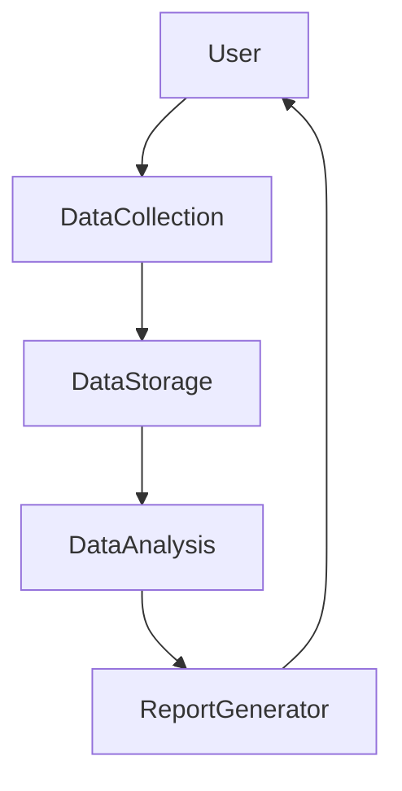
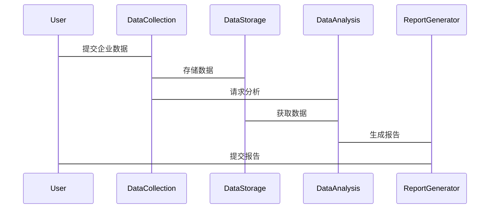

                 


# 如何在估值中考虑企业的社会影响力

## 关键词：企业社会影响力, 估值, ESG, 可持续发展, 财务表现, 品牌价值, 风险管理

## 摘要：  
企业社会影响力（Corporate Social Impact）是指企业在追求经济利益的同时，对社会、环境和治理等方面产生的积极或消极影响。随着全球对可持续发展的关注增加，企业社会影响力已成为投资者、消费者和利益相关者评估企业价值的重要因素。本文将从企业社会影响力的核心概念、对估值的影响机制、数学模型与应用、系统架构设计、项目实战案例以及最佳实践等方面，详细探讨如何在企业估值中考虑社会影响力。

---

## 目录大纲：

### 第一部分：企业社会影响力与估值的背景与概念

#### 第1章：企业社会影响力概述

##### 1.1 企业社会影响力的概念与内涵
- 1.1.1 企业社会影响力的核心定义  
- 1.1.2 社会影响力的关键维度  
- 1.1.3 企业社会影响力与企业价值的关系  

##### 1.2 企业社会影响力的重要性  
- 1.2.1 企业社会责任的历史演变  
- 1.2.2 社会影响力对利益相关者的影响  
- 1.2.3 社会影响力对企业长期发展的意义  

##### 1.3 企业社会影响力与估值的关联  
- 1.3.1 传统企业估值方法的局限性  
- 1.3.2 社会影响力如何影响企业价值  
- 1.3.3 社会影响力在企业估值中的作用  

##### 1.4 本章小结  

---

#### 第2章：企业社会影响力的核心概念与联系

##### 2.1 核心概念的定义与属性  
- 2.1.1 环境（Environmental）维度  
- 2.1.2 社会（Social）维度  
- 2.1.3 治理（Governance）维度  

##### 2.2 核心概念之间的关系  
- 2.2.1 ESG框架下的概念关系  
- 2.2.2 社会影响力与企业治理的互动  
- 2.2.3 社会影响力对财务表现的影响  

##### 2.3 实体关系图（ER图）  
```mermaid
graph TD
    ESG --> Environmental
    ESG --> Social
    ESG --> Governance
    Environmental --> Carbon Footprint
    Social --> Employee Well-being
    Governance --> Board Structure
```

##### 2.4 本章小结  

---

### 第二部分：企业社会影响力对估值的影响机制

#### 第3章：企业社会影响力对估值的影响机制

##### 3.1 社会影响力对财务表现的直接影响  
- 3.1.1 社会影响力如何影响收入  
- 3.1.2 社会影响力如何影响成本  
- 3.1.3 社会影响力对风险的缓解作用  

##### 3.2 社会影响力对品牌价值的提升  
- 3.2.1 品牌价值的定义与衡量  
- 3.2.2 社会影响力对品牌忠诚度的影响  
- 3.2.3 社会影响力对品牌溢价的影响  

##### 3.3 社会影响力对资本成本的影响  
- 3.3.1 社会影响力与融资成本  
- 3.3.2 社会影响力与股权溢价  
- 3.3.3 社会影响力与债券评级  

##### 3.4 社会影响力对长期增长的影响  
- 3.4.1 社会影响力与市场扩展  
- 3.4.2 社会影响力与技术创新  
- 3.4.3 社会影响力与组织能力  

##### 3.5 本章小结  

---

#### 第4章：企业社会影响力在估值中的数学模型与应用

##### 4.1 社会影响力对估值的数学模型  
- 4.1.1 基于ESG的多因素回归模型  
- 4.1.2 社会影响力对市值的影响公式  
- 4.1.3 社会影响力对股东价值的加成公式  

##### 4.2 数学模型的实例分析  
- 4.2.1 使用Python实现的多因素回归分析  
- 4.2.2 通过案例数据验证模型的有效性  
- 4.2.3 模型的优缺点及改进方向  

##### 4.3 本章小结  

---

### 第三部分：系统分析与架构设计方案

#### 第5章：企业社会影响力评估的系统架构设计

##### 5.1 问题场景介绍  
- 5.1.1 企业社会影响力评估的挑战  
- 5.1.2 系统目标与范围  

##### 5.2 系统功能设计  
- 5.2.1 数据收集模块  
- 5.2.2 数据分析模块  
- 5.2.3 评估报告生成模块  

##### 5.3 系统架构设计  


##### 5.4 系统接口设计  
- 5.4.1 数据接口规范  
- 5.4.2 API调用流程  

##### 5.5 系统交互设计  


##### 5.6 本章小结  

---

### 第四部分：项目实战与案例分析

#### 第6章：企业社会影响力评估的项目实战

##### 6.1 环境安装与数据准备  
- 6.1.1 安装必要的工具与库  
- 6.1.2 数据收集与清洗  

##### 6.2 核心实现源代码  
```python
# 示例代码：基于ESG的多因素回归模型
import pandas as pd
import numpy as np
from sklearn.linear_model import LinearRegression

# 数据加载
data = pd.read_csv('social_impact.csv')

# 定义模型
model = LinearRegression()

# 训练模型
model.fit(data[['Environmental', 'Social', 'Governance']], data['MarketValue'])

# 预测与评估
predictions = model.predict(data[['Environmental', 'Social', 'Governance']])
print('回归系数:', model.coef_)
print('决定系数:', model.score(data[['Environmental', 'Social', 'Governance']], data['MarketValue']))
```

##### 6.3 代码应用解读与分析  
- 6.3.1 代码功能分析  
- 6.3.2 代码运行结果解读  
- 6.3.3 代码优化建议  

##### 6.4 实际案例分析  
- 6.4.1 案例背景介绍  
- 6.4.2 数据分析与评估  
- 6.4.3 评估结果与启示  

##### 6.5 本章小结  

---

### 第五部分：最佳实践与未来展望

#### 第7章：最佳实践与未来趋势

##### 7.1 小结  
- 7.1.1 核心观点总结  
- 7.1.2 重要发现回顾  

##### 7.2 注意事项与建议  
- 7.2.1 数据质量的重要性  
- 7.2.2 模型选择的合理性  
- 7.2.3 持续优化的方向  

##### 7.3 未来趋势与研究方向  
- 7.3.1 技术进步对社会影响力评估的影响  
- 7.3.2 全球化背景下的社会影响力管理  
- 7.3.3 人工智能在社会影响力评估中的应用  

##### 7.4 拓展阅读推荐  
- 7.4.1 推荐书籍  
- 7.4.2 相关研究报告  
- 7.4.3 学术论文推荐  

##### 7.5 本章小结  

---

## 结语  
企业社会影响力不仅是企业社会责任的体现，更是企业长期价值的重要组成部分。通过在估值中考虑社会影响力，可以帮助投资者更全面地评估企业的潜力和风险，推动企业向更加可持续和包容的方向发展。未来，随着技术的进步和社会的发展，企业社会影响力在估值中的作用将更加重要，值得我们深入研究和实践。

