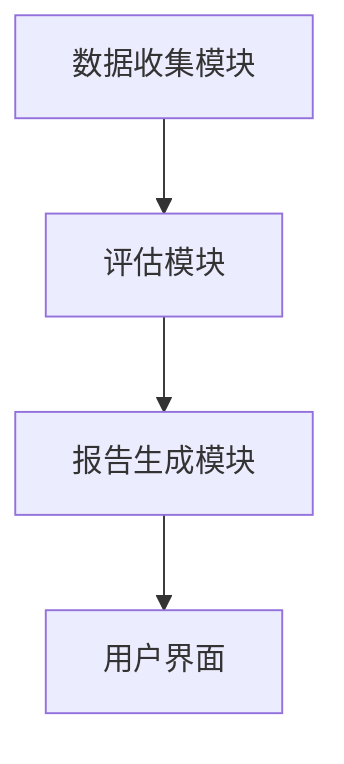

                 


# 如何在估值中考虑企业的社会责任

## 关键词：
企业社会责任, 估值, 财务模型, 可持续发展, 企业价值

## 摘要：
在企业估值过程中，除了财务指标，企业社会责任（Corporate Social Responsibility, CSR）也逐渐成为影响企业价值的重要因素。本文将详细探讨如何将社会责任纳入企业估值模型，分析其对财务表现和社会价值的影响，提供一个综合的评估框架，并通过实际案例展示其应用。

---

## 第一部分：背景介绍

### 第1章：企业社会责任的定义与重要性

#### 1.1 企业社会责任的定义与重要性
企业社会责任是指企业在追求经济利益的同时，对社会、环境和利益相关者承担的义务。其重要性体现在提升企业形象、降低风险、增强长期竞争力等方面。

#### 1.2 传统企业估值方法的局限性
传统财务模型主要关注财务指标，忽视了社会责任带来的长期影响，可能导致估值偏差。

#### 1.3 问题背景与目标
本文旨在探讨如何将社会责任因素整合到企业估值中，构建一个全面的评估框架。

---

## 第二部分：核心概念与联系

### 第2章：企业社会责任的核心概念

#### 2.1 企业社会责任的分类
- 环境责任：减少污染、节约资源。
- 社会责任：公平雇佣、员工福利。
- 治理责任：透明管理、合规经营。

#### 2.2 企业社会责任的影响因素
- 经济因素：成本、收益。
- 社会因素：公众认知、声誉。
- 环境因素：资源消耗、排放。

#### 2.3 企业社会责任与企业价值的关系
社会责任与企业价值呈正相关，良好的社会责任表现能提升企业形象和长期盈利能力。

### 第3章：核心概念的联系与架构

#### 3.1 实体关系图（ER图）
```mermaid
er
  actor(企业)
  actor(利益相关者)
  actor(监管机构)
  actor(公众)
  actor(投资)

  relation(企业) -[承担社会责任]-> (利益相关者)
  relation(企业) -[制定政策]-> (监管机构)
  relation(利益相关者) -[影响企业决策]-> (企业)
  relation(监管机构) -[监管企业行为]-> (企业)
  relation(企业) -[影响投资决策]-> (投资)
```

---

## 第三部分：算法原理

### 第3章：社会责任因素的整合方法

#### 3.1 社会责任评估指标
- 环境指标：碳排放强度、可再生能源使用比例。
- 社会指标：员工满意度、社区贡献。
- 治理指标：董事会多样性、高管薪酬差距。

#### 3.2 权重计算
- 使用层次分析法（AHP）计算各指标的权重。
- 示例：环境、社会、治理的权重分别为0.4、0.3、0.3。

#### 3.3 企业价值评估公式
企业社会责任调整后的价值 = 基准价值 × (1 + ∑(各指标得分 × 权重))

---

## 第四部分：系统分析与架构设计

### 第4章：系统架构设计

#### 4.1 系统功能设计
- 数据收集模块：收集企业社会责任数据。
- 评估模块：计算社会责任得分。
- 报告生成模块：生成评估报告。

#### 4.2 系统架构图


#### 4.3 接口设计
- 数据接口：与企业系统对接。
- 报告接口：生成HTML或PDF报告。

---

## 第五部分：项目实战

### 第5章：案例分析

#### 5.1 环境安装
- 安装Python、数据处理库（Pandas）、可视化库（Matplotlib）。

#### 5.2 核心代码实现
```python
import pandas as pd
import numpy as np

def calculate_social_responsibility_score(data):
    # 加权计算社会责任得分
    weights = {'环境': 0.4, '社会': 0.3, '治理': 0.3}
    scores = []
    for index, row in data.iterrows():
        score = 0
        for category in weights:
            score += row[category] * weights[category]
        scores.append(score)
    return pd.Series(scores, index=data.index)

data = pd.DataFrame({
    '环境': [0.8, 0.7, 0.9],
    '社会': [0.6, 0.8, 0.7],
    '治理': [0.7, 0.6, 0.8]
})

score = calculate_social_responsibility_score(data)
print(score)
```

#### 5.3 案例分析
以某公司为例，计算其社会责任得分，分析对估值的影响。

---

## 第六部分：最佳实践

### 第6章：经验总结

#### 6.1 小结
- 社会责任是企业估值的重要因素。
- 需要结合定量和定性分析。

#### 6.2 注意事项
- 数据来源的可靠性。
- 权重的合理性。

#### 6.3 未来研究方向
- 开发动态评估模型。
- 研究社会责任的长期影响。

#### 6.4 拓展阅读
推荐相关书籍和文章，深入理解社会责任与企业价值的关系。

---

## 结语
通过本文的分析，我们了解了如何在企业估值中考虑社会责任，构建了一个全面的评估框架，并通过案例展示了其应用。未来，随着可持续发展理念的深入，社会责任将在企业估值中发挥越来越重要的作用。

