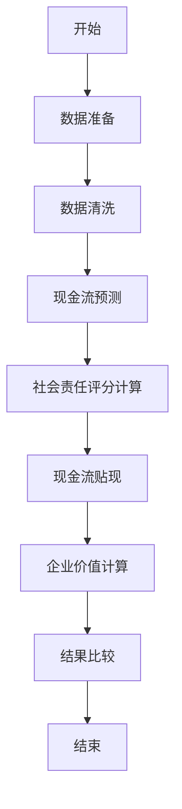
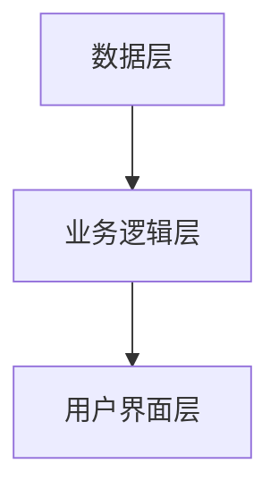

                 


# 第三部分: 数学模型与算法原理

## 第5章: 数学模型与算法原理

### 5.1 基本概念回顾
#### 5.1.1 企业估值的基本概念
#### 5.1.2 社会责任投资的数学表达
#### 5.1.3 DCF模型的基本原理

### 5.2 调整后的DCF模型
#### 5.2.1 DCF模型的调整步骤
#### 5.2.2 社会责任评分系统
#### 5.2.3 现金流的调整方法

### 5.3 算法实现
#### 5.3.1 数据准备与清洗
#### 5.3.2 现金流预测与贴现
#### 5.3.3 企业价值计算与比较

## 第6章: 数学公式与流程图

### 6.1 数学公式
#### 6.1.1 传统DCF模型
$$ V = \frac{CF_t}{(1 + r)^t} $$
#### 6.1.2 调整后的DCF模型
$$ V_{\text{adj}} = \frac{CF_t \times S}{(1 + r)^t} $$
其中，$S$ 是社会责任评分，$r$ 是折现率。

### 6.2 流程图


# 第四部分: 系统分析与架构设计

## 第7章: 系统分析与架构设计

### 7.1 系统分析
#### 7.1.1 系统目标
#### 7.1.2 系统功能需求
#### 7.1.3 系统边界与范围

### 7.2 系统架构设计
#### 7.2.1 分层架构设计
#### 7.2.2 数据流设计
#### 7.2.3 组件交互设计

### 7.3 实体关系图与类图
```mermaid
er
actor 投资者
actor 企业
actor 监管机构
actor 社会
actor 金融机构
```

### 7.4 系统架构图


# 第五部分: 项目实战

## 第8章: 项目实战

### 8.1 环境安装
#### 8.1.1 安装Python与相关库
#### 8.1.2 安装Jupyter Notebook
#### 8.1.3 安装Mermaid工具

### 8.2 系统核心实现
#### 8.2.1 数据采集模块
#### 8.2.2 数据处理模块
#### 8.2.3 估值计算模块
#### 8.2.4 可视化报告模块

### 8.3 代码实现与解读
#### 8.3.1 数据采集与清洗代码
```python
import pandas as pd
import numpy as np

# 假设data.csv是企业社会责任数据
data = pd.read_csv('data.csv')
# 删除缺失值
data.dropna(inplace=True)
```

#### 8.3.2 DCF模型计算代码
```python
def discounted_cash_flow(cash_flows, discount_rate):
    return sum(cash_flow / (1 + discount_rate)**t for t, cash_flow in enumerate(cash_flows))

# 示例现金流和折现率
cash_flows = [100, 200, 300]
discount_rate = 0.10

# 计算终值
terminal_value = discounted_cash_flow(cash_flows, discount_rate)
print(f"终值为：{terminal_value}")
```

#### 8.3.3 可视化报告生成代码
```python
import matplotlib.pyplot as plt

# 示例数据
x = [1, 2, 3, 4, 5]
y = [10, 20, 30, 40, 50]

# 绘制折线图
plt.plot(x, y)
plt.xlabel('时间')
plt.ylabel('价值')
plt.title('企业价值随时间变化')
plt.show()
```

### 8.4 实际案例分析
#### 8.4.1 案例背景
#### 8.4.2 数据准备
#### 8.4.3 模型计算
#### 8.4.4 结果分析

### 8.5 小结
#### 8.5.1 实验总结
#### 8.5.2 实验意义
#### 8.5.3 实验启示

# 第六部分: 最佳实践与小结

## 第9章: 最佳实践

### 9.1 实际应用中的注意事项
#### 9.1.1 数据质量的重要性
#### 9.1.2 模型的适用性
#### 9.1.3 结果的可解释性

### 9.2 拓展阅读与深入学习
#### 9.2.1 推荐书籍
#### 9.2.2 推荐论文
#### 9.2.3 推荐网站与工具

## 第10章: 小结

### 10.1 全文总结
#### 10.1.1 核心内容回顾
#### 10.1.2 创新点总结
#### 10.1.3 未来展望

### 10.2 未来研究方向
#### 10.2.1 更多社会责任指标的引入
#### 10.2.2 多因素模型的构建
#### 10.2.3 全球化背景下的社会责任投资

### 10.3 结语
#### 10.3.1 致谢
#### 10.3.2 前言

---

### 关键词：
- 企业社会责任投资
- 估值模型
- DCF模型
- 社会责任评分
- 企业价值

### 摘要：
本文系统地探讨了如何在企业估值中考虑社会责任投资，从理论基础到实际应用，结合数学模型和系统架构，提供了全面的分析与实践指导。通过案例分析和项目实战，展示了社会责任投资对企业价值的深远影响，并提出了未来的研究方向与实践建议。

---

### （全文完）

