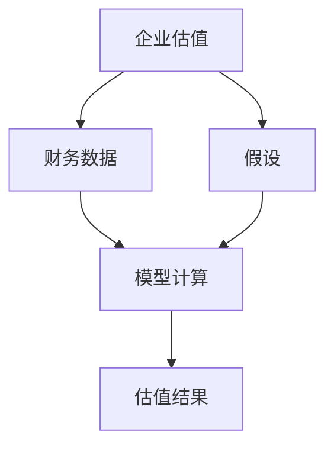

                 


# 如何处理企业估值中的不确定性

> 关键词：企业估值，不确定性，概率论，统计学，蒙特卡洛模拟，风险管理

> 摘要：在企业估值过程中，不确定性是不可避免的，本文通过分析不确定性来源，介绍概率论和统计学的基本原理，探讨蒙特卡洛模拟的应用，结合实际案例，提供系统化的处理方法，帮助读者有效应对不确定性对企业估值的影响。

---

## 第一部分：企业估值与不确定性概述

### 第1章：企业估值中的不确定性背景

#### 1.1 问题背景与重要性

在企业估值过程中，不确定性是一个核心挑战。无论是初创企业还是成熟企业，未来的表现都受到多种不可预测因素的影响，如市场波动、政策变化和竞争环境等。这些不确定性可能导致估值结果的偏差，影响决策的准确性。

- **1.1.1 企业估值的基本概念**  
  企业估值是通过对企业的财务数据、市场地位和未来前景进行分析，估算其市场价值的过程。常见的估值方法包括DCF（Discounted Cash Flow）模型、可比公司分析和杠杆收购分析等。

- **1.1.2 不确定性在企业估值中的表现**  
  不确定性主要体现在收入预测的波动、成本变化、折现率的选择等方面。例如，预测未来现金流时，市场需求的变化可能导致收入预测的偏差。

- **1.1.3 不确定性对企业决策的影响**  
  不确定性可能导致估值结果的不准确，进而影响企业的融资决策、并购策略和投资决策。因此，如何有效处理不确定性，是企业估值的关键。

---

#### 1.2 不确定性问题的描述与分类

不确定性在企业估值中的表现多种多样，了解其来源和分类有助于更好地处理。

- **1.2.1 不确定性的定义与特征**  
  不确定性是指未来结果的多样性，其特征包括不可预测性、潜在影响性和关联性。

- **1.2.2 不确定性的来源分析**  
  不确定性来源可以分为内部和外部因素。内部因素包括管理决策和运营效率，外部因素包括市场环境和政策变化。

- **1.2.3 不确定性的分类与层次**  
  不确定性可以分为系统性风险和非系统性风险。系统性风险是整个市场的波动，而非系统性风险是特定于企业的风险。

---

#### 1.3 问题解决的思路与方法

处理不确定性需要系统性的方法，从假设检验到模型优化，每一步都需要细致分析。

- **1.3.1 确定性假设的局限性**  
  传统的估值方法往往基于确定性假设，如固定增长率假设，这可能导致低估或高估企业的价值。

- **1.3.2 引入不确定性的处理方法**  
  通过概率分析和蒙特卡洛模拟，可以将不确定性因素纳入估值模型，生成更准确的估值区间。

- **1.3.3 处理不确定性的核心目标**  
  通过量化不确定性的影响，提供一个更加稳健的估值结果，帮助决策者更好地应对潜在风险。

---

#### 1.4 不确定性处理的边界与外延

明确处理不确定性的边界，有助于避免过度或不足的分析。

- **1.4.1 企业估值的边界条件**  
  估值模型应基于合理的假设和数据，避免引入过多的不确定因素，导致模型复杂化。

- **1.4.2 不确定性处理的适用范围**  
  不确定性处理方法适用于长期预测和复杂模型，但对于短期确定性问题，简单的假设可能更有效。

- **1.4.3 相关概念的对比与区分**  
  风险与不确定性不同，风险是可以量化的，而不确定性是无法完全量化的潜在影响。

---

#### 1.5 概念结构与核心要素

构建清晰的概念结构，有助于更好地理解不确定性处理的核心要素。

- **1.5.1 企业估值的系统结构**  
  企业估值系统包括输入（财务数据、假设）、处理（模型计算）和输出（估值结果）三个部分。

- **1.5.2 不确定性的核心要素**  
  包括不确定性来源、影响程度和时间因素。

- **1.5.3 相关概念的关联图**  
  使用Mermaid图展示企业估值系统中各要素之间的关系。



---

## 第二部分：不确定性处理的核心概念与联系

### 第2章：不确定性处理的核心概念

#### 2.1 核心概念原理

- **2.1.1 概率论基础**  
  概率论是处理不确定性的核心工具，其基本原理包括概率空间和条件概率。

- **2.1.2 统计学方法**  
  统计学通过数据样本分析，帮助我们估计总体参数，量化不确定性。

- **2.1.3 风险评估与管理**  
  风险评估通过识别潜在风险，制定应对策略，降低不确定性的影响。

---

#### 2.2 核心概念属性特征对比

通过对比分析，理解不同概念的优缺点。

- **2.2.1 概率与统计的区别与联系**  
  概率是预测未来事件的可能性，统计学是通过数据估计概率。

- **2.2.2 不确定性与风险的对比分析**  
  不确定性是潜在的未知因素，风险是可以量化的潜在损失。

- **2.2.3 不同处理方法的优缺点**  
  概率方法精确但计算复杂，统计方法基于数据，风险评估方法注重实际应用。

---

#### 2.3 ER实体关系图架构

构建实体关系图，明确数据结构。

- **2.3.1 实体关系图的构建**  
  实体包括企业、财务数据、假设和模型。

- **2.3.2 实体间的关联关系**  
  企业与财务数据关联，假设与模型关联。

- **2.3.3 实体属性的定义与描述**  
  企业属性包括名称、行业，财务数据属性包括收入、利润。

```mermaid
erd
title 企业估值系统
entity 企业 {
  id
  名称
  行业
}
entity 财务数据 {
  收入
  利润
  资产
}
entity 假设 {
  增长率
  折现率
}
entity 模型计算 {
  现金流
  估值
}
```

---

## 第三部分：不确定性处理的算法原理

### 第3章：概率论与统计学基础

#### 3.1 概率论基础

- **3.1.1 概率空间的定义**  
  概率空间由样本空间、事件和概率测度组成。

- **3.1.2 条件概率与贝叶斯定理**  
  贝叶斯定理用于更新基于新信息的概率。

  $$P(A|B) = \frac{P(B|A)P(A)}{P(B)}$$

- **3.1.3 概率分布的类型**  
  常见分布包括正态分布、泊松分布和均匀分布。

---

#### 3.2 统计学方法

- **3.2.1 描述性统计与推断性统计**  
  描述性统计总结数据特征，推断性统计基于样本估计总体。

- **3.2.2 中心极限定理的应用**  
  中心极限定理表明，样本均值近似正态分布。

- **3.2.3 假设检验的基本原理**  
  假设检验通过p值判断原假设的真假。

---

#### 3.3 概率分布的数学模型

- **3.3.1 正态分布的数学表达式**  
  正态分布的概率密度函数：

  $$f(x) = \frac{1}{\sigma \sqrt{2\pi}} e^{-\frac{(x-\mu)^2}{2\sigma^2}}$$

- **3.3.2 二项分布的数学公式**  
  二项分布的概率质量函数：

  $$P(k) = C(n,k) p^k (1-p)^{n-k}$$

- **3.3.3 指数分布的应用场景**  
  指数分布常用于描述事件发生的时间间隔。

  $$f(x) = \lambda e^{-\lambda x}$$

---

## 第四部分：系统分析与架构设计方案

### 第4章：企业估值模型中的不确定性处理

#### 4.1 问题场景介绍

- **4.1.1 问题背景**  
  初创科技企业的收入和成本预测具有高度不确定性。

- **4.1.2 项目介绍**  
  通过蒙特卡洛模拟，评估企业估值的不确定性。

---

#### 4.2 系统功能设计

- **4.2.1 领域模型类图**  
  包括输入、处理和输出模块。

  ```mermaid
  classDiagram
  class 输入模块 {
    财务数据
    假设
  }
  class 处理模块 {
    现金流计算
    蒙特卡洛模拟
  }
  class 输出模块 {
    估值结果
    概率分布
  }
  输入模块 --> 处理模块
  处理模块 --> 输出模块
  ```

- **4.2.2 系统架构设计**  
  采用分层架构，包括数据层、计算层和结果层。

  ```mermaid
  graph TD
  A[数据层] --> B[计算层]
  B --> C[结果层]
  ```

- **4.2.3 系统接口设计**  
  接口定义包括数据输入、模型调用和结果输出。

- **4.2.4 系统交互序列图**  
  描述用户与系统的交互流程。

  ```mermaid
  sequenceDiagram
  participant 用户
  participant 系统
  用户->系统: 提供财务数据
  系统->用户: 确认输入
  用户->系统: 提供假设
  系统->用户: 确认输入
  用户->系统: 运行模拟
  系统->用户: 返回结果
  ```

---

## 第五部分：项目实战

### 第5章：企业估值中的蒙特卡洛模拟

#### 5.1 环境安装与依赖管理

- **5.1.1 环境安装**  
  安装Python和必要的库，如NumPy和Matplotlib。

- **5.1.2 依赖管理**  
  使用Pip安装相关依赖：

  ```bash
  pip install numpy matplotlib pandas
  ```

---

#### 5.2 系统核心实现源代码

- **5.2.1 蒙特卡洛模拟实现**  
  使用Python代码生成现金流的随机分布。

  ```python
  import numpy as np
  import matplotlib.pyplot as plt

  np.random.seed(42)
  simulations = 1000
  growth_rate = np.random.normal(0.2, 0.1, simulations)
  cash_flows = np.exp(growth_rate * np.log(1000))
  ```

- **5.2.2 结果可视化**  
  绘制现金流分布的直方图。

  ```python
  plt.hist(cash_flows, bins=50, alpha=0.7)
  plt.xlabel('Cash Flow')
  plt.ylabel('Frequency')
  plt.title('Cash Flow Distribution')
  plt.show()
  ```

---

#### 5.3 实际案例分析与解读

- **5.3.1 案例背景**  
  某科技初创企业，预测收入增长率为20% ± 10%。

- **5.3.2 模拟结果分析**  
  蒙特卡洛模拟生成1000次现金流预测，绘制分布图，计算中位数和置信区间。

- **5.3.3 结果解读**  
  中位数为1500万元，95%置信区间为1200-1800万元。

---

#### 5.4 项目小结

- **5.4.1 项目总结**  
  蒙特卡洛模拟提供了更准确的估值区间。

- **5.4.2 实施注意事项**  
  确保输入数据的合理性和模拟次数的充分性。

- **5.4.3 项目成果展示**  
  通过图表展示现金流分布和估值结果。

---

## 第六部分：最佳实践与扩展阅读

### 第6章：总结与建议

#### 6.1 最佳实践 tips

- **6.1.1 确保数据质量**  
  使用可靠的数据源，减少偏差。

- **6.1.2 合理选择模型**  
  根据具体情况选择合适的不确定性处理方法。

- **6.1.3 定期更新模型**  
  随着市场变化，及时调整假设和参数。

---

#### 6.2 小结

通过系统化的处理方法，企业可以更好地应对估值中的不确定性，提高决策的准确性。

---

#### 6.3 注意事项

- **数据的准确性**  
  数据偏差可能导致错误的结论。

- **模型的适用性**  
  不同的企业需要不同的处理方法。

- **结果的解释性**  
  需要清晰地向决策者解释结果的意义。

---

#### 6.4 拓展阅读

- **蒙特卡洛模拟的高级应用**  
  探讨更复杂的随机过程。

- **贝叶斯网络的应用**  
  使用贝叶斯网络进行更精确的概率建模。

- **风险管理的前沿方法**  
  探索最新的风险管理技术。

---

## 附录

### 附录1：数学公式

- **正态分布公式**  
  $$f(x) = \frac{1}{\sigma \sqrt{2\pi}} e^{-\frac{(x-\mu)^2}{2\sigma^2}}$$

- **贝叶斯定理公式**  
  $$P(A|B) = \frac{P(B|A)P(A)}{P(B)}$$

---

### 附录2：工具推荐

- **Python库**  
  NumPy、Pandas、Matplotlib。

- **数据分析工具**  
  Excel、R语言。

---

### 附录3：术语表

- **蒙特卡洛模拟**  
  使用随机采样方法模拟系统行为。

- **贝叶斯定理**  
  用于更新基于新证据的概率。

---

### 附录4：参考文献

- 常见的企业估值书籍和论文。

---

通过以上结构和内容，本文系统地介绍了如何处理企业估值中的不确定性，结合理论与实践，为读者提供了全面的指导。

