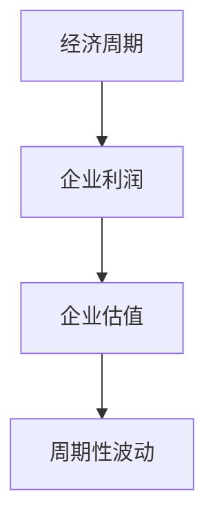
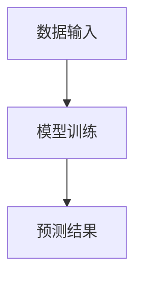
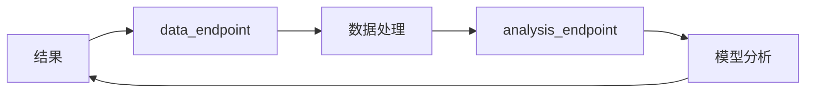

                 


# 如何处理企业估值中的周期性波动

## 关键词：
企业估值、周期性波动、时间序列分析、ARIMA模型、系统架构设计

## 摘要：
本文探讨如何在企业估值中有效处理周期性波动。通过分析经济周期对估值的影响，建立数学模型，采用时间序列分析方法，结合系统设计，提供实战案例和最佳实践，帮助企业应对周期性波动带来的挑战。

---

## 第一部分：引言

### 第1章：周期性波动与企业估值的背景

#### 1.1 周期性波动的背景
- **1.1.1 经济周期的基本概念**：经济周期包括繁荣、衰退、萧条和复苏四个阶段，影响企业盈利和估值。
- **1.1.2 企业估值的基本概念**：企业估值是对其未来现金流的现值评估，受经济环境影响。
- **1.1.3 周期性波动对企业估值的影响**：经济周期波动导致企业盈利和估值波动，需在估值中考虑周期性因素。

#### 1.2 问题背景与描述
- **1.2.1 企业估值中的周期性波动问题**：传统估值方法常忽视周期性波动，导致估值偏差。
- **1.2.2 问题的边界与外延**：周期性波动涉及宏观经济指标和行业差异，需具体分析。
- **1.2.3 核心要素与概念结构**：周期性波动与企业利润、现金流、估值模型密切相关。

---

## 第二部分：周期性波动的核心概念与联系

### 第2章：周期性波动的核心概念

#### 2.1 周期性波动的核心原理
- **2.1.1 经济周期的基本原理**：经济周期通过GDP、利率、就业率等指标影响企业利润。
- **2.1.2 企业估值的基本原理**：企业估值方法包括DCF、EV/EBITDA等，需考虑周期性因素。
- **2.1.3 周期性波动与企业估值的关系**：经济周期影响企业盈利，进而影响估值模型的准确性。

#### 2.2 核心概念对比表
| 概念       | 经济周期       | 企业估值       |
|------------|----------------|----------------|
| 定义       | 经济活动波动   | 企业价值评估   |
| 影响因素   | GDP、利率      | 现金流、行业    |
| 方法       | 宏观分析       | DCF、EV/EBITDA  |

#### 2.3 实体关系图


---

## 第三部分：周期性波动的数学模型与算法

### 第3章：周期性波动的数学模型

#### 3.1 时间序列模型
- **3.1.1 ARIMA模型的定义**：ARIMA模型用于预测时间序列数据，由自回归和移动平均部分组成。
- **3.1.2 ARIMA模型的参数估计**：通过极大似然估计法确定模型参数。
- **3.1.3 ARIMA模型的应用**：适用于企业利润和现金流的周期性波动预测。

#### 3.2 企业估值波动模型
- **3.2.1 模型的数学表达式**：企业估值 = 现金流预测 + 周期性调整。
- **3.2.2 模型的假设条件**：经济周期对企业利润的影响可量化。
- **3.2.3 模型的验证与评估**：通过历史数据验证模型准确性。

### 第4章：算法原理与实现

#### 4.1 时间序列预测算法


#### 4.2 代码实现
```python
# ARIMA模型实现
from statsmodels.tsa.arima_model import ARIMA
import pandas as pd

# 数据加载与训练
data = pd.read_csv('data.csv')
model = ARIMA(data, order=(5, 1, 0))
model_fit = model.fit()
```

---

## 第四部分：系统分析与架构设计

### 第5章：企业估值系统设计

#### 5.1 系统功能设计
- **5.1.1 数据采集模块**：收集宏观经济指标和企业财务数据。
- **5.1.2 数据处理模块**：清洗数据，提取特征。
- **5.1.3 模型训练模块**：训练ARIMA模型，预测周期性波动。

#### 5.2 系统架构设计
```mermaid
graph LR
    Client[客户端] --> API Gateway[网关]
    API Gateway --> Service1[数据处理服务]
    Service1 --> Service2[模型训练服务]
    Service2 --> Database[数据库]
```

#### 5.3 接口设计


---

## 第五部分：项目实战与案例分析

### 第6章：项目实战

#### 6.1 环境安装
```bash
pip install pandas statsmodels
```

#### 6.2 核心代码实现
```python
import pandas as pd
from statsmodels.tsa.arima_model import ARIMA

data = pd.read_csv('data.csv')
model = ARIMA(data, order=(5, 1, 0))
model_fit = model.fit()
```

#### 6.3 案例分析
- 数据准备：收集某行业5年的财务数据和宏观经济指标。
- 模型训练：使用ARIMA模型预测企业利润的周期性波动。
- 结果分析：对比预测值与实际值，评估模型准确性。

---

## 第六部分：最佳实践与总结

### 第7章：总结与注意事项

#### 7.1 最佳实践
- 定期更新模型参数，适应经济环境变化。
- 结合行业特点，调整模型结构。

#### 7.2 小结
- 企业估值中的周期性波动可通过数学模型有效处理，提升估值准确性。
- 综合考虑宏观经济指标和行业特点，选择合适的方法和工具。

#### 7.3 注意事项
- 数据质量影响模型效果，需确保数据准确。
- 模型需定期验证和更新，避免过时。

---

通过以上步骤，我们系统地分析了企业估值中的周期性波动，并提供了数学模型和系统设计的详细方案。企业可结合实际情况，灵活应用这些方法，提升估值的准确性和稳健性。

