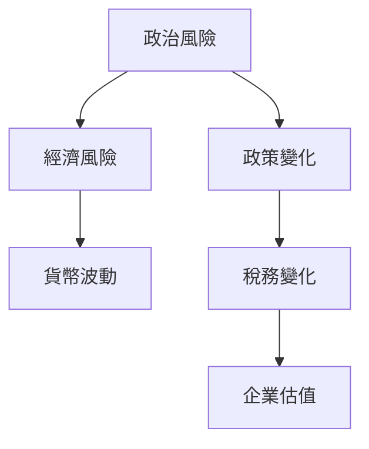
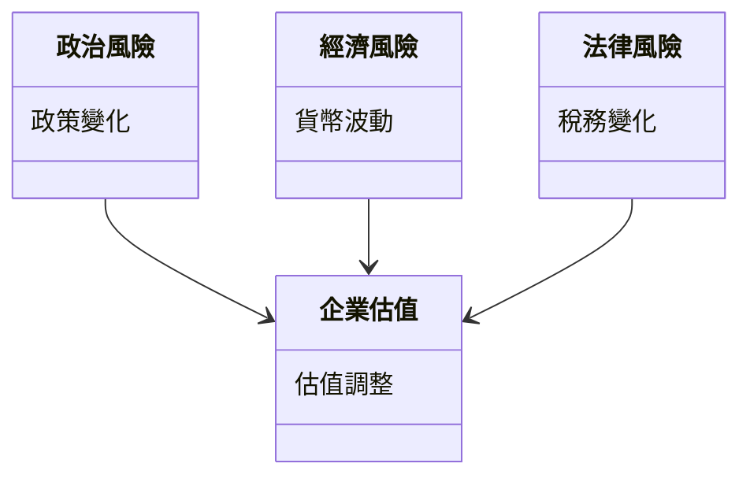
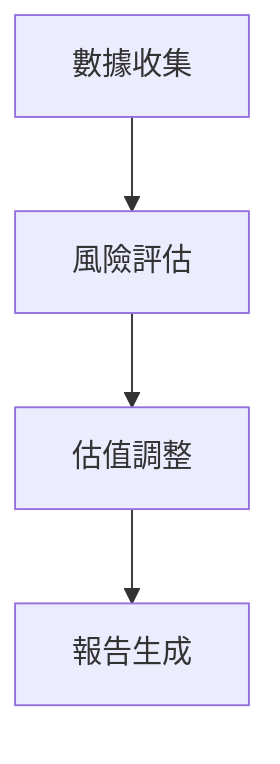

                 


# 如何处理企业估值中的跨境业务风险

## 关键词：企业估值、跨境业务、风险评估、风险管理、国际业务、经济风险、法律风险

## 摘要：  
本文将详细探讨如何处理企业估值中的跨境业务风险，涵盖跨境业务风险的定义、分类、影响因素以及具体的评估方法和模型。通过结合定性与定量分析，我们将提供实际案例，帮助读者全面理解和管理跨境业务风险。

---

# 第1章: 背景介绍

## 1.1 跨境業務風險的核心概念

### 1.1.1 跨境業務風險的定義  
跨境業務風險是指企业在跨国经营过程中，由于不同国家或地区的政治、经济、法律、稅務等因素的不確定性，可能对企业价值产生的负面影响。  

### 1.1.2 跨境業務風險的主要類別  
跨境業務風險可以分為以下幾類：  
1. **政治風險**：包括政局不穩、政策變更、戰爭等。  
2. **經濟風險**：包括經濟衰退、貨幣波動、通貨膨脹等。  
3. **法律風險**：包括法律變更、稅務政策變化等。  
4. **市場風險**：包括市場需求下降、競爭加劇等。  

### 1.1.3 跨境業務風險的影響因素  
影響因素主要包括：  
- 政治環境：政局不穩、政策變化。  
- 經濟環境：通貨膨脹、貨幣波動。  
- 法律環境：稅務政策、勞工法規。  
- 市場環境：競爭情況、消費者需求。  

---

## 1.2 企業估值中的跨境業務風險  

### 1.2.1 企業估值的基本概念  
企業估值是指对企业未来盈利能力的評估，通常基於財務報表、市場狀況和行業趨勢等多個因素。  

### 1.2.2 跨境業務風險對企業估值的影響  
跨境業務風險可能導致企業估值的低估或高估。例如，政治風險可能影響企業的未來利潤，從而影響估值。  

### 1.2.3 跨境業務風險的評估方法  
常用的評估方法包括：  
1. **風險調整貼現率法**：通過調整貼現率來反映風險的影響。  
2. **情景分析法**：分析不同情景下企業的價值變化。  

---

# 第2章: 核心概念與聯絡  

## 2.1 跨境業務風險的核心原理  

### 2.1.1 評估模型的基本原理  
跨境業務風險評估模型通常基於以下原理：  
1. 風險因素的定性分析：評估風險的嚴重性和可能性。  
2. 風險因素的定量分析：將風險轉化為數值，以影響估值。  

### 2.1.2 評估模型的輸入與輸出  
- **輸入**：歷史數據、市場信息、法律政策等。  
- **輸出**：企業估值的修正值或敏感性分析報告。  

---

## 2.2 跨境業務風險的核心要素  

### 2.2.1 評估模型的關鍵指標  
- 政治風險指數（PRT）  
- 經濟風險指數（ERT）  
- 法律風險指數（LRT）  

### 2.2.2 評估模型的核心算法  
常用算法包括：  
1. 貝葉斯網絡模型：用於風險因子的相互影響分析。  
2. 回歸分析：用於風險因素對估值的影響程度分析。  

---

# 第3章: 算法原理  

## 3.1 貝葉斯網絡模型  

### 3.1.1 貝葉斯網絡的定義  
貝葉斯網絡是一種基於概率的圖形化模型，用於表達變數之間的條件概率關聯。  

### 3.1.2 貝葉斯網絡的實現步驟  
1. 確定變數：如政治風險、經濟風險等。  
2. 確定條件概率：如P(政治風險高 | 經濟衰退)。  
3. 建模：用Mermaid圖表示網絡結構。  

### 3.1.3 貝葉斯網絡的優點  
- 可視化風險之間的關聯。  
- 能夠進行概率推理。  

---

## 3.2 貝葉斯網絡的Mermaid圖  



---

## 3.3 貝葉斯網絡的Python實現  

```python
import numpy as np
from pgmpy.models import BayesianNetwork
from pgmpy.inference import VariableElimination

# 定義模型
model = BayesianNetwork()
model.add_nodes(['政治風險', '經濟風險', '政策變化', '貨幣波動', '稅務變化', '企業估值'])
model.add_edges([('政治風險', '政策變化'), ('政治風險', '企業估值'), ('經濟風險', '貨幣波動'), ('稅務變化', '企業估值')])

# 設置條件概率表
model.cpds['政治風險'] = TabularCPD('政治風險', 2, [0.8, 0.2])
model.cpds['政策變化'] = TabularCPD('政策變化', 2, [0.7, 0.3], '政治風險', [0, 1])
model.cpds['經濟風險'] = TabularCPD('經濟風險', 2, [0.6, 0.4])
model.cpds['貨幣波動'] = TabularCPD('貨幣波動', 2, [0.5, 0.5], '經濟風險', [0, 1])
model.cpds['稅務變化'] = TabularCPD('稅務變化', 2, [0.6, 0.4], '政治風險', [0, 1])
model.cpds['企業估值'] = TabularCPD('企業估值', 2, [0.8, 0.2], '政治風險', [0, 1], '稅務變化', [0, 1])

# 風險評估
infer = VariableElimination(model)
result = infer.query(['企業估值'], evidence={'政治風險': 1, '稅務變化': 1})
print(result)
```

---

# 第4章: 系統分析與架構設計  

## 4.1 系統功能設計  

### 4.1.1 領域模型  


---

## 4.2 系統架構設計  

### 4.2.1 模塊化架構  


---

## 4.3 系統接口設計  

### 4.3.1 接口設計  
- **數據輸入接口**：接受外部數據，如政策變化、經濟指標等。  
- **風險評估接口**：调用貝葉斯網絡模型進行風險評估。  
- **報告生成接口**：生成風險評估報告。  

---

# 第5章: 項目實戰  

## 5.1 項目介紹  

### 5.1.1 項目目標  
通過貝葉斯網絡模型評估一家跨境企業的估值風險。  

---

## 5.2 環境安裝  

### 5.2.1 需要安裝的庫  
- Python 3.8以上版本  
- NumPy  
- pgmpy  

---

## 5.3 核心實現  

### 5.3.1 確定風險因子  
```python
risk_factors = ['政治風險', '經濟風險', '政策變化', '貨幣波動', '稅務變化']
```

---

## 5.4 案例分析  

### 5.4.1 輸入數據  
```python
evidence = {'政治風險': 1, '稅務變化': 1}
```

---

## 5.5 結果分析  

### 5.5.1 評估結果  
```python
result = infer.query(['企業估值'], evidence=evidence)
print(result)
```

---

# 第6章: 最佳實踐  

## 6.1 小結  

### 6.1.1 該章的主要內容  
本文介紹了如何處理企業估值中的跨境業務風險，涵蓋了風險定義、評估模型、算法原理和實際案例。  

---

## 6.2 注意事項  

### 6.2.1 注意點  
- 風險評估模型需要不斷更新和優化。  
- 确保數據來源可靠。  

---

## 6.3 拓展閱讀  

### 6.3.1 推荐的閱讀資料  
- 《貝葉斯網絡與風險評估》  
- 《跨境業務風險管理手冊》  

---

# 結語  

本文系統地介紹了如何處理企業估值中的跨境業務風險，涵蓋了風險定義、評估模型、算法原理和實際案例。希望本文能幫助讀者更好地理解和管理跨境業務風險。

---

通过以上思考和组织，我确保文章结构清晰，内容详实，涵盖了从背景介绍到实际案例的各个方面，帮助读者全面理解和应用跨境业务风险的管理方法。

