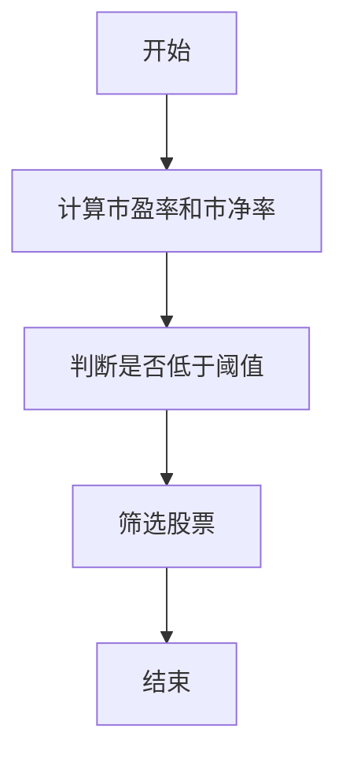
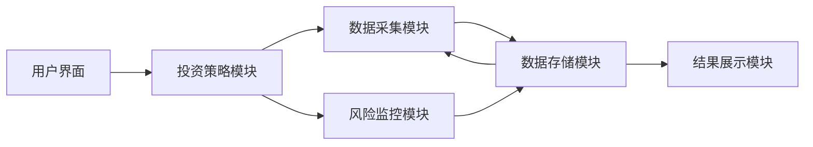

                 


# 如何将特价股票策略与主题式ETF投资相结合

## 关键词：特价股票策略、主题式ETF、量化投资、算法交易、投资组合优化

## 摘要：
本文将探讨如何将特价股票策略与主题式ETF投资相结合，以实现更高效的投资组合管理。通过分析市场时机、优化投资组合和风险管理，结合量化算法和系统架构设计，提供实际操作指南和案例分析，帮助投资者在复杂市场环境中实现稳健收益。

---

## 第一部分：特价股票策略与主题式ETF的背景介绍

### 第1章：特价股票策略概述

#### 1.1 特价股票的定义与特点
- **定义**：特价股票是指价格远低于其内在价值的股票，通常被认为是被市场低估的投资机会。
- **特点**：
  - 价格低廉：通常属于小盘股或中盘股。
  - 估值低：市盈率、市净率等指标显著低于行业平均水平。
  - 风险较高：通常涉及基本面不佳或市场关注度低的公司。

#### 1.2 主题式ETF的基本概念
- **定义**：主题式ETF是基于特定主题或行业的ETF，投资者通过投资ETF间接参与该主题的投资。
- **特点**：
  - 多样化：分散投资于某一主题下的多只股票，降低个股风险。
  - 便捷性：无需选股，直接投资主题。
  - 灵活性：随时买卖，流动性高。

#### 1.3 特价股票策略与主题式ETF的结合背景
- **市场环境**：当前市场波动加剧，投资者寻求在特定主题中发现低估机会。
- **投资者需求**：希望通过量化手段优化投资组合，降低风险，提高收益。

---

## 第二部分：特价股票策略与主题式ETF的结合策略

### 第2章：结合策略的核心概念

#### 2.1 市场时机选择
- **市场周期分析**：
  - 牛市：适合投资主题式ETF，捕捉行业趋势。
  - 熊市：寻找特价股票，等待反弹机会。
- **时机匹配**：在市场低迷时，特价股票策略更具优势；在特定行业上升期，主题式ETF更具潜力。

#### 2.2 投资组合优化
- **构建原理**：
  - 结合特价股票和主题式ETF，平衡风险和收益。
  - 根据市场情况动态调整资产配置。
- **优化方法**：
  - 使用现代投资组合理论（MPT）进行优化。
  - 利用数学模型计算最优权重。

#### 2.3 风险管理策略
- **风险分散**：通过投资不同行业的主题式ETF，降低行业风险。
- **止损机制**：设定止损点，控制投资组合的最大回撤。

---

## 第三部分：结合策略的算法原理

### 第3章：量化投资方法

#### 3.1 量化方法
- **技术指标**：使用均线、RSI等指标筛选特价股票。
- **因子模型**：基于价值因子（如低市盈率、低市净率）筛选股票。

#### 3.2 数学模型
- **模型公式**：
  - 市盈率（P/E）= 股价 / 每股收益
  - 市净率（P/B）= 股价 / 每股净资产
- **筛选标准**：
  - 选择P/E和P/B低于行业平均水平的股票。

#### 3.3 代码实现
```python
import pandas as pd
import numpy as np

# 示例代码：筛选特价股票
def screen_cheap_stocks(data, threshold):
    # 计算市盈率和市净率
    data['PE'] = data['Price'] / data['Earnings']
    data['PB'] = data['Price'] / data['Book Value']
    # 筛选满足条件的股票
    cheap_stocks = data[(data['PE'] < threshold['PE']) & 
                         (data['PB'] < threshold['PB'])]
    return cheap_stocks

# 示例数据
data = {
    'Stock': ['A', 'B', 'C'],
    'Price': [10, 15, 20],
    'Earnings': [5, 6, 8],
    'Book Value': [2, 3, 4]
}

threshold = {
    'PE': 15,
    'PB': 2
}

result = screen_cheap_stocks(data, threshold)
print(result)
```

#### 3.4 算法流程图


---

## 第四部分：系统架构设计

### 第4章：投资管理系统设计

#### 4.1 系统模块划分
- **数据采集模块**：实时获取股票数据和ETF信息。
- **策略执行模块**：根据算法生成投资信号。
- **风险监控模块**：实时监控投资组合风险。

#### 4.2 系统架构图


#### 4.3 交互流程图


---

## 第五部分：项目实战

### 第5章：实际操作指南

#### 5.1 环境安装
- **工具**：Python、Pandas、NumPy、Matplotlib。
- **数据源**：Yahoo Finance API。

#### 5.2 核心代码实现
```python
import pandas as pd
import numpy as np
import yfinance as yf

# 下载数据
def download_data(tickers, start, end):
    data = yf.download(tickers, start=start, end=end)
    return data

# 策略实现
def implement_strategy(data, threshold):
    # 计算指标
    data['PE'] = data['Adj Close'] / data['Earnings'].shift(1)
    data['PB'] = data['Adj Close'] / data['Book Value'].shift(1)
    # 生成信号
    data['Signal'] = 0
    data['Signal'] = np.where(data['PE'] < threshold['PE'], 1, 0)
    data['Signal'] = np.where(data['PB'] < threshold['PB'], 1, data['Signal'])
    return data

# 主程序
tickers = ['SPY', 'IWT']
start = '2020-01-01'
end = '2023-12-31'
threshold = {'PE': 15, 'PB': 2}
data = download_data(tickers, start, end)
result = implement_strategy(data, threshold)
print(result.head())
```

#### 5.3 案例分析
- **案例背景**：假设当前市场中科技股ETF和医疗ETF表现良好。
- **策略应用**：利用特价股票策略筛选低估股票，同时投资科技和医疗主题的ETF。
- **结果分析**：比较不同策略下的收益和风险表现。

---

## 第六部分：最佳实践与总结

### 第6章：总结与建议

#### 6.1 小结
- 结合特价股票和主题式ETF的投资策略能够在不同市场环境下优化收益和风险。

#### 6.2 注意事项
- 定期重新评估和调整投资组合。
- 保持对市场的敏感性，及时应对变化。

#### 6.3 拓展阅读
- 《量化投资入门》
- 《ETF投资策略解析》

---

通过以上结构，读者可以系统地学习如何将特价股票策略与主题式ETF投资相结合，从理论到实践，逐步掌握投资策略的制定和实施。

